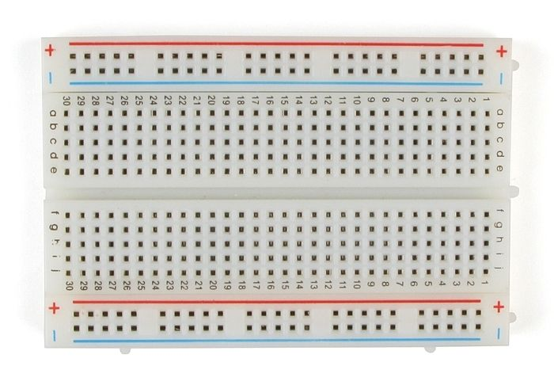

# Building EMUs

With the [appropriate parts](Parts%20list.md), you can build your own EMUs. Our [video](https://www.youtube.com/watch?v=74yjZC-QKPY) associated with the paper steps through this process, below is some additional information.

## Soldering

Proper soldering takes some training or experience, and we recommend that those new to soldering educate themselves, especially on safety. Here is a [video beginner tutorial](https://www.youtube.com/watch?v=Qps9woUGkvI), and a series of [9 video lessons](https://www.youtube.com/playlist?list=PL926EC0F1F93C1837)(1 and 6 are especially relevant). At a minimum, we recommend safety goggles, good ventilation, a soldering iron tip cleaner, a clear workspace that keeps the cord away from the iron, and a sturdy soldering iron stand.

Sensors and the D1 Mini generally come without the pins soldered into the circuit board. Some (e.g. the D1 Mini) come with more than one pin type. We solder these on, using the long female pin headers for the D1 Mini. One could solder wires directly to the sensors, rather than these pins, however, we prefer the pins because it allows for easy sensor replacement.

Additionally, we make several small modifications to the pre-build sensor modules (see [video](https://www.youtube.com/watch?v=74yjZC-QKPY), [paper supplement]()):

1. Since the BME280, BH1750, ADS1115 and DS3231 all share the same I2C wires, the pullup resistors on the SCL and SDA lines present on all four modules are redundant, wasting some electricity. We remove those on the BH1750 (marked 472), and the DS3231 clock (4x472 block across from the VCC pin).
2. Removing the 4x472 block on the DS3231 clock also removes the pullup resistor on the SQW pin. Failure to remove this resistor prevents the clock SQW alarm pin from turning on the MOSFET switch.
3. We remove the resistor marked 102 on the DS3231SN clock (near SCL of the 4-pin header side). This resistor is for charging rechargeable LR2032 batteries, but we prefer to use non-rechargeable CR2032 batteries that are cheaper and last for years, and a charge current can degrade these batteries. See [Ed Mallon](https://thecavepearlproject.org/2014/05/21/using-a-cheap-3-ds3231-rtc-at24c32-eeprom-from-ebay/) and [Beddows & Mallon 2018](https://doi.org/10.3390/s18020530).

## Breadboard Wiring Connections

Breadboards rows numbered from 1-30 and columns lettered from A to J. Within a row, holes A-F are connected to each other, and G-J are connected. Additionally, breadboards have 2 columns labeled (+) and (-) on each outer side. These columns or "rails" are usually used to distribute power. In our setup, the left rails (beside column A) are used for battery power. The right (+) rail (beside column J) is used for 3.3v power (from the D1 Mini), and the right (-) rail is unused.

To wire an EMU breadboard, plug in the wires denoted below, roughly in the order they appear using their row and column addresses, then the components. Generally, we use longer 10-30 cm wires to connect the BME280, BH1750, and soil moisture module to the breadboard, rather than plugging them in directly, but this can be specific to application.

| **Component** | **Start** | **End** | **Function** | **Notes** |
| :---: | :---: | :---: | :---: | :---: |
| Wire | (-) | A2 | Grounding for D1 Mini |  |
| Wire | (-) | A11 | Grounding for D1 Mini | For redundancy |
| Wire | (+) | A13 | Power to the MOSFET | Battery voltage |
| Wire | (-) | A22 | Grounding for clock, BME280, ADS1115, &amp; BH1750 |  |
| Wire | (-) | A29 | Grounding for soil moisture probe |  |
| Wire | B21 | B28 | Power for soil moisture probe | 3.3v |
| Wire | B19 | F23 | Clock I2C - SCL line |  |
| Wire | B20 | F24 | Clock I2C - SDA line |  |
| Wire | C2 | C11 | Grounding for D1 Mini | For redundancy |
| Wire | E5 | E22 | Sensors &amp; Clock I2C - SCL line |  |
| Wire | E6 | E24 | Sensors &amp; Clock I2C - SDA line |  |
| Wire | E10 | E14 | Power from the MOSFET to the D1 Mini | Battery voltage |
| Wire | E15 | E18 | Clock alarm to the MOSFET | Turns power on |
| Wire | E21 | F21 | Power for soil moisture probe and clock | 3.3v |
| Wire | E22 | F22 | Grounding for BME280, ADS1115, &amp; BH1750 |  |
| Wire | E30 | F27 | Soil moisture probe signal to ADS1115 |  |
| Wire | F8 | H6 | Enables waking from sleep for D1 Mini | Clock failsafe |
| Wire | J1 | (+) | Power to the right breadboard rail | 3.3v; all sensors & clock|
| Wire | J21 | (+) | Power to sensors &amp; clock | 3.3v |
| 330k ohm Resistor | C1 | F7 | Measures battery voltage | Either orientation |
| Wire | D1 | D10 | Power from the MOSFET to the D1 Mini | Battery voltage |
| 100k ohm Resistor | D13 | D15 | Pullup for MOSFET | Either orientation |
| 100k ohm Resistor | J5 | (+) | Pullup for code disable pin | Either orientation |
| NDP6020P P-MOSFET 3-pin | C13 | C15 | Power switch | Orientation matters: Source→C13, Drain→C14, Gate→C15 |
| Lolin D1 Mini Microcontroller | B1/H1 | B8/H8 | The brains of the EMU | B1→5V, I1→3.3V |
| DS3231SN Module | D17 | D22 | Clock: timekeeping & power management | GND→D22, VCC→D21, SDA→D20, SCL→D19, SQW→D18|
| ADS1115 Module | I21 | I30 | Analog to digital converter for soil moisture | align VCC→I21 |
| Soil Moisture Sensor Module | D28 | D30 | Soil moisture sensor | VCC→D28, GND→D29, AO→D30 |
| BME280 Module | H21 | H24 | Temp/humidity sensor | VCC→H21, GND→H22, SCL→H23, SDA→H24 |
| BH1750FVI Module | G21 | G24 | Light sensor | VCC→G21, GND→G22, SCL→G23, SDA→G24 |
| 4xAA Battery Pack | (+) | (-) | Battery power | Hook up (+) and (-) to the side adjacent to row A |

## Waterproofing

We recommend coating the circuit boards of the BME280 and BH1750 with [MG Chemicals silicone modified conformal coating](https://www.mgchemicals.com/products/conformal-coatings/silicone-conformal-coating-422b) after soldering pins on. Be very careful not to cover the light sensor (black rectangle) on the BH1750 module or the humidity sensor hole (tiny hole in silver square) on the BME280 sensor. Coating internal components (especially higher value modules such as the D1 Mini) is a good idea as well.  In the event of water leakage, these can be salvaged and reused. In our testing, this coating has the best weatherproofing capability. It can be painted on, removed with acetone, and coatings can be quality-checked using a UV light.

External wiring connections or pins cannot be coated with silicone conformal coating: this would prevent the connection.  Therefore, for these we use [Nano Protech nano-partical anti-corrosion spray](http://nanoprotech.org/).  This spray works relatively well, but may need to be reapplied over long periods.  We recommend keeping external wiring connections to the bare minimum. We experimented with shrink-wrap tubing to coat wiring connections, but instead these trapped water, making the problems worse.

## Temperature Sensor Shielding

Temperature sensors should be shielded from the sun, and perhaps also from the ground to prevent elevated temperature reading. Ideally, shielding should be [fan-aspirated](https://www.apogeeinstruments.com/aspirated-radiation-shield/), to prevent air from being trapped near the sensor. Alternatively, naturally aspirated [gill shields](https://www.onsetcomp.com/products/mounting/rs3-b), provide accuracy to within 1-2 °C when there is no wind to create air movement (and higher accuracy in other conditions). Unfortunately, both of these options are prohibitively expensive relative to EMUs.

Instead of buying a shield, we built one out of an inverted white plastic cup bottom, similar to [Cowles et al. 2016](https://doi.org/10.1111/gcb.13111). Subsequently, [Terando et al. 2017](http://doi.org/10.1002/ece3.3499) have done careful tests and concluded that this is not a good design and can even be worse than no shielding in some circumstances.  Instead, they recommend one built by [Holden et al. 2013](https://doi.org/10.1016/j.agrformet.2013.06.011) ([video instructions for construction](https://www.youtube.com/watch?v=LkVmJRsw5vs)) out of corrugated plastic material covered with foil tape. This shield provides similar shielding to naturally-aspirated gill shields. 

Regardless of the shielding used, we recommend that researchers carefully consider their shielding design, and if it has not already been tested against a high quality shield and temperature sensor, we recommend that this be done.

## Lessons Learned from Novice Builders

*In General*:
- Orientation of sensors and pins should ALWAYS be checked before anything is added or 
removed.
- Each sensor or module should be tested separately to ensure it’s working properly before final assembly. 
- Safety precautions should be thoroughly examined before each process.

*Soldering*: 
- For anyone’s first time soldering it’s important to note how to properly hold the solder and soldering iron as well as to understand ventilation and safety concerns.  
- Good ventilation (at least a fan) should be used while soldering. Safety glasses and aprons are advised. 
- Looking up instructional videos explaining how to solder properly is advised for beginners. (Please see [Soldering](Building%20EMUs.md#soldering) for more information/videos on soldering)
- The type of soldering tip is important.  For removing resistors, a larger flatter tip was found to be easier rather than the common pencil type tip used for soldering pins. 
- Always turn off the soldering iron when not in use. 
- Orientation of pins should be triple checked before soldering.
- Be safe!

*Wiring*: 
- Using pre-cut wires saves time, though it is not required.
- It is better to take your time when wiring the breadboard. After all of the components are added, it makes it more difficult to recheck the positioning of the wires. 

*Waterproofing*: 
- Make sure that when painting the sensors with the silicone conformal coating, the actual sensor portion of the components are not covered. For example, the area on the light sensor that actually does the sensing should not be covered.  Shining UV light shows whether any coating has covered this area. 
- Fume hoods and ventilation should be used when using waterproofing coatings or sprays. 
- Heat shrink tubing should be pre cut and pay attention to the size used.  Looking up instructional videos on how to properly and safely use a heat gun is advised. Alternatively, any flame source is sufficient, but safety still applies.
