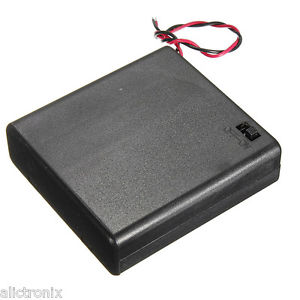
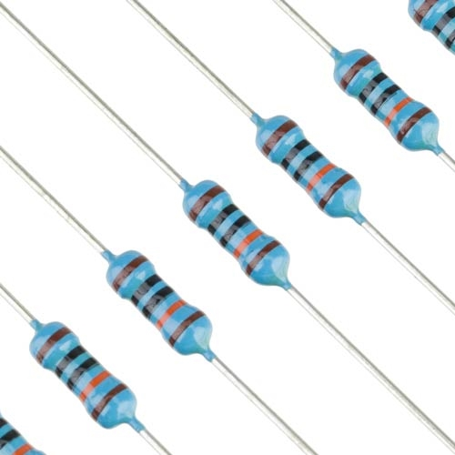

# Parts List

We buy most of our parts from AliExpress, shipped from China. This is nearly always the cheapest option, however the same or similar parts can often be sourced from eBay, Amazon, or [Adafruit](https://www.adafruit.com/). Most sellers on AliExpress, eBay, and Amazon ship from China. Shipments can take 2-4 weeks, and sometimes get lost, so allow ample time for parts to arrive.

While Chinese parts are cheap, the quality control varies. We often buy more than we need to allow for some rejects. AliExpress has especially good customer protection in the case of missing or faulty parts. Usually, there is no need to ship defective products back, you just get a refund.

Many Chinese sellers on AliExpress and elsewhere offer volume discounts for parts bought in lots of 2, 5, 10, 50, and 100.

## Required EMU parts

| &nbsp;&nbsp;&nbsp;&nbsp;&nbsp;&nbsp;&nbsp;&nbsp;&nbsp;&nbsp;&nbsp;Photo&nbsp;&nbsp;&nbsp;&nbsp;&nbsp;&nbsp;&nbsp;&nbsp;&nbsp;&nbsp;&nbsp; | &nbsp;&nbsp;&nbsp;&nbsp;&nbsp;&nbsp;&nbsp;&nbsp;&nbsp;&nbsp;&nbsp;&nbsp;Part&nbsp;&nbsp;&nbsp;&nbsp;&nbsp;&nbsp;&nbsp;&nbsp;&nbsp;&nbsp;&nbsp;&nbsp;&nbsp; | Number | Cost | Source | Datasheet | Notes |
| :---: | :--- | :---: | :---: | :---: | :---: | :--- | 
|  | [Lolin (formerly WeMos)](https://www.wemos.cc/) D1 Mini ESP8266 | 1 | $4.50 | [AliExpress](https://www.aliexpress.com/store/product/D1-mini-Mini-NodeMcu-4M-bytes-Lua-WIFI-Internet-of-Things-development-board-based-ESP8266/1331105_32529101036.html) | [Datasheet](https://wiki.wemos.cc/products:d1:d1_mini) | There's also a [Pro Version](https://www.aliexpress.com/store/product/WEMOS-D1-mini-Pro-16M-bytes-external-antenna-connector-ESP8266-WIFI-Internet-of-Things-development-board/1331105_32724692514.html) with 16MB of flash memory instead of 4MB. Only buy from [LoLin](https://lolin.aliexpress.com/store/1331105) on Aliexpress, there are many counterfeits of varying quality |
|  | BME280 Temp Humidity Pressure Sensor | 1 | $2.50 | [AliExpress](https://www.aliexpress.com/item/3In1-BME280-GY-BME280-Digital-Sensor-SPI-I2C-Humidity-Temperature-and-Barometric-Pressure-Sensor-Module-1/32831977783.html) | [Datasheet](https://ae-bst.resource.bosch.com/media/_tech/media/datasheets/BST-BME280_DS001-11.pdf) | Make sure to get the square sensor and square board, not the BMP280 (that lacks humidity) |
|  | BH1750FVI Digital Light Sensor | 1 | $1.10 | [AliExpress](https://www.aliexpress.com/item/GY-302-BH1750-Chip-Light-Intensity-Light-Module-Freeshipping-Dropshipping/1766481544.html) | [Datasheet](http://rohmfs.rohm.com/en/products/databook/datasheet/ic/sensor/light/bh1750fvi-e.pdf) |  |
|  | ADS1115 16bit Analog to Digital Converter | 1 | $2.00 | [AliExpress](https://www.aliexpress.com/item/I2C-ADS1115-16-Bit-ADC-4-channel-Module-with-Programmable-Gain-Amplifier-2-0V-to-5/32826605867.html) | [Datasheet](http://www.ti.com/lit/ds/symlink/ads1115.pdf) | There are several pinout configurations/colors available that are incompatible with each other. Our design needs the pins in the following order: VCC (V), Gnd (G), SCL, SDA |
|  | Generic Soil Moisture Sensor | 1 | $0.40 | [AliExpress](https://www.aliexpress.com/item/1PCS-Smart-Electronics-Soil-Hygrometer-Humidity-Detection-Module-Moisture-Water-Sensor-Soil-moisture-for-Arduino/32860007226.html) | N/A | There are various options. We used [gold-plated probes](https://www.aliexpress.com/item/86062-Soil-Hygrometer-Humidity-Detection-Module-Moisture-Water-Sensor-Soil-moisture-for-Arduino/32705056123.html), but we now prefer the 2-wire probes with silver solder and a separate module (see photo). Gold plated probes suffer more corrosion. Calibration coefficients are available for both types in our Calibration analysis. |
|  | DS3231SN Real Time Clock | 1 | $1.15 | [AliExpress](https://www.aliexpress.com/item/DS3231-AT24C32-IIC-Module-Precision-Clock-Module-DS3231SN-for-Arduino-Memory-module-Free-Shipping/1767001372.html) | [Datasheet](https://datasheets.maximintegrated.com/en/ds/DS3231.pdf) | Get the SN version (rated to -40C), not the N version (0C). There is also an M version, that is rated to -40C and more resistant to vibration, but slightly less accurate. Even if you order the SN version, they're often a mix of all three versions, so it's wise to order extra. |
|  | 4xAA Battery Holder w/Switch | 1 | $1.14 | [AliExpress](https://www.aliexpress.com/item/1PCS-ON-OFF-Switch-Plastic-Cover-4x-1-5V-AA-Batteries-Case-Box-Holder-With-Wires/32681663145.html) | N/A | Buy extra, these sometimes have defects. Some can be fixed via soldering inside. |
|  | 400 Tiepoint Breadboard | 1 | $1.20 | [AliExpress](https://www.aliexpress.com/item/PCB-Test-Mini-Breadboard-Bread-Board-400-Contacts-Available-8-5-x-5-5cm-New-8/32614008350.html) | N/A | Get ones with rounded (not angular) side tabs. They seem to be higher quality. |
|  | NDP6020P P-Channel MOSFET (10 pcs) | 1 | $1.16 | [Sample](https://www.fairchildsemi.com/products/discretes/fets/mosfets/NDP6020P.html) [AliExpress](https://www.aliexpress.com/item/10pcs-lot-NDP6020P-NDP6020-MOSFET-P-CH-20V-24A-TO-220/32891876960.html) | [Datasheet](https://www.fairchildsemi.com/datasheets/ND/NDP6020P.pdf) | This acts as a power switch with the DS3231 clock. Enough for 10 EMUs |
| | 100k Ω Resistors (100pcs) | 1 | $0.63 | [AliExpress](https://www.aliexpress.com/item/100pcs-1-4W-1R-22M-1-Metal-film-resistor-100R-220R-1K-1-5K-2-2K/32847096736.html) | | any 1/4W should be fine. 100pcs is enough for 50 EMUs |
| | 330k Ω Resistors (100pcs) | 1 | $0.63 | [AliExpress](https://www.aliexpress.com/item/100pcs-1-4W-1R-22M-1-Metal-film-resistor-100R-220R-1K-1-5K-2-2K/32847096736.html) | | 1/4W 1% tolerance. 100pcs is enough for 100 EMUs |
|  | 140-pc kit U-shaped jumper wire kit | 1 | $2.00 | [AliExpress](https://www.aliexpress.com/item/Free-Shipping-140pcs-in-one-package-convenient-New-Solderless-Flexible-Breadboard-Jumper-wires-Cables-HOT-Sale/1347939034.html) | N/A | 1 kit should be enough for 2-4 EMUs |
|  | Dupont Female Connector kit | 1 | $2.88 | [AliExpress](https://www.aliexpress.com/item/150PCS-2-54mm-Plastic-Dupont-Jumper-Wire-Kit-With-Box-1P-2P-3P-4P-5P-6P/32722201898.html) | N/A | Not required but really helps reliability/organization. One kit is enough for ~10 EMUs |
|  | AA Batteries | 4 | $2-5 | N/A | N/A | Name brand preferred (e.g., Duracell, Energizer). Applications in extreme temperatures may require Lithium AA batteries (wider operating temperature range) |
|  | CR2032 Coin Cell Battery (10 pcs) | 1 | $1.70 | [AliExpress](https://www.aliexpress.com/item/Cheap-Free-Shipping-10pcs-CR2032-BR2032-DL2032-SB-T15-EA2032C-ECR2032-L2032-CR-2032-Lithium/32778320423.html) | N/A | For DS3231 clocks (1/EMU). Chinese batteries are usually fine, but for high reliability or long durations, go with US name brands. |
|  | MG Chemicals Silicone Modified Conformal Coating | 1 | $12.95 | [Amazon](https://www.amazon.com/MG-Chemicals-Silicone-Conformal-Coating/dp/B004SPJOKK) | [MSDS](https://www.mgchemicals.com/downloads/msds/01%20English%20Can-USA%20SDS/sds-422b-l.pdf) | 55 mL is enough for 50+ EMUs. Paint onto sensors and circuit boards, especially the external ones. |
|  | Nanoprotech Electrical Anti-corrosion Spray | 1 | $20.00 | [Amazon](https://www.amazon.com/Nanoprotech-Multi-use-Protective-Automotive-Electrical/dp/B00RZUZVC0) | N/A | 1 can is enough for at least 50-100 EMUs. Spray or paint onto external electrical connections. |
|  | 0.8mm 63/37 Solder Wire | 1 | $ | [AliExpress](https://www.aliexpress.com/item/High-Quality-63-37-Rosin-Core-Welding-Flux-2-Tin-Lead-Solder-Iron-Wire-Reel-0/32774426766.html) | N/A | A 100g role is enough for ~20-40 EMUs 
|  | 10cm 40-pin F-M Dupont Cable | 1 | $0.60 | [AliExpress](https://www.aliexpress.com/item/WAVGAT-40pcs-10cm-2-54mm-1pin-1p-1p-male-to-female-jumper-wire-Dupont-cable-for/32825839970.html) | N/A | We use these to connect the soil moisture sensor module to the breadboard. One cable is enough for 12 EMUs (3 random-colored wires/EMU) or 4 EMUs (color-coded) |
|  | 30cm 40-pin F-M Dupont Cable | 1 | $1.10 | [AliExpress](https://www.aliexpress.com/store/product/Dupont-Line-40pcs-30cm-Female-to-Male-Jumper-Wire-Dupont-Cable/3241083_32839425460.html) | N/A | We use these to attach the BH1750 and BME280 sensors using color-coded wires. One cable is enough for 4 EMUs (8 wire colors/EMU) |
|  | 30cm 40-pin F-F Dupont Cable | 1 | $0.85 | [AliExpress](https://www.aliexpress.com/item/Dupont-Line-40pcs-30cm-Female-to-Female-Jumper-Wire-Dupont-Cable/32841975022.html) | N/A | We use these to attach soil moisture probes to the module. One cable is enough for 20 EMUs (2 wires/EMU) |
|  | ~900 mL gasketed container | 1 | $2-4 | N/A | N/A | Any grocery store has a variety of these. We get ours from Ocean State Job Lot for $2. It's easier to drill holes in the slightly flexible polypropylene, rather than brittle acrylic. |

 
## Testing Equipment & Other Useful Parts

| &nbsp;&nbsp;&nbsp;&nbsp;&nbsp;&nbsp;&nbsp;&nbsp;&nbsp;&nbsp;&nbsp;Photo&nbsp;&nbsp;&nbsp;&nbsp;&nbsp;&nbsp;&nbsp;&nbsp;&nbsp;&nbsp;&nbsp; | &nbsp;&nbsp;&nbsp;&nbsp;&nbsp;&nbsp;&nbsp;&nbsp;&nbsp;&nbsp;&nbsp;&nbsp;Part&nbsp;&nbsp;&nbsp;&nbsp;&nbsp;&nbsp;&nbsp;&nbsp;&nbsp;&nbsp;&nbsp;&nbsp;&nbsp; | Number | Cost | Source | Datasheet | Notes |
| :---: | :--- | :---: | :---: | :---: | :---: | :--- | 
|  | Yihua 947-III 60W adjustable soldering iron (with 900-M tips) | 1 | $10.00 | [AliExpress](https://www.aliexpress.com/item/110V-220V-Optional-Welding-Soldering-Iron-60W-YIHUA-947-III-Set-For-Soldering-Kit-With-Temperature/32785900623.html) | N/A | We like these soldering irons. A clone of the Hakko 900-M, uses the same tips. |
|  | Soldering Iron Stand | 1 | $1.99 | [AliExpress](https://www.aliexpress.com/item/Metal-Iron-Useful-Solid-Metal-Base-Soldering-Iron-Bracket-Stand-Holder-Support-Station-Frame-Portable-for/32852907489.html) | N/A |  |
|  | Soldering Iron Tip Cleaner | 1 | $2.75 | [AliExpress](https://www.aliexpress.com/item/1pcs-Wire-With-Stand-Set-Welding-Soldering-Solder-Iron-Tip-Cleaner-Cleaning-Steel-Hot-Selling/32889857477.html) | N/A |  |
|  | Victor 81D Autoranging Multimeter | 1 | $18.29 | [AliExpress](https://www.aliexpress.com/item/81D-Victor-RuoShui-Digital-Multimeter-4000-Counsts-Auto-Range-True-RMS-Resistance-Capacitance-Frequency-Temperature-Multimetro/32910618248.html) | [Manual](https://www.electrokit.com/uploads/productfile/41004/VICTOR81D.pdf) | They're cheap, but have good features. |
|  | Jakemy CT4-12 wire strippers | 1 | $5.00 | [AliExpress](https://www.aliexpress.com/item/AWG22-10-7-Wire-Stripper-Pliers-Decrustation-Pliers-Cable-Wire-Stripping-Pliers-Herramientas-Hand-Tools/32758418451.html) | N/A | These are well-made and excellent! |
|  | Voxlink Micro USB Cords | 1-5 | $2.00 | [AliExpress](https://www.aliexpress.com/item/VOXLINK-5Pack-Micro-USB-Cable-Fast-Charging-Microusb-Data-Cable-for-Samsung-S6-S7-S5-S4/32876384106.html) | N/A | We have good results with Voxlink or Anker brands |
|  | 128x64 I2C OLED Display (SSD1306) | 2 | $2.00 | [AliExpress](https://www.aliexpress.com/item/White-Blue-White-and-Blue-color-0-96-inch-128X64-OLED-Display-Module-For-arduino-0/32767499263.html) | [Datasheet](https://cdn-shop.adafruit.com/datasheets/SSD1306.pdf) | Useful display, can be used with the NodeMCU u8g2 hardware module |
|  | CP2102 Micro USB to Serial Module | 1 | $1.00 | [AliExpress](https://www.aliexpress.com/item/CJMCU-CP2102-USB-To-TTL-Serial-Module-UART-STC-Downloader-For-Arduino/32478532097.html) | N/A | These let you interface an EMU without supplying power via the built-in USB port. Useful for debugging. They also support up to 921600 baud (higher file transfer rates). You need to install the [driver](https://www.silabs.com/products/development-tools/software/usb-to-uart-bridge-vcp-drivers) to use them. Connect TX to RX, RX to TX, and GND to GND |
|  | A small set of various standard resistor values | 1 | $2.15 | [AliExpress](https://www.aliexpress.com/item/Best-Promotion-1-1-4W-Metal-Film-Resistor-Assortment-Kit-Set-20-Kinds-Value-Total-400pcs/32662401735.html) |  | especially 1k, 2.2k, 4.7k, 10k, 47k and 100k. 1/4W 1% or 5% are good |
|  | Heat shrink tubing kit | 1 | $2.69 | [AliExpress](https://www.aliexpress.com/item/328Pcs-Assorted-Heat-Shrink-Tubing-Car-Electrical-Cable-Tube-kits-Wrap-Sleeve-8-Sizes-Mixed-Color/32789316380.html) | N/A | Assorted sizes. We use this for things like pins soldered to the battery pack wires |
|  | 2.54mm pin headers, 40-pin male | 1 | 0.57 | [AliExpress](https://www.aliexpress.com/item/10pcs-40-Pin-1x40-Single-Row-Male-2-54-Breakable-Pin-Header-Connector-Strip-for-Arduino/32864438850.html) | N/A | These are useful to have around as replacements or fixes for bad soldering. We also use them to solder battery wires to. There are several sizes, male and female, and straight and bent. Straight male are the most useful. |

## Other Resources

[Edward Mallon](https://edwardmallon.wordpress.com/) (a fantastic resource!) has a similar parts/tools list for [his logger](https://edwardmallon.wordpress.com/2016/10/27/diy-arduino-promini-data-logger-2016-build-update/) and [classroom kits](https://edwardmallon.wordpress.com/2016/08/08/build-your-own-arduino-classroom/). Useful for comparison and additional parts/tools.

