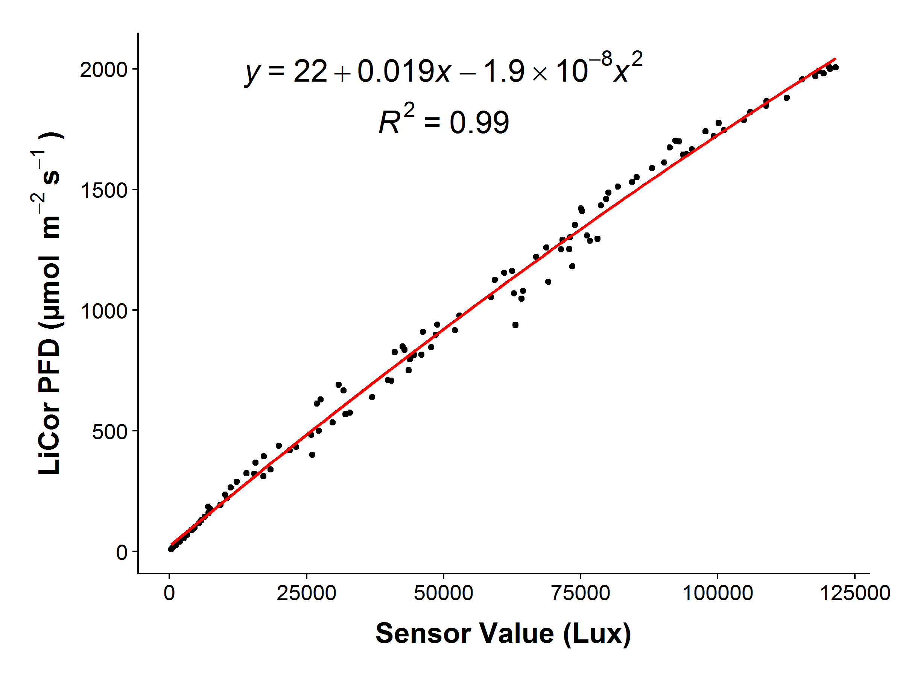
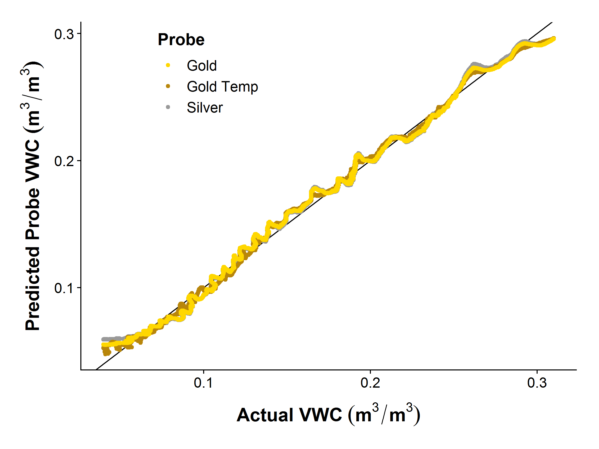

### Overview

This analysis calibrates the light and soil moisture sensors.

The light sensor is calibrated for PFD against a LiCor and compared to a Hobo, while the soil probes are calibrated against measured volumetric water content and compared to a Hobo.


### Light Calibration Results


This shows the calibration of the [BH1750FVI light sensor](http://www.mouser.com/ds/2/348/bh1750fvi-e-186247.pdf) against a [LiCor LI-190R Quantum Sensor](https://www.licor.com/env/products/light/quantum.html) connected to a [LiCor LI-250 Light Meter](https://www.licor.com/env/products/light/light_meter.html)

Both were mounted at the same angle and height on a board, and taking readings every second.

#### Light Linear Model


```

Call:
lm(formula = umol ~ lux, data = light)

Residuals:
     Min       1Q   Median       3Q      Max 
-178.248  -37.350   -9.541   45.492  113.408 

Coefficients:
             Estimate Std. Error t value Pr(>|t|)    
(Intercept) 5.919e+01  9.603e+00   6.164 1.25e-08 ***
lux         1.675e-02  1.465e-04 114.378  < 2e-16 ***
---
Signif. codes:  0 '***' 0.001 '**' 0.01 '*' 0.05 '.' 0.1 ' ' 1

Residual standard error: 56.45 on 108 degrees of freedom
Multiple R-squared:  0.9918,	Adjusted R-squared:  0.9917 
F-statistic: 1.308e+04 on 1 and 108 DF,  p-value: < 2.2e-16
```

#### Light Quadratic Model


```

Call:
lm(formula = umol ~ lux + lux.squared, data = .)

Residuals:
     Min       1Q   Median       3Q      Max 
-203.442  -24.529   -1.738   38.084  100.974 

Coefficients:
              Estimate Std. Error t value Pr(>|t|)    
(Intercept)  2.239e+01  1.180e+01   1.899   0.0603 .  
lux          1.893e-02  4.849e-04  39.047  < 2e-16 ***
lux.squared -1.898e-08  4.057e-09  -4.679 8.49e-06 ***
---
Signif. codes:  0 '***' 0.001 '**' 0.01 '*' 0.05 '.' 0.1 ' ' 1

Residual standard error: 51.67 on 107 degrees of freedom
Multiple R-squared:  0.9932,	Adjusted R-squared:  0.9931 
F-statistic:  7817 on 2 and 107 DF,  p-value: < 2.2e-16
```


#### Light Calibration Graphs

Comparison between the linear and quadratic models

<!-- -->


The best calibration is the quadratic model, presented here alone


<!-- -->

[Root mean square](https://en.wikipedia.org/wiki/Root_mean_square#Error) error between predicted values from the quadratic light model and PFD values from the LiCor.  This gives a measure of accuracy.


```
  mean.square root.mean.square
1    2597.424         50.96493
```

Graph showing the predicted values of PFD from the quadratic model graphed against the LiCor

<!-- -->


### Soil Calibration Results

Calibration of generic silver and gold soil moisture sensor probes with a datalogging scale, measuring water content of the soil every five minutes. The soil used for calibration was a rich loam from the Fenton Meadow. The data columns soil1 and soil2 are gold (ENIG) probes, while soil3 is a silver (HASL) probe.


### Soil Gold Models

Models using the data from the gold-plated soil moisture probe

#### Soil Gold Linear Model


```

Call:
lm(formula = vwc ~ gold, data = .)

Residuals:
      Min        1Q    Median        3Q       Max 
-0.023981 -0.010827  0.001181  0.008224  0.044489 

Coefficients:
              Estimate Std. Error t value Pr(>|t|)    
(Intercept)  3.597e-01  5.311e-04   677.3   <2e-16 ***
gold        -1.296e-05  2.850e-08  -454.6   <2e-16 ***
---
Signif. codes:  0 '***' 0.001 '**' 0.01 '*' 0.05 '.' 0.1 ' ' 1

Residual standard error: 0.01277 on 7678 degrees of freedom
Multiple R-squared:  0.9642,	Adjusted R-squared:  0.9642 
F-statistic: 2.067e+05 on 1 and 7678 DF,  p-value: < 2.2e-16
```

#### Soil Gold Quadratic Model

The quadratic model is considerably better


```

Call:
lm(formula = vwc ~ gold + gold.squared, data = .)

Residuals:
       Min         1Q     Median         3Q        Max 
-0.0154048 -0.0034169 -0.0000345  0.0035356  0.0142257 

Coefficients:
               Estimate Std. Error t value Pr(>|t|)    
(Intercept)   4.806e-01  7.129e-04   674.2   <2e-16 ***
gold         -2.887e-05  8.951e-08  -322.5   <2e-16 ***
gold.squared  4.727e-10  2.633e-12   179.5   <2e-16 ***
---
Signif. codes:  0 '***' 0.001 '**' 0.01 '*' 0.05 '.' 0.1 ' ' 1

Residual standard error: 0.005603 on 7677 degrees of freedom
Multiple R-squared:  0.9931,	Adjusted R-squared:  0.9931 
F-statistic: 5.53e+05 on 2 and 7677 DF,  p-value: < 2.2e-16
          dAICc   df
gold.quad     0.0 4 
gold.lm   12654.2 3 
```


#### Soil Gold Quadratic Temperature Model

The quadratic temperature-compensated model is better by AIC, but it doesn't add much, and doesn't eliminate the residual zig-zag pattern (see below).


```

Call:
lm(formula = vwc ~ gold + gold.squared + temp, data = .)

Residuals:
       Min         1Q     Median         3Q        Max 
-0.0135034 -0.0027853  0.0007276  0.0033035  0.0138653 

Coefficients:
               Estimate Std. Error t value Pr(>|t|)    
(Intercept)   5.656e-01  1.323e-03  427.63   <2e-16 ***
gold         -3.080e-05  7.480e-08 -411.72   <2e-16 ***
gold.squared  5.302e-10  2.204e-12  240.51   <2e-16 ***
temp         -2.720e-03  3.844e-05  -70.74   <2e-16 ***
---
Signif. codes:  0 '***' 0.001 '**' 0.01 '*' 0.05 '.' 0.1 ' ' 1

Residual standard error: 0.00436 on 7676 degrees of freedom
Multiple R-squared:  0.9958,	Adjusted R-squared:  0.9958 
F-statistic: 6.106e+05 on 3 and 7676 DF,  p-value: < 2.2e-16
               dAICc   df
gold.quad.temp     0.0 5 
gold.quad       3853.1 4 
gold.lm        16507.3 3 
```


### Soil Gold Models

Models using the data from the silver (solder plated) soil moisture probe

#### Soil Silver Linear Model


```

Call:
lm(formula = vwc ~ silver, data = .)

Residuals:
       Min         1Q     Median         3Q        Max 
-0.0180007 -0.0061523  0.0002036  0.0057225  0.0272827 

Coefficients:
              Estimate Std. Error t value Pr(>|t|)    
(Intercept)  4.341e-01  4.153e-04  1045.3   <2e-16 ***
silver      -1.513e-05  2.002e-08  -755.6   <2e-16 ***
---
Signif. codes:  0 '***' 0.001 '**' 0.01 '*' 0.05 '.' 0.1 ' ' 1

Residual standard error: 0.007773 on 7678 degrees of freedom
Multiple R-squared:  0.9867,	Adjusted R-squared:  0.9867 
F-statistic: 5.71e+05 on 1 and 7678 DF,  p-value: < 2.2e-16
```

#### Soil Silver Quadratic Model


```

Call:
lm(formula = vwc ~ silver + silver.squared, data = .)

Residuals:
      Min        1Q    Median        3Q       Max 
-0.019434 -0.003896  0.000419  0.004251  0.014139 

Coefficients:
                 Estimate Std. Error t value Pr(>|t|)    
(Intercept)     5.165e-01  1.288e-03   401.0   <2e-16 ***
silver         -2.460e-05  1.440e-07  -170.9   <2e-16 ***
silver.squared  2.546e-10  3.846e-12    66.2   <2e-16 ***
---
Signif. codes:  0 '***' 0.001 '**' 0.01 '*' 0.05 '.' 0.1 ' ' 1

Residual standard error: 0.006202 on 7677 degrees of freedom
Multiple R-squared:  0.9916,	Adjusted R-squared:  0.9916 
F-statistic: 4.506e+05 on 2 and 7677 DF,  p-value: < 2.2e-16
            dAICc  df
silver.quad    0.0 4 
silver.lm   3466.7 3 
```

#### Soil Silver Quadratic Temperature Model


```

Call:
lm(formula = vwc ~ silver + silver.squared + temp, data = .)

Residuals:
       Min         1Q     Median         3Q        Max 
-0.0164454 -0.0030356  0.0007289  0.0036374  0.0134823 

Coefficients:
                 Estimate Std. Error t value Pr(>|t|)    
(Intercept)     6.188e-01  1.722e-03  359.35   <2e-16 ***
silver         -2.737e-05  1.172e-07 -233.60   <2e-16 ***
silver.squared  3.281e-10  3.128e-12  104.89   <2e-16 ***
temp           -3.008e-03  4.138e-05  -72.68   <2e-16 ***
---
Signif. codes:  0 '***' 0.001 '**' 0.01 '*' 0.05 '.' 0.1 ' ' 1

Residual standard error: 0.004774 on 7676 degrees of freedom
Multiple R-squared:  0.995,	Adjusted R-squared:  0.995 
F-statistic: 5.088e+05 on 3 and 7676 DF,  p-value: < 2.2e-16
                 dAICc  df
silver.quad.temp    0.0 5 
silver.lm        7486.2 3 
```


#### Soil Calibration Graphs

Showing soil moisture probe values over time. There is some diurnal variation that is partially temperature-driven.

Adding temperature to the quadratic fit does improve things slightly, but the temperature range is only ~21-30 C, so it doesn't encompass the full temperature range outside

<!-- -->


[Root mean square](https://en.wikipedia.org/wiki/Root_mean_square#Error) error between predicted values from the gold probe quadratic model and measured VWC values from the scale.  This gives a measure of accuracy.


```
  mean.square root.mean.square
1  0.00604131       0.07772586
```


A graph of the calibration and formula using the quadratic model for the gold probe

<!-- -->

Graph showing the predicted values of VWC from the quadratic model graphed against the actual VWC. Notably, the zig-zag pattern improves slightly in the temperature-compensated model, but it is far from eliminated.

<!-- -->


### Session Information


```
R version 3.4.3 (2017-11-30)
Platform: x86_64-w64-mingw32/x64 (64-bit)
Running under: Windows 7 x64 (build 7601) Service Pack 1

Matrix products: default

locale:
[1] LC_COLLATE=English_United States.1252 
[2] LC_CTYPE=English_United States.1252   
[3] LC_MONETARY=English_United States.1252
[4] LC_NUMERIC=C                          
[5] LC_TIME=English_United States.1252    

attached base packages:
[1] stats4    stats     graphics  grDevices utils     datasets  methods  
[8] base     

other attached packages:
 [1] bindrcpp_0.2.2  bbmle_1.0.20    ggpmisc_0.3.0   cowplot_0.9.3  
 [5] forcats_0.3.0   stringr_1.3.0   dplyr_0.7.6     purrr_0.2.4    
 [9] readr_1.1.1     tidyr_0.8.0     tibble_1.4.2    ggplot2_3.0.0  
[13] tidyverse_1.2.1

loaded via a namespace (and not attached):
 [1] tidyselect_0.2.4  reshape2_1.4.3    haven_1.1.1      
 [4] lattice_0.20-35   colorspace_1.3-2  htmltools_0.3.6  
 [7] yaml_2.1.18       rlang_0.2.2       pillar_1.2.2     
[10] foreign_0.8-69    glue_1.2.0        withr_2.1.2      
[13] modelr_0.1.1      readxl_1.1.0      bindr_0.1.1      
[16] plyr_1.8.4        munsell_0.4.3     gtable_0.2.0     
[19] cellranger_1.1.0  rvest_0.3.2       codetools_0.2-15 
[22] psych_1.8.4       evaluate_0.10.1   labeling_0.3     
[25] knitr_1.20        parallel_3.4.3    broom_0.4.4      
[28] Rcpp_0.12.16      polynom_1.3-9     scales_0.5.0     
[31] backports_1.1.2   jsonlite_1.5      mnormt_1.5-5     
[34] hms_0.4.2         digest_0.6.15     stringi_1.1.7    
[37] numDeriv_2016.8-1 grid_3.4.3        rprojroot_1.3-2  
[40] cli_1.0.0         tools_3.4.3       magrittr_1.5     
[43] lazyeval_0.2.1    crayon_1.3.4      pkgconfig_2.0.1  
[46] xml2_1.2.0        lubridate_1.7.4   assertthat_0.2.0 
[49] rmarkdown_1.9     httr_1.3.1        rstudioapi_0.7   
[52] R6_2.2.2          nlme_3.1-131      compiler_3.4.3   
```
