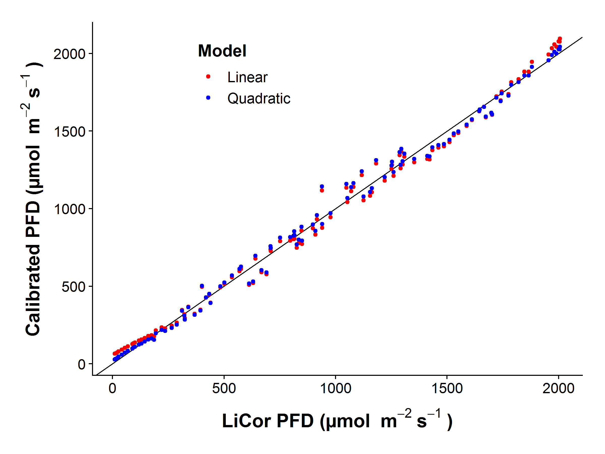
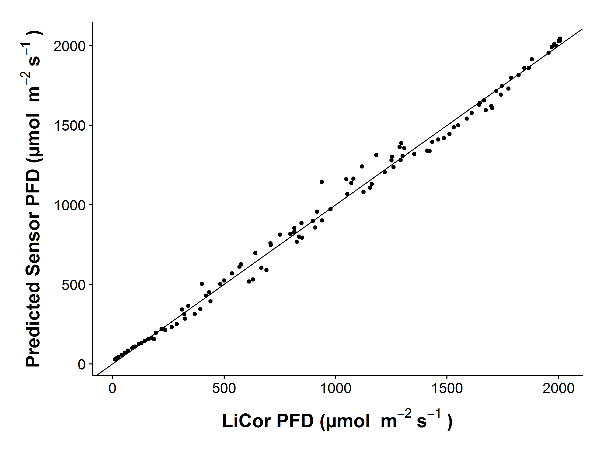
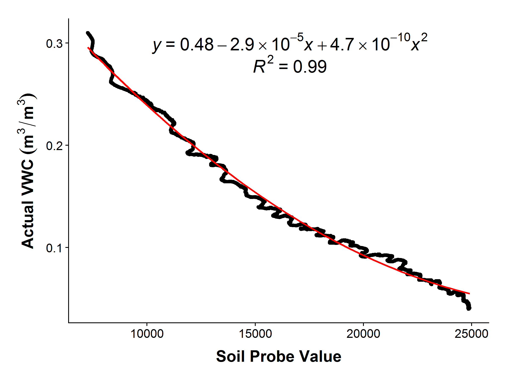

### Overview

This analysis calibrates the light and soil moisture sensors.

The light sensor is calibrated for PAR against a LiCor and compared to a Hobo, while the soil probes are calibrated against measured volumetric water content and compared to a Hobo.


### Light Calibration Results


This shows the calibration of the [BH1750FVI light sensor](http://www.mouser.com/ds/2/348/bh1750fvi-e-186247.pdf) against a [LiCor LI-190R Quantum Sensor](https://www.licor.com/env/products/light/quantum.html) connected to a [LiCor LI-250 Light Meter](https://www.licor.com/env/products/light/light_meter.html)

Both were mounted at the same angle and height on a board, and taking readings every second.

#### Light Linear Model


```

Call:
lm(formula = umol ~ lux, data = light)

Residuals:
     Min       1Q   Median       3Q      Max 
-178.248  -37.350   -9.541   45.492  113.408 

Coefficients:
             Estimate Std. Error t value Pr(>|t|)    
(Intercept) 5.919e+01  9.603e+00   6.164 1.25e-08 ***
lux         1.675e-02  1.465e-04 114.378  < 2e-16 ***
---
Signif. codes:  0 '***' 0.001 '**' 0.01 '*' 0.05 '.' 0.1 ' ' 1

Residual standard error: 56.45 on 108 degrees of freedom
Multiple R-squared:  0.9918,	Adjusted R-squared:  0.9917 
F-statistic: 1.308e+04 on 1 and 108 DF,  p-value: < 2.2e-16
```

#### Light Quadratic Model


```

Call:
lm(formula = umol ~ lux + lux.squared, data = .)

Residuals:
     Min       1Q   Median       3Q      Max 
-203.442  -24.529   -1.738   38.084  100.974 

Coefficients:
              Estimate Std. Error t value Pr(>|t|)    
(Intercept)  2.239e+01  1.180e+01   1.899   0.0603 .  
lux          1.893e-02  4.849e-04  39.047  < 2e-16 ***
lux.squared -1.898e-08  4.057e-09  -4.679 8.49e-06 ***
---
Signif. codes:  0 '***' 0.001 '**' 0.01 '*' 0.05 '.' 0.1 ' ' 1

Residual standard error: 51.67 on 107 degrees of freedom
Multiple R-squared:  0.9932,	Adjusted R-squared:  0.9931 
F-statistic:  7817 on 2 and 107 DF,  p-value: < 2.2e-16
```


#### Light Calibration Graphs

Comparison between the linear and quadratic models

<!-- -->


The best calibration is the quadratic model, presented here alone


<!-- -->

[Root mean square](https://en.wikipedia.org/wiki/Root_mean_square#Error) error between predicted values from the quadratic light model and PAR values from the LiCor.  This gives a measure of accuracy.


```
  mean.square root.mean.square
1    2597.424         50.96493
```

Graph showing the predicted values of PAR from the quadratic model graphed against the LiCor

<!-- -->

This graph compares the BH1750FVI (calibrated to the LiCor) to a [Hobo Microstation](http://www.onsetcomp.com/products/data-loggers/h21-002) with a [S-LIA-M003 PAR Sensor](http://www.onsetcomp.com/products/sensors/s-lia-m003).  The Hobo shows very messy data.  This is the calibration run on the windowsill in TLS in parallel with the soil calibration

<!-- -->


### Soil Calibration Results

Calibration of generic silver and gold soil moisture sensor probes with a datalogging scale, measuring water content of the soil every five minutes. The soil used for calibration was a rich loam from the Fenton Meadow. The data columns soil1 and soil2 are gold (ENIG) probes, while soil3 is a silver (HASL) probe.

Concurrently, the soil moisture was measured with a [Hobo Microstation](http://www.onsetcomp.com/products/data-loggers/h21-002) equipped with a [Decagon Devices ECH20 capacitive soil moisture sensor](http://www.decagondevices.eu/products/discontinued-products/ech2o-1).


#### Soil Gold Linear Model


```

Call:
lm(formula = vwc ~ gold, data = .)

Residuals:
      Min        1Q    Median        3Q       Max 
-0.029218 -0.008886 -0.002010  0.010517  0.044366 

Coefficients:
              Estimate Std. Error t value Pr(>|t|)    
(Intercept)  3.553e-01  4.019e-04   883.9   <2e-16 ***
gold        -1.233e-05  2.090e-08  -590.0   <2e-16 ***
---
Signif. codes:  0 '***' 0.001 '**' 0.01 '*' 0.05 '.' 0.1 ' ' 1

Residual standard error: 0.01387 on 15358 degrees of freedom
Multiple R-squared:  0.9577,	Adjusted R-squared:  0.9577 
F-statistic: 3.481e+05 on 1 and 15358 DF,  p-value: < 2.2e-16
```

#### Soil Gold Linear Temperature Model (Combined)

This model is better (by AICc), but it doesn't add much


```

Call:
lm(formula = vwc ~ gold + temp, data = .)

Residuals:
      Min        1Q    Median        3Q       Max 
-0.028827 -0.009056 -0.001993  0.010674  0.044884 

Coefficients:
              Estimate Std. Error  t value Pr(>|t|)    
(Intercept)  3.670e-01  2.122e-03  172.963  < 2e-16 ***
gold        -1.233e-05  2.089e-08 -590.582  < 2e-16 ***
temp        -4.528e-04  8.033e-05   -5.637 1.76e-08 ***
---
Signif. codes:  0 '***' 0.001 '**' 0.01 '*' 0.05 '.' 0.1 ' ' 1

Residual standard error: 0.01386 on 15357 degrees of freedom
Multiple R-squared:  0.9578,	Adjusted R-squared:  0.9578 
F-statistic: 1.744e+05 on 2 and 15357 DF,  p-value: < 2.2e-16
             dAICc df
gold.lm.temp  0.0  4 
gold.lm      29.7  3 
```

#### Soil Gold Quadratic Model (Combined)

The quadratic model is considerably better


```

Call:
lm(formula = vwc ~ gold + gold.squared, data = .)

Residuals:
       Min         1Q     Median         3Q        Max 
-0.0210182 -0.0071117 -0.0009399  0.0058789  0.0199873 

Coefficients:
               Estimate Std. Error t value Pr(>|t|)    
(Intercept)   4.622e-01  7.828e-04   590.4   <2e-16 ***
gold         -2.628e-05  9.726e-08  -270.2   <2e-16 ***
gold.squared  4.077e-10  2.815e-12   144.8   <2e-16 ***
---
Signif. codes:  0 '***' 0.001 '**' 0.01 '*' 0.05 '.' 0.1 ' ' 1

Residual standard error: 0.009017 on 15357 degrees of freedom
Multiple R-squared:  0.9821,	Adjusted R-squared:  0.9821 
F-statistic: 4.223e+05 on 2 and 15357 DF,  p-value: < 2.2e-16
             dAICc   df
gold.quad        0.0 4 
gold.lm.temp 13198.0 4 
gold.lm      13227.7 3 
```

#### Soil Gold Quadratic Model (Separate)

Calulates a separate quadratic model for each probe.

I've decided to use the Gold2 probe calibration.  The Gold1 probe did some funny things and was more corroded, so I think it's not so trustworthy.


```

Call:
lm(formula = vwc ~ gold1 + gold1.squared, data = .)

Residuals:
       Min         1Q     Median         3Q        Max 
-0.0225132 -0.0052504  0.0005674  0.0048755  0.0165890 

Coefficients:
                Estimate Std. Error t value Pr(>|t|)    
(Intercept)    4.328e-01  9.226e-04  469.13   <2e-16 ***
gold1         -2.199e-05  1.143e-07 -192.34   <2e-16 ***
gold1.squared  2.878e-10  3.276e-12   87.84   <2e-16 ***
---
Signif. codes:  0 '***' 0.001 '**' 0.01 '*' 0.05 '.' 0.1 ' ' 1

Residual standard error: 0.007636 on 7677 degrees of freedom
Multiple R-squared:  0.9872,	Adjusted R-squared:  0.9872 
F-statistic: 2.959e+05 on 2 and 7677 DF,  p-value: < 2.2e-16

Call:
lm(formula = vwc ~ gold2 + gold2.squared, data = .)

Residuals:
       Min         1Q     Median         3Q        Max 
-0.0154048 -0.0034169 -0.0000345  0.0035356  0.0142257 

Coefficients:
                Estimate Std. Error t value Pr(>|t|)    
(Intercept)    4.806e-01  7.129e-04   674.2   <2e-16 ***
gold2         -2.887e-05  8.951e-08  -322.5   <2e-16 ***
gold2.squared  4.727e-10  2.633e-12   179.5   <2e-16 ***
---
Signif. codes:  0 '***' 0.001 '**' 0.01 '*' 0.05 '.' 0.1 ' ' 1

Residual standard error: 0.005603 on 7677 degrees of freedom
Multiple R-squared:  0.9931,	Adjusted R-squared:  0.9931 
F-statistic: 5.53e+05 on 2 and 7677 DF,  p-value: < 2.2e-16
```

#### Soil Silver Linear Model


```

Call:
lm(formula = vwc ~ silver, data = .)

Residuals:
       Min         1Q     Median         3Q        Max 
-0.0180007 -0.0061523  0.0002036  0.0057225  0.0272827 

Coefficients:
              Estimate Std. Error t value Pr(>|t|)    
(Intercept)  4.341e-01  4.153e-04  1045.3   <2e-16 ***
silver      -1.513e-05  2.002e-08  -755.6   <2e-16 ***
---
Signif. codes:  0 '***' 0.001 '**' 0.01 '*' 0.05 '.' 0.1 ' ' 1

Residual standard error: 0.007773 on 7678 degrees of freedom
Multiple R-squared:  0.9867,	Adjusted R-squared:  0.9867 
F-statistic: 5.71e+05 on 1 and 7678 DF,  p-value: < 2.2e-16
```

#### Soil Silver Quadratic Model


```

Call:
lm(formula = vwc ~ silver + silver.squared, data = .)

Residuals:
      Min        1Q    Median        3Q       Max 
-0.019434 -0.003896  0.000419  0.004251  0.014139 

Coefficients:
                 Estimate Std. Error t value Pr(>|t|)    
(Intercept)     5.165e-01  1.288e-03   401.0   <2e-16 ***
silver         -2.460e-05  1.440e-07  -170.9   <2e-16 ***
silver.squared  2.546e-10  3.846e-12    66.2   <2e-16 ***
---
Signif. codes:  0 '***' 0.001 '**' 0.01 '*' 0.05 '.' 0.1 ' ' 1

Residual standard error: 0.006202 on 7677 degrees of freedom
Multiple R-squared:  0.9916,	Adjusted R-squared:  0.9916 
F-statistic: 4.506e+05 on 2 and 7677 DF,  p-value: < 2.2e-16
            dAICc  df
silver.quad    0.0 4 
silver.lm   3466.7 3 
```


#### Soil Calibration Graphs

Showing soil moisture probe values over time. There is some diurnal variation that is likely temperature driven.

Adding temperature to the quadratic fit does improve things slightly, but the temperature range is only ~21-30 C, so it doesn't encompass the full temperature range outside

<!-- -->


[Root mean square](https://en.wikipedia.org/wiki/Root_mean_square#Error) error between predicted values from the quadratic gold model and VWC values from the scale.  This gives a measure of accuracy.


```
  mean.square root.mean.square
1  0.00604131       0.07772586
```


A graph of the calibration and formula using the quadratic model

<!-- -->

Graph showing the predicted values of VWC from the quadratic model graphed against the actual VWC

<!-- -->

Comparison of predicted values of VWC from the EMU sensors and VWC from the Hobo Microstation compared to actual VWC

<!-- -->


### Session Information


```
R version 3.4.3 (2017-11-30)
Platform: x86_64-redhat-linux-gnu (64-bit)
Running under: CentOS Linux 7 (Core)

Matrix products: default
BLAS/LAPACK: /usr/lib64/R/lib/libRblas.so

locale:
 [1] LC_CTYPE=en_US.UTF-8       LC_NUMERIC=C              
 [3] LC_TIME=en_US.UTF-8        LC_COLLATE=en_US.UTF-8    
 [5] LC_MONETARY=en_US.UTF-8    LC_MESSAGES=en_US.UTF-8   
 [7] LC_PAPER=en_US.UTF-8       LC_NAME=C                 
 [9] LC_ADDRESS=C               LC_TELEPHONE=C            
[11] LC_MEASUREMENT=en_US.UTF-8 LC_IDENTIFICATION=C       

attached base packages:
[1] stats4    stats     graphics  grDevices utils     datasets  methods  
[8] base     

other attached packages:
[1] bindrcpp_0.2   dplyr_0.7.4    tidyr_0.7.2    bbmle_1.0.20  
[5] ggpmisc_0.2.16 cowplot_0.9.1  ggplot2_2.2.1 

loaded via a namespace (and not attached):
 [1] Rcpp_0.12.13      compiler_3.4.3    plyr_1.8.4       
 [4] bindr_0.1         tools_3.4.3       digest_0.6.12    
 [7] evaluate_0.10.1   tibble_1.3.4      gtable_0.2.0     
[10] lattice_0.20-35   pkgconfig_2.0.1   rlang_0.1.4      
[13] yaml_2.1.14       polynom_1.3-9     stringr_1.2.0    
[16] knitr_1.17        tidyselect_0.2.3  rprojroot_1.2    
[19] grid_3.4.3        glue_1.2.0        R6_2.2.2         
[22] rmarkdown_1.8     purrr_0.2.4       magrittr_1.5     
[25] backports_1.1.1   scales_0.5.0      codetools_0.2-15 
[28] htmltools_0.3.6   assertthat_0.2.0  colorspace_1.3-2 
[31] numDeriv_2016.8-1 labeling_0.3      stringi_1.1.6    
[34] lazyeval_0.2.1    munsell_0.4.3    
```
