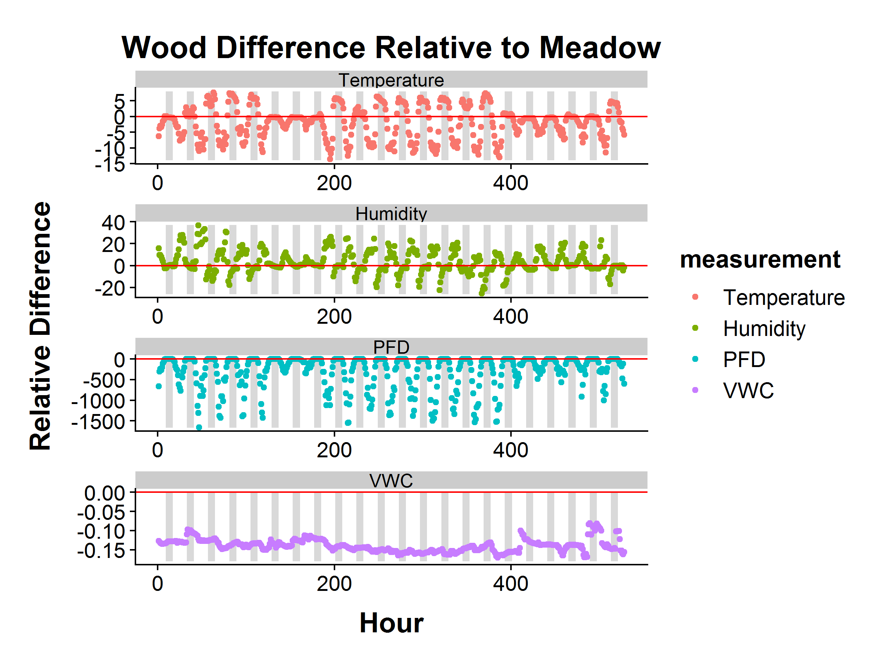
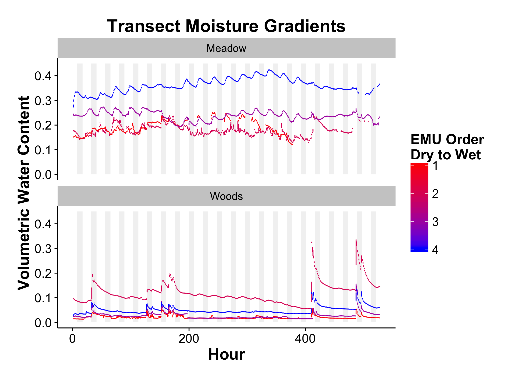
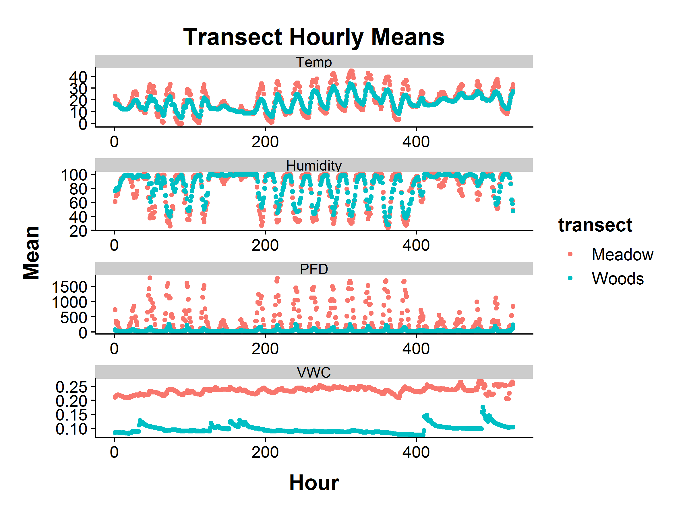

### Overview

We set up a number of expectations for the Fenton site

1. The temperature should be lower in the woods
2. The humidity should be higher in the woods
3. The light levels should be lower in the woods
4. Soil moisture should show a gradient in both transects
    a. The woods should have a gradient from top to bottom of hill
    b. The meadow should have a gradient from the meadow to the swamp


## Missing Data


|emu       |  logs| logs.missing| temperature| humidity|   pfd|   vwc| data.missing|
|:---------|-----:|------------:|-----------:|--------:|-----:|-----:|------------:|
|Charlotte |  2109|        0.000|        2109|     2109|  2109|  2109|        0.000|
|Marie     |  1898|        0.100|        1898|     1898|  1898|  1898|        0.100|
|MaryLee   |  2109|        0.000|         752|      752|  2109|  2109|        0.322|
|Natalie   |  1177|        0.442|        1177|     1177|  1177|  1177|        0.442|
|Roger     |  2109|        0.000|        2109|     2109|  2109|  2109|        0.000|
|Santiago  |  2108|        0.000|        2105|     2105|  2108|  2108|        0.001|
|Simon     |  2108|        0.000|        2108|     2108|  2108|  2108|        0.000|
|Simona    |  2033|        0.036|        1995|     1996|  2033|  2033|        0.045|
|Total     | 15651|        0.072|       14253|    14254| 15651| 15651|        0.114|


## Main Hypotheses

Hourly differences between the two transects. Dark rectangles denote night-time hours (between dusk and dawn)


<!-- -->
Hourly soil moisture means for each position in the transect, colored by *a priori* expectations on dry to wet (wetter in the swampy end of the meadow transect, wetter at the bottom of the hill in the woods)

<!-- -->

Hourly means for each transect

<!-- -->


### Session Information


```
R version 3.4.3 (2017-11-30)
Platform: x86_64-w64-mingw32/x64 (64-bit)
Running under: Windows 7 x64 (build 7601) Service Pack 1

Matrix products: default

locale:
[1] LC_COLLATE=English_United States.1252 
[2] LC_CTYPE=English_United States.1252   
[3] LC_MONETARY=English_United States.1252
[4] LC_NUMERIC=C                          
[5] LC_TIME=English_United States.1252    

attached base packages:
[1] stats     graphics  grDevices utils     datasets  methods   base     

other attached packages:
 [1] bindrcpp_0.2.2  lubridate_1.7.4 mgcv_1.8-22     nlme_3.1-131   
 [5] knitr_1.20      maptools_0.9-4  sp_1.3-1        rgeos_0.3-28   
 [9] cowplot_0.9.3   forcats_0.3.0   stringr_1.3.0   dplyr_0.7.6    
[13] purrr_0.2.4     readr_1.1.1     tidyr_0.8.0     tibble_1.4.2   
[17] ggplot2_3.0.0   tidyverse_1.2.1

loaded via a namespace (and not attached):
 [1] tidyselect_0.2.4 reshape2_1.4.3   haven_1.1.1      lattice_0.20-35 
 [5] colorspace_1.3-2 htmltools_0.3.6  yaml_2.1.18      rlang_0.2.2     
 [9] pillar_1.2.2     foreign_0.8-69   glue_1.2.0       withr_2.1.2     
[13] modelr_0.1.1     readxl_1.1.0     bindr_0.1.1      plyr_1.8.4      
[17] munsell_0.4.3    gtable_0.2.0     cellranger_1.1.0 rvest_0.3.2     
[21] codetools_0.2-15 psych_1.8.4      evaluate_0.10.1  labeling_0.3    
[25] parallel_3.4.3   highr_0.6        broom_0.4.4      Rcpp_0.12.16    
[29] scales_0.5.0     backports_1.1.2  jsonlite_1.5     mnormt_1.5-5    
[33] hms_0.4.2        digest_0.6.15    stringi_1.1.7    grid_3.4.3      
[37] rprojroot_1.3-2  cli_1.0.0        tools_3.4.3      magrittr_1.5    
[41] lazyeval_0.2.1   crayon_1.3.4     pkgconfig_2.0.1  Matrix_1.2-12   
[45] xml2_1.2.0       assertthat_0.2.0 rmarkdown_1.9    httr_1.3.1      
[49] rstudioapi_0.7   R6_2.2.2         compiler_3.4.3  
```
