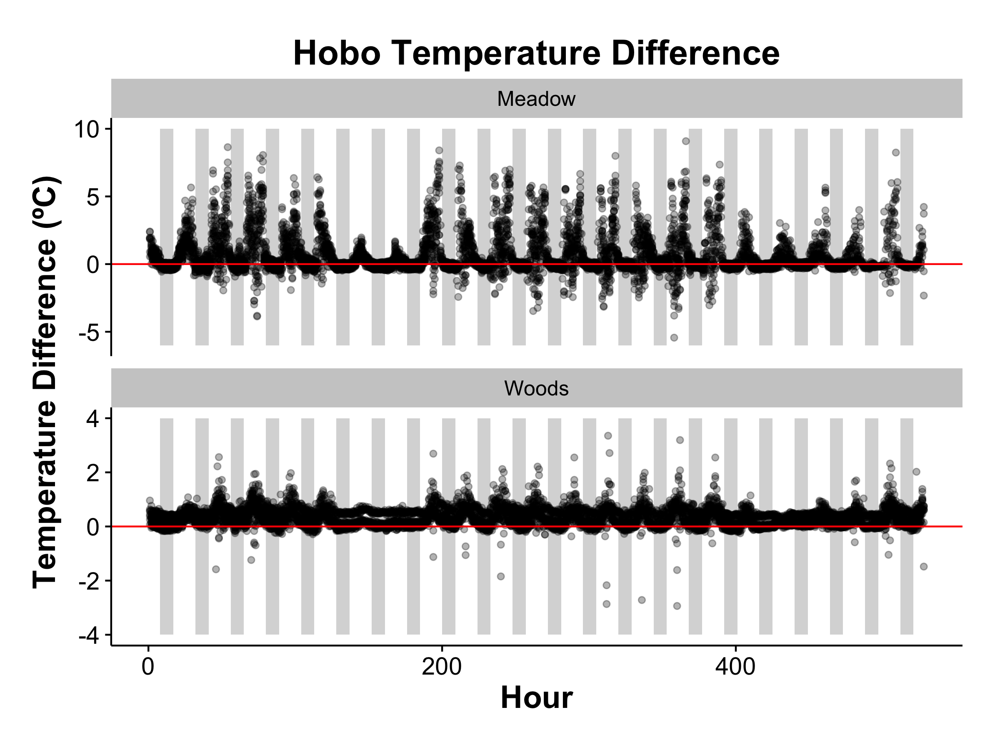
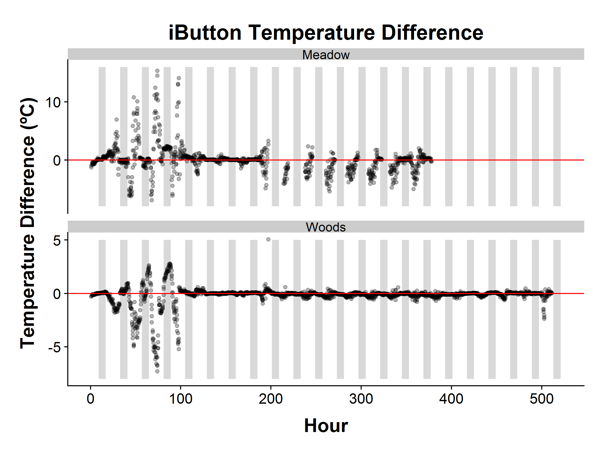
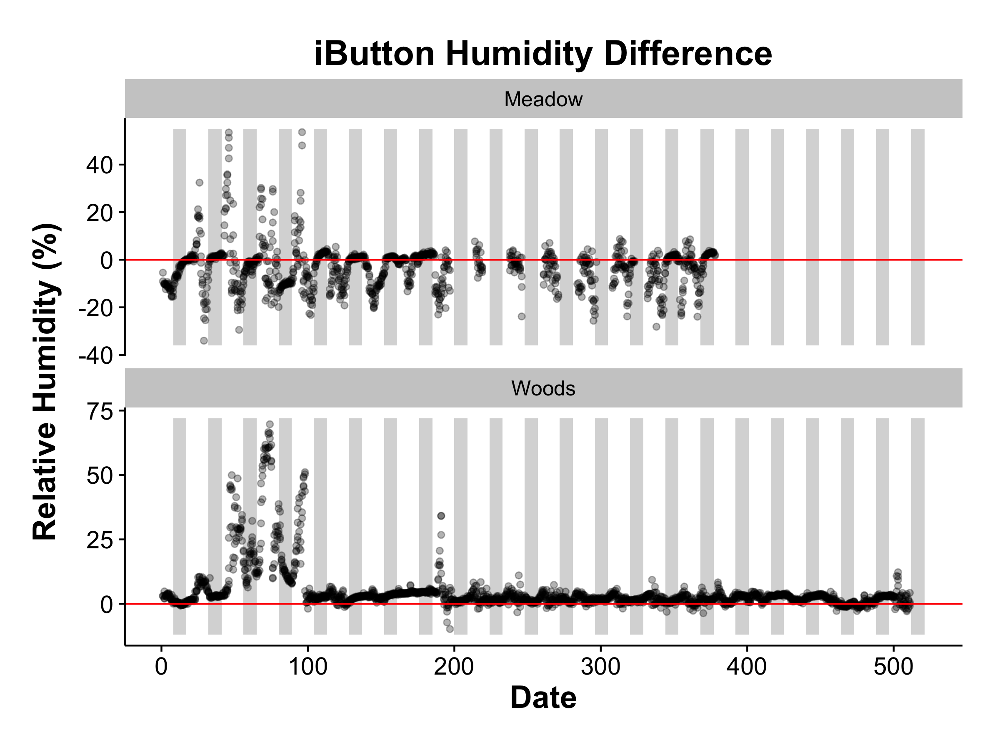
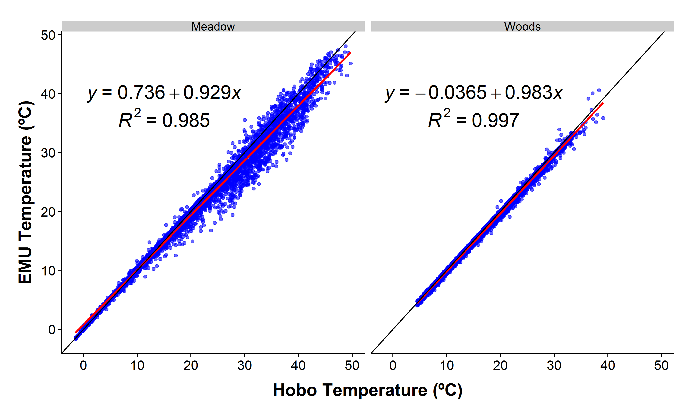
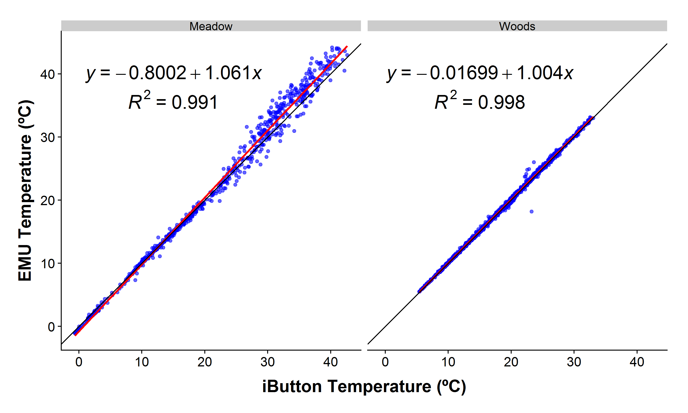
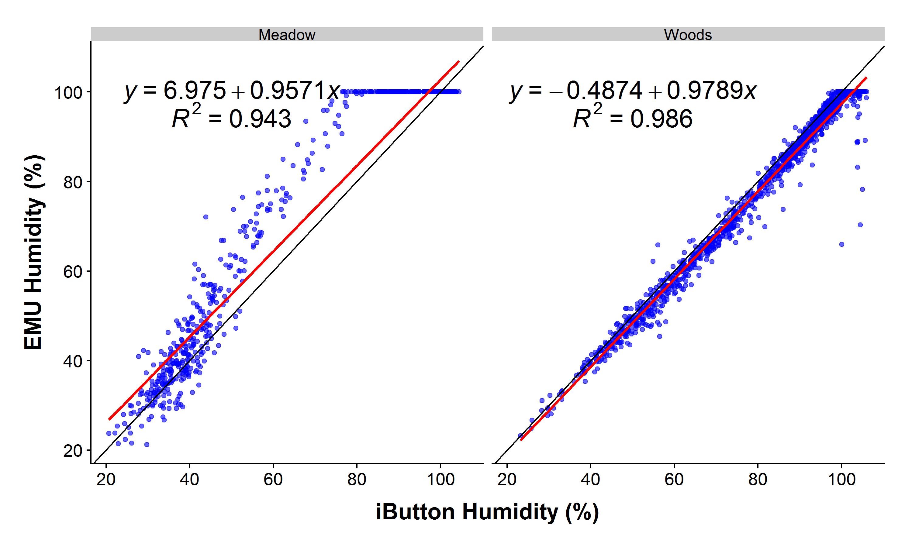
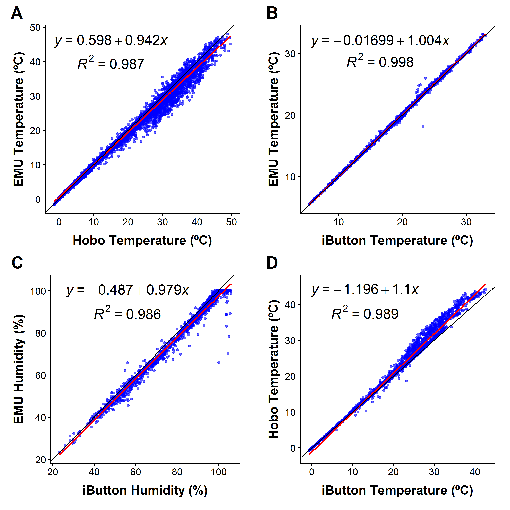

# Comparison Among Sensor Types
James Mickley  


### Overview

This analysis compares the results for the EMU, Hobo Pendant, Hobo Microstation, and iButton at the first site in each of the two transects.  


### Temperature

Differences in temperature between EMUs and Hobos at all positions

Hobos tend to read high, especially during the day.  Strongly suggests heat trapped from sun.

<!-- -->

Differences between EMUs and iButtons at the first position of each transect.

Prior to hour 98, the iButtons had fallen on the ground, so you are seeing the difference between ground temperature and that of 10 cm above.

There is minimal difference in temperature between the iButtons and Hobos on both transects from hour 98 to 190.  After 190, the meadow BME280 started failing, and I think those values may be bad.  

<!-- -->


### Humidity

Differences in humidity between EMUs and iButtons at the first position of each transect.

Prior to hour 98, the iButtons had fallen on the ground, so you are seeing the difference between ground temperature and that of 10 cm above.

It looks like humidity is lower during the day with the iButton on the meadow transect, and generally higher at all times in the woods.


<!-- -->


### PAR

Differences in PAR between EMUs and Hobo Microstations at the first position of each transect.

The Hobo is consistently lower in the woods, even at night (why is that?). There's a lot of noise in the meadow during the day.


<!-- -->


### Volumetric Water Content

Differences in Volumetric Water Content between EMUs and Hobo Microstations at the first position of each transect.

The Hobo is always wetter in the woods, and it seems to be responding more strongly to rain than the EMU.

In the meadow, the pattern is unpredictable, but the measurements are closer together.

<!-- -->

## Comparisons between EMU & iButton/Hobo Pendant for Woods transect

The Hobo Pendant reads slightly high on temperature (by about 2ºC).  Presumably it's getting heated inside of its enclosed case.


<!-- -->

The iButtons read slightly lower than the EMU when it's cold, and slightly higher when hot.  Presumably, this is in response to the metal enclosure.

<!-- -->

```
## [1] 4
```

Comparing iButtons to Hobos, we see that hobos read too high for anything over about 10C.  Again evidence of self-heating.


### Humidity

The iButtons have slightly higher humidity (3-5% or so) in the Woods.  They also can return values higher than 100%.  

In the meadow, the BME280 failed, and I think all the humidity values are bogus.

<!-- -->

<!-- -->


### PAR

Hobos tend to read too low in low light, and high in high light (sometimes wildly too high).

Roughly the same pattern in both transects.


<!-- -->


### Volumetric Water Content

Very strange patterns here, and not at all what we saw during calibration.

In the meadow (which is wet), the hobo is mostly reading lower than the EMU, but sometimes it's higher.  While the trend is positive, the high readings on the Hobo are not at the higest readings for the EMU, but somewhere in the middle.

In the woods, the EMU read very low, while there was a full range for the Hobo.  
This was true of 3 of 4 EMUs along the transect.  Maybe it's a depth issue? Deeper soil, which the Hobo could access would be wetter.  Or perhaps it's a coarse soil issue?

<!-- -->


### Session Information


```
R version 3.4.0 (2017-04-21)
Platform: x86_64-apple-darwin15.6.0 (64-bit)
Running under: OS X El Capitan 10.11.6

Matrix products: default
BLAS: /Library/Frameworks/R.framework/Versions/3.4/Resources/lib/libRblas.0.dylib
LAPACK: /Library/Frameworks/R.framework/Versions/3.4/Resources/lib/libRlapack.dylib

locale:
[1] en_US.UTF-8/en_US.UTF-8/en_US.UTF-8/C/en_US.UTF-8/en_US.UTF-8

attached base packages:
[1] stats     graphics  grDevices utils     datasets  methods   base     

other attached packages:
[1] bindrcpp_0.2    dplyr_0.7.1     lubridate_1.6.0 tidyr_0.6.3    
[5] ggpmisc_0.2.15  cowplot_0.7.0   ggplot2_2.2.1  

loaded via a namespace (and not attached):
 [1] Rcpp_0.12.11     bindr_0.1        knitr_1.16       magrittr_1.5    
 [5] munsell_0.4.3    colorspace_1.3-2 R6_2.2.2         rlang_0.1.1     
 [9] stringr_1.2.0    plyr_1.8.4       tools_3.4.0      grid_3.4.0      
[13] gtable_0.2.0     htmltools_0.3.6  assertthat_0.2.0 yaml_2.1.14     
[17] lazyeval_0.2.0   rprojroot_1.2    digest_0.6.12    tibble_1.3.3    
[21] glue_1.1.1       evaluate_0.10    rmarkdown_1.6    stringi_1.1.5   
[25] compiler_3.4.0   scales_0.4.1     backports_1.1.0  pkgconfig_2.0.1 
```


