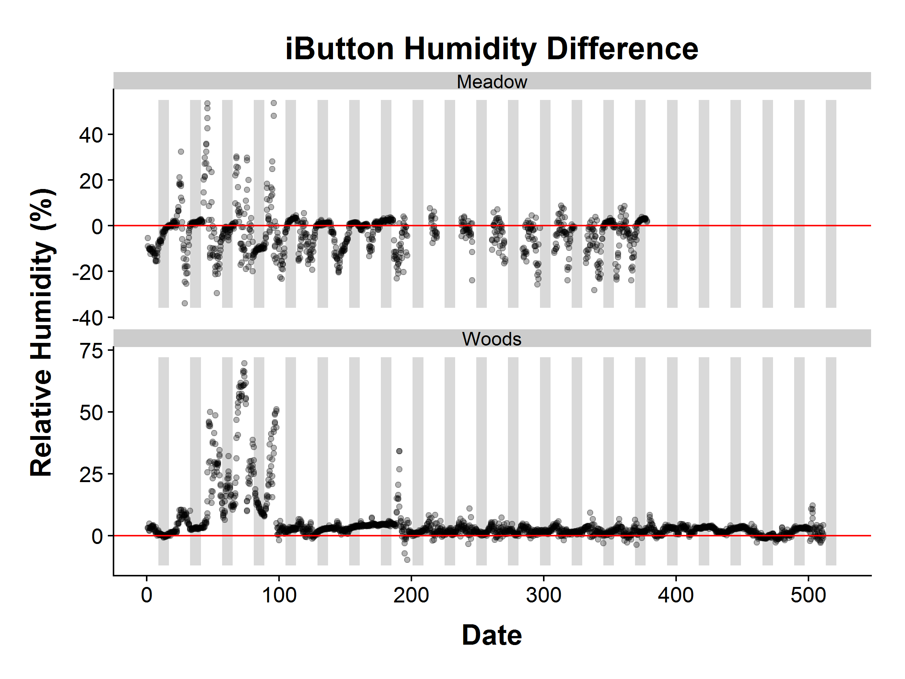

# Comparison Among different Sensor Types
James Mickley  

### Overview

This analysis compares the results for the EMU, Hobo Pendant, Hobo Microstation, and iButton at the first site in each of the two transects.  

### Temperature

Differences in temperature between EMUs and Hobos at all positions, and between EMUs and iButtons at the first position of each transect

<!-- -->

### Humidity

Differences in humidity between EMUs and iButtons at the first position of each transect

<!-- -->

### PAR

Differences in PAR between EMUs and Hobo Microstations at the first position of each transect

<!-- -->

### Volumetric Water Content

Differences in Volumetric Water Content between EMUs and Hobo Microstations at the first position of each transect

<!-- -->

