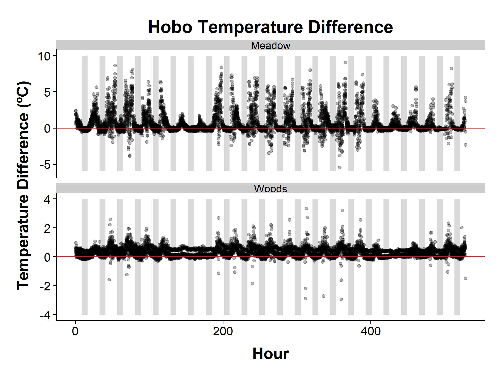

### Overview

This analysis compares the results for the EMU, Hobo Pendant, and iButton at the first site in each of the two transects.  


### Temperature

Differences in temperature between EMUs relative to Hobo Pendants at all positions in the transects.

Hobos tend to read high, especially during the day.  Strongly suggests heat trapped from sun.

<!-- -->

Differences in temperature between EMUs relative to iButtons at the first position of each transect.

Prior to hour 98, the iButtons had fallen on the ground, so you are seeing the difference between ground temperature and that of 10 cm above.

There is minimal difference in temperature between the iButtons and Hobos on both transects from hour 98 to 190.  After 190, the meadow BME280 started failing. Subsequent values may be inaccurate.

<!-- -->


### Humidity

Differences in humidity between EMUs relative to iButtons at the first position of each transect.

Prior to hour 98, the iButtons had fallen on the ground, so this is the difference between ground temperature and that of 10 cm above.

It looks like humidity is lower during the day with the iButton on the meadow transect, and generally higher at all times in the woods.


<!-- -->


## Comparisons between EMU & iButton/Hobo Pendant for Woods transect

The Hobo Pendant reads slightly high on temperature (by about 2ºC).  Presumably it's getting heated inside of its enclosed case.


<!-- -->

The iButtons read slightly lower than the EMU when it's cold, and slightly higher when hot.  Presumably, this is in response to the metal enclosure.

<!-- -->

Comparing iButtons to Hobos, we see that hobos read too high for anything over about 10C.  Again evidence of self-heating.

<!-- -->


### Humidity

The iButtons have slightly higher humidity (3-5% or so) in the Woods.  They also can return values higher than 100%.  

In the meadow, the BME280 failed, and I think all the humidity values are bogus.

<!-- -->

<!-- -->

### Session Information


```
R version 3.4.3 (2017-11-30)
Platform: x86_64-w64-mingw32/x64 (64-bit)
Running under: Windows 7 x64 (build 7601) Service Pack 1

Matrix products: default

locale:
[1] LC_COLLATE=English_United States.1252 
[2] LC_CTYPE=English_United States.1252   
[3] LC_MONETARY=English_United States.1252
[4] LC_NUMERIC=C                          
[5] LC_TIME=English_United States.1252    

attached base packages:
[1] stats     graphics  grDevices utils     datasets  methods   base     

other attached packages:
 [1] bindrcpp_0.2.2  maptools_0.9-4  sp_1.3-1        rgeos_0.3-28   
 [5] lubridate_1.7.4 ggpmisc_0.3.0   cowplot_0.9.3   forcats_0.3.0  
 [9] stringr_1.3.0   dplyr_0.7.6     purrr_0.2.4     readr_1.1.1    
[13] tidyr_0.8.0     tibble_1.4.2    ggplot2_3.0.0   tidyverse_1.2.1

loaded via a namespace (and not attached):
 [1] tidyselect_0.2.4 reshape2_1.4.3   haven_1.1.1      lattice_0.20-35 
 [5] colorspace_1.3-2 htmltools_0.3.6  yaml_2.1.18      rlang_0.2.2     
 [9] pillar_1.2.2     foreign_0.8-69   glue_1.2.0       withr_2.1.2     
[13] modelr_0.1.1     readxl_1.1.0     bindr_0.1.1      plyr_1.8.4      
[17] munsell_0.4.3    gtable_0.2.0     cellranger_1.1.0 rvest_0.3.2     
[21] codetools_0.2-15 psych_1.8.4      evaluate_0.10.1  labeling_0.3    
[25] knitr_1.20       parallel_3.4.3   broom_0.4.4      Rcpp_0.12.16    
[29] polynom_1.3-9    scales_0.5.0     backports_1.1.2  jsonlite_1.5    
[33] mnormt_1.5-5     hms_0.4.2        digest_0.6.15    stringi_1.1.7   
[37] grid_3.4.3       rprojroot_1.3-2  cli_1.0.0        tools_3.4.3     
[41] magrittr_1.5     lazyeval_0.2.1   crayon_1.3.4     pkgconfig_2.0.1 
[45] xml2_1.2.0       assertthat_0.2.0 rmarkdown_1.9    httr_1.3.1      
[49] rstudioapi_0.7   R6_2.2.2         nlme_3.1-131     compiler_3.4.3  
```
