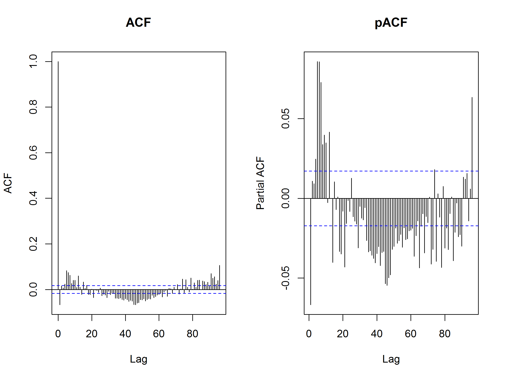
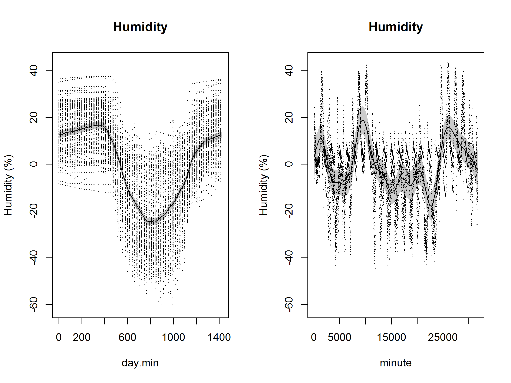
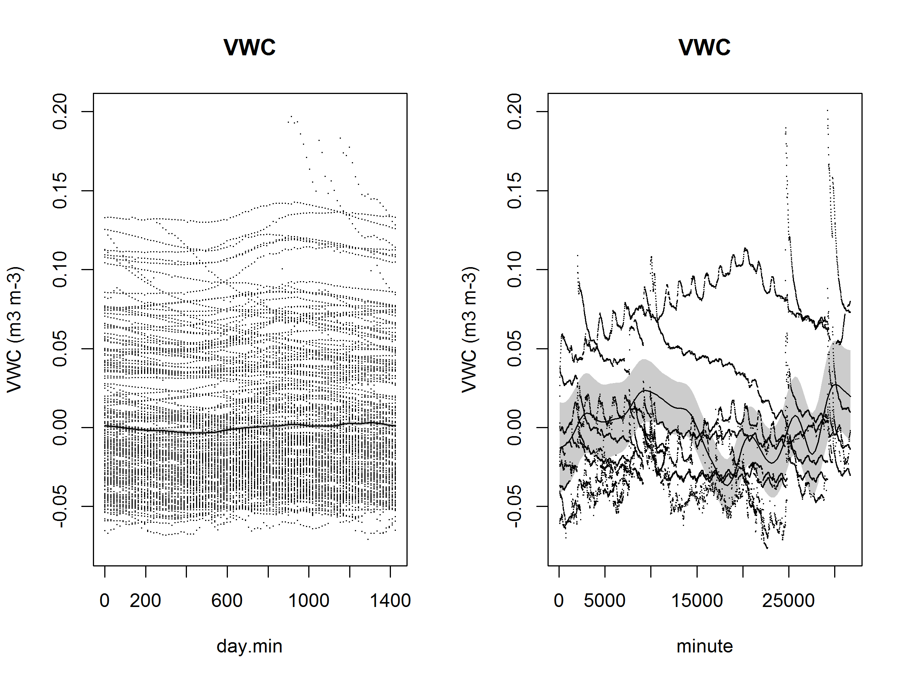

# Transect Comparison
James Mickley  


## Overview

This analysis is looking for microenvironmental differences or gradients between transects.  It's a more involved version of the [Paired T-Test analysis](Paired-T-tests.md).

We're using this [GAM approach](http://www.fromthebottomoftheheap.net/2014/05/09/modelling-seasonal-data-with-gam/).  In this approach, there are two smoothers (as Robi suggested).  One smoother is a cubic spline that accounts for intra-day variation.  Then a second spline is fitted to account for temporal variation that is not intra-day.  

Readings have temporal autocorrelation, therefore, we add an autoregressive moving average correlation structure (corAR1). We set the form here to account for autocorrelation separately for each transect position, treating positions and transects as independent.  In every case, accounting for autocorrelation improves the models considerably, however, significant autocorrelation is still unaccounted for.  Zuur et. al. say that it's usually not worth finding the optimal autocorrelation structure.  

After all temporal effects are accounted for, we test our expectations:

1. The temperature should be lower in the woods
2. The humidity should be higher in the woods
3. The light levels should be lower in the woods
4. The soil in the meadow should be wetter than the woods

*Nota bene*: I've left out the first position in the meadow transect for temperature and humidity.  This BME280 failed and gave suspect values for much of the time.  


## Temperature

The model that includes transect is better than the base temporal model for temperature.

After accounting for temporal variation, and autocorrelation, the woods is 1.96 ºC cooler than the meadow.  This is close to the paired t-test result: 1.83 ºC cooler.


<!-- -->

```
##                 dAICc   df
## temp.ar1$lme        0.0 6 
## temp.uncorr$lme 35387.3 5
## 
## Family: gaussian 
## Link function: identity 
## 
## Formula:
## temperature ~ s(day.min, bs = "cc", k = 96) + s(minute)
## 
## Parametric coefficients:
##             Estimate Std. Error t value Pr(>|t|)    
## (Intercept)  18.2064     0.4114   44.25   <2e-16 ***
## ---
## Signif. codes:  0 '***' 0.001 '**' 0.01 '*' 0.05 '.' 0.1 ' ' 1
## 
## Approximate significance of smooth terms:
##               edf Ref.df     F p-value    
## s(day.min) 52.319 94.000 27.61  <2e-16 ***
## s(minute)   1.004  1.004 70.24  <2e-16 ***
## ---
## Signif. codes:  0 '***' 0.001 '**' 0.01 '*' 0.05 '.' 0.1 ' ' 1
## 
## R-sq.(adj) =  0.585   
##   Scale est. = 28.151    n = 13076
```

<!-- --><!-- --><!-- -->

```
##                       dAICc   df
## temp.ar1.transect$lme     0.0 7 
## temp.ar1$lme              4.0 6 
## temp.uncorr$lme       35391.2 5
## Linear mixed-effects model fit by maximum likelihood
##  Data: strip.offset(mf) 
##        AIC      BIC    logLik
##   41094.73 41147.08 -20540.37
## 
## Random effects:
##  Formula: ~Xr - 1 | g
##  Structure: pdIdnot
##                Xr1        Xr2        Xr3        Xr4        Xr5        Xr6
## StdDev: 0.02595239 0.02595239 0.02595239 0.02595239 0.02595239 0.02595239
##                Xr7        Xr8        Xr9       Xr10       Xr11       Xr12
## StdDev: 0.02595239 0.02595239 0.02595239 0.02595239 0.02595239 0.02595239
##               Xr13       Xr14       Xr15       Xr16       Xr17       Xr18
## StdDev: 0.02595239 0.02595239 0.02595239 0.02595239 0.02595239 0.02595239
##               Xr19       Xr20       Xr21       Xr22       Xr23       Xr24
## StdDev: 0.02595239 0.02595239 0.02595239 0.02595239 0.02595239 0.02595239
##               Xr25       Xr26       Xr27       Xr28       Xr29       Xr30
## StdDev: 0.02595239 0.02595239 0.02595239 0.02595239 0.02595239 0.02595239
##               Xr31       Xr32       Xr33       Xr34       Xr35       Xr36
## StdDev: 0.02595239 0.02595239 0.02595239 0.02595239 0.02595239 0.02595239
##               Xr37       Xr38       Xr39       Xr40       Xr41       Xr42
## StdDev: 0.02595239 0.02595239 0.02595239 0.02595239 0.02595239 0.02595239
##               Xr43       Xr44       Xr45       Xr46       Xr47       Xr48
## StdDev: 0.02595239 0.02595239 0.02595239 0.02595239 0.02595239 0.02595239
##               Xr49       Xr50       Xr51       Xr52       Xr53       Xr54
## StdDev: 0.02595239 0.02595239 0.02595239 0.02595239 0.02595239 0.02595239
##               Xr55       Xr56       Xr57       Xr58       Xr59       Xr60
## StdDev: 0.02595239 0.02595239 0.02595239 0.02595239 0.02595239 0.02595239
##               Xr61       Xr62       Xr63       Xr64       Xr65       Xr66
## StdDev: 0.02595239 0.02595239 0.02595239 0.02595239 0.02595239 0.02595239
##               Xr67       Xr68       Xr69       Xr70       Xr71       Xr72
## StdDev: 0.02595239 0.02595239 0.02595239 0.02595239 0.02595239 0.02595239
##               Xr73       Xr74       Xr75       Xr76       Xr77       Xr78
## StdDev: 0.02595239 0.02595239 0.02595239 0.02595239 0.02595239 0.02595239
##               Xr79       Xr80       Xr81       Xr82       Xr83       Xr84
## StdDev: 0.02595239 0.02595239 0.02595239 0.02595239 0.02595239 0.02595239
##               Xr85       Xr86       Xr87       Xr88       Xr89       Xr90
## StdDev: 0.02595239 0.02595239 0.02595239 0.02595239 0.02595239 0.02595239
##               Xr91       Xr92       Xr93       Xr94
## StdDev: 0.02595239 0.02595239 0.02595239 0.02595239
## 
##  Formula: ~Xr.0 - 1 | g.0 %in% g
##  Structure: pdIdnot
##             Xr.01     Xr.02     Xr.03     Xr.04     Xr.05     Xr.06
## StdDev: 0.1084961 0.1084961 0.1084961 0.1084961 0.1084961 0.1084961
##             Xr.07     Xr.08 Residual
## StdDev: 0.1084961 0.1084961 5.222848
## 
## Correlation Structure: AR(1)
##  Formula: ~1 | g/g.0/t.order 
##  Parameter estimate(s):
##       Phi 
## 0.9751315 
## Fixed effects: y ~ X - 1 
##                    Value Std.Error    DF  t-value p-value
## X(Intercept)   19.283437 0.5897291 13073 32.69880  0.0000
## XtransectWoods -1.982217 0.8007596 13073 -2.47542  0.0133
## Xs(minute)Fx1   3.082799 0.3591645 13073  8.58325  0.0000
##  Correlation: 
##                X(Int) XtrnsW
## XtransectWoods -0.737       
## Xs(minute)Fx1   0.016 -0.024
## 
## Standardized Within-Group Residuals:
##         Min          Q1         Med          Q3         Max 
## -2.82475447 -0.61269284 -0.02870447  0.64116472  3.90852473 
## 
## Number of Observations: 13076
## Number of Groups: 
##          g g.0 %in% g 
##          1          1
```


## Humidity

The model that includes transect is better than the base temporal model for humidity.

After accounting for temporal variation, and autocorrelation, the woods is 4.23% more humid than the meadow.  This is close to the paired t-test result: 3.4% more humid.


<!-- -->

```
##                  dAICc   df
## humid.ar1$lme        0.0 6 
## humid.uncorr$lme 31895.1 5
## 
## Family: gaussian 
## Link function: identity 
## 
## Formula:
## humidity ~ s(day.min, bs = "cc", k = 96) + s(minute)
## 
## Parametric coefficients:
##             Estimate Std. Error t value Pr(>|t|)    
## (Intercept)  82.7874     0.7893   104.9   <2e-16 ***
## ---
## Signif. codes:  0 '***' 0.001 '**' 0.01 '*' 0.05 '.' 0.1 ' ' 1
## 
## Approximate significance of smooth terms:
##               edf Ref.df     F p-value    
## s(day.min) 41.502 94.000 21.11  <2e-16 ***
## s(minute)   8.449  8.449 18.07  <2e-16 ***
## ---
## Signif. codes:  0 '***' 0.001 '**' 0.01 '*' 0.05 '.' 0.1 ' ' 1
## 
## R-sq.(adj) =  0.628   
##   Scale est. = 181.3     n = 13075
```

<!-- --><!-- --><!-- -->

```
##                        dAICc   df
## humid.ar1.transect$lme     0.0 7 
## humid.ar1$lme              5.2 6 
## humid.uncorr$lme       31900.3 5
## Linear mixed-effects model fit by maximum likelihood
##  Data: strip.offset(mf) 
##        AIC      BIC    logLik
##   72823.48 72875.83 -36404.74
## 
## Random effects:
##  Formula: ~Xr - 1 | g
##  Structure: pdIdnot
##                Xr1        Xr2        Xr3        Xr4        Xr5        Xr6
## StdDev: 0.06217056 0.06217056 0.06217056 0.06217056 0.06217056 0.06217056
##                Xr7        Xr8        Xr9       Xr10       Xr11       Xr12
## StdDev: 0.06217056 0.06217056 0.06217056 0.06217056 0.06217056 0.06217056
##               Xr13       Xr14       Xr15       Xr16       Xr17       Xr18
## StdDev: 0.06217056 0.06217056 0.06217056 0.06217056 0.06217056 0.06217056
##               Xr19       Xr20       Xr21       Xr22       Xr23       Xr24
## StdDev: 0.06217056 0.06217056 0.06217056 0.06217056 0.06217056 0.06217056
##               Xr25       Xr26       Xr27       Xr28       Xr29       Xr30
## StdDev: 0.06217056 0.06217056 0.06217056 0.06217056 0.06217056 0.06217056
##               Xr31       Xr32       Xr33       Xr34       Xr35       Xr36
## StdDev: 0.06217056 0.06217056 0.06217056 0.06217056 0.06217056 0.06217056
##               Xr37       Xr38       Xr39       Xr40       Xr41       Xr42
## StdDev: 0.06217056 0.06217056 0.06217056 0.06217056 0.06217056 0.06217056
##               Xr43       Xr44       Xr45       Xr46       Xr47       Xr48
## StdDev: 0.06217056 0.06217056 0.06217056 0.06217056 0.06217056 0.06217056
##               Xr49       Xr50       Xr51       Xr52       Xr53       Xr54
## StdDev: 0.06217056 0.06217056 0.06217056 0.06217056 0.06217056 0.06217056
##               Xr55       Xr56       Xr57       Xr58       Xr59       Xr60
## StdDev: 0.06217056 0.06217056 0.06217056 0.06217056 0.06217056 0.06217056
##               Xr61       Xr62       Xr63       Xr64       Xr65       Xr66
## StdDev: 0.06217056 0.06217056 0.06217056 0.06217056 0.06217056 0.06217056
##               Xr67       Xr68       Xr69       Xr70       Xr71       Xr72
## StdDev: 0.06217056 0.06217056 0.06217056 0.06217056 0.06217056 0.06217056
##               Xr73       Xr74       Xr75       Xr76       Xr77       Xr78
## StdDev: 0.06217056 0.06217056 0.06217056 0.06217056 0.06217056 0.06217056
##               Xr79       Xr80       Xr81       Xr82       Xr83       Xr84
## StdDev: 0.06217056 0.06217056 0.06217056 0.06217056 0.06217056 0.06217056
##               Xr85       Xr86       Xr87       Xr88       Xr89       Xr90
## StdDev: 0.06217056 0.06217056 0.06217056 0.06217056 0.06217056 0.06217056
##               Xr91       Xr92       Xr93       Xr94
## StdDev: 0.06217056 0.06217056 0.06217056 0.06217056
## 
##  Formula: ~Xr.0 - 1 | g.0 %in% g
##  Structure: pdIdnot
##            Xr.01    Xr.02    Xr.03    Xr.04    Xr.05    Xr.06    Xr.07
## StdDev: 209.0445 209.0445 209.0445 209.0445 209.0445 209.0445 209.0445
##            Xr.08 Residual
## StdDev: 209.0445 13.29224
## 
## Correlation Structure: AR(1)
##  Formula: ~1 | g/g.0/t.order 
##  Parameter estimate(s):
##       Phi 
## 0.9561055 
## Fixed effects: y ~ X - 1 
##                    Value Std.Error    DF  t-value p-value
## X(Intercept)    80.51595  1.135751 13072 70.89229  0.0000
## XtransectWoods   4.21392  1.546717 13072  2.72443  0.0064
## Xs(minute)Fx1  -36.36815 12.612485 13072 -2.88350  0.0039
##  Correlation: 
##                X(Int) XtrnsW
## XtransectWoods -0.736       
## Xs(minute)Fx1   0.007 -0.006
## 
## Standardized Within-Group Residuals:
##          Min           Q1          Med           Q3          Max 
## -3.611754989 -0.649104921 -0.008326206  0.696587095  2.996704882 
## 
## Number of Observations: 13075
## Number of Groups: 
##          g g.0 %in% g 
##          1          1
```


## VWC

The model that includes transect is better than the base temporal model for VWC.

After accounting for temporal variation, and autocorrelation, the woods is drier than the meadow by 0.14 m<sup>3</sup>/m<sup>3</sup>.  This is close to the paired t-test result: 0.19 m<sup>3</sup>/m<sup>3</sup>.


<!-- -->

```
##                dAICc    df
## vwc.ar1$lme         0.0 6 
## vwc.uncorr$lme 103883.1 5
## 
## Family: gaussian 
## Link function: identity 
## 
## Formula:
## vwc ~ s(day.min, bs = "cc", k = 96) + s(minute)
## 
## Parametric coefficients:
##             Estimate Std. Error t value Pr(>|t|)    
## (Intercept)   0.1519     0.0232   6.544 6.16e-11 ***
## ---
## Signif. codes:  0 '***' 0.001 '**' 0.01 '*' 0.05 '.' 0.1 ' ' 1
## 
## Approximate significance of smooth terms:
##               edf Ref.df     F  p-value    
## s(day.min) 31.372 94.000 1.161 2.27e-14 ***
## s(minute)   6.677  6.677 6.046 2.77e-06 ***
## ---
## Signif. codes:  0 '***' 0.001 '**' 0.01 '*' 0.05 '.' 0.1 ' ' 1
## 
## R-sq.(adj) =  -0.0315   
##   Scale est. = 0.0065169  n = 15651
```

<!-- --><!-- --><!-- -->

```
##                      dAICc    df
## vwc.ar1.transect$lme      0.0 7 
## vwc.ar1$lme              18.6 6 
## vwc.uncorr$lme       103901.7 5
## Linear mixed-effects model fit by maximum likelihood
##  Data: strip.offset(mf) 
##         AIC       BIC   logLik
##   -138077.9 -138024.3 69045.94
## 
## Random effects:
##  Formula: ~Xr - 1 | g
##  Structure: pdIdnot
##                  Xr1          Xr2          Xr3          Xr4          Xr5
## StdDev: 2.896713e-05 2.896713e-05 2.896713e-05 2.896713e-05 2.896713e-05
##                  Xr6          Xr7          Xr8          Xr9         Xr10
## StdDev: 2.896713e-05 2.896713e-05 2.896713e-05 2.896713e-05 2.896713e-05
##                 Xr11         Xr12         Xr13         Xr14         Xr15
## StdDev: 2.896713e-05 2.896713e-05 2.896713e-05 2.896713e-05 2.896713e-05
##                 Xr16         Xr17         Xr18         Xr19         Xr20
## StdDev: 2.896713e-05 2.896713e-05 2.896713e-05 2.896713e-05 2.896713e-05
##                 Xr21         Xr22         Xr23         Xr24         Xr25
## StdDev: 2.896713e-05 2.896713e-05 2.896713e-05 2.896713e-05 2.896713e-05
##                 Xr26         Xr27         Xr28         Xr29         Xr30
## StdDev: 2.896713e-05 2.896713e-05 2.896713e-05 2.896713e-05 2.896713e-05
##                 Xr31         Xr32         Xr33         Xr34         Xr35
## StdDev: 2.896713e-05 2.896713e-05 2.896713e-05 2.896713e-05 2.896713e-05
##                 Xr36         Xr37         Xr38         Xr39         Xr40
## StdDev: 2.896713e-05 2.896713e-05 2.896713e-05 2.896713e-05 2.896713e-05
##                 Xr41         Xr42         Xr43         Xr44         Xr45
## StdDev: 2.896713e-05 2.896713e-05 2.896713e-05 2.896713e-05 2.896713e-05
##                 Xr46         Xr47         Xr48         Xr49         Xr50
## StdDev: 2.896713e-05 2.896713e-05 2.896713e-05 2.896713e-05 2.896713e-05
##                 Xr51         Xr52         Xr53         Xr54         Xr55
## StdDev: 2.896713e-05 2.896713e-05 2.896713e-05 2.896713e-05 2.896713e-05
##                 Xr56         Xr57         Xr58         Xr59         Xr60
## StdDev: 2.896713e-05 2.896713e-05 2.896713e-05 2.896713e-05 2.896713e-05
##                 Xr61         Xr62         Xr63         Xr64         Xr65
## StdDev: 2.896713e-05 2.896713e-05 2.896713e-05 2.896713e-05 2.896713e-05
##                 Xr66         Xr67         Xr68         Xr69         Xr70
## StdDev: 2.896713e-05 2.896713e-05 2.896713e-05 2.896713e-05 2.896713e-05
##                 Xr71         Xr72         Xr73         Xr74         Xr75
## StdDev: 2.896713e-05 2.896713e-05 2.896713e-05 2.896713e-05 2.896713e-05
##                 Xr76         Xr77         Xr78         Xr79         Xr80
## StdDev: 2.896713e-05 2.896713e-05 2.896713e-05 2.896713e-05 2.896713e-05
##                 Xr81         Xr82         Xr83         Xr84         Xr85
## StdDev: 2.896713e-05 2.896713e-05 2.896713e-05 2.896713e-05 2.896713e-05
##                 Xr86         Xr87         Xr88         Xr89         Xr90
## StdDev: 2.896713e-05 2.896713e-05 2.896713e-05 2.896713e-05 2.896713e-05
##                 Xr91         Xr92         Xr93         Xr94
## StdDev: 2.896713e-05 2.896713e-05 2.896713e-05 2.896713e-05
## 
##  Formula: ~Xr.0 - 1 | g.0 %in% g
##  Structure: pdIdnot
##             Xr.01     Xr.02     Xr.03     Xr.04     Xr.05     Xr.06
## StdDev: 0.1775843 0.1775843 0.1775843 0.1775843 0.1775843 0.1775843
##             Xr.07     Xr.08   Residual
## StdDev: 0.1775843 0.1775843 0.04466267
## 
## Correlation Structure: AR(1)
##  Formula: ~1 | g/g.0/t.order 
##  Parameter estimate(s):
##       Phi 
## 0.9978536 
## Fixed effects: y ~ X - 1 
##                      Value  Std.Error    DF   t-value p-value
## X(Intercept)    0.22787504 0.01330147 15648 17.131574  0.0000
## XtransectWoods -0.13534650 0.01799409 15648 -7.521719  0.0000
## Xs(minute)Fx1   0.03715243 0.02185730 15648  1.699772  0.0892
##  Correlation: 
##                X(Int) XtrnsW
## XtransectWoods -0.708       
## Xs(minute)Fx1   0.073 -0.011
## 
## Standardized Within-Group Residuals:
##        Min         Q1        Med         Q3        Max 
## -1.5690788 -0.6324508 -0.1221117  0.7796037  4.4142490 
## 
## Number of Observations: 15651
## Number of Groups: 
##          g g.0 %in% g 
##          1          1
```


## PAR

The model that includes transect is better than the base temporal model for PAR.

After accounting for temporal variation, and autocorrelation, the woods gets 300.7 µmol/m<sup>2</sup>/s less light than the meadow.  This is close to the paired t-test result: 243 µmol/m<sup>2</sup>/s less light.


<!-- -->

```
##                dAICc df
## par.ar1$lme        0 6 
## par.uncorr$lme 20088 5
## 
## Family: gaussian 
## Link function: identity 
## 
## Formula:
## par ~ s(day.min, bs = "cc", k = 96) + s(minute)
## 
## Parametric coefficients:
##             Estimate Std. Error t value Pr(>|t|)    
## (Intercept)  186.367      8.842   21.08   <2e-16 ***
## ---
## Signif. codes:  0 '***' 0.001 '**' 0.01 '*' 0.05 '.' 0.1 ' ' 1
## 
## Approximate significance of smooth terms:
##               edf Ref.df     F  p-value    
## s(day.min) 16.919 94.000 7.558  < 2e-16 ***
## s(minute)   6.866  6.866 7.827 6.62e-09 ***
## ---
## Signif. codes:  0 '***' 0.001 '**' 0.01 '*' 0.05 '.' 0.1 ' ' 1
## 
## R-sq.(adj) =    0.3   
##   Scale est. = 97327     n = 15651
```

<!-- --><!-- --><!-- -->

```
##                      dAICc   df
## par.ar1.transect$lme     0.0 7 
## par.ar1$lme            376.2 6 
## par.uncorr$lme       20464.2 5
## Linear mixed-effects model fit by maximum likelihood
##  Data: strip.offset(mf) 
##        AIC    BIC    logLik
##   203496.4 203550 -101741.2
## 
## Random effects:
##  Formula: ~Xr - 1 | g
##  Structure: pdIdnot
##               Xr1       Xr2       Xr3       Xr4       Xr5       Xr6
## StdDev: 0.7890691 0.7890691 0.7890691 0.7890691 0.7890691 0.7890691
##               Xr7       Xr8       Xr9      Xr10      Xr11      Xr12
## StdDev: 0.7890691 0.7890691 0.7890691 0.7890691 0.7890691 0.7890691
##              Xr13      Xr14      Xr15      Xr16      Xr17      Xr18
## StdDev: 0.7890691 0.7890691 0.7890691 0.7890691 0.7890691 0.7890691
##              Xr19      Xr20      Xr21      Xr22      Xr23      Xr24
## StdDev: 0.7890691 0.7890691 0.7890691 0.7890691 0.7890691 0.7890691
##              Xr25      Xr26      Xr27      Xr28      Xr29      Xr30
## StdDev: 0.7890691 0.7890691 0.7890691 0.7890691 0.7890691 0.7890691
##              Xr31      Xr32      Xr33      Xr34      Xr35      Xr36
## StdDev: 0.7890691 0.7890691 0.7890691 0.7890691 0.7890691 0.7890691
##              Xr37      Xr38      Xr39      Xr40      Xr41      Xr42
## StdDev: 0.7890691 0.7890691 0.7890691 0.7890691 0.7890691 0.7890691
##              Xr43      Xr44      Xr45      Xr46      Xr47      Xr48
## StdDev: 0.7890691 0.7890691 0.7890691 0.7890691 0.7890691 0.7890691
##              Xr49      Xr50      Xr51      Xr52      Xr53      Xr54
## StdDev: 0.7890691 0.7890691 0.7890691 0.7890691 0.7890691 0.7890691
##              Xr55      Xr56      Xr57      Xr58      Xr59      Xr60
## StdDev: 0.7890691 0.7890691 0.7890691 0.7890691 0.7890691 0.7890691
##              Xr61      Xr62      Xr63      Xr64      Xr65      Xr66
## StdDev: 0.7890691 0.7890691 0.7890691 0.7890691 0.7890691 0.7890691
##              Xr67      Xr68      Xr69      Xr70      Xr71      Xr72
## StdDev: 0.7890691 0.7890691 0.7890691 0.7890691 0.7890691 0.7890691
##              Xr73      Xr74      Xr75      Xr76      Xr77      Xr78
## StdDev: 0.7890691 0.7890691 0.7890691 0.7890691 0.7890691 0.7890691
##              Xr79      Xr80      Xr81      Xr82      Xr83      Xr84
## StdDev: 0.7890691 0.7890691 0.7890691 0.7890691 0.7890691 0.7890691
##              Xr85      Xr86      Xr87      Xr88      Xr89      Xr90
## StdDev: 0.7890691 0.7890691 0.7890691 0.7890691 0.7890691 0.7890691
##              Xr91      Xr92      Xr93      Xr94
## StdDev: 0.7890691 0.7890691 0.7890691 0.7890691
## 
##  Formula: ~Xr.0 - 1 | g.0 %in% g
##  Structure: pdIdnot
##            Xr.01    Xr.02    Xr.03    Xr.04    Xr.05    Xr.06    Xr.07
## StdDev: 1259.597 1259.597 1259.597 1259.597 1259.597 1259.597 1259.597
##            Xr.08 Residual
## StdDev: 1259.597 272.4628
## 
## Correlation Structure: AR(1)
##  Formula: ~1 | g/g.0/t.order 
##  Parameter estimate(s):
##       Phi 
## 0.8076949 
## Fixed effects: y ~ X - 1 
##                    Value Std.Error    DF   t-value p-value
## X(Intercept)    348.2553   9.83725 15648  35.40169  0.0000
## XtransectWoods -300.6896  13.43523 15648 -22.38068  0.0000
## Xs(minute)Fx1   281.0116 120.70980 15648   2.32799  0.0199
##  Correlation: 
##                X(Int) XtrnsW
## XtransectWoods -0.736       
## Xs(minute)Fx1   0.013 -0.017
## 
## Standardized Within-Group Residuals:
##        Min         Q1        Med         Q3        Max 
## -2.3995160 -0.6944166 -0.2221270  0.4645482  5.0026599 
## 
## Number of Observations: 15651
## Number of Groups: 
##          g g.0 %in% g 
##          1          1
```


### Session Information


```
R version 3.4.0 (2017-04-21)
Platform: x86_64-apple-darwin15.6.0 (64-bit)
Running under: OS X El Capitan 10.11.6

Matrix products: default
BLAS: /Library/Frameworks/R.framework/Versions/3.4/Resources/lib/libRblas.0.dylib
LAPACK: /Library/Frameworks/R.framework/Versions/3.4/Resources/lib/libRlapack.dylib

locale:
[1] en_US.UTF-8/en_US.UTF-8/en_US.UTF-8/C/en_US.UTF-8/en_US.UTF-8

attached base packages:
[1] stats4    stats     graphics  grDevices utils     datasets  methods  
[8] base     

other attached packages:
[1] bindrcpp_0.2    dplyr_0.7.1     bbmle_1.0.19    mgcv_1.8-17    
[5] nlme_3.1-131    lubridate_1.6.0 tidyr_0.6.3     cowplot_0.7.0  
[9] ggplot2_2.2.1  

loaded via a namespace (and not attached):
 [1] Rcpp_0.12.11      compiler_3.4.0    plyr_1.8.4       
 [4] bindr_0.1         tools_3.4.0       digest_0.6.12    
 [7] evaluate_0.10     tibble_1.3.3      gtable_0.2.0     
[10] lattice_0.20-35   pkgconfig_2.0.1   rlang_0.1.1      
[13] Matrix_1.2-9      yaml_2.1.14       stringr_1.2.0    
[16] knitr_1.16        rprojroot_1.2     grid_3.4.0       
[19] glue_1.1.1        R6_2.2.2          rmarkdown_1.6    
[22] magrittr_1.5      codetools_0.2-15  backports_1.1.0  
[25] scales_0.4.1      htmltools_0.3.6   assertthat_0.2.0 
[28] colorspace_1.3-2  numDeriv_2016.8-1 labeling_0.3     
[31] stringi_1.1.5     lazyeval_0.2.0    munsell_0.4.3    
```

