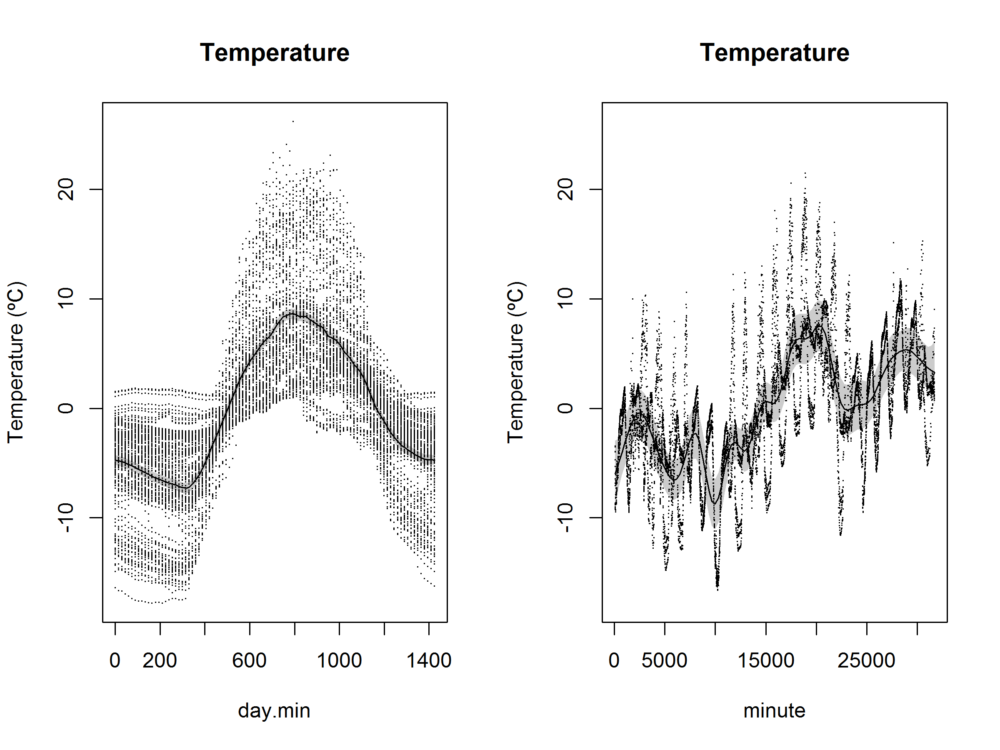
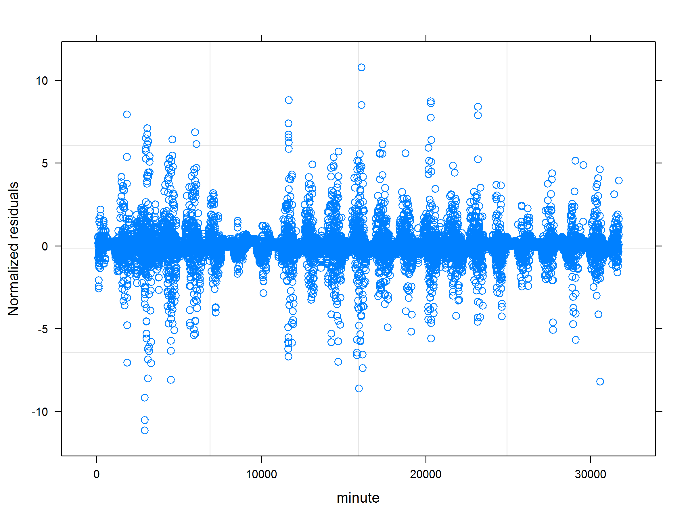
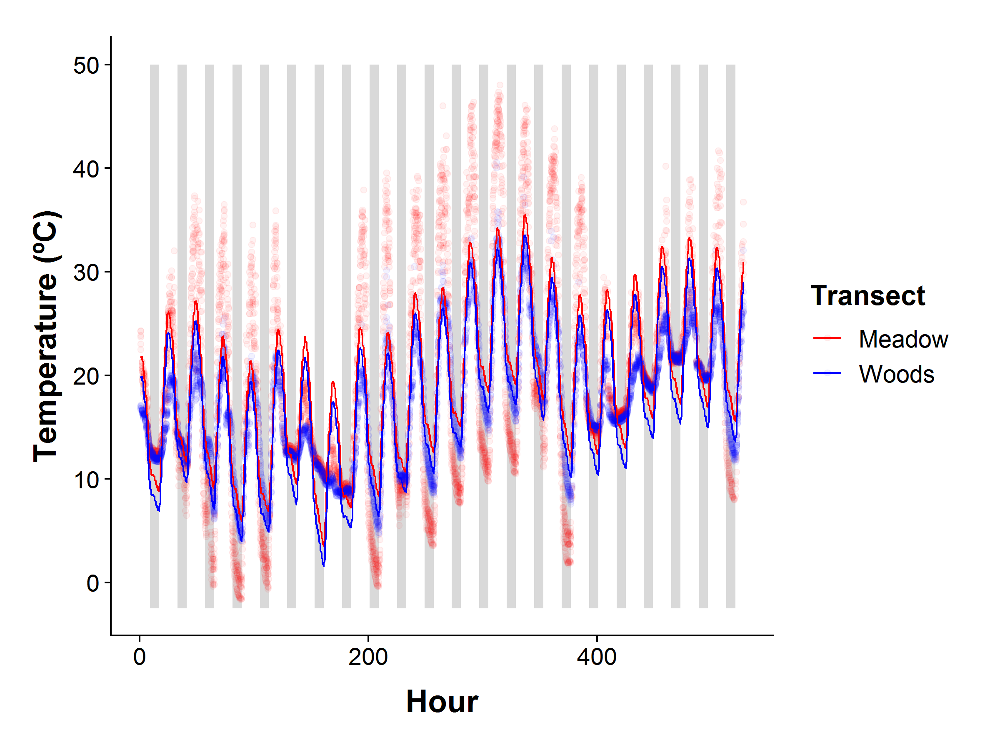
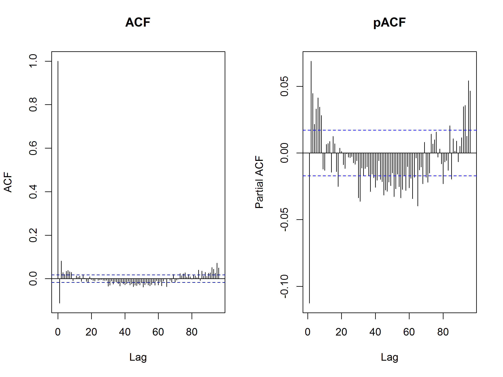
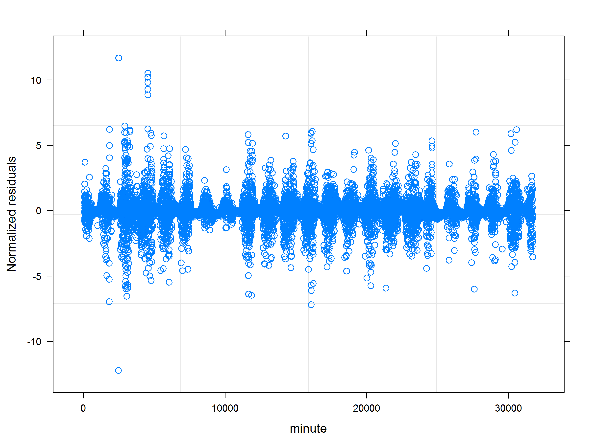
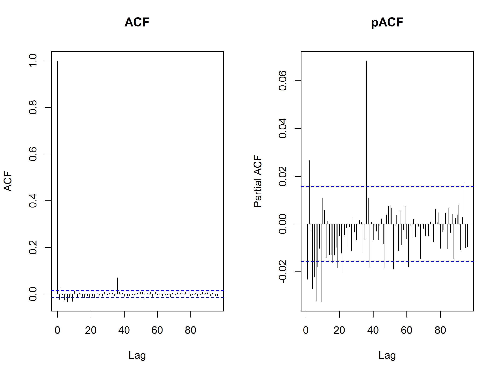

## Overview

This analysis is looking for microenvironmental differences or gradients between transects.  It's a more involved version of the [Paired T-Test analysis](Paired-T-tests.md).

We're using this [GAM approach](http://www.fromthebottomoftheheap.net/2014/05/09/modelling-seasonal-data-with-gam/).  In this approach, there are two smoothers.  One smoother is a cubic spline that accounts for intra-day variation.  Then a second spline is fitted to account for temporal variation that is not intra-day.  

Readings have temporal autocorrelation, therefore, we add an autoregressive moving average correlation structure (corAR1). We set the form here to account for autocorrelation separately for each transect position, treating positions and transects as independent.  In every case, accounting for autocorrelation improves the models considerably, however, some autocorrelation is still unaccounted for.  Zuur et. al. say that it's usually not worth finding the optimal autocorrelation structure.  

After all temporal effects are accounted for, we test our expectations:

1. The temperature should be lower in the woods (yes)
2. The humidity should be higher in the woods (yes)
3. The light levels should be lower in the woods (yes)
4. The soil in the meadow should be wetter than the woods (yes)

*Nota bene*: I've left out the first position in the meadow transect for temperature and humidity.  This BME280 failed and gave suspect values for much of the time.  


## Temperature

The model that includes transect is better than the base temporal model for temperature.

After accounting for temporal variation, and autocorrelation, the woods is 1.96 ºC cooler than the meadow.  This is close to the paired t-test result: 1.83 ºC cooler.


<!-- -->

```
                                dAICc   df
temp.ar1.transect$lme               0.0 27
temp.ar1$lme                       10.3 26
temp.ar1.transect.penalized$lme    60.3 7 
temp.uncorr$lme                 34651.7 25

Family: gaussian 
Link function: identity 

Formula:
temperature ~ s(day.min, bs = "cc", k = 96) + s(minute, k = 23, 
    fx = T) + transect

Parametric coefficients:
              Estimate Std. Error t value Pr(>|t|)    
(Intercept)    19.3207     0.4006   48.23  < 2e-16 ***
transectWoods  -1.9515     0.5451   -3.58 0.000344 ***
---
Signif. codes:  0 '***' 0.001 '**' 0.01 '*' 0.05 '.' 0.1 ' ' 1

Approximate significance of smooth terms:
             edf Ref.df     F p-value    
s(day.min) 51.73     94 27.29  <2e-16 ***
s(minute)  22.00     22 12.75  <2e-16 ***
---
Signif. codes:  0 '***' 0.001 '**' 0.01 '*' 0.05 '.' 0.1 ' ' 1

R-sq.(adj) =  0.729   
  Scale est. = 18.41     n = 13076
Linear mixed-effects model fit by maximum likelihood
 Data: strip.offset(mf) 
       AIC     BIC    logLik
  41034.37 41236.3 -20490.19

Random effects:
 Formula: ~Xr - 1 | g
 Structure: pdIdnot
               Xr1        Xr2        Xr3        Xr4        Xr5        Xr6
StdDev: 0.02555426 0.02555426 0.02555426 0.02555426 0.02555426 0.02555426
               Xr7        Xr8        Xr9       Xr10       Xr11       Xr12
StdDev: 0.02555426 0.02555426 0.02555426 0.02555426 0.02555426 0.02555426
              Xr13       Xr14       Xr15       Xr16       Xr17       Xr18
StdDev: 0.02555426 0.02555426 0.02555426 0.02555426 0.02555426 0.02555426
              Xr19       Xr20       Xr21       Xr22       Xr23       Xr24
StdDev: 0.02555426 0.02555426 0.02555426 0.02555426 0.02555426 0.02555426
              Xr25       Xr26       Xr27       Xr28       Xr29       Xr30
StdDev: 0.02555426 0.02555426 0.02555426 0.02555426 0.02555426 0.02555426
              Xr31       Xr32       Xr33       Xr34       Xr35       Xr36
StdDev: 0.02555426 0.02555426 0.02555426 0.02555426 0.02555426 0.02555426
              Xr37       Xr38       Xr39       Xr40       Xr41       Xr42
StdDev: 0.02555426 0.02555426 0.02555426 0.02555426 0.02555426 0.02555426
              Xr43       Xr44       Xr45       Xr46       Xr47       Xr48
StdDev: 0.02555426 0.02555426 0.02555426 0.02555426 0.02555426 0.02555426
              Xr49       Xr50       Xr51       Xr52       Xr53       Xr54
StdDev: 0.02555426 0.02555426 0.02555426 0.02555426 0.02555426 0.02555426
              Xr55       Xr56       Xr57       Xr58       Xr59       Xr60
StdDev: 0.02555426 0.02555426 0.02555426 0.02555426 0.02555426 0.02555426
              Xr61       Xr62       Xr63       Xr64       Xr65       Xr66
StdDev: 0.02555426 0.02555426 0.02555426 0.02555426 0.02555426 0.02555426
              Xr67       Xr68       Xr69       Xr70       Xr71       Xr72
StdDev: 0.02555426 0.02555426 0.02555426 0.02555426 0.02555426 0.02555426
              Xr73       Xr74       Xr75       Xr76       Xr77       Xr78
StdDev: 0.02555426 0.02555426 0.02555426 0.02555426 0.02555426 0.02555426
              Xr79       Xr80       Xr81       Xr82       Xr83       Xr84
StdDev: 0.02555426 0.02555426 0.02555426 0.02555426 0.02555426 0.02555426
              Xr85       Xr86       Xr87       Xr88       Xr89       Xr90
StdDev: 0.02555426 0.02555426 0.02555426 0.02555426 0.02555426 0.02555426
              Xr91       Xr92       Xr93       Xr94 Residual
StdDev: 0.02555426 0.02555426 0.02555426 0.02555426 4.290729

Correlation Structure: AR(1)
 Formula: ~1 | g/t.order 
 Parameter estimate(s):
      Phi 
0.9632006 
Fixed effects: y ~ X - 1 
                   Value Std.Error    DF  t-value p-value
X(Intercept)    19.32071  0.400930 13052 48.18978  0.0000
XtransectWoods  -1.95148  0.545520 13052 -3.57728  0.0003
Xs(minute)Fx1   -0.31598  5.079705 13052 -0.06220  0.9504
Xs(minute)Fx2   17.51686 16.413423 13052  1.06723  0.2859
Xs(minute)Fx3  -11.31258  3.328403 13052 -3.39880  0.0007
Xs(minute)Fx4   19.58308  9.733706 13052  2.01188  0.0443
Xs(minute)Fx5   -1.28735  3.558263 13052 -0.36179  0.7175
Xs(minute)Fx6  -19.84352  8.923412 13052 -2.22376  0.0262
Xs(minute)Fx7   -3.79483  3.672197 13052 -1.03340  0.3014
Xs(minute)Fx8   11.69000  8.816174 13052  1.32597  0.1849
Xs(minute)Fx9  -12.26910  3.996297 13052 -3.07012  0.0021
Xs(minute)Fx10 -18.53717  9.073304 13052 -2.04305  0.0411
Xs(minute)Fx11  -8.12702  4.348099 13052 -1.86910  0.0616
Xs(minute)Fx12  12.35844  9.268705 13052  1.33335  0.1824
Xs(minute)Fx13   0.69449  4.461788 13052  0.15565  0.8763
Xs(minute)Fx14   3.46370  9.206694 13052  0.37622  0.7068
Xs(minute)Fx15   1.92989  4.776798 13052  0.40401  0.6862
Xs(minute)Fx16  -9.80698  9.324870 13052 -1.05170  0.2930
Xs(minute)Fx17   9.64778  5.251981 13052  1.83698  0.0662
Xs(minute)Fx18 -19.81474  9.759249 13052 -2.03036  0.0423
Xs(minute)Fx19  -0.31845  5.199745 13052 -0.06124  0.9512
Xs(minute)Fx20  -3.25787 10.037030 13052 -0.32459  0.7455
Xs(minute)Fx21  40.30389 28.949617 13052  1.39221  0.1639
Xs(minute)Fx22  10.37651 11.214132 13052  0.92531  0.3548
 Correlation: 
               X(Int) XtrnsW Xs()F1 Xs()F2 Xs()F3 Xs()F4 Xs()F5 Xs()F6
XtransectWoods -0.735                                                 
Xs(minute)Fx1  -0.029  0.005                                          
Xs(minute)Fx2   0.048 -0.001 -0.584                                   
Xs(minute)Fx3  -0.042  0.002  0.735 -0.881                            
Xs(minute)Fx4   0.052 -0.007 -0.592  0.980 -0.872                     
Xs(minute)Fx5   0.042 -0.003 -0.628  0.839 -0.779  0.832              
Xs(minute)Fx6  -0.050  0.005  0.584 -0.968  0.879 -0.955 -0.819       
Xs(minute)Fx7  -0.036 -0.003  0.605 -0.786  0.745 -0.793 -0.652  0.766
Xs(minute)Fx8   0.048 -0.004 -0.583  0.960 -0.854  0.934  0.814 -0.928
Xs(minute)Fx9  -0.038  0.003  0.591 -0.748  0.709 -0.737 -0.616  0.742
Xs(minute)Fx10 -0.043  0.000  0.580 -0.941  0.861 -0.931 -0.798  0.905
Xs(minute)Fx11 -0.035  0.001  0.594 -0.731  0.706 -0.734 -0.630  0.700
Xs(minute)Fx12  0.044 -0.003 -0.590  0.931 -0.838  0.921  0.803 -0.909
Xs(minute)Fx13  0.032  0.001 -0.586  0.701 -0.630  0.680  0.629 -0.711
Xs(minute)Fx14  0.042 -0.001 -0.589  0.929 -0.831  0.918  0.796 -0.916
Xs(minute)Fx15  0.026  0.004 -0.554  0.654 -0.621  0.653  0.578 -0.637
Xs(minute)Fx16 -0.045  0.006  0.583 -0.926  0.830 -0.911 -0.784  0.890
Xs(minute)Fx17  0.033 -0.005 -0.617  0.714 -0.714  0.711  0.626 -0.691
Xs(minute)Fx18 -0.039  0.000  0.568 -0.913  0.825 -0.896 -0.759  0.882
Xs(minute)Fx19 -0.029  0.003  0.621 -0.645  0.660 -0.638 -0.563  0.629
Xs(minute)Fx20 -0.038 -0.001  0.557 -0.914  0.817 -0.898 -0.772  0.880
Xs(minute)Fx21  0.047 -0.001 -0.569  0.998 -0.879  0.983  0.835 -0.971
Xs(minute)Fx22  0.012  0.000 -0.924  0.277 -0.518  0.292  0.410 -0.289
               Xs()F7 Xs()F8 Xs()F9 X()F10 X()F11 X()F12 X()F13 X()F14
XtransectWoods                                                        
Xs(minute)Fx1                                                         
Xs(minute)Fx2                                                         
Xs(minute)Fx3                                                         
Xs(minute)Fx4                                                         
Xs(minute)Fx5                                                         
Xs(minute)Fx6                                                         
Xs(minute)Fx7                                                         
Xs(minute)Fx8  -0.785                                                 
Xs(minute)Fx9   0.577 -0.718                                          
Xs(minute)Fx10  0.748 -0.904  0.708                                   
Xs(minute)Fx11  0.553 -0.717  0.557  0.688                            
Xs(minute)Fx12 -0.741  0.889 -0.716 -0.872 -0.680                     
Xs(minute)Fx13 -0.609  0.653 -0.490 -0.689 -0.502  0.657              
Xs(minute)Fx14 -0.755  0.902 -0.686 -0.862 -0.727  0.859  0.655       
Xs(minute)Fx15 -0.546  0.643 -0.520 -0.627 -0.432  0.636  0.408  0.629
Xs(minute)Fx16  0.726 -0.878  0.728  0.877  0.660 -0.841 -0.682 -0.869
Xs(minute)Fx17 -0.531  0.693 -0.547 -0.693 -0.517  0.671  0.492  0.716
Xs(minute)Fx18  0.732 -0.865  0.665  0.850  0.707 -0.854 -0.656 -0.816
Xs(minute)Fx19  0.545 -0.630  0.457  0.605  0.497 -0.646 -0.435 -0.588
Xs(minute)Fx20  0.728 -0.864  0.699  0.850  0.659 -0.838 -0.647 -0.842
Xs(minute)Fx21 -0.786  0.959 -0.743 -0.945 -0.726  0.936  0.697  0.936
Xs(minute)Fx22 -0.397  0.293 -0.395 -0.294 -0.417  0.310  0.413  0.306
               X()F15 X()F16 X()F17 X()F18 X()F19 X()F20 X()F21
XtransectWoods                                                 
Xs(minute)Fx1                                                  
Xs(minute)Fx2                                                  
Xs(minute)Fx3                                                  
Xs(minute)Fx4                                                  
Xs(minute)Fx5                                                  
Xs(minute)Fx6                                                  
Xs(minute)Fx7                                                  
Xs(minute)Fx8                                                  
Xs(minute)Fx9                                                  
Xs(minute)Fx10                                                 
Xs(minute)Fx11                                                 
Xs(minute)Fx12                                                 
Xs(minute)Fx13                                                 
Xs(minute)Fx14                                                 
Xs(minute)Fx15                                                 
Xs(minute)Fx16 -0.625                                          
Xs(minute)Fx17  0.424 -0.655                                   
Xs(minute)Fx18 -0.621  0.818 -0.670                            
Xs(minute)Fx19 -0.340  0.651 -0.412  0.583                     
Xs(minute)Fx20 -0.608  0.804 -0.671  0.791  0.624              
Xs(minute)Fx21  0.655 -0.925  0.713 -0.913 -0.640 -0.915       
Xs(minute)Fx22  0.393 -0.311  0.434 -0.294 -0.474 -0.283  0.258

Standardized Within-Group Residuals:
         Min           Q1          Med           Q3          Max 
-2.825941196 -0.585481672  0.008834687  0.579643512  4.087312380 

Number of Observations: 13076
Number of Groups: 1 
```

<!-- --><!-- --><!-- --><!-- -->


## Humidity

The model that includes transect is better than the base temporal model for humidity.

After accounting for temporal variation, and autocorrelation, the woods is 4.23% more humid than the meadow.  This is close to the paired t-test result: 3.4% more humid.


<!-- -->

```
                                 dAICc   df
humid.ar1.transect$lme               0.0 27
humid.ar1$lme                        7.0 26
humid.ar1.transect.penalized$lme    40.4 7 
humid.uncorr$lme                 30745.2 25

Family: gaussian 
Link function: identity 

Formula:
humidity ~ s(day.min, bs = "cc", k = 96) + s(minute, k = 23, 
    fx = T) + transect

Parametric coefficients:
              Estimate Std. Error t value Pr(>|t|)    
(Intercept)     80.580      1.025   78.60  < 2e-16 ***
transectWoods    4.242      1.396    3.04  0.00237 ** 
---
Signif. codes:  0 '***' 0.001 '**' 0.01 '*' 0.05 '.' 0.1 ' ' 1

Approximate significance of smooth terms:
             edf Ref.df     F p-value    
s(day.min) 41.33     94 20.84  <2e-16 ***
s(minute)  22.00     22 10.79  <2e-16 ***
---
Signif. codes:  0 '***' 0.001 '**' 0.01 '*' 0.05 '.' 0.1 ' ' 1

R-sq.(adj) =  0.666   
  Scale est. = 159.33    n = 13075
Linear mixed-effects model fit by maximum likelihood
 Data: strip.offset(mf) 
       AIC     BIC    logLik
  72782.98 72984.9 -36364.49

Random effects:
 Formula: ~Xr - 1 | g
 Structure: pdIdnot
               Xr1        Xr2        Xr3        Xr4        Xr5        Xr6
StdDev: 0.06190255 0.06190255 0.06190255 0.06190255 0.06190255 0.06190255
               Xr7        Xr8        Xr9       Xr10       Xr11       Xr12
StdDev: 0.06190255 0.06190255 0.06190255 0.06190255 0.06190255 0.06190255
              Xr13       Xr14       Xr15       Xr16       Xr17       Xr18
StdDev: 0.06190255 0.06190255 0.06190255 0.06190255 0.06190255 0.06190255
              Xr19       Xr20       Xr21       Xr22       Xr23       Xr24
StdDev: 0.06190255 0.06190255 0.06190255 0.06190255 0.06190255 0.06190255
              Xr25       Xr26       Xr27       Xr28       Xr29       Xr30
StdDev: 0.06190255 0.06190255 0.06190255 0.06190255 0.06190255 0.06190255
              Xr31       Xr32       Xr33       Xr34       Xr35       Xr36
StdDev: 0.06190255 0.06190255 0.06190255 0.06190255 0.06190255 0.06190255
              Xr37       Xr38       Xr39       Xr40       Xr41       Xr42
StdDev: 0.06190255 0.06190255 0.06190255 0.06190255 0.06190255 0.06190255
              Xr43       Xr44       Xr45       Xr46       Xr47       Xr48
StdDev: 0.06190255 0.06190255 0.06190255 0.06190255 0.06190255 0.06190255
              Xr49       Xr50       Xr51       Xr52       Xr53       Xr54
StdDev: 0.06190255 0.06190255 0.06190255 0.06190255 0.06190255 0.06190255
              Xr55       Xr56       Xr57       Xr58       Xr59       Xr60
StdDev: 0.06190255 0.06190255 0.06190255 0.06190255 0.06190255 0.06190255
              Xr61       Xr62       Xr63       Xr64       Xr65       Xr66
StdDev: 0.06190255 0.06190255 0.06190255 0.06190255 0.06190255 0.06190255
              Xr67       Xr68       Xr69       Xr70       Xr71       Xr72
StdDev: 0.06190255 0.06190255 0.06190255 0.06190255 0.06190255 0.06190255
              Xr73       Xr74       Xr75       Xr76       Xr77       Xr78
StdDev: 0.06190255 0.06190255 0.06190255 0.06190255 0.06190255 0.06190255
              Xr79       Xr80       Xr81       Xr82       Xr83       Xr84
StdDev: 0.06190255 0.06190255 0.06190255 0.06190255 0.06190255 0.06190255
              Xr85       Xr86       Xr87       Xr88       Xr89       Xr90
StdDev: 0.06190255 0.06190255 0.06190255 0.06190255 0.06190255 0.06190255
              Xr91       Xr92       Xr93       Xr94 Residual
StdDev: 0.06190255 0.06190255 0.06190255 0.06190255  12.6225

Correlation Structure: AR(1)
 Formula: ~1 | g/t.order 
 Parameter estimate(s):
      Phi 
0.9513616 
Fixed effects: y ~ X - 1 
                   Value Std.Error    DF  t-value p-value
X(Intercept)    80.58038   1.02609 13051 78.53156  0.0000
XtransectWoods   4.24207   1.39675 13051  3.03709  0.0024
Xs(minute)Fx1  -24.53564  14.61610 13051 -1.67867  0.0932
Xs(minute)Fx2  102.86305  48.23760 13051  2.13242  0.0330
Xs(minute)Fx3    9.28968   9.55910 13051  0.97182  0.3312
Xs(minute)Fx4   43.45340  28.46616 13051  1.52649  0.1269
Xs(minute)Fx5  -15.46130  10.14431 13051 -1.52413  0.1275
Xs(minute)Fx6  -54.61921  25.99263 13051 -2.10133  0.0356
Xs(minute)Fx7  -44.65243  10.39849 13051 -4.29413  0.0000
Xs(minute)Fx8   43.83445  25.62548 13051  1.71058  0.0872
Xs(minute)Fx9  -43.51323  11.26859 13051 -3.86146  0.0001
Xs(minute)Fx10 -42.38006  26.28571 13051 -1.61228  0.1069
Xs(minute)Fx11  -2.86538  12.22995 13051 -0.23429  0.8148
Xs(minute)Fx12  59.40115  26.82616 13051  2.21430  0.0268
Xs(minute)Fx13   4.51826  12.53050 13051  0.36058  0.7184
Xs(minute)Fx14  57.52592  26.84301 13051  2.14305  0.0321
Xs(minute)Fx15  45.65084  13.47635 13051  3.38748  0.0007
Xs(minute)Fx16 -44.19144  27.25294 13051 -1.62153  0.1049
Xs(minute)Fx17  16.70464  15.01004 13051  1.11290  0.2658
Xs(minute)Fx18 -52.30010  28.61628 13051 -1.82763  0.0676
Xs(minute)Fx19 -20.58271  14.91901 13051 -1.37963  0.1677
Xs(minute)Fx20 -44.28434  29.42005 13051 -1.50524  0.1323
Xs(minute)Fx21 158.71867  85.27734 13051  1.86121  0.0627
Xs(minute)Fx22  21.10520  32.95494 13051  0.64043  0.5219
 Correlation: 
               X(Int) XtrnsW Xs()F1 Xs()F2 Xs()F3 Xs()F4 Xs()F5 Xs()F6
XtransectWoods -0.736                                                 
Xs(minute)Fx1  -0.024  0.004                                          
Xs(minute)Fx2   0.042 -0.002 -0.544                                   
Xs(minute)Fx3  -0.038  0.003  0.722 -0.891                            
Xs(minute)Fx4   0.046 -0.007 -0.556  0.984 -0.885                     
Xs(minute)Fx5   0.037 -0.004 -0.617  0.862 -0.813  0.857              
Xs(minute)Fx6  -0.044  0.006  0.551 -0.973  0.887 -0.963 -0.846       
Xs(minute)Fx7  -0.032 -0.001  0.593 -0.811  0.775 -0.815 -0.704  0.794
Xs(minute)Fx8   0.043 -0.005 -0.550  0.965 -0.869  0.946  0.840 -0.939
Xs(minute)Fx9  -0.034  0.003  0.581 -0.769  0.737 -0.762 -0.666  0.764
Xs(minute)Fx10 -0.039  0.001  0.547 -0.949  0.870 -0.941 -0.827  0.920
Xs(minute)Fx11 -0.031  0.000  0.586 -0.744  0.728 -0.747 -0.664  0.721
Xs(minute)Fx12  0.040 -0.004 -0.554  0.939 -0.853  0.930  0.827 -0.919
Xs(minute)Fx13  0.029  0.000 -0.580  0.711 -0.662  0.696  0.654 -0.717
Xs(minute)Fx14  0.038 -0.002 -0.552  0.936 -0.847  0.927  0.822 -0.924
Xs(minute)Fx15  0.023  0.004 -0.555  0.662 -0.644  0.663  0.602 -0.651
Xs(minute)Fx16 -0.041  0.007  0.548 -0.931  0.845 -0.919 -0.811  0.903
Xs(minute)Fx17  0.031 -0.006 -0.609  0.711 -0.718  0.710  0.643 -0.694
Xs(minute)Fx18 -0.035  0.001  0.537 -0.919  0.837 -0.905 -0.791  0.894
Xs(minute)Fx19 -0.026  0.003  0.620 -0.642  0.667 -0.640 -0.584  0.634
Xs(minute)Fx20 -0.033  0.000  0.527 -0.919  0.831 -0.906 -0.799  0.890
Xs(minute)Fx21  0.042 -0.002 -0.527  0.998 -0.887  0.986  0.858 -0.975
Xs(minute)Fx22  0.008  0.001 -0.921  0.212 -0.474  0.232  0.366 -0.231
               Xs()F7 Xs()F8 Xs()F9 X()F10 X()F11 X()F12 X()F13 X()F14
XtransectWoods                                                        
Xs(minute)Fx1                                                         
Xs(minute)Fx2                                                         
Xs(minute)Fx3                                                         
Xs(minute)Fx4                                                         
Xs(minute)Fx5                                                         
Xs(minute)Fx6                                                         
Xs(minute)Fx7                                                         
Xs(minute)Fx8  -0.806                                                 
Xs(minute)Fx9   0.625 -0.745                                          
Xs(minute)Fx10  0.777 -0.916  0.736                                   
Xs(minute)Fx11  0.593 -0.731  0.585  0.710                            
Xs(minute)Fx12 -0.771  0.903 -0.738 -0.887 -0.701                     
Xs(minute)Fx13 -0.628  0.673 -0.527 -0.699 -0.528  0.674              
Xs(minute)Fx14 -0.780  0.911 -0.716 -0.879 -0.737  0.873  0.670       
Xs(minute)Fx15 -0.568  0.653 -0.537 -0.639 -0.464  0.643  0.433  0.639
Xs(minute)Fx16  0.757 -0.891  0.745  0.886  0.682 -0.856 -0.690 -0.877
Xs(minute)Fx17 -0.563  0.696 -0.566 -0.691 -0.525  0.675  0.504  0.709
Xs(minute)Fx18  0.760 -0.878  0.699  0.863  0.717 -0.863 -0.668 -0.832
Xs(minute)Fx19  0.556 -0.634  0.479  0.613  0.506 -0.641 -0.446 -0.594
Xs(minute)Fx20  0.756 -0.875  0.724  0.863  0.681 -0.850 -0.661 -0.852
Xs(minute)Fx21 -0.810  0.964 -0.765 -0.952 -0.739  0.942  0.705  0.942
Xs(minute)Fx22 -0.355  0.235 -0.357 -0.235 -0.381  0.247  0.385  0.243
               X()F15 X()F16 X()F17 X()F18 X()F19 X()F20 X()F21
XtransectWoods                                                 
Xs(minute)Fx1                                                  
Xs(minute)Fx2                                                  
Xs(minute)Fx3                                                  
Xs(minute)Fx4                                                  
Xs(minute)Fx5                                                  
Xs(minute)Fx6                                                  
Xs(minute)Fx7                                                  
Xs(minute)Fx8                                                  
Xs(minute)Fx9                                                  
Xs(minute)Fx10                                                 
Xs(minute)Fx11                                                 
Xs(minute)Fx12                                                 
Xs(minute)Fx13                                                 
Xs(minute)Fx14                                                 
Xs(minute)Fx15                                                 
Xs(minute)Fx16 -0.635                                          
Xs(minute)Fx17  0.436 -0.658                                   
Xs(minute)Fx18 -0.629  0.832 -0.670                            
Xs(minute)Fx19 -0.362  0.645 -0.418  0.587                     
Xs(minute)Fx20 -0.620  0.818 -0.668  0.805  0.621              
Xs(minute)Fx21  0.661 -0.931  0.707 -0.920 -0.637 -0.920       
Xs(minute)Fx22  0.374 -0.249  0.412 -0.237 -0.457 -0.228  0.192

Standardized Within-Group Residuals:
        Min          Q1         Med          Q3         Max 
-3.80485215 -0.69479202 -0.01217305  0.73592254  3.02508895 

Number of Observations: 13075
Number of Groups: 1 
```

<!-- --><!-- --><!-- --><!-- -->


## VWC

The model that includes transect is better than the base temporal model for VWC.

After accounting for temporal variation, and autocorrelation, the woods is drier than the meadow by 0.14 m<sup>3</sup>/m<sup>3</sup>.  This is close to the paired t-test result: 0.19 m<sup>3</sup>/m<sup>3</sup>.


<!-- -->

```
                               dAICc    df
vwc.ar1.transect$lme                0.0 27
vwc.ar1$lme                        19.9 26
vwc.ar1.transect.penalized$lme     39.8 7 
vwc.uncorr$lme                 103897.3 25

Family: gaussian 
Link function: identity 

Formula:
vwc ~ s(day.min, bs = "cc", k = 96) + s(minute, k = 23, fx = T) + 
    transect

Parametric coefficients:
              Estimate Std. Error t value Pr(>|t|)    
(Intercept)    0.22925    0.01278  17.938  < 2e-16 ***
transectWoods -0.13520    0.01727  -7.829 5.23e-15 ***
---
Signif. codes:  0 '***' 0.001 '**' 0.01 '*' 0.05 '.' 0.1 ' ' 1

Approximate significance of smooth terms:
             edf Ref.df     F  p-value    
s(day.min) 30.76     94 1.202 1.86e-15 ***
s(minute)  22.00     22 4.740 1.28e-12 ***
---
Signif. codes:  0 '***' 0.001 '**' 0.01 '*' 0.05 '.' 0.1 ' ' 1

R-sq.(adj) =    0.7   
  Scale est. = 0.0018956  n = 15651
Linear mixed-effects model fit by maximum likelihood
 Data: strip.offset(mf) 
        AIC     BIC  logLik
  -138117.8 -137911 69085.9

Random effects:
 Formula: ~Xr - 1 | g
 Structure: pdIdnot
                 Xr1          Xr2          Xr3          Xr4          Xr5
StdDev: 2.822126e-05 2.822126e-05 2.822126e-05 2.822126e-05 2.822126e-05
                 Xr6          Xr7          Xr8          Xr9         Xr10
StdDev: 2.822126e-05 2.822126e-05 2.822126e-05 2.822126e-05 2.822126e-05
                Xr11         Xr12         Xr13         Xr14         Xr15
StdDev: 2.822126e-05 2.822126e-05 2.822126e-05 2.822126e-05 2.822126e-05
                Xr16         Xr17         Xr18         Xr19         Xr20
StdDev: 2.822126e-05 2.822126e-05 2.822126e-05 2.822126e-05 2.822126e-05
                Xr21         Xr22         Xr23         Xr24         Xr25
StdDev: 2.822126e-05 2.822126e-05 2.822126e-05 2.822126e-05 2.822126e-05
                Xr26         Xr27         Xr28         Xr29         Xr30
StdDev: 2.822126e-05 2.822126e-05 2.822126e-05 2.822126e-05 2.822126e-05
                Xr31         Xr32         Xr33         Xr34         Xr35
StdDev: 2.822126e-05 2.822126e-05 2.822126e-05 2.822126e-05 2.822126e-05
                Xr36         Xr37         Xr38         Xr39         Xr40
StdDev: 2.822126e-05 2.822126e-05 2.822126e-05 2.822126e-05 2.822126e-05
                Xr41         Xr42         Xr43         Xr44         Xr45
StdDev: 2.822126e-05 2.822126e-05 2.822126e-05 2.822126e-05 2.822126e-05
                Xr46         Xr47         Xr48         Xr49         Xr50
StdDev: 2.822126e-05 2.822126e-05 2.822126e-05 2.822126e-05 2.822126e-05
                Xr51         Xr52         Xr53         Xr54         Xr55
StdDev: 2.822126e-05 2.822126e-05 2.822126e-05 2.822126e-05 2.822126e-05
                Xr56         Xr57         Xr58         Xr59         Xr60
StdDev: 2.822126e-05 2.822126e-05 2.822126e-05 2.822126e-05 2.822126e-05
                Xr61         Xr62         Xr63         Xr64         Xr65
StdDev: 2.822126e-05 2.822126e-05 2.822126e-05 2.822126e-05 2.822126e-05
                Xr66         Xr67         Xr68         Xr69         Xr70
StdDev: 2.822126e-05 2.822126e-05 2.822126e-05 2.822126e-05 2.822126e-05
                Xr71         Xr72         Xr73         Xr74         Xr75
StdDev: 2.822126e-05 2.822126e-05 2.822126e-05 2.822126e-05 2.822126e-05
                Xr76         Xr77         Xr78         Xr79         Xr80
StdDev: 2.822126e-05 2.822126e-05 2.822126e-05 2.822126e-05 2.822126e-05
                Xr81         Xr82         Xr83         Xr84         Xr85
StdDev: 2.822126e-05 2.822126e-05 2.822126e-05 2.822126e-05 2.822126e-05
                Xr86         Xr87         Xr88         Xr89         Xr90
StdDev: 2.822126e-05 2.822126e-05 2.822126e-05 2.822126e-05 2.822126e-05
                Xr91         Xr92         Xr93         Xr94  Residual
StdDev: 2.822126e-05 2.822126e-05 2.822126e-05 2.822126e-05 0.0435384

Correlation Structure: AR(1)
 Formula: ~1 | g/t.order 
 Parameter estimate(s):
    Phi 
0.99775 
Fixed effects: y ~ X - 1 
                     Value  Std.Error    DF   t-value p-value
X(Intercept)    0.22925152 0.01278941 15627 17.925101  0.0000
XtransectWoods -0.13519878 0.01728087 15627 -7.823611  0.0000
Xs(minute)Fx1  -0.04530211 0.02548719 15627 -1.777446  0.0755
Xs(minute)Fx2   0.06505011 0.07118160 15627  0.913861  0.3608
Xs(minute)Fx3   0.00756898 0.01966700 15627  0.384857  0.7003
Xs(minute)Fx4   0.00903315 0.04375474 15627  0.206450  0.8364
Xs(minute)Fx5   0.03254276 0.01982039 15627  1.641883  0.1006
Xs(minute)Fx6  -0.04480393 0.03953304 15627 -1.133329  0.2571
Xs(minute)Fx7  -0.00551421 0.01921162 15627 -0.287025  0.7741
Xs(minute)Fx8   0.03537428 0.03881265 15627  0.911411  0.3621
Xs(minute)Fx9  -0.04446980 0.01963246 15627 -2.265116  0.0235
Xs(minute)Fx10 -0.03127609 0.03792932 15627 -0.824589  0.4096
Xs(minute)Fx11  0.03755109 0.02030028 15627  1.849782  0.0644
Xs(minute)Fx12  0.07779744 0.03750950 15627  2.074073  0.0381
Xs(minute)Fx13 -0.03206319 0.01963963 15627 -1.632576  0.1026
Xs(minute)Fx14  0.03976535 0.03759449 15627  1.057744  0.2902
Xs(minute)Fx15  0.01153349 0.01902012 15627  0.606384  0.5443
Xs(minute)Fx16 -0.01110008 0.03676954 15627 -0.301882  0.7627
Xs(minute)Fx17  0.00847534 0.02103321 15627  0.402950  0.6870
Xs(minute)Fx18 -0.00762236 0.03802943 15627 -0.200433  0.8411
Xs(minute)Fx19 -0.02121123 0.02025913 15627 -1.046996  0.2951
Xs(minute)Fx20  0.00301418 0.03645522 15627  0.082682  0.9341
Xs(minute)Fx21  0.09440828 0.12065649 15627  0.782455  0.4340
Xs(minute)Fx22 -0.01002137 0.04688943 15627 -0.213723  0.8308
 Correlation: 
               X(Int) XtrnsW Xs()F1 Xs()F2 Xs()F3 Xs()F4 Xs()F5 Xs()F6
XtransectWoods -0.707                                                 
Xs(minute)Fx1  -0.058  0.013                                          
Xs(minute)Fx2   0.044  0.006 -0.492                                   
Xs(minute)Fx3  -0.048 -0.014  0.579 -0.692                            
Xs(minute)Fx4   0.042 -0.001 -0.512  0.923 -0.668                     
Xs(minute)Fx5   0.039  0.012 -0.378  0.691 -0.545  0.677              
Xs(minute)Fx6  -0.043 -0.003  0.496 -0.867  0.683 -0.902 -0.670       
Xs(minute)Fx7  -0.048 -0.001  0.451 -0.707  0.402 -0.708 -0.588  0.676
Xs(minute)Fx8   0.035  0.009 -0.508  0.899 -0.667  0.831  0.672 -0.875
Xs(minute)Fx9  -0.043 -0.001  0.514 -0.715  0.517 -0.690 -0.368  0.701
Xs(minute)Fx10 -0.042 -0.005  0.504 -0.897  0.662 -0.865 -0.663  0.824
Xs(minute)Fx11 -0.031 -0.005  0.461 -0.701  0.529 -0.700 -0.535  0.686
Xs(minute)Fx12  0.047  0.004 -0.506  0.894 -0.658  0.885  0.665 -0.860
Xs(minute)Fx13  0.031  0.003 -0.512  0.719 -0.536  0.694  0.536 -0.697
Xs(minute)Fx14  0.041  0.008 -0.513  0.913 -0.656  0.866  0.647 -0.863
Xs(minute)Fx15  0.034 -0.001 -0.542  0.727 -0.583  0.699  0.511 -0.692
Xs(minute)Fx16 -0.044 -0.007  0.498 -0.903  0.658 -0.886 -0.651  0.861
Xs(minute)Fx17  0.029  0.001 -0.525  0.728 -0.576  0.717  0.602 -0.698
Xs(minute)Fx18 -0.047 -0.006  0.504 -0.920  0.659 -0.898 -0.661  0.880
Xs(minute)Fx19 -0.024 -0.003  0.556 -0.681  0.555 -0.649 -0.503  0.657
Xs(minute)Fx20 -0.045 -0.007  0.500 -0.931  0.663 -0.889 -0.663  0.880
Xs(minute)Fx21  0.056  0.008 -0.482  0.970 -0.686  0.942  0.694 -0.929
Xs(minute)Fx22  0.030 -0.012 -0.820  0.226 -0.455  0.236  0.378 -0.251
               Xs()F7 Xs()F8 Xs()F9 X()F10 X()F11 X()F12 X()F13 X()F14
XtransectWoods                                                        
Xs(minute)Fx1                                                         
Xs(minute)Fx2                                                         
Xs(minute)Fx3                                                         
Xs(minute)Fx4                                                         
Xs(minute)Fx5                                                         
Xs(minute)Fx6                                                         
Xs(minute)Fx7                                                         
Xs(minute)Fx8  -0.680                                                 
Xs(minute)Fx9   0.629 -0.678                                          
Xs(minute)Fx10  0.691 -0.875  0.678                                   
Xs(minute)Fx11  0.397 -0.691  0.608  0.682                            
Xs(minute)Fx12 -0.678  0.820 -0.696 -0.889 -0.684                     
Xs(minute)Fx13 -0.536  0.697 -0.443 -0.705 -0.607  0.702              
Xs(minute)Fx14 -0.681  0.865 -0.683 -0.817 -0.700  0.885  0.709       
Xs(minute)Fx15 -0.582  0.701 -0.538 -0.709 -0.424  0.731  0.646  0.715
Xs(minute)Fx16  0.662 -0.854  0.688  0.858  0.696 -0.829 -0.719 -0.872
Xs(minute)Fx17 -0.516  0.702 -0.557 -0.722 -0.567  0.719  0.417  0.740
Xs(minute)Fx18  0.680 -0.861  0.688  0.873  0.696 -0.863 -0.721 -0.840
Xs(minute)Fx19  0.548 -0.659  0.501  0.649  0.483 -0.679 -0.530 -0.679
Xs(minute)Fx20  0.692 -0.884  0.688  0.857  0.694 -0.881 -0.718 -0.881
Xs(minute)Fx21 -0.714  0.925 -0.717 -0.924 -0.722  0.930  0.736  0.930
Xs(minute)Fx22 -0.366  0.257 -0.366 -0.267 -0.350  0.277  0.360  0.273
               X()F15 X()F16 X()F17 X()F18 X()F19 X()F20 X()F21
XtransectWoods                                                 
Xs(minute)Fx1                                                  
Xs(minute)Fx2                                                  
Xs(minute)Fx3                                                  
Xs(minute)Fx4                                                  
Xs(minute)Fx5                                                  
Xs(minute)Fx6                                                  
Xs(minute)Fx7                                                  
Xs(minute)Fx8                                                  
Xs(minute)Fx9                                                  
Xs(minute)Fx10                                                 
Xs(minute)Fx11                                                 
Xs(minute)Fx12                                                 
Xs(minute)Fx13                                                 
Xs(minute)Fx14                                                 
Xs(minute)Fx15                                                 
Xs(minute)Fx16 -0.720                                          
Xs(minute)Fx17  0.638 -0.726                                   
Xs(minute)Fx18 -0.742  0.894 -0.736                            
Xs(minute)Fx19 -0.420  0.678 -0.530  0.710                     
Xs(minute)Fx20 -0.722  0.831 -0.756  0.925  0.679              
Xs(minute)Fx21  0.742 -0.929  0.752 -0.949 -0.692 -0.949       
Xs(minute)Fx22  0.383 -0.267  0.394 -0.262 -0.415 -0.249  0.201

Standardized Within-Group Residuals:
       Min         Q1        Med         Q3        Max 
-1.6982854 -0.7007631 -0.2091577  0.8051801  4.4744210 

Number of Observations: 15651
Number of Groups: 1 
```

<!-- --><!-- --><!-- --><!-- -->


## PFD

The model that includes transect is better than the base temporal model for PFD.

After accounting for temporal variation, and autocorrelation, the woods gets 300.7 µmol/m<sup>2</sup>/s less light than the meadow.  This is close to the paired t-test result: 306 µmol/m<sup>2</sup>/s less light.


<!-- -->

```
                               dAICc   df
pfd.ar1.transect$lme               0.0 27
pfd.ar1.transect.penalized$lme    14.5 7 
pfd.ar1$lme                      388.9 26
pfd.uncorr$lme                 20478.7 5 

Family: gaussian 
Link function: identity 

Formula:
pfd ~ s(day.min, bs = "cc", k = 96) + s(minute, k = 23, fx = T) + 
    transect

Parametric coefficients:
              Estimate Std. Error t value Pr(>|t|)    
(Intercept)    348.506      9.687   35.98   <2e-16 ***
transectWoods -301.138     13.231  -22.76   <2e-16 ***
---
Signif. codes:  0 '***' 0.001 '**' 0.01 '*' 0.05 '.' 0.1 ' ' 1

Approximate significance of smooth terms:
             edf Ref.df      F  p-value    
s(day.min) 16.91     94 11.369  < 2e-16 ***
s(minute)  22.00     22  5.312 7.49e-15 ***
---
Signif. codes:  0 '***' 0.001 '**' 0.01 '*' 0.05 '.' 0.1 ' ' 1

R-sq.(adj) =   0.47   
  Scale est. = 73141     n = 15651
Linear mixed-effects model fit by maximum likelihood
 Data: strip.offset(mf) 
       AIC      BIC    logLik
  203481.7 203688.5 -101713.9

Random effects:
 Formula: ~Xr - 1 | g
 Structure: pdIdnot
              Xr1       Xr2       Xr3       Xr4       Xr5       Xr6
StdDev: 0.7938905 0.7938905 0.7938905 0.7938905 0.7938905 0.7938905
              Xr7       Xr8       Xr9      Xr10      Xr11      Xr12
StdDev: 0.7938905 0.7938905 0.7938905 0.7938905 0.7938905 0.7938905
             Xr13      Xr14      Xr15      Xr16      Xr17      Xr18
StdDev: 0.7938905 0.7938905 0.7938905 0.7938905 0.7938905 0.7938905
             Xr19      Xr20      Xr21      Xr22      Xr23      Xr24
StdDev: 0.7938905 0.7938905 0.7938905 0.7938905 0.7938905 0.7938905
             Xr25      Xr26      Xr27      Xr28      Xr29      Xr30
StdDev: 0.7938905 0.7938905 0.7938905 0.7938905 0.7938905 0.7938905
             Xr31      Xr32      Xr33      Xr34      Xr35      Xr36
StdDev: 0.7938905 0.7938905 0.7938905 0.7938905 0.7938905 0.7938905
             Xr37      Xr38      Xr39      Xr40      Xr41      Xr42
StdDev: 0.7938905 0.7938905 0.7938905 0.7938905 0.7938905 0.7938905
             Xr43      Xr44      Xr45      Xr46      Xr47      Xr48
StdDev: 0.7938905 0.7938905 0.7938905 0.7938905 0.7938905 0.7938905
             Xr49      Xr50      Xr51      Xr52      Xr53      Xr54
StdDev: 0.7938905 0.7938905 0.7938905 0.7938905 0.7938905 0.7938905
             Xr55      Xr56      Xr57      Xr58      Xr59      Xr60
StdDev: 0.7938905 0.7938905 0.7938905 0.7938905 0.7938905 0.7938905
             Xr61      Xr62      Xr63      Xr64      Xr65      Xr66
StdDev: 0.7938905 0.7938905 0.7938905 0.7938905 0.7938905 0.7938905
             Xr67      Xr68      Xr69      Xr70      Xr71      Xr72
StdDev: 0.7938905 0.7938905 0.7938905 0.7938905 0.7938905 0.7938905
             Xr73      Xr74      Xr75      Xr76      Xr77      Xr78
StdDev: 0.7938905 0.7938905 0.7938905 0.7938905 0.7938905 0.7938905
             Xr79      Xr80      Xr81      Xr82      Xr83      Xr84
StdDev: 0.7938905 0.7938905 0.7938905 0.7938905 0.7938905 0.7938905
             Xr85      Xr86      Xr87      Xr88      Xr89      Xr90
StdDev: 0.7938905 0.7938905 0.7938905 0.7938905 0.7938905 0.7938905
             Xr91      Xr92      Xr93      Xr94 Residual
StdDev: 0.7938905 0.7938905 0.7938905 0.7938905 270.4457

Correlation Structure: AR(1)
 Formula: ~1 | g/t.order 
 Parameter estimate(s):
      Phi 
0.8048045 
Fixed effects: y ~ X - 1 
                   Value Std.Error    DF   t-value p-value
X(Intercept)    348.5056    9.6943 15627  35.94971  0.0000
XtransectWoods -301.1383   13.2406 15627 -22.74351  0.0000
Xs(minute)Fx1   193.8949  197.3601 15627   0.98244  0.3259
Xs(minute)Fx2   337.6766  684.3787 15627   0.49341  0.6217
Xs(minute)Fx3  -221.0097  139.9612 15627  -1.57908  0.1143
Xs(minute)Fx4   367.7976  396.4783 15627   0.92766  0.3536
Xs(minute)Fx5   265.2309  145.3325 15627   1.82499  0.0680
Xs(minute)Fx6  -351.4428  359.6077 15627  -0.97729  0.3284
Xs(minute)Fx7    64.6177  144.8745 15627   0.44603  0.6556
Xs(minute)Fx8   132.5536  353.2484 15627   0.37524  0.7075
Xs(minute)Fx9    17.6918  152.2465 15627   0.11621  0.9075
Xs(minute)Fx10 -280.9571  356.6254 15627  -0.78782  0.4308
Xs(minute)Fx11 -202.5062  160.7437 15627  -1.25981  0.2078
Xs(minute)Fx12  184.1036  362.4614 15627   0.50793  0.6115
Xs(minute)Fx13   18.8487  162.6408 15627   0.11589  0.9077
Xs(minute)Fx14  145.3336  369.2451 15627   0.39360  0.6939
Xs(minute)Fx15 -186.5074  167.7184 15627  -1.11203  0.2661
Xs(minute)Fx16 -256.5255  376.8522 15627  -0.68071  0.4961
Xs(minute)Fx17   53.8591  190.1886 15627   0.28319  0.7770
Xs(minute)Fx18 -123.8716  394.8605 15627  -0.31371  0.7537
Xs(minute)Fx19   41.9533  188.7694 15627   0.22225  0.8241
Xs(minute)Fx20 -305.6608  397.0535 15627  -0.76982  0.4414
Xs(minute)Fx21  926.1320 1253.8353 15627   0.73864  0.4601
Xs(minute)Fx22 -527.7503  472.9818 15627  -1.11579  0.2645
 Correlation: 
               X(Int) XtrnsW Xs()F1 Xs()F2 Xs()F3 Xs()F4 Xs()F5 Xs()F6
XtransectWoods -0.736                                                 
Xs(minute)Fx1  -0.005 -0.001                                          
Xs(minute)Fx2   0.015 -0.003 -0.369                                   
Xs(minute)Fx3  -0.012  0.000  0.614 -0.923                            
Xs(minute)Fx4   0.016 -0.005 -0.392  0.992 -0.925                     
Xs(minute)Fx5   0.016 -0.006 -0.516  0.927 -0.913  0.926              
Xs(minute)Fx6  -0.014  0.002  0.396 -0.986  0.922 -0.982 -0.921       
Xs(minute)Fx7  -0.013  0.002  0.501 -0.898  0.883 -0.897 -0.866  0.891
Xs(minute)Fx8   0.015 -0.003 -0.395  0.979 -0.918  0.974  0.916 -0.968
Xs(minute)Fx9  -0.010 -0.002  0.507 -0.864  0.855 -0.865 -0.833  0.860
Xs(minute)Fx10 -0.018  0.008  0.394 -0.972  0.911 -0.966 -0.912  0.961
Xs(minute)Fx11 -0.009 -0.002  0.519 -0.828  0.829 -0.831 -0.803  0.827
Xs(minute)Fx12  0.015 -0.003 -0.392  0.966 -0.906  0.961  0.905 -0.954
Xs(minute)Fx13  0.010  0.000 -0.533  0.787 -0.800  0.790  0.771 -0.787
Xs(minute)Fx14  0.014 -0.003 -0.390  0.961 -0.901  0.955  0.900 -0.948
Xs(minute)Fx15  0.011 -0.001 -0.559  0.746 -0.772  0.751  0.736 -0.749
Xs(minute)Fx16 -0.016  0.006  0.382 -0.956  0.894 -0.950 -0.896  0.943
Xs(minute)Fx17  0.008  0.003 -0.581  0.740 -0.773  0.745  0.734 -0.744
Xs(minute)Fx18 -0.013  0.002  0.389 -0.951  0.893 -0.945 -0.892  0.936
Xs(minute)Fx19 -0.011  0.003  0.604 -0.672  0.727 -0.679 -0.676  0.679
Xs(minute)Fx20 -0.012  0.001  0.386 -0.948  0.890 -0.942 -0.890  0.934
Xs(minute)Fx21  0.015 -0.004 -0.332  0.998 -0.912  0.992  0.920 -0.985
Xs(minute)Fx22 -0.004  0.006 -0.882 -0.098 -0.203 -0.070  0.097  0.062
               Xs()F7 Xs()F8 Xs()F9 X()F10 X()F11 X()F12 X()F13 X()F14
XtransectWoods                                                        
Xs(minute)Fx1                                                         
Xs(minute)Fx2                                                         
Xs(minute)Fx3                                                         
Xs(minute)Fx4                                                         
Xs(minute)Fx5                                                         
Xs(minute)Fx6                                                         
Xs(minute)Fx7                                                         
Xs(minute)Fx8  -0.885                                                 
Xs(minute)Fx9   0.807 -0.850                                          
Xs(minute)Fx10  0.880 -0.953  0.844                                   
Xs(minute)Fx11  0.774 -0.819  0.747  0.811                            
Xs(minute)Fx12 -0.877  0.946 -0.843 -0.939 -0.805                     
Xs(minute)Fx13 -0.736  0.784 -0.712 -0.775 -0.686  0.766              
Xs(minute)Fx14 -0.872  0.940 -0.841 -0.931 -0.806  0.925  0.763       
Xs(minute)Fx15 -0.708  0.744 -0.673 -0.741 -0.649  0.734  0.621  0.725
Xs(minute)Fx16  0.867 -0.935  0.836  0.925  0.806 -0.917 -0.765 -0.911
Xs(minute)Fx17 -0.700  0.739 -0.674 -0.735 -0.638  0.732  0.606  0.724
Xs(minute)Fx18  0.866 -0.928  0.834  0.918  0.802 -0.908 -0.766 -0.902
Xs(minute)Fx19  0.641 -0.677  0.611  0.672  0.585 -0.668 -0.553 -0.665
Xs(minute)Fx20  0.863 -0.924  0.834  0.914  0.800 -0.907 -0.762 -0.897
Xs(minute)Fx21 -0.890  0.978 -0.856 -0.971 -0.819  0.965  0.777  0.960
Xs(minute)Fx22 -0.096 -0.061 -0.119  0.058 -0.150 -0.057  0.187 -0.057
               X()F15 X()F16 X()F17 X()F18 X()F19 X()F20 X()F21
XtransectWoods                                                 
Xs(minute)Fx1                                                  
Xs(minute)Fx2                                                  
Xs(minute)Fx3                                                  
Xs(minute)Fx4                                                  
Xs(minute)Fx5                                                  
Xs(minute)Fx6                                                  
Xs(minute)Fx7                                                  
Xs(minute)Fx8                                                  
Xs(minute)Fx9                                                  
Xs(minute)Fx10                                                 
Xs(minute)Fx11                                                 
Xs(minute)Fx12                                                 
Xs(minute)Fx13                                                 
Xs(minute)Fx14                                                 
Xs(minute)Fx15                                                 
Xs(minute)Fx16 -0.721                                          
Xs(minute)Fx17  0.588 -0.713                                   
Xs(minute)Fx18 -0.724  0.896 -0.710                            
Xs(minute)Fx19 -0.526  0.658 -0.529  0.650                     
Xs(minute)Fx20 -0.727  0.889 -0.718  0.886  0.644              
Xs(minute)Fx21  0.734 -0.955  0.726 -0.950 -0.656 -0.948       
Xs(minute)Fx22  0.235  0.063  0.262  0.053 -0.322  0.056 -0.137

Standardized Within-Group Residuals:
       Min         Q1        Med         Q3        Max 
-2.5697410 -0.6973062 -0.1839623  0.4423017  5.0107895 

Number of Observations: 15651
Number of Groups: 1 
```

<!-- --><!-- --><!-- --><!-- -->


## Session Information


```
R version 3.4.3 (2017-11-30)
Platform: x86_64-w64-mingw32/x64 (64-bit)
Running under: Windows 7 x64 (build 7601) Service Pack 1

Matrix products: default

locale:
[1] LC_COLLATE=English_United States.1252 
[2] LC_CTYPE=English_United States.1252   
[3] LC_MONETARY=English_United States.1252
[4] LC_NUMERIC=C                          
[5] LC_TIME=English_United States.1252    

attached base packages:
[1] stats4    stats     graphics  grDevices utils     datasets  methods  
[8] base     

other attached packages:
 [1] bindrcpp_0.2.2  maptools_0.9-4  sp_1.3-1        rgeos_0.3-28   
 [5] bbmle_1.0.20    mgcv_1.8-22     nlme_3.1-131    lubridate_1.7.4
 [9] forcats_0.3.0   stringr_1.3.0   dplyr_0.7.6     purrr_0.2.4    
[13] readr_1.1.1     tidyr_0.8.0     tibble_1.4.2    tidyverse_1.2.1
[17] cowplot_0.9.3   ggplot2_3.0.0  

loaded via a namespace (and not attached):
 [1] tidyselect_0.2.4  reshape2_1.4.3    haven_1.1.1      
 [4] lattice_0.20-35   colorspace_1.3-2  htmltools_0.3.6  
 [7] yaml_2.1.18       rlang_0.2.2       pillar_1.2.2     
[10] foreign_0.8-69    glue_1.2.0        withr_2.1.2      
[13] modelr_0.1.1      readxl_1.1.0      bindr_0.1.1      
[16] plyr_1.8.4        munsell_0.4.3     gtable_0.2.0     
[19] cellranger_1.1.0  rvest_0.3.2       codetools_0.2-15 
[22] psych_1.8.4       evaluate_0.10.1   labeling_0.3     
[25] knitr_1.20        parallel_3.4.3    broom_0.4.4      
[28] Rcpp_0.12.16      scales_0.5.0      backports_1.1.2  
[31] jsonlite_1.5      mnormt_1.5-5      hms_0.4.2        
[34] digest_0.6.15     stringi_1.1.7     numDeriv_2016.8-1
[37] grid_3.4.3        rprojroot_1.3-2   cli_1.0.0        
[40] tools_3.4.3       magrittr_1.5      lazyeval_0.2.1   
[43] crayon_1.3.4      pkgconfig_2.0.1   Matrix_1.2-12    
[46] xml2_1.2.0        assertthat_0.2.0  rmarkdown_1.9    
[49] httr_1.3.1        rstudioapi_0.7    R6_2.2.2         
[52] compiler_3.4.3   
```

