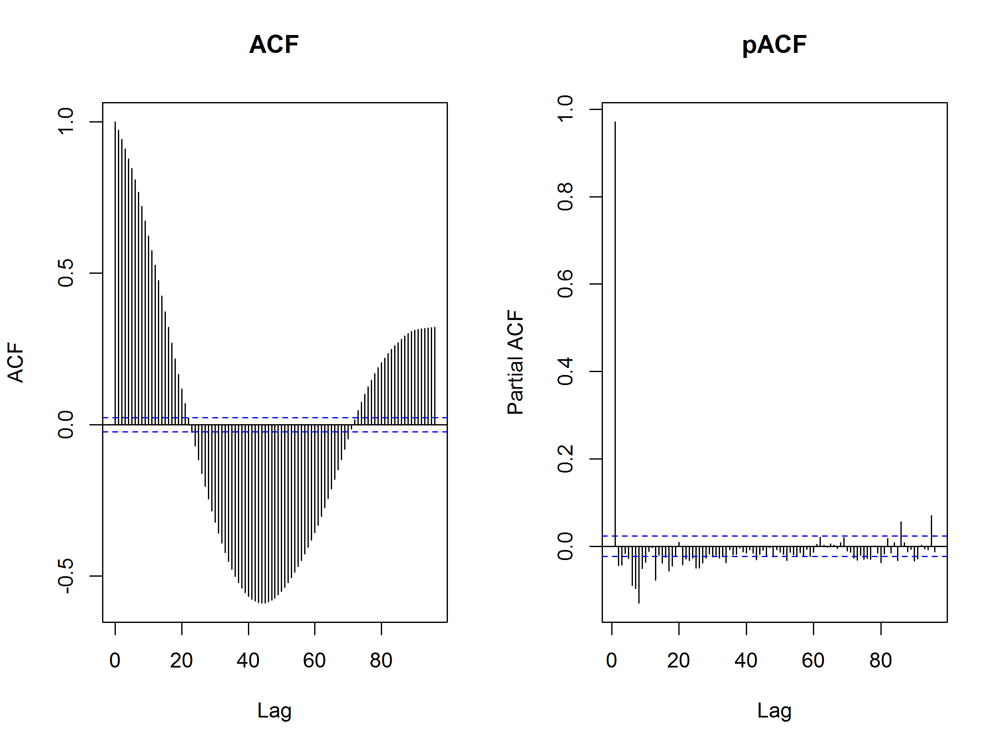
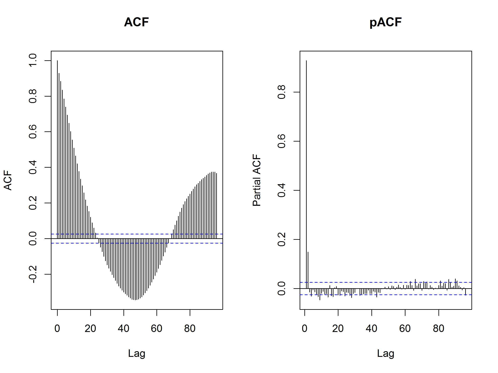
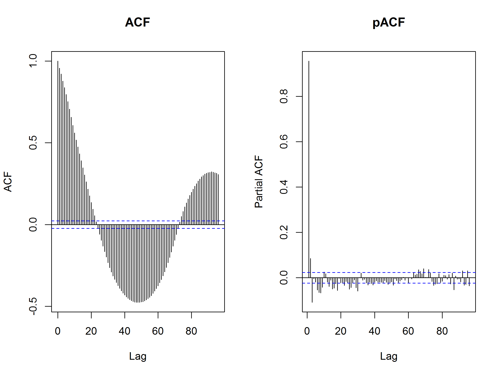
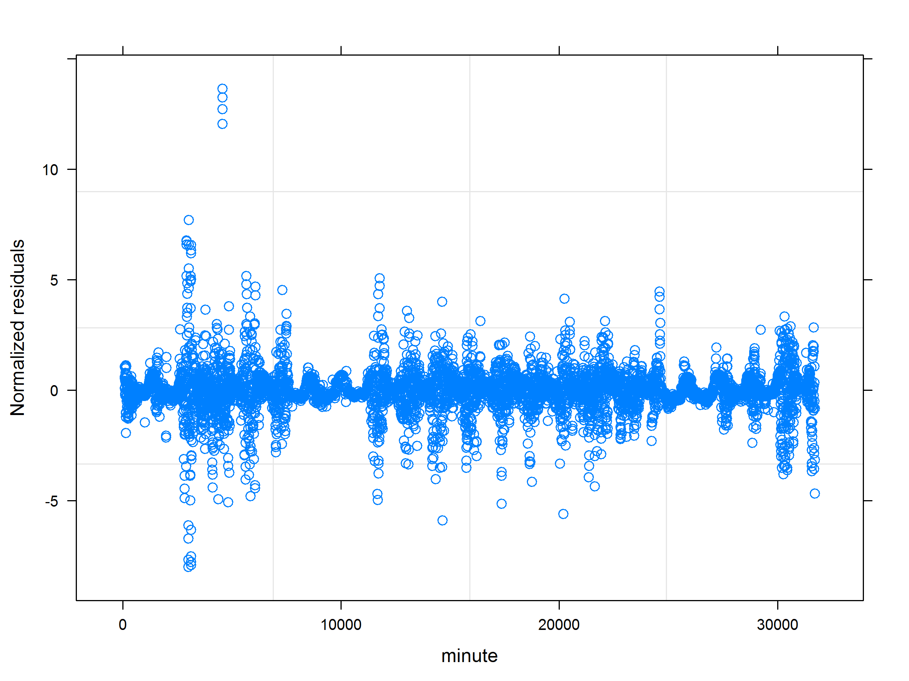
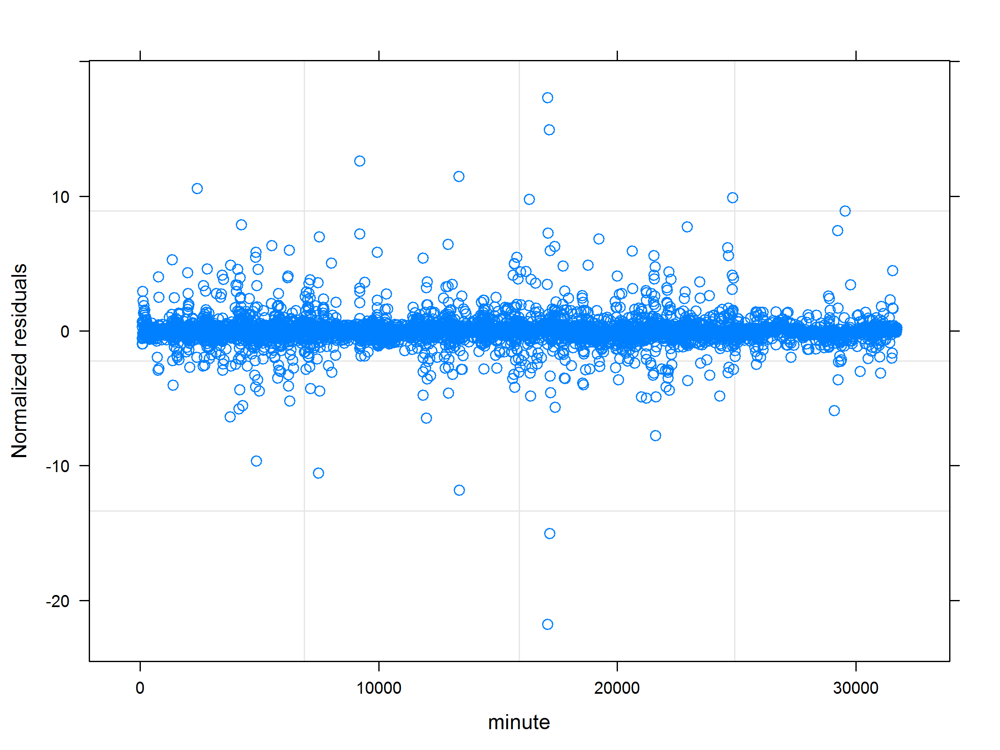
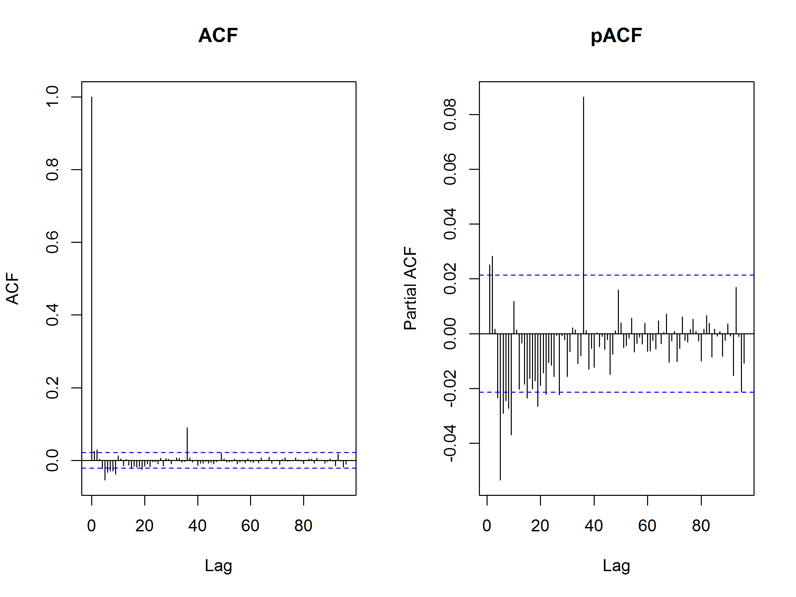
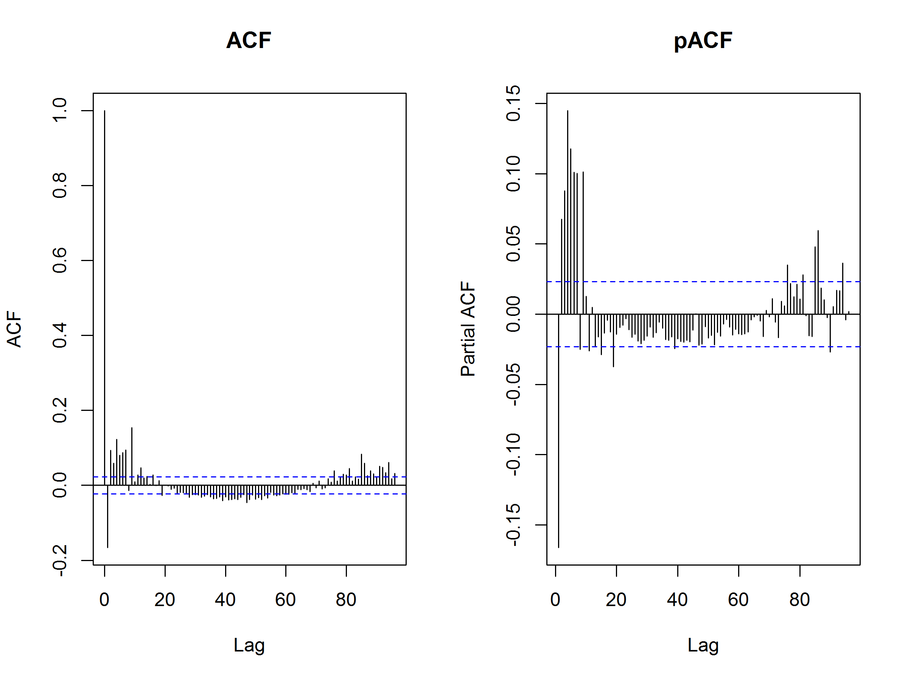
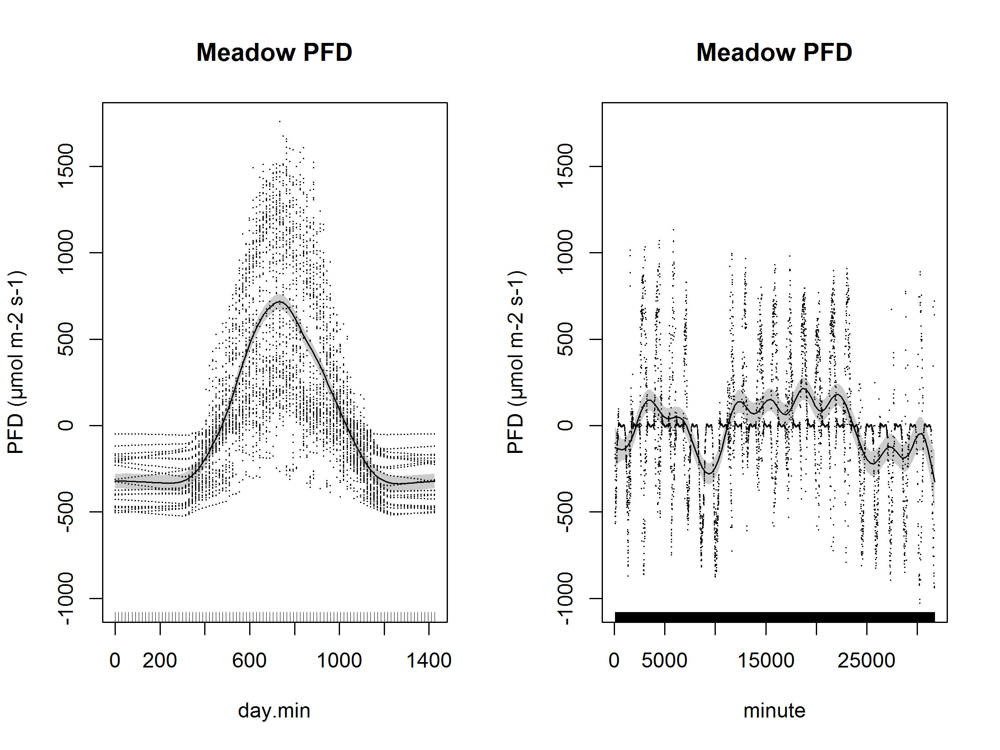
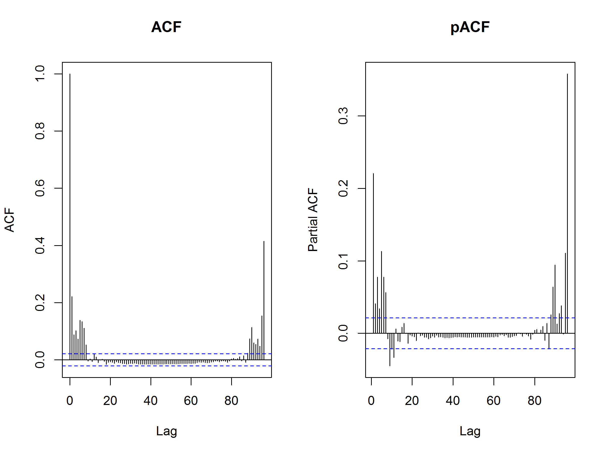
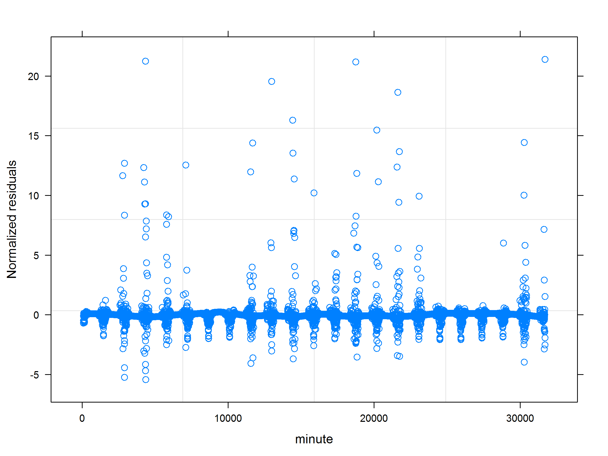

## Overview

This analysis is looking for microenvironmental differences or gradients within transects.

We're using this [GAM approach](http://www.fromthebottomoftheheap.net/2014/05/09/modelling-seasonal-data-with-gam/).  In this approach, there are two smoothers (as Robi suggested).  One smoother is a cubic spline that accounts for intra-day variation.  Then a second spline is fitted to account for temporal variation that is not intra-day.  

Readings have temporal autocorrelation, therefore, we add an autoregressive moving average correlation structure (corAR1). We set the form here to account for autocorrelation separately for each transect position, treating positions as independent.  In every case, accounting for autocorrelation improves the models considerably, however, significant autocorrelation is still unaccounted for.  Zuur et. al. say that it's usually not worth finding the optimal autocorrelation structure.  

After all temporal effects are accounted for, we test for differences among transect positions separately for each transect (woods and meadow) and each variable (temperature, humidity, vwc, par).

We do this with two models: in one the transect positions are treated as individual factors, and there is no explicit spatial trend.  In the other, transect positions are treated as a continuous variable, testing for a gradient.

**Expectations:**

1. The woods VWC should increase (wetter) from 1 to 4, moving down the hill (no, but heterogeneity)
2. The meadow VWC should increase (wetter) from 1 to 4, moving into the swamp (yes)
3. The woods temperature should get cooler from 1 to 4, moving down the hill (no)
4. There should be no difference in PAR, or in temperature @ the meadow
    1. In fact, there are slight gradients in PAR in both sites, especially the meadow
    2. No differences in temp at the meadow
5. Humidity is unclear, but perhaps it would mirror soil moisture patterns
    1. No gradient, but some heterogeneity (in the meadow)


#### Transects

* Meadow: 1 (dry, sunny, grassy) to 4 (wet, some shade from ferns and shrubs)
* Woods: 1 (highest part of hill, but not top) to 4 (bottom of hill)


## Temperature


### Meadow Temperature

The model that includes transect order is worse than the base temporal model for meadow temperature.

There are no significant differences between position 2, 3, and 4 (1 is bad data and removed).  The maximum difference is 0.65 ºC between positions.

**NOTE:** Position two is the reference level for this model: the intercept is the temperature for position 2.

<!-- -->

```
                  dAICc   df
m.temp.ar1$lme        0.0 26
m.temp.uncorr$lme 13113.7 25

Family: gaussian 
Link function: identity 

Formula:
temperature ~ s(day.min, bs = "cc", k = 96) + s(minute, k = 23, 
    fx = T)

Parametric coefficients:
            Estimate Std. Error t value Pr(>|t|)    
(Intercept)   19.149      0.364    52.6   <2e-16 ***
---
Signif. codes:  0 '***' 0.001 '**' 0.01 '*' 0.05 '.' 0.1 ' ' 1

Approximate significance of smooth terms:
             edf Ref.df      F p-value    
s(day.min) 42.81     94 15.600  <2e-16 ***
s(minute)  22.00     22  7.135  <2e-16 ***
---
Signif. codes:  0 '***' 0.001 '**' 0.01 '*' 0.05 '.' 0.1 ' ' 1

R-sq.(adj) =  0.781   
  Scale est. = 23.066    n = 5998
```

<!-- --><!-- --><!-- -->

```
                          dAICc   df
m.temp.ar1$lme                0.0 26
m.temp.ar1.continuous$lme     2.0 27
m.temp.ar1.factor$lme         3.4 28
m.temp.uncorr$lme         13113.7 25

Family: gaussian 
Link function: identity 

Formula:
temperature ~ s(day.min, bs = "cc", k = 96) + s(minute, k = 23, 
    fx = T) + factor(order)

Parametric coefficients:
               Estimate Std. Error t value Pr(>|t|)    
(Intercept)     19.0513     0.6450  29.536   <2e-16 ***
factor(order)3   0.4862     0.8934   0.544    0.586    
factor(order)4  -0.2177     0.9013  -0.242    0.809    
---
Signif. codes:  0 '***' 0.001 '**' 0.01 '*' 0.05 '.' 0.1 ' ' 1

Approximate significance of smooth terms:
            edf Ref.df      F p-value    
s(day.min) 42.8     94 15.643  <2e-16 ***
s(minute)  22.0     22  7.168  <2e-16 ***
---
Signif. codes:  0 '***' 0.001 '**' 0.01 '*' 0.05 '.' 0.1 ' ' 1

R-sq.(adj) =  0.782   
  Scale est. = 22.973    n = 5998
Linear mixed-effects model fit by maximum likelihood
 Data: strip.offset(mf) 
      AIC      BIC    logLik
  22681.5 22869.08 -11312.75

Random effects:
 Formula: ~Xr - 1 | g
 Structure: pdIdnot
               Xr1        Xr2        Xr3        Xr4        Xr5        Xr6
StdDev: 0.03911494 0.03911494 0.03911494 0.03911494 0.03911494 0.03911494
               Xr7        Xr8        Xr9       Xr10       Xr11       Xr12
StdDev: 0.03911494 0.03911494 0.03911494 0.03911494 0.03911494 0.03911494
              Xr13       Xr14       Xr15       Xr16       Xr17       Xr18
StdDev: 0.03911494 0.03911494 0.03911494 0.03911494 0.03911494 0.03911494
              Xr19       Xr20       Xr21       Xr22       Xr23       Xr24
StdDev: 0.03911494 0.03911494 0.03911494 0.03911494 0.03911494 0.03911494
              Xr25       Xr26       Xr27       Xr28       Xr29       Xr30
StdDev: 0.03911494 0.03911494 0.03911494 0.03911494 0.03911494 0.03911494
              Xr31       Xr32       Xr33       Xr34       Xr35       Xr36
StdDev: 0.03911494 0.03911494 0.03911494 0.03911494 0.03911494 0.03911494
              Xr37       Xr38       Xr39       Xr40       Xr41       Xr42
StdDev: 0.03911494 0.03911494 0.03911494 0.03911494 0.03911494 0.03911494
              Xr43       Xr44       Xr45       Xr46       Xr47       Xr48
StdDev: 0.03911494 0.03911494 0.03911494 0.03911494 0.03911494 0.03911494
              Xr49       Xr50       Xr51       Xr52       Xr53       Xr54
StdDev: 0.03911494 0.03911494 0.03911494 0.03911494 0.03911494 0.03911494
              Xr55       Xr56       Xr57       Xr58       Xr59       Xr60
StdDev: 0.03911494 0.03911494 0.03911494 0.03911494 0.03911494 0.03911494
              Xr61       Xr62       Xr63       Xr64       Xr65       Xr66
StdDev: 0.03911494 0.03911494 0.03911494 0.03911494 0.03911494 0.03911494
              Xr67       Xr68       Xr69       Xr70       Xr71       Xr72
StdDev: 0.03911494 0.03911494 0.03911494 0.03911494 0.03911494 0.03911494
              Xr73       Xr74       Xr75       Xr76       Xr77       Xr78
StdDev: 0.03911494 0.03911494 0.03911494 0.03911494 0.03911494 0.03911494
              Xr79       Xr80       Xr81       Xr82       Xr83       Xr84
StdDev: 0.03911494 0.03911494 0.03911494 0.03911494 0.03911494 0.03911494
              Xr85       Xr86       Xr87       Xr88       Xr89       Xr90
StdDev: 0.03911494 0.03911494 0.03911494 0.03911494 0.03911494 0.03911494
              Xr91       Xr92       Xr93       Xr94 Residual
StdDev: 0.03911494 0.03911494 0.03911494 0.03911494 4.793055

Correlation Structure: AR(1)
 Formula: ~1 | g/order 
 Parameter estimate(s):
     Phi 
0.943994 
Fixed effects: y ~ X - 1 
                     Value Std.Error   DF   t-value p-value
X(Intercept)     19.051306   0.64621 5973 29.481562  0.0000
Xfactor(order)3   0.486213   0.89507 5973  0.543215  0.5870
Xfactor(order)4  -0.217680   0.90297 5973 -0.241072  0.8095
Xs(minute)Fx1    -2.408112   8.39307 5973 -0.286917  0.7742
Xs(minute)Fx2     3.729689  26.93351 5973  0.138478  0.8899
Xs(minute)Fx3    -8.867075   5.72225 5973 -1.549577  0.1213
Xs(minute)Fx4    12.707230  15.90514 5973  0.798939  0.4244
Xs(minute)Fx5    -4.115430   5.98495 5973 -0.687630  0.4917
Xs(minute)Fx6   -13.828419  14.57002 5973 -0.949101  0.3426
Xs(minute)Fx7     0.277552   6.05981 5973  0.045802  0.9635
Xs(minute)Fx8     6.956769  14.43271 5973  0.482014  0.6298
Xs(minute)Fx9    -8.221182   6.50295 5973 -1.264223  0.2062
Xs(minute)Fx10  -12.514743  14.63463 5973 -0.855146  0.3925
Xs(minute)Fx11   -8.245755   7.03943 5973 -1.171366  0.2415
Xs(minute)Fx12    4.573775  14.81353 5973  0.308757  0.7575
Xs(minute)Fx13    1.412118   7.28555 5973  0.193825  0.8463
Xs(minute)Fx14   -4.076633  14.98668 5973 -0.272017  0.7856
Xs(minute)Fx15    2.592240   7.65457 5973  0.338653  0.7349
Xs(minute)Fx16   -1.598018  15.17344 5973 -0.105317  0.9161
Xs(minute)Fx17    6.464063   8.66200 5973  0.746255  0.4555
Xs(minute)Fx18  -10.510505  15.80198 5973 -0.665139  0.5060
Xs(minute)Fx19   -3.154671   8.63002 5973 -0.365546  0.7147
Xs(minute)Fx20    7.335953  15.92268 5973  0.460724  0.6450
Xs(minute)Fx21   14.228727  49.82452 5973  0.285577  0.7752
Xs(minute)Fx22   20.251170  18.78930 5973  1.077803  0.2812
 Correlation: 
                X(Int) Xfc()3 Xfc()4 Xs()F1 Xs()F2 Xs()F3 Xs()F4 Xs()F5
Xfactor(order)3 -0.726                                                 
Xfactor(order)4 -0.717  0.523                                          
Xs(minute)Fx1   -0.030  0.014  0.015                                   
Xs(minute)Fx2    0.016  0.011  0.016 -0.486                            
Xs(minute)Fx3   -0.025  0.003 -0.006  0.692 -0.903                     
Xs(minute)Fx4    0.017  0.009  0.015 -0.499  0.987 -0.901              
Xs(minute)Fx5    0.019  0.005  0.009 -0.607  0.892 -0.860  0.889       
Xs(minute)Fx6   -0.019 -0.007 -0.012  0.497 -0.978  0.894 -0.968 -0.883
Xs(minute)Fx7   -0.017 -0.010 -0.007  0.587 -0.846  0.814 -0.845 -0.783
Xs(minute)Fx8    0.020  0.005  0.011 -0.493  0.967 -0.887  0.958  0.875
Xs(minute)Fx9   -0.016 -0.011 -0.007  0.578 -0.805  0.779 -0.803 -0.741
Xs(minute)Fx10  -0.019 -0.005 -0.013  0.494 -0.956  0.879 -0.946 -0.865
Xs(minute)Fx11  -0.015 -0.010 -0.008  0.573 -0.772  0.753 -0.771 -0.717
Xs(minute)Fx12   0.016  0.006  0.016 -0.497  0.947 -0.873  0.939  0.857
Xs(minute)Fx13   0.013  0.009  0.009 -0.565  0.743 -0.731  0.741  0.697
Xs(minute)Fx14   0.016  0.007  0.015 -0.500  0.940 -0.867  0.931  0.851
Xs(minute)Fx15   0.015  0.006  0.007 -0.568  0.722 -0.720  0.721  0.681
Xs(minute)Fx16  -0.017 -0.007 -0.012  0.501 -0.935  0.861 -0.927 -0.846
Xs(minute)Fx17   0.017  0.002  0.005 -0.591  0.736 -0.739  0.733  0.701
Xs(minute)Fx18  -0.017 -0.008 -0.010  0.505 -0.927  0.855 -0.918 -0.837
Xs(minute)Fx19  -0.017  0.000 -0.004  0.605 -0.695  0.717 -0.694 -0.669
Xs(minute)Fx20  -0.014 -0.011 -0.012  0.496 -0.928  0.853 -0.919 -0.839
Xs(minute)Fx21   0.016  0.010  0.016 -0.458  0.998 -0.894  0.988  0.886
Xs(minute)Fx22   0.021 -0.011 -0.020 -0.910  0.109 -0.389  0.128  0.299
                Xs()F6 Xs()F7 Xs()F8 Xs()F9 X()F10 X()F11 X()F12 X()F13
Xfactor(order)3                                                        
Xfactor(order)4                                                        
Xs(minute)Fx1                                                          
Xs(minute)Fx2                                                          
Xs(minute)Fx3                                                          
Xs(minute)Fx4                                                          
Xs(minute)Fx5                                                          
Xs(minute)Fx6                                                          
Xs(minute)Fx7    0.839                                                 
Xs(minute)Fx8   -0.948 -0.831                                          
Xs(minute)Fx9    0.797  0.703 -0.788                                   
Xs(minute)Fx10   0.936  0.820 -0.926  0.779                            
Xs(minute)Fx11   0.764  0.675 -0.755  0.641  0.747                     
Xs(minute)Fx12  -0.928 -0.813  0.916 -0.772 -0.905 -0.740              
Xs(minute)Fx13  -0.734 -0.652  0.725 -0.616 -0.717 -0.586  0.714       
Xs(minute)Fx14  -0.921 -0.806  0.909 -0.765 -0.896 -0.737  0.886  0.713
Xs(minute)Fx15  -0.713 -0.643  0.704 -0.599 -0.699 -0.566  0.697  0.532
Xs(minute)Fx16   0.916  0.802 -0.904  0.764  0.890  0.736 -0.877 -0.714
Xs(minute)Fx17  -0.727 -0.654  0.720 -0.617 -0.714 -0.574  0.712  0.537
Xs(minute)Fx18   0.907  0.797 -0.894  0.759  0.880  0.732 -0.866 -0.707
Xs(minute)Fx19   0.688  0.625 -0.683  0.579  0.678  0.545 -0.674 -0.505
Xs(minute)Fx20   0.907  0.798 -0.894  0.763  0.879  0.731 -0.867 -0.703
Xs(minute)Fx21  -0.979 -0.840  0.969 -0.798 -0.958 -0.765  0.949  0.735
Xs(minute)Fx22  -0.129 -0.298  0.128 -0.307 -0.134 -0.316  0.142  0.320
                X()F14 X()F15 X()F16 X()F17 X()F18 X()F19 X()F20 X()F21
Xfactor(order)3                                                        
Xfactor(order)4                                                        
Xs(minute)Fx1                                                          
Xs(minute)Fx2                                                          
Xs(minute)Fx3                                                          
Xs(minute)Fx4                                                          
Xs(minute)Fx5                                                          
Xs(minute)Fx6                                                          
Xs(minute)Fx7                                                          
Xs(minute)Fx8                                                          
Xs(minute)Fx9                                                          
Xs(minute)Fx10                                                         
Xs(minute)Fx11                                                         
Xs(minute)Fx12                                                         
Xs(minute)Fx13                                                         
Xs(minute)Fx14                                                         
Xs(minute)Fx15   0.698                                                 
Xs(minute)Fx16  -0.867 -0.697                                          
Xs(minute)Fx17   0.710  0.509 -0.707                                   
Xs(minute)Fx18  -0.854 -0.688  0.845 -0.703                            
Xs(minute)Fx19  -0.670 -0.471  0.674 -0.479  0.671                     
Xs(minute)Fx20  -0.855 -0.689  0.846 -0.704  0.832  0.675              
Xs(minute)Fx21   0.941  0.715 -0.935  0.729 -0.926 -0.687 -0.928       
Xs(minute)Fx22   0.150  0.330 -0.155  0.348 -0.163 -0.383 -0.152  0.076

Standardized Within-Group Residuals:
         Min           Q1          Med           Q3          Max 
-2.570132632 -0.827550474 -0.003769888  0.771751583  2.892178288 

Number of Observations: 5998
Number of Groups: 1 
                 Estimate Std..Error    t.value      Pr...t..
(Intercept)    19.0513059  0.6450241 29.5358064 5.384916e-179
factor(order)3  0.4862130  0.8934225  0.5442140  5.863147e-01
factor(order)4 -0.2176798  0.9013076 -0.2415155  8.091640e-01
```

<!-- -->

### Woods Temperature

The model that includes transect order is worse than the base temporal model for woods temperature.

There are no significant differences between any of the positions relative to position 1, and a maximum difference of 0.48 ºC between positions.

<!-- -->

```
                  dAICc   df
w.temp.ar1$lme        0.0 26
w.temp.uncorr$lme 21056.6 25

Family: gaussian 
Link function: identity 

Formula:
temperature ~ s(day.min, bs = "cc", k = 96) + s(minute, k = 23, 
    fx = T)

Parametric coefficients:
            Estimate Std. Error t value Pr(>|t|)    
(Intercept)  17.5454     0.2774   63.25   <2e-16 ***
---
Signif. codes:  0 '***' 0.001 '**' 0.01 '*' 0.05 '.' 0.1 ' ' 1

Approximate significance of smooth terms:
             edf Ref.df     F p-value    
s(day.min) 66.51     94 32.42  <2e-16 ***
s(minute)  22.00     22 16.30  <2e-16 ***
---
Signif. codes:  0 '***' 0.001 '**' 0.01 '*' 0.05 '.' 0.1 ' ' 1

R-sq.(adj) =   0.83   
  Scale est. = 5.9567    n = 7078
```

<!-- --><!-- --><!-- -->

```
                          dAICc   df
w.temp.ar1$lme                0.0 26
w.temp.ar1.continuous$lme     2.0 27
w.temp.ar1.factor$lme         6.0 29
w.temp.uncorr$lme         21056.6 25

Family: gaussian 
Link function: identity 

Formula:
temperature ~ s(day.min, bs = "cc", k = 96) + s(minute, k = 23, 
    fx = T) + factor(order)

Parametric coefficients:
               Estimate Std. Error t value Pr(>|t|)    
(Intercept)    17.51014    0.50639  34.578   <2e-16 ***
factor(order)2  0.11079    0.71400   0.155    0.877    
factor(order)3  0.13529    1.00114   0.135    0.893    
factor(order)4 -0.04116    0.71409  -0.058    0.954    
---
Signif. codes:  0 '***' 0.001 '**' 0.01 '*' 0.05 '.' 0.1 ' ' 1

Approximate significance of smooth terms:
             edf Ref.df     F p-value    
s(day.min) 66.51     94 32.41  <2e-16 ***
s(minute)  22.00     22 16.30  <2e-16 ***
---
Signif. codes:  0 '***' 0.001 '**' 0.01 '*' 0.05 '.' 0.1 ' ' 1

R-sq.(adj) =   0.83   
  Scale est. = 5.953     n = 7078
Linear mixed-effects model fit by maximum likelihood
 Data: strip.offset(mf) 
       AIC      BIC    logLik
  10449.08 10648.15 -5195.538

Random effects:
 Formula: ~Xr - 1 | g
 Structure: pdIdnot
               Xr1        Xr2        Xr3        Xr4        Xr5        Xr6
StdDev: 0.02368226 0.02368226 0.02368226 0.02368226 0.02368226 0.02368226
               Xr7        Xr8        Xr9       Xr10       Xr11       Xr12
StdDev: 0.02368226 0.02368226 0.02368226 0.02368226 0.02368226 0.02368226
              Xr13       Xr14       Xr15       Xr16       Xr17       Xr18
StdDev: 0.02368226 0.02368226 0.02368226 0.02368226 0.02368226 0.02368226
              Xr19       Xr20       Xr21       Xr22       Xr23       Xr24
StdDev: 0.02368226 0.02368226 0.02368226 0.02368226 0.02368226 0.02368226
              Xr25       Xr26       Xr27       Xr28       Xr29       Xr30
StdDev: 0.02368226 0.02368226 0.02368226 0.02368226 0.02368226 0.02368226
              Xr31       Xr32       Xr33       Xr34       Xr35       Xr36
StdDev: 0.02368226 0.02368226 0.02368226 0.02368226 0.02368226 0.02368226
              Xr37       Xr38       Xr39       Xr40       Xr41       Xr42
StdDev: 0.02368226 0.02368226 0.02368226 0.02368226 0.02368226 0.02368226
              Xr43       Xr44       Xr45       Xr46       Xr47       Xr48
StdDev: 0.02368226 0.02368226 0.02368226 0.02368226 0.02368226 0.02368226
              Xr49       Xr50       Xr51       Xr52       Xr53       Xr54
StdDev: 0.02368226 0.02368226 0.02368226 0.02368226 0.02368226 0.02368226
              Xr55       Xr56       Xr57       Xr58       Xr59       Xr60
StdDev: 0.02368226 0.02368226 0.02368226 0.02368226 0.02368226 0.02368226
              Xr61       Xr62       Xr63       Xr64       Xr65       Xr66
StdDev: 0.02368226 0.02368226 0.02368226 0.02368226 0.02368226 0.02368226
              Xr67       Xr68       Xr69       Xr70       Xr71       Xr72
StdDev: 0.02368226 0.02368226 0.02368226 0.02368226 0.02368226 0.02368226
              Xr73       Xr74       Xr75       Xr76       Xr77       Xr78
StdDev: 0.02368226 0.02368226 0.02368226 0.02368226 0.02368226 0.02368226
              Xr79       Xr80       Xr81       Xr82       Xr83       Xr84
StdDev: 0.02368226 0.02368226 0.02368226 0.02368226 0.02368226 0.02368226
              Xr85       Xr86       Xr87       Xr88       Xr89       Xr90
StdDev: 0.02368226 0.02368226 0.02368226 0.02368226 0.02368226 0.02368226
              Xr91       Xr92       Xr93       Xr94 Residual
StdDev: 0.02368226 0.02368226 0.02368226 0.02368226 2.439871

Correlation Structure: AR(1)
 Formula: ~1 | g/order 
 Parameter estimate(s):
      Phi 
0.9790015 
Fixed effects: y ~ X - 1 
                    Value Std.Error   DF  t-value p-value
X(Intercept)     17.51014  0.507180 7052 34.52450  0.0000
Xfactor(order)2   0.11079  0.715117 7052  0.15493  0.8769
Xfactor(order)3   0.13529  1.002699 7052  0.13493  0.8927
Xfactor(order)4  -0.04116  0.715198 7052 -0.05756  0.9541
Xs(minute)Fx1     3.64575  3.713957 7052  0.98164  0.3263
Xs(minute)Fx2    16.53697 12.273582 7052  1.34736  0.1779
Xs(minute)Fx3   -12.30167  2.431180 7052 -5.05996  0.0000
Xs(minute)Fx4    19.22648  7.349141 7052  2.61615  0.0089
Xs(minute)Fx5    -3.89023  2.794898 7052 -1.39190  0.1640
Xs(minute)Fx6   -15.19388  6.753807 7052 -2.24968  0.0245
Xs(minute)Fx7    -0.59736  2.940308 7052 -0.20316  0.8390
Xs(minute)Fx8    11.87556  6.700362 7052  1.77238  0.0764
Xs(minute)Fx9   -12.19474  3.193862 7052 -3.81818  0.0001
Xs(minute)Fx10  -18.82828  6.946894 7052 -2.71032  0.0067
Xs(minute)Fx11   -9.19883  3.387286 7052 -2.71569  0.0066
Xs(minute)Fx12   17.59252  7.117588 7052  2.47170  0.0135
Xs(minute)Fx13    2.89292  3.493611 7052  0.82806  0.4077
Xs(minute)Fx14    4.12038  6.991119 7052  0.58937  0.5556
Xs(minute)Fx15    0.51884  3.603928 7052  0.14397  0.8855
Xs(minute)Fx16   -7.49169  7.063650 7052 -1.06060  0.2889
Xs(minute)Fx17    0.83009  3.807956 7052  0.21799  0.8274
Xs(minute)Fx18  -13.93293  7.454158 7052 -1.86915  0.0616
Xs(minute)Fx19    2.52508  3.808133 7052  0.66308  0.5073
Xs(minute)Fx20   -6.79170  7.740652 7052 -0.87741  0.3803
Xs(minute)Fx21   39.41489 20.934093 7052  1.88281  0.0598
Xs(minute)Fx22   -1.83274  8.182302 7052 -0.22399  0.8228
 Correlation: 
                X(Int) Xfc()2 Xfc()3 Xfc()4 Xs()F1 Xs()F2 Xs()F3 Xs()F4
Xfactor(order)2 -0.705                                                 
Xfactor(order)3 -0.512  0.357                                          
Xfactor(order)4 -0.705  0.500  0.357                                   
Xs(minute)Fx1   -0.026  0.000 -0.002  0.000                            
Xs(minute)Fx2    0.049  0.000 -0.014  0.000 -0.626                     
Xs(minute)Fx3   -0.032  0.000 -0.027  0.000  0.703 -0.831              
Xs(minute)Fx4    0.056  0.000 -0.048  0.000 -0.625  0.964 -0.805       
Xs(minute)Fx5    0.038  0.000 -0.022  0.000 -0.559  0.751 -0.633  0.732
Xs(minute)Fx6   -0.051  0.000  0.031  0.000  0.610 -0.947  0.841 -0.923
Xs(minute)Fx7   -0.033  0.000  0.008  0.000  0.548 -0.698  0.628 -0.713
Xs(minute)Fx8    0.046  0.000 -0.014  0.000 -0.615  0.943 -0.786  0.886
Xs(minute)Fx9   -0.039  0.000  0.041  0.000  0.553 -0.689  0.635 -0.659
Xs(minute)Fx10  -0.040  0.000 -0.002  0.000  0.612 -0.918  0.827 -0.904
Xs(minute)Fx11  -0.036  0.000  0.029  0.000  0.556 -0.686  0.632 -0.695
Xs(minute)Fx12   0.043  0.000 -0.012  0.000 -0.626  0.912 -0.773  0.896
Xs(minute)Fx13   0.029  0.000 -0.006  0.000 -0.546  0.644 -0.499  0.600
Xs(minute)Fx14   0.040  0.000 -0.008  0.000 -0.619  0.905 -0.762  0.886
Xs(minute)Fx15   0.022  0.000  0.011  0.000 -0.501  0.579 -0.494  0.574
Xs(minute)Fx16  -0.044  0.000  0.027  0.000  0.600 -0.914  0.760 -0.884
Xs(minute)Fx17   0.028  0.000 -0.003  0.000 -0.615  0.681 -0.667  0.673
Xs(minute)Fx18  -0.037  0.000  0.007  0.000  0.580 -0.901  0.777 -0.863
Xs(minute)Fx19  -0.025  0.000  0.004  0.000  0.594 -0.561  0.558 -0.547
Xs(minute)Fx20  -0.037  0.000  0.017  0.000  0.562 -0.903  0.761 -0.872
Xs(minute)Fx21   0.047  0.000 -0.013  0.000 -0.618  0.997 -0.838  0.969
Xs(minute)Fx22   0.013  0.000  0.009  0.000 -0.922  0.367 -0.561  0.377
                Xs()F5 Xs()F6 Xs()F7 Xs()F8 Xs()F9 X()F10 X()F11 X()F12
Xfactor(order)2                                                        
Xfactor(order)3                                                        
Xfactor(order)4                                                        
Xs(minute)Fx1                                                          
Xs(minute)Fx2                                                          
Xs(minute)Fx3                                                          
Xs(minute)Fx4                                                          
Xs(minute)Fx5                                                          
Xs(minute)Fx6   -0.705                                                 
Xs(minute)Fx7   -0.465  0.660                                          
Xs(minute)Fx8    0.706 -0.887 -0.700                                   
Xs(minute)Fx9   -0.457  0.684  0.427 -0.627                            
Xs(minute)Fx10  -0.685  0.854  0.655 -0.863  0.620                     
Xs(minute)Fx11  -0.526  0.625  0.429 -0.672  0.467  0.614              
Xs(minute)Fx12   0.716 -0.885 -0.636  0.846 -0.647 -0.826 -0.610       
Xs(minute)Fx13   0.529 -0.668 -0.523  0.566 -0.340 -0.632 -0.374  0.582
Xs(minute)Fx14   0.690 -0.888 -0.677  0.871 -0.598 -0.807 -0.693  0.822
Xs(minute)Fx15   0.446 -0.542 -0.441  0.579 -0.451 -0.550 -0.291  0.584
Xs(minute)Fx16  -0.686  0.852  0.627 -0.838  0.694  0.856  0.596 -0.802
Xs(minute)Fx17   0.512 -0.650 -0.362  0.647 -0.450 -0.680 -0.495  0.621
Xs(minute)Fx18  -0.651  0.845  0.651 -0.822  0.582  0.815  0.681 -0.838
Xs(minute)Fx19  -0.393  0.534  0.415 -0.551  0.320  0.509  0.412 -0.594
Xs(minute)Fx20  -0.683  0.846  0.650 -0.824  0.640  0.815  0.595 -0.808
Xs(minute)Fx21   0.744 -0.953 -0.707  0.937 -0.682 -0.924 -0.683  0.921
Xs(minute)Fx22   0.417 -0.372 -0.394  0.383 -0.400 -0.385 -0.444  0.400
                X()F13 X()F14 X()F15 X()F16 X()F17 X()F18 X()F19 X()F20
Xfactor(order)2                                                        
Xfactor(order)3                                                        
Xfactor(order)4                                                        
Xs(minute)Fx1                                                          
Xs(minute)Fx2                                                          
Xs(minute)Fx3                                                          
Xs(minute)Fx4                                                          
Xs(minute)Fx5                                                          
Xs(minute)Fx6                                                          
Xs(minute)Fx7                                                          
Xs(minute)Fx8                                                          
Xs(minute)Fx9                                                          
Xs(minute)Fx10                                                         
Xs(minute)Fx11                                                         
Xs(minute)Fx12                                                         
Xs(minute)Fx13                                                         
Xs(minute)Fx14   0.586                                                 
Xs(minute)Fx15   0.291  0.546                                          
Xs(minute)Fx16  -0.630 -0.843 -0.542                                   
Xs(minute)Fx17   0.407  0.701  0.351 -0.600                            
Xs(minute)Fx18  -0.593 -0.774 -0.542  0.787 -0.615                     
Xs(minute)Fx19  -0.354 -0.478 -0.196  0.570 -0.345  0.468              
Xs(minute)Fx20  -0.580 -0.819 -0.522  0.778 -0.630  0.768  0.520       
Xs(minute)Fx21   0.642  0.919  0.586 -0.913  0.687 -0.901 -0.556 -0.905
Xs(minute)Fx22   0.424  0.386  0.399 -0.382  0.464 -0.350 -0.513 -0.333
                X()F21
Xfactor(order)2       
Xfactor(order)3       
Xfactor(order)4       
Xs(minute)Fx1         
Xs(minute)Fx2         
Xs(minute)Fx3         
Xs(minute)Fx4         
Xs(minute)Fx5         
Xs(minute)Fx6         
Xs(minute)Fx7         
Xs(minute)Fx8         
Xs(minute)Fx9         
Xs(minute)Fx10        
Xs(minute)Fx11        
Xs(minute)Fx12        
Xs(minute)Fx13        
Xs(minute)Fx14        
Xs(minute)Fx15        
Xs(minute)Fx16        
Xs(minute)Fx17        
Xs(minute)Fx18        
Xs(minute)Fx19        
Xs(minute)Fx20        
Xs(minute)Fx21        
Xs(minute)Fx22   0.360

Standardized Within-Group Residuals:
        Min          Q1         Med          Q3         Max 
-2.59222391 -0.73239047  0.05710019  0.69411922  4.47922601 

Number of Observations: 7078
Number of Groups: 1 
                  Estimate Std..Error     t.value      Pr...t..
(Intercept)    17.51013811  0.5063908 34.57831322 5.416931e-242
factor(order)2  0.11079059  0.7140038  0.15516807  8.766933e-01
factor(order)3  0.13529269  1.0011388  0.13513880  8.925060e-01
factor(order)4 -0.04116333  0.7140850 -0.05764486  9.540332e-01
```

<!-- --><!-- -->


## Humidity

### Meadow Humidity

The model that includes transect order is better than the base temporal model for meadow humidity.

There are no significant differences between position 2 and 3, but position 4 is 7.9% more humid.  This would make sense, given its position in the swamp.

<!-- -->

```
                   dAICc   df
m.humid.ar1$lme        0.0 26
m.humid.uncorr$lme 11976.3 25

Family: gaussian 
Link function: identity 

Formula:
humidity ~ s(day.min, bs = "cc", k = 96) + s(minute, k = 23, 
    fx = T)

Parametric coefficients:
            Estimate Std. Error t value Pr(>|t|)    
(Intercept)  80.4062     0.8958   89.76   <2e-16 ***
---
Signif. codes:  0 '***' 0.001 '**' 0.01 '*' 0.05 '.' 0.1 ' ' 1

Approximate significance of smooth terms:
             edf Ref.df      F  p-value    
s(day.min) 36.83     94 13.158  < 2e-16 ***
s(minute)  22.00     22  4.988 1.72e-13 ***
---
Signif. codes:  0 '***' 0.001 '**' 0.01 '*' 0.05 '.' 0.1 ' ' 1

R-sq.(adj) =  0.731   
  Scale est. = 168.37    n = 5997
```

<!-- --><!-- --><!-- -->

```
                           dAICc   df
m.humid.ar1.factor$lme         0.0 28
m.humid.ar1.continuous$lme     1.1 27
m.humid.ar1$lme               13.1 26
m.humid.uncorr$lme         11989.5 25

Family: gaussian 
Link function: identity 

Formula:
humidity ~ s(day.min, bs = "cc", k = 96) + s(minute, k = 23, 
    fx = T) + factor(order)

Parametric coefficients:
               Estimate Std. Error t value Pr(>|t|)    
(Intercept)     77.4292     1.4675  52.764  < 2e-16 ***
factor(order)3   0.9422     2.0325   0.464    0.643    
factor(order)4   8.0001     2.0503   3.902 9.65e-05 ***
---
Signif. codes:  0 '***' 0.001 '**' 0.01 '*' 0.05 '.' 0.1 ' ' 1

Approximate significance of smooth terms:
             edf Ref.df      F p-value    
s(day.min) 36.77     94 14.053  <2e-16 ***
s(minute)  22.00     22  5.773  <2e-16 ***
---
Signif. codes:  0 '***' 0.001 '**' 0.01 '*' 0.05 '.' 0.1 ' ' 1

R-sq.(adj) =  0.752   
  Scale est. = 155.03    n = 5997
Linear mixed-effects model fit by maximum likelihood
 Data: strip.offset(mf) 
       AIC      BIC    logLik
  35627.86 35815.43 -17785.93

Random effects:
 Formula: ~Xr - 1 | g
 Structure: pdIdnot
               Xr1        Xr2        Xr3        Xr4        Xr5        Xr6
StdDev: 0.09409245 0.09409245 0.09409245 0.09409245 0.09409245 0.09409245
               Xr7        Xr8        Xr9       Xr10       Xr11       Xr12
StdDev: 0.09409245 0.09409245 0.09409245 0.09409245 0.09409245 0.09409245
              Xr13       Xr14       Xr15       Xr16       Xr17       Xr18
StdDev: 0.09409245 0.09409245 0.09409245 0.09409245 0.09409245 0.09409245
              Xr19       Xr20       Xr21       Xr22       Xr23       Xr24
StdDev: 0.09409245 0.09409245 0.09409245 0.09409245 0.09409245 0.09409245
              Xr25       Xr26       Xr27       Xr28       Xr29       Xr30
StdDev: 0.09409245 0.09409245 0.09409245 0.09409245 0.09409245 0.09409245
              Xr31       Xr32       Xr33       Xr34       Xr35       Xr36
StdDev: 0.09409245 0.09409245 0.09409245 0.09409245 0.09409245 0.09409245
              Xr37       Xr38       Xr39       Xr40       Xr41       Xr42
StdDev: 0.09409245 0.09409245 0.09409245 0.09409245 0.09409245 0.09409245
              Xr43       Xr44       Xr45       Xr46       Xr47       Xr48
StdDev: 0.09409245 0.09409245 0.09409245 0.09409245 0.09409245 0.09409245
              Xr49       Xr50       Xr51       Xr52       Xr53       Xr54
StdDev: 0.09409245 0.09409245 0.09409245 0.09409245 0.09409245 0.09409245
              Xr55       Xr56       Xr57       Xr58       Xr59       Xr60
StdDev: 0.09409245 0.09409245 0.09409245 0.09409245 0.09409245 0.09409245
              Xr61       Xr62       Xr63       Xr64       Xr65       Xr66
StdDev: 0.09409245 0.09409245 0.09409245 0.09409245 0.09409245 0.09409245
              Xr67       Xr68       Xr69       Xr70       Xr71       Xr72
StdDev: 0.09409245 0.09409245 0.09409245 0.09409245 0.09409245 0.09409245
              Xr73       Xr74       Xr75       Xr76       Xr77       Xr78
StdDev: 0.09409245 0.09409245 0.09409245 0.09409245 0.09409245 0.09409245
              Xr79       Xr80       Xr81       Xr82       Xr83       Xr84
StdDev: 0.09409245 0.09409245 0.09409245 0.09409245 0.09409245 0.09409245
              Xr85       Xr86       Xr87       Xr88       Xr89       Xr90
StdDev: 0.09409245 0.09409245 0.09409245 0.09409245 0.09409245 0.09409245
              Xr91       Xr92       Xr93       Xr94 Residual
StdDev: 0.09409245 0.09409245 0.09409245 0.09409245 12.45108

Correlation Structure: AR(1)
 Formula: ~1 | g/order 
 Parameter estimate(s):
      Phi 
0.9272486 
Fixed effects: y ~ X - 1 
                    Value Std.Error   DF  t-value p-value
X(Intercept)     77.42925   1.47016 5972 52.66709  0.0000
Xfactor(order)3   0.94224   2.03626 5972  0.46273  0.6436
Xfactor(order)4   8.00007   2.05408 5972  3.89471  0.0001
Xs(minute)Fx1   -24.40604  20.66261 5972 -1.18117  0.2376
Xs(minute)Fx2   132.16814  67.92587 5972  1.94577  0.0517
Xs(minute)Fx3    -4.39409  14.12029 5972 -0.31119  0.7557
Xs(minute)Fx4    55.59369  39.94350 5972  1.39181  0.1640
Xs(minute)Fx5    -3.78975  14.80550 5972 -0.25597  0.7980
Xs(minute)Fx6   -58.90948  36.48230 5972 -1.61474  0.1064
Xs(minute)Fx7   -49.43036  14.91085 5972 -3.31506  0.0009
Xs(minute)Fx8    61.69153  36.06409 5972  1.71061  0.0872
Xs(minute)Fx9   -50.56676  15.89156 5972 -3.18199  0.0015
Xs(minute)Fx10  -52.19130  36.52220 5972 -1.42903  0.1530
Xs(minute)Fx11   -6.27745  17.09144 5972 -0.36729  0.7134
Xs(minute)Fx12   75.78828  36.97201 5972  2.04988  0.0404
Xs(minute)Fx13   15.64107  17.60096 5972  0.88865  0.3742
Xs(minute)Fx14   81.69944  37.44437 5972  2.18189  0.0292
Xs(minute)Fx15   46.82004  18.46382 5972  2.53577  0.0112
Xs(minute)Fx16  -56.62701  37.98917 5972 -1.49061  0.1361
Xs(minute)Fx17   19.24621  20.96923 5972  0.91783  0.3587
Xs(minute)Fx18  -68.10601  39.57635 5972 -1.72088  0.0853
Xs(minute)Fx19  -24.62759  20.94491 5972 -1.17583  0.2397
Xs(minute)Fx20  -74.44293  39.93650 5972 -1.86403  0.0624
Xs(minute)Fx21  223.18839 126.02262 5972  1.77102  0.0766
Xs(minute)Fx22    6.34045  47.40168 5972  0.13376  0.8936
 Correlation: 
                X(Int) Xfc()3 Xfc()4 Xs()F1 Xs()F2 Xs()F3 Xs()F4 Xs()F5
Xfactor(order)3 -0.727                                                 
Xfactor(order)4 -0.717  0.523                                          
Xs(minute)Fx1   -0.026  0.013  0.015                                   
Xs(minute)Fx2    0.013  0.008  0.015 -0.439                            
Xs(minute)Fx3   -0.022  0.005 -0.004  0.665 -0.908                     
Xs(minute)Fx4    0.014  0.007  0.014 -0.456  0.989 -0.908              
Xs(minute)Fx5    0.017  0.003  0.008 -0.576  0.904 -0.880  0.902       
Xs(minute)Fx6   -0.016 -0.005 -0.011  0.455 -0.981  0.902 -0.974 -0.897
Xs(minute)Fx7   -0.015 -0.007 -0.006  0.560 -0.863  0.838 -0.862 -0.813
Xs(minute)Fx8    0.017  0.003  0.010 -0.452  0.972 -0.895  0.964  0.889
Xs(minute)Fx9   -0.014 -0.009 -0.005  0.556 -0.823  0.804 -0.822 -0.773
Xs(minute)Fx10  -0.016 -0.003 -0.012  0.452 -0.962  0.888 -0.954 -0.881
Xs(minute)Fx11  -0.013 -0.008 -0.007  0.556 -0.788  0.778 -0.788 -0.745
Xs(minute)Fx12   0.014  0.004  0.014 -0.454  0.954 -0.883  0.947  0.874
Xs(minute)Fx13   0.011  0.008  0.009 -0.553  0.755 -0.752  0.755  0.721
Xs(minute)Fx14   0.013  0.004  0.014 -0.457  0.947 -0.878  0.940  0.869
Xs(minute)Fx15   0.012  0.006  0.007 -0.559  0.729 -0.736  0.730  0.700
Xs(minute)Fx16  -0.015 -0.004 -0.010  0.458 -0.942  0.872 -0.935 -0.864
Xs(minute)Fx17   0.015  0.001  0.004 -0.581  0.740 -0.752  0.739  0.715
Xs(minute)Fx18  -0.015 -0.005 -0.008  0.464 -0.934  0.867 -0.926 -0.855
Xs(minute)Fx19  -0.015  0.001 -0.004  0.595 -0.694  0.724 -0.695 -0.677
Xs(minute)Fx20  -0.012 -0.008 -0.010  0.457 -0.933  0.864 -0.926 -0.856
Xs(minute)Fx21   0.013  0.007  0.014 -0.410  0.998 -0.899  0.990  0.898
Xs(minute)Fx22   0.017 -0.009 -0.019 -0.906  0.041 -0.335  0.063  0.239
                Xs()F6 Xs()F7 Xs()F8 Xs()F9 X()F10 X()F11 X()F12 X()F13
Xfactor(order)3                                                        
Xfactor(order)4                                                        
Xs(minute)Fx1                                                          
Xs(minute)Fx2                                                          
Xs(minute)Fx3                                                          
Xs(minute)Fx4                                                          
Xs(minute)Fx5                                                          
Xs(minute)Fx6                                                          
Xs(minute)Fx7    0.856                                                 
Xs(minute)Fx8   -0.956 -0.849                                          
Xs(minute)Fx9    0.816  0.739 -0.808                                   
Xs(minute)Fx10   0.946  0.840 -0.937  0.800                            
Xs(minute)Fx11   0.782  0.708 -0.774  0.676  0.766                     
Xs(minute)Fx12  -0.938 -0.833  0.928 -0.793 -0.918 -0.760              
Xs(minute)Fx13  -0.749 -0.680  0.741 -0.646 -0.733 -0.617  0.730       
Xs(minute)Fx14  -0.931 -0.828  0.921 -0.788 -0.909 -0.757  0.900  0.729
Xs(minute)Fx15  -0.724 -0.664  0.716 -0.624 -0.711 -0.592  0.708  0.560
Xs(minute)Fx16   0.926  0.824 -0.915  0.787  0.903  0.756 -0.891 -0.729
Xs(minute)Fx17  -0.735 -0.671  0.728 -0.637 -0.722 -0.596  0.720  0.559
Xs(minute)Fx18   0.916  0.820 -0.905  0.783  0.892  0.753 -0.880 -0.723
Xs(minute)Fx19   0.691  0.637 -0.687  0.594  0.683  0.561 -0.678 -0.522
Xs(minute)Fx20   0.915  0.819 -0.903  0.786  0.890  0.753 -0.879 -0.720
Xs(minute)Fx21  -0.982 -0.857  0.973 -0.815 -0.963 -0.780  0.955  0.746
Xs(minute)Fx22  -0.066 -0.241  0.065 -0.256 -0.070 -0.272  0.076  0.284
                X()F14 X()F15 X()F16 X()F17 X()F18 X()F19 X()F20 X()F21
Xfactor(order)3                                                        
Xfactor(order)4                                                        
Xs(minute)Fx1                                                          
Xs(minute)Fx2                                                          
Xs(minute)Fx3                                                          
Xs(minute)Fx4                                                          
Xs(minute)Fx5                                                          
Xs(minute)Fx6                                                          
Xs(minute)Fx7                                                          
Xs(minute)Fx8                                                          
Xs(minute)Fx9                                                          
Xs(minute)Fx10                                                         
Xs(minute)Fx11                                                         
Xs(minute)Fx12                                                         
Xs(minute)Fx13                                                         
Xs(minute)Fx14                                                         
Xs(minute)Fx15   0.709                                                 
Xs(minute)Fx16  -0.883 -0.707                                          
Xs(minute)Fx17   0.717  0.532 -0.714                                   
Xs(minute)Fx18  -0.869 -0.699  0.861 -0.709                            
Xs(minute)Fx19  -0.673 -0.489  0.675 -0.498  0.671                     
Xs(minute)Fx20  -0.868 -0.700  0.860 -0.710  0.847  0.673              
Xs(minute)Fx21   0.947  0.721 -0.942  0.731 -0.933 -0.684 -0.933       
Xs(minute)Fx22   0.083  0.300 -0.087  0.318 -0.099 -0.355 -0.090  0.007

Standardized Within-Group Residuals:
        Min          Q1         Med          Q3         Max 
-4.12370302 -0.74122781  0.03696442  0.76569485  3.26984908 

Number of Observations: 5997
Number of Groups: 1 
                 Estimate Std..Error    t.value     Pr...t..
(Intercept)    77.4292490   1.467463 52.7640070 0.000000e+00
factor(order)3  0.9422413   2.032518  0.4635832 6.429634e-01
factor(order)4  8.0000699   2.050311  3.9018812 9.650376e-05
```

<!-- -->

### Woods Humidity

The model that includes transect order is worse than the base temporal model for woods humidity.

There are no significant differences between any of the transect positions for humidity in the woods.

<!-- -->

```
                   dAICc df
w.humid.ar1$lme        0 26
w.humid.uncorr$lme 17770 25

Family: gaussian 
Link function: identity 

Formula:
humidity ~ s(day.min, bs = "cc", k = 96) + s(minute, k = 23, 
    fx = T)

Parametric coefficients:
            Estimate Std. Error t value Pr(>|t|)    
(Intercept)  84.9474     0.9282   91.52   <2e-16 ***
---
Signif. codes:  0 '***' 0.001 '**' 0.01 '*' 0.05 '.' 0.1 ' ' 1

Approximate significance of smooth terms:
             edf Ref.df     F p-value    
s(day.min) 28.05     94 10.46  <2e-16 ***
s(minute)  22.00     22 11.84  <2e-16 ***
---
Signif. codes:  0 '***' 0.001 '**' 0.01 '*' 0.05 '.' 0.1 ' ' 1

R-sq.(adj) =   0.65   
  Scale est. = 119.79    n = 7078
```

<!-- --><!-- --><!-- -->

```
                           dAICc df
w.humid.ar1$lme                0 26
w.humid.ar1.continuous$lme     2 27
w.humid.ar1.factor$lme         3 29
w.humid.uncorr$lme         17770 25

Family: gaussian 
Link function: identity 

Formula:
humidity ~ s(day.min, bs = "cc", k = 96) + s(minute, k = 23, 
    fx = T) + factor(order)

Parametric coefficients:
               Estimate Std. Error t value Pr(>|t|)    
(Intercept)      83.852      1.664  50.397   <2e-16 ***
factor(order)2    3.100      2.347   1.321    0.187    
factor(order)3   -2.068      3.349  -0.618    0.537    
factor(order)4    1.333      2.347   0.568    0.570    
---
Signif. codes:  0 '***' 0.001 '**' 0.01 '*' 0.05 '.' 0.1 ' ' 1

Approximate significance of smooth terms:
             edf Ref.df     F p-value    
s(day.min) 28.05     94 10.56  <2e-16 ***
s(minute)  22.00     22 12.12  <2e-16 ***
---
Signif. codes:  0 '***' 0.001 '**' 0.01 '*' 0.05 '.' 0.1 ' ' 1

R-sq.(adj) =  0.657   
  Scale est. = 117.21    n = 7078
Linear mixed-effects model fit by maximum likelihood
 Data: strip.offset(mf) 
       AIC      BIC    logLik
  35683.34 35882.42 -17812.67

Random effects:
 Formula: ~Xr - 1 | g
 Structure: pdIdnot
               Xr1        Xr2        Xr3        Xr4        Xr5        Xr6
StdDev: 0.03897522 0.03897522 0.03897522 0.03897522 0.03897522 0.03897522
               Xr7        Xr8        Xr9       Xr10       Xr11       Xr12
StdDev: 0.03897522 0.03897522 0.03897522 0.03897522 0.03897522 0.03897522
              Xr13       Xr14       Xr15       Xr16       Xr17       Xr18
StdDev: 0.03897522 0.03897522 0.03897522 0.03897522 0.03897522 0.03897522
              Xr19       Xr20       Xr21       Xr22       Xr23       Xr24
StdDev: 0.03897522 0.03897522 0.03897522 0.03897522 0.03897522 0.03897522
              Xr25       Xr26       Xr27       Xr28       Xr29       Xr30
StdDev: 0.03897522 0.03897522 0.03897522 0.03897522 0.03897522 0.03897522
              Xr31       Xr32       Xr33       Xr34       Xr35       Xr36
StdDev: 0.03897522 0.03897522 0.03897522 0.03897522 0.03897522 0.03897522
              Xr37       Xr38       Xr39       Xr40       Xr41       Xr42
StdDev: 0.03897522 0.03897522 0.03897522 0.03897522 0.03897522 0.03897522
              Xr43       Xr44       Xr45       Xr46       Xr47       Xr48
StdDev: 0.03897522 0.03897522 0.03897522 0.03897522 0.03897522 0.03897522
              Xr49       Xr50       Xr51       Xr52       Xr53       Xr54
StdDev: 0.03897522 0.03897522 0.03897522 0.03897522 0.03897522 0.03897522
              Xr55       Xr56       Xr57       Xr58       Xr59       Xr60
StdDev: 0.03897522 0.03897522 0.03897522 0.03897522 0.03897522 0.03897522
              Xr61       Xr62       Xr63       Xr64       Xr65       Xr66
StdDev: 0.03897522 0.03897522 0.03897522 0.03897522 0.03897522 0.03897522
              Xr67       Xr68       Xr69       Xr70       Xr71       Xr72
StdDev: 0.03897522 0.03897522 0.03897522 0.03897522 0.03897522 0.03897522
              Xr73       Xr74       Xr75       Xr76       Xr77       Xr78
StdDev: 0.03897522 0.03897522 0.03897522 0.03897522 0.03897522 0.03897522
              Xr79       Xr80       Xr81       Xr82       Xr83       Xr84
StdDev: 0.03897522 0.03897522 0.03897522 0.03897522 0.03897522 0.03897522
              Xr85       Xr86       Xr87       Xr88       Xr89       Xr90
StdDev: 0.03897522 0.03897522 0.03897522 0.03897522 0.03897522 0.03897522
              Xr91       Xr92       Xr93       Xr94 Residual
StdDev: 0.03897522 0.03897522 0.03897522 0.03897522 10.82648

Correlation Structure: AR(1)
 Formula: ~1 | g/order 
 Parameter estimate(s):
      Phi 
0.9613005 
Fixed effects: y ~ X - 1 
                    Value Std.Error   DF  t-value p-value
X(Intercept)     83.85248   1.66642 7052 50.31895  0.0000
Xfactor(order)2   3.09992   2.35032 7052  1.31894  0.1872
Xfactor(order)3  -2.06800   3.35398 7052 -0.61658  0.5375
Xfactor(order)4   1.33336   2.35059 7052  0.56725  0.5706
Xs(minute)Fx1   -26.21166  16.89593 7052 -1.55136  0.1209
Xs(minute)Fx2    72.83651  58.13092 7052  1.25297  0.2103
Xs(minute)Fx3    23.29196  10.82900 7052  2.15089  0.0315
Xs(minute)Fx4    34.11038  34.25979 7052  0.99564  0.3195
Xs(minute)Fx5   -24.77556  11.87816 7052 -2.08581  0.0370
Xs(minute)Fx6   -53.77062  31.21421 7052 -1.72263  0.0850
Xs(minute)Fx7   -41.21915  12.41864 7052 -3.31914  0.0009
Xs(minute)Fx8    28.68287  30.66016 7052  0.93551  0.3496
Xs(minute)Fx9   -38.77237  13.51062 7052 -2.86977  0.0041
Xs(minute)Fx10  -33.36993  31.77464 7052 -1.05021  0.2937
Xs(minute)Fx11    9.88424  14.54785 7052  0.67943  0.4969
Xs(minute)Fx12   40.68014  32.66597 7052  1.24534  0.2130
Xs(minute)Fx13   -6.79952  14.90552 7052 -0.45617  0.6483
Xs(minute)Fx14   34.32077  32.53076 7052  1.05503  0.2914
Xs(minute)Fx15   43.01281  15.97732 7052  2.69212  0.0071
Xs(minute)Fx16  -28.60434  33.07235 7052 -0.86490  0.3871
Xs(minute)Fx17   30.42702  17.43204 7052  1.74547  0.0809
Xs(minute)Fx18  -41.24832  35.07743 7052 -1.17592  0.2397
Xs(minute)Fx19  -22.42358  17.48764 7052 -1.28225  0.1998
Xs(minute)Fx20   -4.60660  36.63249 7052 -0.12575  0.8999
Xs(minute)Fx21   99.44471  99.47078 7052  0.99974  0.3175
Xs(minute)Fx22   39.67565  38.78088 7052  1.02307  0.3063
 Correlation: 
                X(Int) Xfc()2 Xfc()3 Xfc()4 Xs()F1 Xs()F2 Xs()F3 Xs()F4
Xfactor(order)2 -0.705                                                 
Xfactor(order)3 -0.510  0.350                                          
Xfactor(order)4 -0.705  0.500  0.350                                   
Xs(minute)Fx1   -0.019  0.000 -0.004  0.000                            
Xs(minute)Fx2    0.041  0.000 -0.017  0.000 -0.563                     
Xs(minute)Fx3   -0.029  0.000 -0.016  0.000  0.715 -0.871              
Xs(minute)Fx4    0.047  0.000 -0.043  0.000 -0.575  0.979 -0.860       
Xs(minute)Fx5    0.034  0.000 -0.021  0.000 -0.584  0.824 -0.747  0.814
Xs(minute)Fx6   -0.044  0.000  0.030  0.000  0.567 -0.966  0.871 -0.953
Xs(minute)Fx7   -0.031  0.000  0.014  0.000  0.554 -0.767  0.716 -0.775
Xs(minute)Fx8    0.040  0.000 -0.016  0.000 -0.571  0.958 -0.841  0.930
Xs(minute)Fx9   -0.036  0.000  0.045  0.000  0.549 -0.733  0.693 -0.718
Xs(minute)Fx10  -0.034  0.000 -0.004  0.000  0.565 -0.940  0.856 -0.931
Xs(minute)Fx11  -0.030  0.000  0.020  0.000  0.564 -0.712  0.689 -0.718
Xs(minute)Fx12   0.037  0.000 -0.012  0.000 -0.573  0.930 -0.826  0.920
Xs(minute)Fx13   0.026  0.000 -0.007  0.000 -0.559  0.666 -0.582  0.641
Xs(minute)Fx14   0.035  0.000 -0.010  0.000 -0.565  0.927 -0.817  0.916
Xs(minute)Fx15   0.018  0.000  0.016  0.000 -0.518  0.597 -0.559  0.599
Xs(minute)Fx16  -0.039  0.000  0.032  0.000  0.554 -0.925  0.815 -0.908
Xs(minute)Fx17   0.027  0.000 -0.017  0.000 -0.604  0.682 -0.687  0.684
Xs(minute)Fx18  -0.033  0.000  0.011  0.000  0.533 -0.912  0.814 -0.890
Xs(minute)Fx19  -0.021  0.000  0.004  0.000  0.611 -0.562  0.594 -0.561
Xs(minute)Fx20  -0.033  0.000  0.017  0.000  0.520 -0.912  0.803 -0.893
Xs(minute)Fx21   0.040  0.000 -0.016  0.000 -0.554  0.998 -0.872  0.982
Xs(minute)Fx22   0.006  0.000  0.009  0.000 -0.925  0.256 -0.502  0.277
                Xs()F5 Xs()F6 Xs()F7 Xs()F8 Xs()F9 X()F10 X()F11 X()F12
Xfactor(order)2                                                        
Xfactor(order)3                                                        
Xfactor(order)4                                                        
Xs(minute)Fx1                                                          
Xs(minute)Fx2                                                          
Xs(minute)Fx3                                                          
Xs(minute)Fx4                                                          
Xs(minute)Fx5                                                          
Xs(minute)Fx6   -0.798                                                 
Xs(minute)Fx7   -0.613  0.742                                          
Xs(minute)Fx8    0.793 -0.924 -0.765                                   
Xs(minute)Fx9   -0.583  0.727  0.537 -0.694                            
Xs(minute)Fx10  -0.777  0.899  0.726 -0.900  0.687                     
Xs(minute)Fx11  -0.605  0.676  0.512 -0.701  0.520  0.664              
Xs(minute)Fx12   0.787 -0.910 -0.717  0.885 -0.698 -0.866 -0.658       
Xs(minute)Fx13   0.593 -0.684 -0.575  0.612 -0.425 -0.663 -0.444  0.620
Xs(minute)Fx14   0.779 -0.915 -0.740  0.901 -0.666 -0.855 -0.716  0.853
Xs(minute)Fx15   0.515 -0.580 -0.488  0.598 -0.479 -0.575 -0.353  0.589
Xs(minute)Fx16  -0.768  0.886  0.707 -0.873  0.723  0.878  0.633 -0.834
Xs(minute)Fx17   0.576 -0.665 -0.460  0.668 -0.501 -0.672 -0.496  0.635
Xs(minute)Fx18  -0.742  0.876  0.720 -0.857  0.644  0.845  0.697 -0.856
Xs(minute)Fx19  -0.467  0.553  0.455 -0.562  0.366  0.529  0.435 -0.586
Xs(minute)Fx20  -0.758  0.874  0.714 -0.855  0.687  0.845  0.634 -0.833
Xs(minute)Fx21   0.821 -0.969 -0.772  0.956 -0.729 -0.943 -0.709  0.935
Xs(minute)Fx22   0.368 -0.275 -0.343  0.286 -0.350 -0.282 -0.392  0.295
                X()F13 X()F14 X()F15 X()F16 X()F17 X()F18 X()F19 X()F20
Xfactor(order)2                                                        
Xfactor(order)3                                                        
Xfactor(order)4                                                        
Xs(minute)Fx1                                                          
Xs(minute)Fx2                                                          
Xs(minute)Fx3                                                          
Xs(minute)Fx4                                                          
Xs(minute)Fx5                                                          
Xs(minute)Fx6                                                          
Xs(minute)Fx7                                                          
Xs(minute)Fx8                                                          
Xs(minute)Fx9                                                          
Xs(minute)Fx10                                                         
Xs(minute)Fx11                                                         
Xs(minute)Fx12                                                         
Xs(minute)Fx13                                                         
Xs(minute)Fx14   0.616                                                 
Xs(minute)Fx15   0.332  0.571                                          
Xs(minute)Fx16  -0.649 -0.868 -0.564                                   
Xs(minute)Fx17   0.446  0.693  0.368 -0.613                            
Xs(minute)Fx18  -0.617 -0.809 -0.564  0.814 -0.628                     
Xs(minute)Fx19  -0.377 -0.499 -0.243  0.575 -0.350  0.482              
Xs(minute)Fx20  -0.608 -0.842 -0.545  0.797 -0.633  0.786  0.531       
Xs(minute)Fx21   0.663  0.935  0.599 -0.924  0.683 -0.912 -0.558 -0.913
Xs(minute)Fx22   0.396  0.281  0.378 -0.282  0.431 -0.255 -0.499 -0.244
                X()F21
Xfactor(order)2       
Xfactor(order)3       
Xfactor(order)4       
Xs(minute)Fx1         
Xs(minute)Fx2         
Xs(minute)Fx3         
Xs(minute)Fx4         
Xs(minute)Fx5         
Xs(minute)Fx6         
Xs(minute)Fx7         
Xs(minute)Fx8         
Xs(minute)Fx9         
Xs(minute)Fx10        
Xs(minute)Fx11        
Xs(minute)Fx12        
Xs(minute)Fx13        
Xs(minute)Fx14        
Xs(minute)Fx15        
Xs(minute)Fx16        
Xs(minute)Fx17        
Xs(minute)Fx18        
Xs(minute)Fx19        
Xs(minute)Fx20        
Xs(minute)Fx21        
Xs(minute)Fx22   0.246

Standardized Within-Group Residuals:
        Min          Q1         Med          Q3         Max 
-2.90376131 -0.77871605  0.03290217  0.74139713  2.97967064 

Number of Observations: 7078
Number of Groups: 1 
                Estimate Std..Error    t.value  Pr...t..
(Intercept)    83.852478   1.663826 50.3973775 0.0000000
factor(order)2  3.099921   2.346660  1.3209927 0.1865468
factor(order)3 -2.068004   3.348761 -0.6175430 0.5368966
factor(order)4  1.333362   2.346933  0.5681297 0.5699651
```

<!-- --><!-- -->


## Volumetric Water Content

### Meadow VWC

The model that includes transect order as a continuous fixed factor is better than the base temporal model for meadow soil volumetric water content.  However, the base model is better than the model with transect order as a factor.  

The continuous model shows a positive trend towards increased soil moisture of about 0.039 m<sup>3</sup>/m<sup>3</sup> per position. This matches the pattern expected as the transect goes into the swamp.  

The factor model shows minimal differences between positions 1 and 2 (not significant).  However, position 3 is wetter, and position 4 is a lot wetter.  This is also what the data show, and qualitatively what one might expect.  

Also, an ANOVA shows that the factor model is better than the base temporal model, though AIC doesn't agree.  

<!-- -->

```
                 dAICc   df
m.vwc.ar1$lme        0.0 26
m.vwc.uncorr$lme 44227.2 25

Family: gaussian 
Link function: identity 

Formula:
vwc ~ s(day.min, bs = "cc", k = 96) + s(minute, k = 23, fx = T)

Parametric coefficients:
            Estimate Std. Error t value Pr(>|t|)    
(Intercept)  0.22446    0.01876   11.97   <2e-16 ***
---
Signif. codes:  0 '***' 0.001 '**' 0.01 '*' 0.05 '.' 0.1 ' ' 1

Approximate significance of smooth terms:
             edf Ref.df     F p-value    
s(day.min) 13.23     94 0.977  <2e-16 ***
s(minute)  22.00     22 7.388  <2e-16 ***
---
Signif. codes:  0 '***' 0.001 '**' 0.01 '*' 0.05 '.' 0.1 ' ' 1

R-sq.(adj) =  -0.169   
  Scale est. = 0.0024679  n = 7216
```

<!-- --><!-- --><!-- -->

```
                         dAICc   df
m.vwc.ar1.factor$lme         0.0 29
m.vwc.ar1.continuous$lme     7.4 27
m.vwc.ar1$lme               17.8 26
m.vwc.uncorr$lme         44245.0 25

Family: gaussian 
Link function: identity 

Formula:
vwc ~ s(day.min, bs = "cc", k = 96) + s(minute, k = 23, fx = T) + 
    factor(order)

Parametric coefficients:
                 Estimate Std. Error t value Pr(>|t|)    
(Intercept)     0.1914203  0.0086933  22.019  < 2e-16 ***
factor(order)2 -0.0007696  0.0111378  -0.069  0.94491    
factor(order)3  0.0371394  0.0110494   3.361  0.00078 ***
factor(order)4  0.1113487  0.0110728  10.056  < 2e-16 ***
---
Signif. codes:  0 '***' 0.001 '**' 0.01 '*' 0.05 '.' 0.1 ' ' 1

Approximate significance of smooth terms:
             edf Ref.df     F p-value    
s(day.min) 13.48     94 1.154  <2e-16 ***
s(minute)  22.00     22 6.861  <2e-16 ***
---
Signif. codes:  0 '***' 0.001 '**' 0.01 '*' 0.05 '.' 0.1 ' ' 1

R-sq.(adj) =   0.85   
  Scale est. = 0.0003673  n = 7216
Linear mixed-effects model fit by maximum likelihood
 Data: strip.offset(mf) 
        AIC       BIC   logLik
  -67355.88 -67156.25 33706.94

Random effects:
 Formula: ~Xr - 1 | g
 Structure: pdIdnot
                 Xr1          Xr2          Xr3          Xr4          Xr5
StdDev: 1.257908e-05 1.257908e-05 1.257908e-05 1.257908e-05 1.257908e-05
                 Xr6          Xr7          Xr8          Xr9         Xr10
StdDev: 1.257908e-05 1.257908e-05 1.257908e-05 1.257908e-05 1.257908e-05
                Xr11         Xr12         Xr13         Xr14         Xr15
StdDev: 1.257908e-05 1.257908e-05 1.257908e-05 1.257908e-05 1.257908e-05
                Xr16         Xr17         Xr18         Xr19         Xr20
StdDev: 1.257908e-05 1.257908e-05 1.257908e-05 1.257908e-05 1.257908e-05
                Xr21         Xr22         Xr23         Xr24         Xr25
StdDev: 1.257908e-05 1.257908e-05 1.257908e-05 1.257908e-05 1.257908e-05
                Xr26         Xr27         Xr28         Xr29         Xr30
StdDev: 1.257908e-05 1.257908e-05 1.257908e-05 1.257908e-05 1.257908e-05
                Xr31         Xr32         Xr33         Xr34         Xr35
StdDev: 1.257908e-05 1.257908e-05 1.257908e-05 1.257908e-05 1.257908e-05
                Xr36         Xr37         Xr38         Xr39         Xr40
StdDev: 1.257908e-05 1.257908e-05 1.257908e-05 1.257908e-05 1.257908e-05
                Xr41         Xr42         Xr43         Xr44         Xr45
StdDev: 1.257908e-05 1.257908e-05 1.257908e-05 1.257908e-05 1.257908e-05
                Xr46         Xr47         Xr48         Xr49         Xr50
StdDev: 1.257908e-05 1.257908e-05 1.257908e-05 1.257908e-05 1.257908e-05
                Xr51         Xr52         Xr53         Xr54         Xr55
StdDev: 1.257908e-05 1.257908e-05 1.257908e-05 1.257908e-05 1.257908e-05
                Xr56         Xr57         Xr58         Xr59         Xr60
StdDev: 1.257908e-05 1.257908e-05 1.257908e-05 1.257908e-05 1.257908e-05
                Xr61         Xr62         Xr63         Xr64         Xr65
StdDev: 1.257908e-05 1.257908e-05 1.257908e-05 1.257908e-05 1.257908e-05
                Xr66         Xr67         Xr68         Xr69         Xr70
StdDev: 1.257908e-05 1.257908e-05 1.257908e-05 1.257908e-05 1.257908e-05
                Xr71         Xr72         Xr73         Xr74         Xr75
StdDev: 1.257908e-05 1.257908e-05 1.257908e-05 1.257908e-05 1.257908e-05
                Xr76         Xr77         Xr78         Xr79         Xr80
StdDev: 1.257908e-05 1.257908e-05 1.257908e-05 1.257908e-05 1.257908e-05
                Xr81         Xr82         Xr83         Xr84         Xr85
StdDev: 1.257908e-05 1.257908e-05 1.257908e-05 1.257908e-05 1.257908e-05
                Xr86         Xr87         Xr88         Xr89         Xr90
StdDev: 1.257908e-05 1.257908e-05 1.257908e-05 1.257908e-05 1.257908e-05
                Xr91         Xr92         Xr93         Xr94   Residual
StdDev: 1.257908e-05 1.257908e-05 1.257908e-05 1.257908e-05 0.01916497

Correlation Structure: AR(1)
 Formula: ~1 | g/order 
 Parameter estimate(s):
      Phi 
0.9930314 
Fixed effects: y ~ X - 1 
                      Value  Std.Error   DF   t-value p-value
X(Intercept)     0.19142027 0.00870657 7190 21.985731  0.0000
Xfactor(order)2 -0.00076963 0.01115479 7190 -0.068996  0.9450
Xfactor(order)3  0.03713935 0.01106628 7190  3.356083  0.0008
Xfactor(order)4  0.11134873 0.01108971 7190 10.040727  0.0000
Xs(minute)Fx1   -0.03895284 0.02507988 7190 -1.553151  0.1204
Xs(minute)Fx2    0.02850888 0.06592671 7190  0.432433  0.6654
Xs(minute)Fx3   -0.00766876 0.01973554 7190 -0.388576  0.6976
Xs(minute)Fx4   -0.00979978 0.04023860 7190 -0.243542  0.8076
Xs(minute)Fx5    0.03698162 0.02042589 7190  1.810527  0.0703
Xs(minute)Fx6   -0.03269481 0.03731650 7190 -0.876149  0.3810
Xs(minute)Fx7    0.01351522 0.02063031 7190  0.655115  0.5124
Xs(minute)Fx8    0.01873757 0.03695393 7190  0.507052  0.6121
Xs(minute)Fx9   -0.03922218 0.02138139 7190 -1.834408  0.0666
Xs(minute)Fx10  -0.02393797 0.03631784 7190 -0.659124  0.5098
Xs(minute)Fx11   0.03991754 0.02254715 7190  1.770403  0.0767
Xs(minute)Fx12   0.06593167 0.03612561 7190  1.825067  0.0680
Xs(minute)Fx13  -0.04063450 0.02211683 7190 -1.837266  0.0662
Xs(minute)Fx14   0.01886693 0.03620258 7190  0.521149  0.6023
Xs(minute)Fx15   0.01114307 0.02147081 7190  0.518987  0.6038
Xs(minute)Fx16  -0.02593917 0.03544069 7190 -0.731904  0.4643
Xs(minute)Fx17   0.01040952 0.02370232 7190  0.439177  0.6605
Xs(minute)Fx18  -0.00752066 0.03681329 7190 -0.204292  0.8381
Xs(minute)Fx19  -0.03065697 0.02301713 7190 -1.331920  0.1829
Xs(minute)Fx20   0.03041154 0.03494984 7190  0.870148  0.3842
Xs(minute)Fx21   0.05977048 0.11639286 7190  0.513524  0.6076
Xs(minute)Fx22   0.00575259 0.04484972 7190  0.128264  0.8979
 Correlation: 
                X(Int) Xfc()2 Xfc()3 Xfc()4 Xs()F1 Xs()F2 Xs()F3 Xs()F4
Xfactor(order)2 -0.780                                                 
Xfactor(order)3 -0.793  0.624                                          
Xfactor(order)4 -0.789  0.620  0.635                                   
Xs(minute)Fx1   -0.043  0.001  0.016  0.013                            
Xs(minute)Fx2    0.036 -0.010  0.002  0.005 -0.614                     
Xs(minute)Fx3    0.010 -0.038 -0.046 -0.047  0.684 -0.791              
Xs(minute)Fx4    0.062 -0.033 -0.025 -0.021 -0.615  0.938 -0.765       
Xs(minute)Fx5    0.016  0.006  0.019  0.018 -0.554  0.765 -0.669  0.752
Xs(minute)Fx6   -0.036  0.012  0.003 -0.001  0.615 -0.895  0.784 -0.918
Xs(minute)Fx7   -0.059  0.030  0.019  0.020  0.585 -0.772  0.545 -0.763
Xs(minute)Fx8    0.009  0.009  0.019  0.022 -0.616  0.909 -0.763  0.837
Xs(minute)Fx9   -0.041  0.012  0.004  0.004  0.613 -0.765  0.622 -0.744
Xs(minute)Fx10  -0.040  0.018  0.007  0.004  0.611 -0.902  0.750 -0.866
Xs(minute)Fx11  -0.013 -0.006 -0.012 -0.013  0.582 -0.750  0.642 -0.746
Xs(minute)Fx12   0.045 -0.021 -0.010 -0.007 -0.624  0.903 -0.749  0.891
Xs(minute)Fx13   0.025 -0.005  0.001  0.002 -0.608  0.767 -0.643  0.736
Xs(minute)Fx14   0.020  0.000  0.012  0.014 -0.625  0.914 -0.746  0.868
Xs(minute)Fx15   0.041 -0.018 -0.012 -0.010 -0.635  0.780 -0.682  0.746
Xs(minute)Fx16  -0.031  0.010 -0.002 -0.004  0.612 -0.904  0.748 -0.889
Xs(minute)Fx17   0.026 -0.007 -0.003  0.000 -0.637  0.769 -0.680  0.752
Xs(minute)Fx18  -0.039  0.015  0.003  0.002  0.620 -0.930  0.754 -0.907
Xs(minute)Fx19  -0.012 -0.004 -0.007 -0.010  0.650 -0.726  0.652 -0.691
Xs(minute)Fx20  -0.031  0.009 -0.004 -0.006  0.611 -0.938  0.754 -0.894
Xs(minute)Fx21   0.038 -0.014  0.001  0.004 -0.579  0.981 -0.779  0.953
Xs(minute)Fx22   0.017  0.014 -0.004 -0.006 -0.855  0.298 -0.495  0.296
                Xs()F5 Xs()F6 Xs()F7 Xs()F8 Xs()F9 X()F10 X()F11 X()F12
Xfactor(order)2                                                        
Xfactor(order)3                                                        
Xfactor(order)4                                                        
Xs(minute)Fx1                                                          
Xs(minute)Fx2                                                          
Xs(minute)Fx3                                                          
Xs(minute)Fx4                                                          
Xs(minute)Fx5                                                          
Xs(minute)Fx6   -0.737                                                 
Xs(minute)Fx7   -0.673  0.730                                          
Xs(minute)Fx8    0.742 -0.886 -0.729                                   
Xs(minute)Fx9   -0.467  0.753  0.703 -0.716                            
Xs(minute)Fx10  -0.734  0.818  0.742 -0.873  0.712                     
Xs(minute)Fx11  -0.603  0.737  0.462 -0.731  0.681  0.707              
Xs(minute)Fx12   0.727 -0.855 -0.735  0.807 -0.736 -0.887 -0.710       
Xs(minute)Fx13   0.625 -0.739 -0.603  0.737 -0.503 -0.736 -0.668  0.730
Xs(minute)Fx14   0.705 -0.869 -0.723  0.857 -0.725 -0.791 -0.736  0.882
Xs(minute)Fx15   0.615 -0.733 -0.669  0.736 -0.596 -0.754 -0.486  0.772
Xs(minute)Fx16  -0.705  0.861  0.700 -0.848  0.725  0.842  0.734 -0.802
Xs(minute)Fx17   0.678 -0.725 -0.584  0.727 -0.626 -0.743 -0.611  0.750
Xs(minute)Fx18  -0.726  0.884  0.729 -0.859  0.726  0.867  0.728 -0.849
Xs(minute)Fx19  -0.587  0.699  0.621 -0.691  0.564  0.674  0.548 -0.710
Xs(minute)Fx20  -0.731  0.887  0.742 -0.881  0.726  0.846  0.726 -0.878
Xs(minute)Fx21   0.757 -0.935 -0.762  0.923 -0.757 -0.916 -0.757  0.920
Xs(minute)Fx22   0.439 -0.314 -0.425  0.318 -0.416 -0.333 -0.396  0.352
                X()F13 X()F14 X()F15 X()F16 X()F17 X()F18 X()F19 X()F20
Xfactor(order)2                                                        
Xfactor(order)3                                                        
Xfactor(order)4                                                        
Xs(minute)Fx1                                                          
Xs(minute)Fx2                                                          
Xs(minute)Fx3                                                          
Xs(minute)Fx4                                                          
Xs(minute)Fx5                                                          
Xs(minute)Fx6                                                          
Xs(minute)Fx7                                                          
Xs(minute)Fx8                                                          
Xs(minute)Fx9                                                          
Xs(minute)Fx10                                                         
Xs(minute)Fx11                                                         
Xs(minute)Fx12                                                         
Xs(minute)Fx13                                                         
Xs(minute)Fx14   0.733                                                 
Xs(minute)Fx15   0.710  0.746                                          
Xs(minute)Fx16  -0.755 -0.858 -0.753                                   
Xs(minute)Fx17   0.456  0.767  0.702 -0.740                            
Xs(minute)Fx18  -0.761 -0.819 -0.783  0.889 -0.763                     
Xs(minute)Fx19  -0.586 -0.713 -0.473  0.711 -0.582  0.749              
Xs(minute)Fx20  -0.746 -0.870 -0.766  0.806 -0.787  0.929  0.714       
Xs(minute)Fx21   0.770  0.919  0.782 -0.917  0.776 -0.944 -0.723 -0.945
Xs(minute)Fx22   0.398  0.345  0.425 -0.338  0.444 -0.331 -0.462 -0.314
                X()F21
Xfactor(order)2       
Xfactor(order)3       
Xfactor(order)4       
Xs(minute)Fx1         
Xs(minute)Fx2         
Xs(minute)Fx3         
Xs(minute)Fx4         
Xs(minute)Fx5         
Xs(minute)Fx6         
Xs(minute)Fx7         
Xs(minute)Fx8         
Xs(minute)Fx9         
Xs(minute)Fx10        
Xs(minute)Fx11        
Xs(minute)Fx12        
Xs(minute)Fx13        
Xs(minute)Fx14        
Xs(minute)Fx15        
Xs(minute)Fx16        
Xs(minute)Fx17        
Xs(minute)Fx18        
Xs(minute)Fx19        
Xs(minute)Fx20        
Xs(minute)Fx21        
Xs(minute)Fx22   0.242

Standardized Within-Group Residuals:
       Min         Q1        Med         Q3        Max 
-2.4623563 -0.6344048 -0.0437199  0.7221393  3.4715936 

Number of Observations: 7216
Number of Groups: 1 

Family: gaussian 
Link function: identity 

Formula:
vwc ~ s(day.min, bs = "cc", k = 96) + s(minute, k = 23, fx = T) + 
    order

Parametric coefficients:
            Estimate Std. Error t value Pr(>|t|)    
(Intercept) 0.126392   0.018961   6.666 2.83e-11 ***
order       0.039522   0.006654   5.939 2.99e-09 ***
---
Signif. codes:  0 '***' 0.001 '**' 0.01 '*' 0.05 '.' 0.1 ' ' 1

Approximate significance of smooth terms:
             edf Ref.df     F p-value    
s(day.min) 13.29     94 1.031  <2e-16 ***
s(minute)  22.00     22 7.202  <2e-16 ***
---
Signif. codes:  0 '***' 0.001 '**' 0.01 '*' 0.05 '.' 0.1 ' ' 1

R-sq.(adj) =  0.646   
  Scale est. = 0.00077984  n = 7216
Linear mixed-effects model fit by maximum likelihood
 Data: strip.offset(mf) 
        AIC       BIC   logLik
  -67348.44 -67162.57 33701.22

Random effects:
 Formula: ~Xr - 1 | g
 Structure: pdIdnot
                Xr1         Xr2         Xr3         Xr4         Xr5
StdDev: 1.23867e-05 1.23867e-05 1.23867e-05 1.23867e-05 1.23867e-05
                Xr6         Xr7         Xr8         Xr9        Xr10
StdDev: 1.23867e-05 1.23867e-05 1.23867e-05 1.23867e-05 1.23867e-05
               Xr11        Xr12        Xr13        Xr14        Xr15
StdDev: 1.23867e-05 1.23867e-05 1.23867e-05 1.23867e-05 1.23867e-05
               Xr16        Xr17        Xr18        Xr19        Xr20
StdDev: 1.23867e-05 1.23867e-05 1.23867e-05 1.23867e-05 1.23867e-05
               Xr21        Xr22        Xr23        Xr24        Xr25
StdDev: 1.23867e-05 1.23867e-05 1.23867e-05 1.23867e-05 1.23867e-05
               Xr26        Xr27        Xr28        Xr29        Xr30
StdDev: 1.23867e-05 1.23867e-05 1.23867e-05 1.23867e-05 1.23867e-05
               Xr31        Xr32        Xr33        Xr34        Xr35
StdDev: 1.23867e-05 1.23867e-05 1.23867e-05 1.23867e-05 1.23867e-05
               Xr36        Xr37        Xr38        Xr39        Xr40
StdDev: 1.23867e-05 1.23867e-05 1.23867e-05 1.23867e-05 1.23867e-05
               Xr41        Xr42        Xr43        Xr44        Xr45
StdDev: 1.23867e-05 1.23867e-05 1.23867e-05 1.23867e-05 1.23867e-05
               Xr46        Xr47        Xr48        Xr49        Xr50
StdDev: 1.23867e-05 1.23867e-05 1.23867e-05 1.23867e-05 1.23867e-05
               Xr51        Xr52        Xr53        Xr54        Xr55
StdDev: 1.23867e-05 1.23867e-05 1.23867e-05 1.23867e-05 1.23867e-05
               Xr56        Xr57        Xr58        Xr59        Xr60
StdDev: 1.23867e-05 1.23867e-05 1.23867e-05 1.23867e-05 1.23867e-05
               Xr61        Xr62        Xr63        Xr64        Xr65
StdDev: 1.23867e-05 1.23867e-05 1.23867e-05 1.23867e-05 1.23867e-05
               Xr66        Xr67        Xr68        Xr69        Xr70
StdDev: 1.23867e-05 1.23867e-05 1.23867e-05 1.23867e-05 1.23867e-05
               Xr71        Xr72        Xr73        Xr74        Xr75
StdDev: 1.23867e-05 1.23867e-05 1.23867e-05 1.23867e-05 1.23867e-05
               Xr76        Xr77        Xr78        Xr79        Xr80
StdDev: 1.23867e-05 1.23867e-05 1.23867e-05 1.23867e-05 1.23867e-05
               Xr81        Xr82        Xr83        Xr84        Xr85
StdDev: 1.23867e-05 1.23867e-05 1.23867e-05 1.23867e-05 1.23867e-05
               Xr86        Xr87        Xr88        Xr89        Xr90
StdDev: 1.23867e-05 1.23867e-05 1.23867e-05 1.23867e-05 1.23867e-05
               Xr91        Xr92        Xr93        Xr94   Residual
StdDev: 1.23867e-05 1.23867e-05 1.23867e-05 1.23867e-05 0.02792555

Correlation Structure: AR(1)
 Formula: ~1 | g/order 
 Parameter estimate(s):
      Phi 
0.9967199 
Fixed effects: y ~ X - 1 
                     Value  Std.Error   DF   t-value p-value
X(Intercept)    0.12639215 0.01899042 7192  6.655574  0.0000
Xorder          0.03952220 0.00666445 7192  5.930305  0.0000
Xs(minute)Fx1  -0.05317456 0.02805006 7192 -1.895702  0.0580
Xs(minute)Fx2   0.02768189 0.07131337 7192  0.388172  0.6979
Xs(minute)Fx3  -0.00873751 0.02228403 7192 -0.392097  0.6950
Xs(minute)Fx4  -0.01638464 0.04371548 7192 -0.374802  0.7078
Xs(minute)Fx5   0.03827708 0.02269156 7192  1.686843  0.0917
Xs(minute)Fx6  -0.03043309 0.03983866 7192 -0.763909  0.4449
Xs(minute)Fx7   0.01915511 0.02239693 7192  0.855256  0.3924
Xs(minute)Fx8   0.02433745 0.03916484 7192  0.621411  0.5343
Xs(minute)Fx9  -0.03671853 0.02294342 7192 -1.600395  0.1096
Xs(minute)Fx10 -0.02190190 0.03824486 7192 -0.572676  0.5669
Xs(minute)Fx11  0.04072968 0.02381736 7192  1.710084  0.0873
Xs(minute)Fx12  0.06265967 0.03788124 7192  1.654108  0.0981
Xs(minute)Fx13 -0.04091738 0.02315415 7192 -1.767172  0.0772
Xs(minute)Fx14  0.01963290 0.03802919 7192  0.516259  0.6057
Xs(minute)Fx15  0.01012111 0.02242592 7192  0.451313  0.6518
Xs(minute)Fx16 -0.02234258 0.03710706 7192 -0.602111  0.5471
Xs(minute)Fx17  0.01079132 0.02460461 7192  0.438589  0.6610
Xs(minute)Fx18 -0.00318587 0.03842245 7192 -0.082917  0.9339
Xs(minute)Fx19 -0.03337144 0.02384095 7192 -1.399753  0.1616
Xs(minute)Fx20  0.03208941 0.03661639 7192  0.876367  0.3809
Xs(minute)Fx21  0.04787998 0.12217017 7192  0.391912  0.6951
Xs(minute)Fx22  0.01598903 0.04720107 7192  0.338743  0.7348
 Correlation: 
               X(Int) Xorder Xs()F1 Xs()F2 Xs()F3 Xs()F4 Xs()F5 Xs()F6
Xorder         -0.923                                                 
Xs(minute)Fx1  -0.058  0.026                                          
Xs(minute)Fx2   0.019  0.007 -0.598                                   
Xs(minute)Fx3   0.002 -0.041  0.669 -0.754                            
Xs(minute)Fx4   0.037 -0.015 -0.607  0.926 -0.727                     
Xs(minute)Fx5  -0.002  0.029 -0.474  0.738 -0.635  0.721              
Xs(minute)Fx6  -0.023 -0.001  0.598 -0.861  0.744 -0.907 -0.708       
Xs(minute)Fx7  -0.035  0.008  0.541 -0.762  0.490 -0.754 -0.664  0.717
Xs(minute)Fx8   0.001  0.021 -0.603  0.895 -0.730  0.818  0.717 -0.873
Xs(minute)Fx9  -0.031  0.004  0.602 -0.762  0.592 -0.742 -0.434  0.746
Xs(minute)Fx10 -0.019 -0.005  0.595 -0.893  0.715 -0.855 -0.712  0.805
Xs(minute)Fx11 -0.007 -0.012  0.549 -0.742  0.615 -0.740 -0.592  0.735
Xs(minute)Fx12  0.027  0.000 -0.604  0.890 -0.711  0.884  0.705 -0.848
Xs(minute)Fx13  0.014  0.005 -0.592  0.764 -0.616  0.734  0.609 -0.737
Xs(minute)Fx14  0.010  0.014 -0.609  0.910 -0.713  0.859  0.683 -0.859
Xs(minute)Fx15  0.027 -0.006 -0.624  0.778 -0.657  0.744  0.592 -0.730
Xs(minute)Fx16 -0.016 -0.010  0.594 -0.897  0.717 -0.883 -0.686  0.856
Xs(minute)Fx17  0.017  0.000 -0.606  0.764 -0.649  0.747  0.665 -0.723
Xs(minute)Fx18 -0.021 -0.006  0.601 -0.921  0.718 -0.900 -0.704  0.877
Xs(minute)Fx19 -0.009 -0.007  0.638 -0.726  0.629 -0.692 -0.567  0.700
Xs(minute)Fx20 -0.017 -0.009  0.596 -0.934  0.721 -0.886 -0.710  0.877
Xs(minute)Fx21  0.020  0.011 -0.568  0.970 -0.742  0.941  0.735 -0.924
Xs(minute)Fx22  0.038 -0.019 -0.834  0.322 -0.514  0.321  0.446 -0.342
               Xs()F7 Xs()F8 Xs()F9 X()F10 X()F11 X()F12 X()F13 X()F14
Xorder                                                                
Xs(minute)Fx1                                                         
Xs(minute)Fx2                                                         
Xs(minute)Fx3                                                         
Xs(minute)Fx4                                                         
Xs(minute)Fx5                                                         
Xs(minute)Fx6                                                         
Xs(minute)Fx7                                                         
Xs(minute)Fx8  -0.720                                                 
Xs(minute)Fx9   0.702 -0.715                                          
Xs(minute)Fx10  0.739 -0.871  0.715                                   
Xs(minute)Fx11  0.456 -0.732  0.678  0.710                            
Xs(minute)Fx12 -0.732  0.800 -0.738 -0.888 -0.714                     
Xs(minute)Fx13 -0.601  0.742 -0.508 -0.742 -0.673  0.737              
Xs(minute)Fx14 -0.718  0.856 -0.729 -0.793 -0.740  0.882  0.742       
Xs(minute)Fx15 -0.668  0.739 -0.605 -0.761 -0.489  0.778  0.719  0.754
Xs(minute)Fx16  0.697 -0.846  0.727  0.845  0.740 -0.807 -0.762 -0.862
Xs(minute)Fx17 -0.582  0.728 -0.625 -0.748 -0.620  0.756  0.468  0.771
Xs(minute)Fx18  0.726 -0.855  0.729  0.870  0.731 -0.853 -0.768 -0.825
Xs(minute)Fx19  0.618 -0.699  0.573  0.681  0.555 -0.716 -0.599 -0.722
Xs(minute)Fx20  0.740 -0.881  0.731  0.849  0.729 -0.880 -0.753 -0.876
Xs(minute)Fx21 -0.758  0.918 -0.759 -0.915 -0.760  0.921  0.777  0.920
Xs(minute)Fx22 -0.430  0.347 -0.427 -0.359 -0.406  0.374  0.413  0.366
               X()F15 X()F16 X()F17 X()F18 X()F19 X()F20 X()F21
Xorder                                                         
Xs(minute)Fx1                                                  
Xs(minute)Fx2                                                  
Xs(minute)Fx3                                                  
Xs(minute)Fx4                                                  
Xs(minute)Fx5                                                  
Xs(minute)Fx6                                                  
Xs(minute)Fx7                                                  
Xs(minute)Fx8                                                  
Xs(minute)Fx9                                                  
Xs(minute)Fx10                                                 
Xs(minute)Fx11                                                 
Xs(minute)Fx12                                                 
Xs(minute)Fx13                                                 
Xs(minute)Fx14                                                 
Xs(minute)Fx15                                                 
Xs(minute)Fx16 -0.760                                          
Xs(minute)Fx17  0.708 -0.747                                   
Xs(minute)Fx18 -0.789  0.894 -0.769                            
Xs(minute)Fx19 -0.491  0.719 -0.592  0.757                     
Xs(minute)Fx20 -0.773  0.815 -0.791  0.931  0.724              
Xs(minute)Fx21  0.787 -0.920  0.780 -0.946 -0.731 -0.948       
Xs(minute)Fx22  0.442 -0.358  0.457 -0.350 -0.477 -0.336  0.271

Standardized Within-Group Residuals:
        Min          Q1         Med          Q3         Max 
-2.32583456 -0.62505722 -0.06791492  0.65900304  3.37203200 

Number of Observations: 7216
Number of Groups: 1 
                     Model df       AIC       BIC   logLik   Test  L.Ratio
m.vwc.ar1$lme            1 26 -67338.04 -67159.05 33695.02                
m.vwc.ar1.factor$lme     2 29 -67355.88 -67156.25 33706.94 1 vs 2 23.84303
                     p-value
m.vwc.ar1$lme               
m.vwc.ar1.factor$lme  <.0001
                    Estimate  Std..Error     t.value      Pr...t..
(Intercept)     0.1914202714 0.008693279 22.01934173 4.924154e-104
factor(order)2 -0.0007696305 0.011137765 -0.06910098  9.449112e-01
factor(order)3  0.0371393521 0.011049389  3.36121334  7.800609e-04
factor(order)4  0.1113487276 0.011072781 10.05607642  1.237864e-23
```

<!-- -->

### Woods VWC

The model that includes transect order is better than the base temporal model for woods soil volumetric water content.  

The actual pattern is a bit odd, though it matches qualitative results.  The highest point on the hill (position 1) is the driest, while the second position is the wettest.  Position 3 is not different from position 2, and position 4 is intermediate between 1 and 2 in soil moisture.  

So, while there are differences among transect positions, there isn't really a gradient.

<!-- -->

```
                 dAICc   df
w.vwc.ar1$lme        0.0 26
w.vwc.uncorr$lme 39195.2 25

Family: gaussian 
Link function: identity 

Formula:
vwc ~ s(day.min, bs = "cc", k = 96) + s(minute, k = 23, fx = T)

Parametric coefficients:
            Estimate Std. Error t value Pr(>|t|)    
(Intercept) 0.096259   0.007312   13.16   <2e-16 ***
---
Signif. codes:  0 '***' 0.001 '**' 0.01 '*' 0.05 '.' 0.1 ' ' 1

Approximate significance of smooth terms:
            edf Ref.df     F  p-value    
s(day.min) 30.1     94 0.842 1.84e-08 ***
s(minute)  22.0     22 0.912    0.579    
---
Signif. codes:  0 '***' 0.001 '**' 0.01 '*' 0.05 '.' 0.1 ' ' 1

R-sq.(adj) =  0.103   
  Scale est. = 0.001195  n = 8435
```

<!-- --><!-- --><!-- -->

```
                     dAICc   df
w.vwc.ar1.factor$lme     0.0 29
w.vwc.ar1$lme          126.7 26
w.vwc.uncorr$lme     39321.9 25

Family: gaussian 
Link function: identity 

Formula:
vwc ~ s(day.min, bs = "cc", k = 96) + s(minute, k = 23, fx = T) + 
    factor(order)

Parametric coefficients:
               Estimate Std. Error t value Pr(>|t|)    
(Intercept)    0.066862   0.002127  31.433   <2e-16 ***
factor(order)2 0.081795   0.003004  27.229   <2e-16 ***
factor(order)3 0.007004   0.003004   2.331   0.0198 *  
factor(order)4 0.028615   0.003004   9.525   <2e-16 ***
---
Signif. codes:  0 '***' 0.001 '**' 0.01 '*' 0.05 '.' 0.1 ' ' 1

Approximate significance of smooth terms:
             edf Ref.df     F  p-value    
s(day.min) 29.06     94 0.832 1.32e-08 ***
s(minute)  22.00     22 6.474  < 2e-16 ***
---
Signif. codes:  0 '***' 0.001 '**' 0.01 '*' 0.05 '.' 0.1 ' ' 1

R-sq.(adj) =  0.873   
  Scale est. = 0.00016815  n = 8435
Linear mixed-effects model fit by maximum likelihood
 Data: strip.offset(mf) 
       AIC       BIC   logLik
  -72097.7 -71893.53 36077.85

Random effects:
 Formula: ~Xr - 1 | g
 Structure: pdIdnot
                 Xr1          Xr2          Xr3          Xr4          Xr5
StdDev: 4.179739e-05 4.179739e-05 4.179739e-05 4.179739e-05 4.179739e-05
                 Xr6          Xr7          Xr8          Xr9         Xr10
StdDev: 4.179739e-05 4.179739e-05 4.179739e-05 4.179739e-05 4.179739e-05
                Xr11         Xr12         Xr13         Xr14         Xr15
StdDev: 4.179739e-05 4.179739e-05 4.179739e-05 4.179739e-05 4.179739e-05
                Xr16         Xr17         Xr18         Xr19         Xr20
StdDev: 4.179739e-05 4.179739e-05 4.179739e-05 4.179739e-05 4.179739e-05
                Xr21         Xr22         Xr23         Xr24         Xr25
StdDev: 4.179739e-05 4.179739e-05 4.179739e-05 4.179739e-05 4.179739e-05
                Xr26         Xr27         Xr28         Xr29         Xr30
StdDev: 4.179739e-05 4.179739e-05 4.179739e-05 4.179739e-05 4.179739e-05
                Xr31         Xr32         Xr33         Xr34         Xr35
StdDev: 4.179739e-05 4.179739e-05 4.179739e-05 4.179739e-05 4.179739e-05
                Xr36         Xr37         Xr38         Xr39         Xr40
StdDev: 4.179739e-05 4.179739e-05 4.179739e-05 4.179739e-05 4.179739e-05
                Xr41         Xr42         Xr43         Xr44         Xr45
StdDev: 4.179739e-05 4.179739e-05 4.179739e-05 4.179739e-05 4.179739e-05
                Xr46         Xr47         Xr48         Xr49         Xr50
StdDev: 4.179739e-05 4.179739e-05 4.179739e-05 4.179739e-05 4.179739e-05
                Xr51         Xr52         Xr53         Xr54         Xr55
StdDev: 4.179739e-05 4.179739e-05 4.179739e-05 4.179739e-05 4.179739e-05
                Xr56         Xr57         Xr58         Xr59         Xr60
StdDev: 4.179739e-05 4.179739e-05 4.179739e-05 4.179739e-05 4.179739e-05
                Xr61         Xr62         Xr63         Xr64         Xr65
StdDev: 4.179739e-05 4.179739e-05 4.179739e-05 4.179739e-05 4.179739e-05
                Xr66         Xr67         Xr68         Xr69         Xr70
StdDev: 4.179739e-05 4.179739e-05 4.179739e-05 4.179739e-05 4.179739e-05
                Xr71         Xr72         Xr73         Xr74         Xr75
StdDev: 4.179739e-05 4.179739e-05 4.179739e-05 4.179739e-05 4.179739e-05
                Xr76         Xr77         Xr78         Xr79         Xr80
StdDev: 4.179739e-05 4.179739e-05 4.179739e-05 4.179739e-05 4.179739e-05
                Xr81         Xr82         Xr83         Xr84         Xr85
StdDev: 4.179739e-05 4.179739e-05 4.179739e-05 4.179739e-05 4.179739e-05
                Xr86         Xr87         Xr88         Xr89         Xr90
StdDev: 4.179739e-05 4.179739e-05 4.179739e-05 4.179739e-05 4.179739e-05
                Xr91         Xr92         Xr93         Xr94   Residual
StdDev: 4.179739e-05 4.179739e-05 4.179739e-05 4.179739e-05 0.01296728

Correlation Structure: AR(1)
 Formula: ~1 | g/order 
 Parameter estimate(s):
      Phi 
0.9661546 
Fixed effects: y ~ X - 1 
                      Value  Std.Error   DF   t-value p-value
X(Intercept)     0.06686197 0.00212993 8409 31.391583  0.0000
Xfactor(order)2  0.08179463 0.00300784 8409 27.193799  0.0000
Xfactor(order)3  0.00700355 0.00300784 8409  2.328430  0.0199
Xfactor(order)4  0.02861498 0.00300819 8409  9.512359  0.0000
Xs(minute)Fx1   -0.00778060 0.02029918 8409 -0.383296  0.7015
Xs(minute)Fx2    0.11495023 0.07319182 8409  1.570534  0.1163
Xs(minute)Fx3   -0.00206943 0.01339869 8409 -0.154450  0.8773
Xs(minute)Fx4    0.06332453 0.04303308 8409  1.471531  0.1412
Xs(minute)Fx5    0.00150306 0.01442978 8409  0.104164  0.9170
Xs(minute)Fx6   -0.07098072 0.03930496 8409 -1.805897  0.0710
Xs(minute)Fx7   -0.05060118 0.01480069 8409 -3.418839  0.0006
Xs(minute)Fx8    0.06743677 0.03897709 8409  1.730164  0.0836
Xs(minute)Fx9   -0.02975674 0.01601287 8409 -1.858301  0.0632
Xs(minute)Fx10  -0.06315009 0.03974935 8409 -1.588707  0.1122
Xs(minute)Fx11   0.02693181 0.01731754 8409  1.555176  0.1199
Xs(minute)Fx12   0.09411397 0.04055410 8409  2.320702  0.0203
Xs(minute)Fx13  -0.01682787 0.01770253 8409 -0.950591  0.3418
Xs(minute)Fx14   0.07667320 0.04138720 8409  1.852582  0.0640
Xs(minute)Fx15   0.00534647 0.01841490 8409  0.290334  0.7716
Xs(minute)Fx16  -0.01080719 0.04222917 8409 -0.255918  0.7980
Xs(minute)Fx17   0.02051672 0.02069902 8409  0.991193  0.3216
Xs(minute)Fx18  -0.00854735 0.04395755 8409 -0.194445  0.8458
Xs(minute)Fx19  -0.01523423 0.02030609 8409 -0.750229  0.4531
Xs(minute)Fx20  -0.04007444 0.04411340 8409 -0.908441  0.3637
Xs(minute)Fx21   0.18718010 0.13181171 8409  1.420057  0.1556
Xs(minute)Fx22  -0.05991105 0.04996923 8409 -1.198959  0.2306
 Correlation: 
                X(Int) Xfc()2 Xfc()3 Xfc()4 Xs()F1 Xs()F2 Xs()F3 Xs()F4
Xfactor(order)2 -0.706                                                 
Xfactor(order)3 -0.706  0.500                                          
Xfactor(order)4 -0.706  0.500  0.500                                   
Xs(minute)Fx1   -0.014  0.000  0.000  0.000                            
Xs(minute)Fx2    0.038  0.000  0.000  0.000 -0.400                     
Xs(minute)Fx3   -0.032  0.000  0.000  0.000  0.600 -0.873              
Xs(minute)Fx4    0.038  0.000  0.000  0.000 -0.421  0.983 -0.870       
Xs(minute)Fx5    0.031  0.000  0.000  0.000 -0.487  0.850 -0.781  0.844
Xs(minute)Fx6   -0.038  0.000  0.000  0.000  0.423 -0.970  0.862 -0.959
Xs(minute)Fx7   -0.029  0.000  0.000  0.000  0.461 -0.787  0.722 -0.783
Xs(minute)Fx8    0.037  0.000  0.000  0.000 -0.419  0.958 -0.853  0.946
Xs(minute)Fx9   -0.027  0.000  0.000  0.000  0.464 -0.740  0.688 -0.736
Xs(minute)Fx10  -0.036  0.000  0.000  0.000  0.417 -0.948  0.844 -0.936
Xs(minute)Fx11  -0.026  0.000  0.000  0.000  0.480 -0.701  0.664 -0.700
Xs(minute)Fx12   0.035  0.000  0.000  0.000 -0.413  0.941 -0.837  0.929
Xs(minute)Fx13   0.024  0.000  0.000  0.000 -0.494  0.654 -0.631  0.653
Xs(minute)Fx14   0.034  0.000  0.000  0.000 -0.408  0.936 -0.832  0.924
Xs(minute)Fx15   0.022  0.000  0.000  0.000 -0.515  0.613 -0.608  0.615
Xs(minute)Fx16  -0.033  0.000  0.000  0.000  0.401 -0.933  0.826 -0.920
Xs(minute)Fx17   0.023  0.000  0.000  0.000 -0.551  0.638 -0.637  0.639
Xs(minute)Fx18  -0.032  0.000  0.000  0.000  0.403 -0.928  0.824 -0.915
Xs(minute)Fx19  -0.021  0.000  0.000  0.000  0.567 -0.570  0.594 -0.574
Xs(minute)Fx20  -0.031  0.000  0.000  0.000  0.395 -0.929  0.822 -0.916
Xs(minute)Fx21   0.037  0.000  0.000  0.000 -0.389  0.998 -0.871  0.985
Xs(minute)Fx22   0.000  0.000  0.000  0.000 -0.912  0.030 -0.307  0.058
                Xs()F5 Xs()F6 Xs()F7 Xs()F8 Xs()F9 X()F10 X()F11 X()F12
Xfactor(order)2                                                        
Xfactor(order)3                                                        
Xfactor(order)4                                                        
Xs(minute)Fx1                                                          
Xs(minute)Fx2                                                          
Xs(minute)Fx3                                                          
Xs(minute)Fx4                                                          
Xs(minute)Fx5                                                          
Xs(minute)Fx6   -0.836                                                 
Xs(minute)Fx7   -0.680  0.774                                          
Xs(minute)Fx8    0.826 -0.933 -0.765                                   
Xs(minute)Fx9   -0.638  0.729  0.583 -0.719                            
Xs(minute)Fx10  -0.817  0.922  0.756 -0.909  0.711                     
Xs(minute)Fx11  -0.612  0.692  0.553 -0.684  0.515  0.676              
Xs(minute)Fx12   0.810 -0.915 -0.751  0.901 -0.707 -0.890 -0.671       
Xs(minute)Fx13   0.577 -0.647 -0.518  0.640 -0.482 -0.633 -0.453  0.628
Xs(minute)Fx14   0.806 -0.910 -0.747  0.896 -0.703 -0.883 -0.669  0.874
Xs(minute)Fx15   0.544 -0.610 -0.495  0.603 -0.454 -0.598 -0.427  0.592
Xs(minute)Fx16  -0.803  0.906  0.744 -0.892  0.701  0.879  0.666 -0.868
Xs(minute)Fx17   0.574 -0.635 -0.512  0.628 -0.479 -0.620 -0.445  0.616
Xs(minute)Fx18  -0.797  0.901  0.741 -0.886  0.696  0.872  0.662 -0.862
Xs(minute)Fx19  -0.520  0.570  0.465 -0.565  0.424  0.559  0.402 -0.554
Xs(minute)Fx20  -0.799  0.902  0.739 -0.886  0.698  0.872  0.662 -0.862
Xs(minute)Fx21   0.850 -0.973 -0.786  0.961 -0.739 -0.951 -0.700  0.944
Xs(minute)Fx22   0.192 -0.065 -0.190  0.066 -0.212 -0.068 -0.246  0.067
                X()F13 X()F14 X()F15 X()F16 X()F17 X()F18 X()F19 X()F20
Xfactor(order)2                                                        
Xfactor(order)3                                                        
Xfactor(order)4                                                        
Xs(minute)Fx1                                                          
Xs(minute)Fx2                                                          
Xs(minute)Fx3                                                          
Xs(minute)Fx4                                                          
Xs(minute)Fx5                                                          
Xs(minute)Fx6                                                          
Xs(minute)Fx7                                                          
Xs(minute)Fx8                                                          
Xs(minute)Fx9                                                          
Xs(minute)Fx10                                                         
Xs(minute)Fx11                                                         
Xs(minute)Fx12                                                         
Xs(minute)Fx13                                                         
Xs(minute)Fx14   0.624                                                 
Xs(minute)Fx15   0.393  0.589                                          
Xs(minute)Fx16  -0.623 -0.861 -0.586                                   
Xs(minute)Fx17   0.411  0.611  0.386 -0.606                            
Xs(minute)Fx18  -0.619 -0.853 -0.581  0.847 -0.603                     
Xs(minute)Fx19  -0.369 -0.549 -0.339  0.548 -0.359  0.544              
Xs(minute)Fx20  -0.618 -0.853 -0.584  0.847 -0.605  0.838  0.545       
Xs(minute)Fx21   0.651  0.939  0.611 -0.936  0.635 -0.931 -0.567 -0.932
Xs(minute)Fx22   0.281  0.064  0.320 -0.057  0.349 -0.061 -0.395 -0.051
                X()F21
Xfactor(order)2       
Xfactor(order)3       
Xfactor(order)4       
Xs(minute)Fx1         
Xs(minute)Fx2         
Xs(minute)Fx3         
Xs(minute)Fx4         
Xs(minute)Fx5         
Xs(minute)Fx6         
Xs(minute)Fx7         
Xs(minute)Fx8         
Xs(minute)Fx9         
Xs(minute)Fx10        
Xs(minute)Fx11        
Xs(minute)Fx12        
Xs(minute)Fx13        
Xs(minute)Fx14        
Xs(minute)Fx15        
Xs(minute)Fx16        
Xs(minute)Fx17        
Xs(minute)Fx18        
Xs(minute)Fx19        
Xs(minute)Fx20        
Xs(minute)Fx21        
Xs(minute)Fx22   0.017

Standardized Within-Group Residuals:
        Min          Q1         Med          Q3         Max 
-3.85565879 -0.44735856 -0.01395025  0.36952254 10.09450969 

Number of Observations: 8435
Number of Groups: 1 
                  Estimate  Std..Error   t.value      Pr...t..
(Intercept)    0.066861968 0.002127152 31.432620 4.154601e-205
factor(order)2 0.081794629 0.003003914 27.229348 1.629478e-156
factor(order)3 0.007003548 0.003003914  2.331474  1.975196e-02
factor(order)4 0.028614978 0.003004262  9.524795  2.121545e-21
```

<!-- --><!-- -->


## Photosynthetically Active Radiation

### Meadow PAR

The model that includes transect order is better than the base temporal model for meadow PAR.  

There are no differences between positions 1 and 2, but 3 and 4 have increasingly lower PAR, with a maximum difference of 108 µmol/m<sup>2</sup>/s between position 2 and 4.  The difference between 1 and 3 is not significant (p = 0.08), but the difference between 1 and 4 is.  

This pattern can probably be explained by the increasing vegetation, especially in positions 3 and 4 that must be adding a small amount of shade.


<!-- -->

```
                 dAICc  df
m.par.ar1$lme       0.0 26
m.par.uncorr$lme 4088.9 25

Family: gaussian 
Link function: identity 

Formula:
par ~ s(day.min, bs = "cc", k = 96) + s(minute, k = 23, fx = T)

Parametric coefficients:
            Estimate Std. Error t value Pr(>|t|)    
(Intercept)  351.646      7.249   48.51   <2e-16 ***
---
Signif. codes:  0 '***' 0.001 '**' 0.01 '*' 0.05 '.' 0.1 ' ' 1

Approximate significance of smooth terms:
             edf Ref.df     F p-value    
s(day.min) 15.77     94 30.26  <2e-16 ***
s(minute)  22.00     22 17.04  <2e-16 ***
---
Signif. codes:  0 '***' 0.001 '**' 0.01 '*' 0.05 '.' 0.1 ' ' 1

R-sq.(adj) =  0.676   
  Scale est. = 77877     n = 7216
```

<!-- --><!-- --><!-- -->

```
                         dAICc  df
m.par.ar1.factor$lme        0.0 29
m.par.ar1.continuous$lme    0.8 27
m.par.ar1$lme              31.2 26
m.par.uncorr$lme         4120.1 25

Family: gaussian 
Link function: identity 

Formula:
par ~ s(day.min, bs = "cc", k = 96) + s(minute, k = 23, fx = T) + 
    factor(order)

Parametric coefficients:
               Estimate Std. Error t value Pr(>|t|)    
(Intercept)     393.226     18.066  21.767  < 2e-16 ***
factor(order)2    3.587     22.820   0.157   0.8751    
factor(order)3  -44.544     22.639  -1.968   0.0492 *  
factor(order)4 -104.844     22.650  -4.629 3.74e-06 ***
---
Signif. codes:  0 '***' 0.001 '**' 0.01 '*' 0.05 '.' 0.1 ' ' 1

Approximate significance of smooth terms:
             edf Ref.df     F p-value    
s(day.min) 15.82     94 31.61  <2e-16 ***
s(minute)  22.00     22 17.55  <2e-16 ***
---
Signif. codes:  0 '***' 0.001 '**' 0.01 '*' 0.05 '.' 0.1 ' ' 1

R-sq.(adj) =  0.684   
  Scale est. = 75960     n = 7216
Linear mixed-effects model fit by maximum likelihood
 Data: strip.offset(mf) 
       AIC      BIC    logLik
  97692.11 97891.74 -48817.05

Random effects:
 Formula: ~Xr - 1 | g
 Structure: pdIdnot
             Xr1      Xr2      Xr3      Xr4      Xr5      Xr6      Xr7
StdDev: 1.331996 1.331996 1.331996 1.331996 1.331996 1.331996 1.331996
             Xr8      Xr9     Xr10     Xr11     Xr12     Xr13     Xr14
StdDev: 1.331996 1.331996 1.331996 1.331996 1.331996 1.331996 1.331996
            Xr15     Xr16     Xr17     Xr18     Xr19     Xr20     Xr21
StdDev: 1.331996 1.331996 1.331996 1.331996 1.331996 1.331996 1.331996
            Xr22     Xr23     Xr24     Xr25     Xr26     Xr27     Xr28
StdDev: 1.331996 1.331996 1.331996 1.331996 1.331996 1.331996 1.331996
            Xr29     Xr30     Xr31     Xr32     Xr33     Xr34     Xr35
StdDev: 1.331996 1.331996 1.331996 1.331996 1.331996 1.331996 1.331996
            Xr36     Xr37     Xr38     Xr39     Xr40     Xr41     Xr42
StdDev: 1.331996 1.331996 1.331996 1.331996 1.331996 1.331996 1.331996
            Xr43     Xr44     Xr45     Xr46     Xr47     Xr48     Xr49
StdDev: 1.331996 1.331996 1.331996 1.331996 1.331996 1.331996 1.331996
            Xr50     Xr51     Xr52     Xr53     Xr54     Xr55     Xr56
StdDev: 1.331996 1.331996 1.331996 1.331996 1.331996 1.331996 1.331996
            Xr57     Xr58     Xr59     Xr60     Xr61     Xr62     Xr63
StdDev: 1.331996 1.331996 1.331996 1.331996 1.331996 1.331996 1.331996
            Xr64     Xr65     Xr66     Xr67     Xr68     Xr69     Xr70
StdDev: 1.331996 1.331996 1.331996 1.331996 1.331996 1.331996 1.331996
            Xr71     Xr72     Xr73     Xr74     Xr75     Xr76     Xr77
StdDev: 1.331996 1.331996 1.331996 1.331996 1.331996 1.331996 1.331996
            Xr78     Xr79     Xr80     Xr81     Xr82     Xr83     Xr84
StdDev: 1.331996 1.331996 1.331996 1.331996 1.331996 1.331996 1.331996
            Xr85     Xr86     Xr87     Xr88     Xr89     Xr90     Xr91
StdDev: 1.331996 1.331996 1.331996 1.331996 1.331996 1.331996 1.331996
            Xr92     Xr93     Xr94 Residual
StdDev: 1.331996 1.331996 1.331996  275.608

Correlation Structure: AR(1)
 Formula: ~1 | g/order 
 Parameter estimate(s):
      Phi 
0.6511934 
Fixed effects: y ~ X - 1 
                     Value Std.Error   DF   t-value p-value
X(Intercept)      393.2258   18.0931 7190 21.733410  0.0000
Xfactor(order)2     3.5874   22.8549 7190  0.156965  0.8753
Xfactor(order)3   -44.5436   22.6734 7190 -1.964579  0.0495
Xfactor(order)4  -104.8438   22.6843 7190 -4.621861  0.0000
Xs(minute)Fx1     461.9136  231.0505 7190  1.999189  0.0456
Xs(minute)Fx2    1141.1574  811.5805 7190  1.406093  0.1597
Xs(minute)Fx3    -502.7957  186.2712 7190 -2.699267  0.0070
Xs(minute)Fx4     945.8426  463.2594 7190  2.041713  0.0412
Xs(minute)Fx5     627.2373  193.5353 7190  3.240945  0.0012
Xs(minute)Fx6    -898.1925  420.8685 7190 -2.134140  0.0329
Xs(minute)Fx7       9.0535  192.8786 7190  0.046939  0.9626
Xs(minute)Fx8     515.1056  413.0975 7190  1.246935  0.2125
Xs(minute)Fx9     -53.9258  199.4633 7190 -0.270355  0.7869
Xs(minute)Fx10   -733.0839  415.8817 7190 -1.762722  0.0780
Xs(minute)Fx11   -564.2513  206.1988 7190 -2.736443  0.0062
Xs(minute)Fx12    544.5835  421.9576 7190  1.290612  0.1969
Xs(minute)Fx13    221.9779  206.4082 7190  1.075432  0.2822
Xs(minute)Fx14    464.8013  428.2760 7190  1.085284  0.2778
Xs(minute)Fx15   -326.3243  210.0161 7190 -1.553806  0.1203
Xs(minute)Fx16   -752.0415  435.6439 7190 -1.726276  0.0843
Xs(minute)Fx17    241.7401  232.7503 7190  1.038624  0.2990
Xs(minute)Fx18   -504.6232  452.4941 7190 -1.115204  0.2648
Xs(minute)Fx19     56.6791  231.7025 7190  0.244620  0.8068
Xs(minute)Fx20   -764.8833  452.0752 7190 -1.691938  0.0907
Xs(minute)Fx21   2834.5609 1545.0886 7190  1.834562  0.0666
Xs(minute)Fx22  -1394.6889  570.8985 7190 -2.442972  0.0146
 Correlation: 
                X(Int) Xfc()2 Xfc()3 Xfc()4 Xs()F1 Xs()F2 Xs()F3 Xs()F4
Xfactor(order)2 -0.796                                                 
Xfactor(order)3 -0.813  0.645                                          
Xfactor(order)4 -0.808  0.643  0.660                                   
Xs(minute)Fx1    0.006 -0.013 -0.007 -0.002                            
Xs(minute)Fx2    0.000  0.003 -0.002  0.008 -0.263                     
Xs(minute)Fx3    0.019 -0.026 -0.014 -0.024  0.518 -0.936              
Xs(minute)Fx4    0.008 -0.004 -0.009  0.000 -0.287  0.994 -0.938       
Xs(minute)Fx5    0.010 -0.004 -0.012 -0.004 -0.428  0.944 -0.940  0.942
Xs(minute)Fx6    0.005 -0.009 -0.003 -0.012  0.291 -0.989  0.936 -0.985
Xs(minute)Fx7   -0.005  0.000  0.005 -0.001  0.420 -0.925  0.922 -0.924
Xs(minute)Fx8   -0.005  0.009  0.002  0.012 -0.289  0.983 -0.933  0.979
Xs(minute)Fx9    0.006 -0.010 -0.007 -0.011  0.437 -0.898  0.898 -0.900
Xs(minute)Fx10  -0.013  0.007  0.015  0.004  0.288 -0.977  0.926 -0.972
Xs(minute)Fx11   0.004 -0.008 -0.006 -0.008  0.453 -0.868  0.875 -0.870
Xs(minute)Fx12  -0.004  0.009  0.001  0.013 -0.289  0.972 -0.923  0.968
Xs(minute)Fx13   0.003  0.000  0.000  0.001 -0.469  0.837 -0.853  0.839
Xs(minute)Fx14  -0.005  0.009  0.001  0.012 -0.290  0.967 -0.920  0.963
Xs(minute)Fx15   0.009 -0.007 -0.007 -0.004 -0.501  0.804 -0.830  0.809
Xs(minute)Fx16  -0.008  0.003  0.011  0.001  0.285 -0.963  0.915 -0.958
Xs(minute)Fx17  -0.014  0.015  0.013  0.019 -0.513  0.787 -0.820  0.793
Xs(minute)Fx18   0.002 -0.007  0.000 -0.007  0.300 -0.957  0.915 -0.952
Xs(minute)Fx19  -0.002  0.000  0.003 -0.005  0.533 -0.735  0.782 -0.743
Xs(minute)Fx20   0.001 -0.005 -0.001 -0.007  0.308 -0.954  0.913 -0.949
Xs(minute)Fx21   0.001  0.002 -0.004  0.007 -0.198  0.997 -0.917  0.991
Xs(minute)Fx22  -0.006  0.007  0.011 -0.002 -0.828 -0.312  0.028 -0.286
                Xs()F5 Xs()F6 Xs()F7 Xs()F8 Xs()F9 X()F10 X()F11 X()F12
Xfactor(order)2                                                        
Xfactor(order)3                                                        
Xfactor(order)4                                                        
Xs(minute)Fx1                                                          
Xs(minute)Fx2                                                          
Xs(minute)Fx3                                                          
Xs(minute)Fx4                                                          
Xs(minute)Fx5                                                          
Xs(minute)Fx6   -0.938                                                 
Xs(minute)Fx7   -0.911  0.917                                          
Xs(minute)Fx8    0.935 -0.974 -0.912                                   
Xs(minute)Fx9   -0.885  0.894  0.869 -0.883                            
Xs(minute)Fx10  -0.933  0.968  0.909 -0.963  0.877                     
Xs(minute)Fx11  -0.857  0.867  0.842 -0.857  0.822  0.848              
Xs(minute)Fx12   0.926 -0.962 -0.909  0.957 -0.879 -0.951 -0.843       
Xs(minute)Fx13   0.833 -0.835 -0.807  0.833 -0.794 -0.822 -0.772  0.812
Xs(minute)Fx14   0.923 -0.958 -0.905  0.950 -0.881 -0.944 -0.848  0.939
Xs(minute)Fx15   0.806 -0.807 -0.785  0.802 -0.756 -0.800 -0.741  0.791
Xs(minute)Fx16  -0.922  0.953  0.902 -0.946  0.877  0.937  0.854 -0.931
Xs(minute)Fx17   0.788 -0.792 -0.766  0.788 -0.745 -0.784 -0.711  0.785
Xs(minute)Fx18  -0.918  0.945  0.902 -0.938  0.877  0.929  0.851 -0.920
Xs(minute)Fx19  -0.743  0.743  0.715 -0.742  0.692  0.738  0.667 -0.735
Xs(minute)Fx20  -0.917  0.942  0.901 -0.932  0.879  0.924  0.850 -0.919
Xs(minute)Fx21   0.931 -0.985 -0.911  0.980 -0.883 -0.973 -0.851  0.968
Xs(minute)Fx22  -0.120  0.280  0.114 -0.279  0.083  0.276  0.048 -0.273
                X()F13 X()F14 X()F15 X()F16 X()F17 X()F18 X()F19 X()F20
Xfactor(order)2                                                        
Xfactor(order)3                                                        
Xfactor(order)4                                                        
Xs(minute)Fx1                                                          
Xs(minute)Fx2                                                          
Xs(minute)Fx3                                                          
Xs(minute)Fx4                                                          
Xs(minute)Fx5                                                          
Xs(minute)Fx6                                                          
Xs(minute)Fx7                                                          
Xs(minute)Fx8                                                          
Xs(minute)Fx9                                                          
Xs(minute)Fx10                                                         
Xs(minute)Fx11                                                         
Xs(minute)Fx12                                                         
Xs(minute)Fx13                                                         
Xs(minute)Fx14   0.811                                                 
Xs(minute)Fx15   0.717  0.781                                          
Xs(minute)Fx16  -0.818 -0.926 -0.779                                   
Xs(minute)Fx17   0.692  0.774  0.679 -0.760                            
Xs(minute)Fx18  -0.825 -0.918 -0.785  0.914 -0.758                     
Xs(minute)Fx19  -0.640 -0.734 -0.629  0.722 -0.621  0.708              
Xs(minute)Fx20  -0.819 -0.911 -0.794  0.907 -0.768  0.905  0.702       
Xs(minute)Fx21   0.816  0.964  0.781 -0.961  0.764 -0.953 -0.709 -0.949
Xs(minute)Fx22  -0.011 -0.270  0.038  0.271  0.058  0.253 -0.109  0.244
                X()F21
Xfactor(order)2       
Xfactor(order)3       
Xfactor(order)4       
Xs(minute)Fx1         
Xs(minute)Fx2         
Xs(minute)Fx3         
Xs(minute)Fx4         
Xs(minute)Fx5         
Xs(minute)Fx6         
Xs(minute)Fx7         
Xs(minute)Fx8         
Xs(minute)Fx9         
Xs(minute)Fx10        
Xs(minute)Fx11        
Xs(minute)Fx12        
Xs(minute)Fx13        
Xs(minute)Fx14        
Xs(minute)Fx15        
Xs(minute)Fx16        
Xs(minute)Fx17        
Xs(minute)Fx18        
Xs(minute)Fx19        
Xs(minute)Fx20        
Xs(minute)Fx21        
Xs(minute)Fx22  -0.377

Standardized Within-Group Residuals:
       Min         Q1        Med         Q3        Max 
-3.5231967 -0.5559510 -0.1053193  0.5291311  4.2591414 

Number of Observations: 7216
Number of Groups: 1 
                  Estimate Std..Error    t.value      Pr...t..
(Intercept)     393.225797   18.06553 21.7666343 8.919629e-102
factor(order)2    3.587415   22.82002  0.1572048  8.750879e-01
factor(order)3  -44.543618   22.63876 -1.9675821  4.915461e-02
factor(order)4 -104.843788   22.64970 -4.6289267  3.740297e-06
                  Estimate Std..Error    t.value      Pr...t..
(Intercept)     393.225797   18.06553 21.7666343 8.919629e-102
factor(order)2    3.587415   22.82002  0.1572048  8.750879e-01
factor(order)3  -44.543618   22.63876 -1.9675821  4.915461e-02
factor(order)4 -104.843788   22.64970 -4.6289267  3.740297e-06
```

<!-- -->

### Woods PAR

The model that includes transect order is better than the base temporal model for woods PAR.  

PAR increases from the highest position on the hill (position 1) to the bottom (position 4).  There are no significant differences between positions 1-3, but position 4 has significantly higher par, with a maximum difference of 18.7 µmol/m<sup>2</sup>/s between position 1 and 4.  

It's unclear what explains this difference. Perhaps light is coming from the forest edge?


<!-- -->

```
                 dAICc df
w.par.ar1$lme      0.0 26
w.par.uncorr$lme 455.9 25

Family: gaussian 
Link function: identity 

Formula:
par ~ s(day.min, bs = "cc", k = 96) + s(minute, k = 23, fx = T)

Parametric coefficients:
            Estimate Std. Error t value Pr(>|t|)    
(Intercept)  44.3523     0.9401   47.18   <2e-16 ***
---
Signif. codes:  0 '***' 0.001 '**' 0.01 '*' 0.05 '.' 0.1 ' ' 1

Approximate significance of smooth terms:
             edf Ref.df      F  p-value    
s(day.min) 69.48     94 15.826  < 2e-16 ***
s(minute)  22.00     22  4.195 1.62e-10 ***
---
Signif. codes:  0 '***' 0.001 '**' 0.01 '*' 0.05 '.' 0.1 ' ' 1

R-sq.(adj) =  0.213   
  Scale est. = 4590.7    n = 8435
```

<!-- --><!-- --><!-- -->

```
                         dAICc df
w.par.ar1.factor$lme       0.0 29
w.par.ar1.continuous$lme   6.6 27
w.par.ar1$lme             53.4 26
w.par.uncorr$lme         509.3 25

Family: gaussian 
Link function: identity 

Formula:
par ~ s(day.min, bs = "cc", k = 96) + s(minute, k = 23, fx = T) + 
    factor(order)

Parametric coefficients:
               Estimate Std. Error t value Pr(>|t|)    
(Intercept)      37.673      1.851  20.354  < 2e-16 ***
factor(order)2    2.924      2.618   1.117   0.2640    
factor(order)3    5.052      2.618   1.930   0.0537 .  
factor(order)4   18.738      2.618   7.158 8.89e-13 ***
---
Signif. codes:  0 '***' 0.001 '**' 0.01 '*' 0.05 '.' 0.1 ' ' 1

Approximate significance of smooth terms:
             edf Ref.df      F  p-value    
s(day.min) 69.42     94 16.227  < 2e-16 ***
s(minute)  22.00     22  4.325 5.33e-11 ***
---
Signif. codes:  0 '***' 0.001 '**' 0.01 '*' 0.05 '.' 0.1 ' ' 1

R-sq.(adj) =  0.222   
  Scale est. = 4537.1    n = 8435
Linear mixed-effects model fit by maximum likelihood
 Data: strip.offset(mf) 
      AIC      BIC    logLik
  94821.7 95025.86 -47381.85

Random effects:
 Formula: ~Xr - 1 | g
 Structure: pdIdnot
             Xr1      Xr2      Xr3      Xr4      Xr5      Xr6      Xr7
StdDev: 4.569288 4.569288 4.569288 4.569288 4.569288 4.569288 4.569288
             Xr8      Xr9     Xr10     Xr11     Xr12     Xr13     Xr14
StdDev: 4.569288 4.569288 4.569288 4.569288 4.569288 4.569288 4.569288
            Xr15     Xr16     Xr17     Xr18     Xr19     Xr20     Xr21
StdDev: 4.569288 4.569288 4.569288 4.569288 4.569288 4.569288 4.569288
            Xr22     Xr23     Xr24     Xr25     Xr26     Xr27     Xr28
StdDev: 4.569288 4.569288 4.569288 4.569288 4.569288 4.569288 4.569288
            Xr29     Xr30     Xr31     Xr32     Xr33     Xr34     Xr35
StdDev: 4.569288 4.569288 4.569288 4.569288 4.569288 4.569288 4.569288
            Xr36     Xr37     Xr38     Xr39     Xr40     Xr41     Xr42
StdDev: 4.569288 4.569288 4.569288 4.569288 4.569288 4.569288 4.569288
            Xr43     Xr44     Xr45     Xr46     Xr47     Xr48     Xr49
StdDev: 4.569288 4.569288 4.569288 4.569288 4.569288 4.569288 4.569288
            Xr50     Xr51     Xr52     Xr53     Xr54     Xr55     Xr56
StdDev: 4.569288 4.569288 4.569288 4.569288 4.569288 4.569288 4.569288
            Xr57     Xr58     Xr59     Xr60     Xr61     Xr62     Xr63
StdDev: 4.569288 4.569288 4.569288 4.569288 4.569288 4.569288 4.569288
            Xr64     Xr65     Xr66     Xr67     Xr68     Xr69     Xr70
StdDev: 4.569288 4.569288 4.569288 4.569288 4.569288 4.569288 4.569288
            Xr71     Xr72     Xr73     Xr74     Xr75     Xr76     Xr77
StdDev: 4.569288 4.569288 4.569288 4.569288 4.569288 4.569288 4.569288
            Xr78     Xr79     Xr80     Xr81     Xr82     Xr83     Xr84
StdDev: 4.569288 4.569288 4.569288 4.569288 4.569288 4.569288 4.569288
            Xr85     Xr86     Xr87     Xr88     Xr89     Xr90     Xr91
StdDev: 4.569288 4.569288 4.569288 4.569288 4.569288 4.569288 4.569288
            Xr92     Xr93     Xr94 Residual
StdDev: 4.569288 4.569288 4.569288 67.35805

Correlation Structure: AR(1)
 Formula: ~1 | g/order 
 Parameter estimate(s):
     Phi 
0.228433 
Fixed effects: y ~ X - 1 
                     Value Std.Error   DF   t-value p-value
X(Intercept)      37.67320   1.85332 8409 20.327439  0.0000
Xfactor(order)2    2.92422   2.62099 8409  1.115695  0.2646
Xfactor(order)3    5.05153   2.62099 8409  1.927340  0.0540
Xfactor(order)4   18.73847   2.62130 8409  7.148546  0.0000
Xs(minute)Fx1    -17.57219  28.62693 8409 -0.613834  0.5393
Xs(minute)Fx2    -98.10264 102.84177 8409 -0.953918  0.3402
Xs(minute)Fx3    -16.04888  18.02029 8409 -0.890601  0.3732
Xs(minute)Fx4    -38.38872  60.20585 8409 -0.637624  0.5237
Xs(minute)Fx5     25.99318  18.76812 8409  1.384965  0.1661
Xs(minute)Fx6     22.79774  54.46543 8409  0.418573  0.6755
Xs(minute)Fx7     26.32210  18.58162 8409  1.416566  0.1566
Xs(minute)Fx8    -61.95185  53.43808 8409 -1.159320  0.2464
Xs(minute)Fx9     21.07732  19.71980 8409  1.068840  0.2852
Xs(minute)Fx10    44.15718  53.98006 8409  0.818028  0.4134
Xs(minute)Fx11     6.58470  21.14221 8409  0.311448  0.7555
Xs(minute)Fx12   -51.70329  54.76034 8409 -0.944174  0.3451
Xs(minute)Fx13    -7.12170  21.45957 8409 -0.331866  0.7400
Xs(minute)Fx14   -31.61019  55.76876 8409 -0.566808  0.5709
Xs(minute)Fx15   -40.27606  22.40573 8409 -1.797578  0.0723
Xs(minute)Fx16    43.17975  57.00646 8409  0.757454  0.4488
Xs(minute)Fx17    14.75529  25.87335 8409  0.570289  0.5685
Xs(minute)Fx18    18.70774  59.59893 8409  0.313894  0.7536
Xs(minute)Fx19    14.55595  25.55979 8409  0.569486  0.5690
Xs(minute)Fx20    53.05807  60.42439 8409  0.878090  0.3799
Xs(minute)Fx21  -149.42634 184.59090 8409 -0.809500  0.4183
Xs(minute)Fx22    72.56692  70.01524 8409  1.036445  0.3000
 Correlation: 
                X(Int) Xfc()2 Xfc()3 Xfc()4 Xs()F1 Xs()F2 Xs()F3 Xs()F4
Xfactor(order)2 -0.707                                                 
Xfactor(order)3 -0.707  0.500                                          
Xfactor(order)4 -0.707  0.500  0.500                                   
Xs(minute)Fx1    0.000  0.000  0.000  0.000                            
Xs(minute)Fx2    0.001  0.000  0.000  0.000 -0.393                     
Xs(minute)Fx3   -0.001  0.000  0.000  0.000  0.654 -0.908              
Xs(minute)Fx4    0.001  0.000  0.000  0.000 -0.417  0.993 -0.912       
Xs(minute)Fx5    0.001  0.000  0.000  0.000 -0.546  0.914 -0.897  0.915
Xs(minute)Fx6   -0.001  0.000  0.000  0.000  0.422 -0.987  0.909 -0.983
Xs(minute)Fx7   -0.001  0.000  0.000  0.000  0.525 -0.876  0.858 -0.878
Xs(minute)Fx8    0.001  0.000  0.000  0.000 -0.421  0.981 -0.905  0.976
Xs(minute)Fx9   -0.001  0.000  0.000  0.000  0.525 -0.839  0.829 -0.841
Xs(minute)Fx10  -0.001  0.000  0.000  0.000  0.421 -0.974  0.899 -0.969
Xs(minute)Fx11  -0.001  0.000  0.000  0.000  0.537 -0.802  0.803 -0.805
Xs(minute)Fx12   0.001  0.000  0.000  0.000 -0.418  0.968 -0.894  0.964
Xs(minute)Fx13   0.001  0.000  0.000  0.000 -0.549  0.752 -0.767  0.756
Xs(minute)Fx14   0.001  0.000  0.000  0.000 -0.413  0.963 -0.888  0.958
Xs(minute)Fx15   0.001  0.000  0.000  0.000 -0.569  0.703 -0.735  0.709
Xs(minute)Fx16  -0.001  0.000  0.000  0.000  0.406 -0.958  0.882 -0.953
Xs(minute)Fx17   0.000  0.000  0.000  0.000 -0.599  0.712 -0.750  0.718
Xs(minute)Fx18  -0.001  0.000  0.000  0.000  0.407 -0.952  0.878 -0.947
Xs(minute)Fx19   0.000  0.000  0.000  0.000  0.624 -0.632  0.699 -0.641
Xs(minute)Fx20  -0.001  0.000  0.000  0.000  0.396 -0.951  0.873 -0.945
Xs(minute)Fx21   0.001  0.000  0.000  0.000 -0.382  0.999 -0.904  0.993
Xs(minute)Fx22   0.000  0.000  0.000  0.000 -0.923  0.025 -0.347  0.053
                Xs()F5 Xs()F6 Xs()F7 Xs()F8 Xs()F9 X()F10 X()F11 X()F12
Xfactor(order)2                                                        
Xfactor(order)3                                                        
Xfactor(order)4                                                        
Xs(minute)Fx1                                                          
Xs(minute)Fx2                                                          
Xs(minute)Fx3                                                          
Xs(minute)Fx4                                                          
Xs(minute)Fx5                                                          
Xs(minute)Fx6   -0.912                                                 
Xs(minute)Fx7   -0.838  0.874                                          
Xs(minute)Fx8    0.907 -0.970 -0.869                                   
Xs(minute)Fx9   -0.803  0.838  0.766 -0.832                            
Xs(minute)Fx10  -0.901  0.963  0.863 -0.956  0.827                     
Xs(minute)Fx11  -0.774  0.802  0.734 -0.797  0.701  0.792              
Xs(minute)Fx12   0.895 -0.957 -0.858  0.950 -0.823 -0.942 -0.787       
Xs(minute)Fx13   0.734 -0.754 -0.693  0.750 -0.662 -0.745 -0.632  0.741
Xs(minute)Fx14   0.890 -0.952 -0.853  0.944 -0.818 -0.936 -0.784  0.929
Xs(minute)Fx15   0.693 -0.708 -0.658  0.704 -0.623 -0.700 -0.596  0.695
Xs(minute)Fx16  -0.885  0.946  0.848 -0.939  0.814  0.930  0.779 -0.922
Xs(minute)Fx17   0.707 -0.717 -0.663  0.713 -0.635 -0.708 -0.602  0.704
Xs(minute)Fx18  -0.879  0.940  0.844 -0.931  0.808  0.923  0.774 -0.914
Xs(minute)Fx19  -0.641  0.640  0.602 -0.638  0.566  0.634  0.544 -0.630
Xs(minute)Fx20  -0.877  0.938  0.840 -0.929  0.807  0.919  0.772 -0.912
Xs(minute)Fx21   0.913 -0.988 -0.874  0.981 -0.837 -0.975 -0.800  0.969
Xs(minute)Fx22   0.227 -0.061 -0.220  0.062 -0.234 -0.065 -0.263  0.064
                X()F13 X()F14 X()F15 X()F16 X()F17 X()F18 X()F19 X()F20
Xfactor(order)2                                                        
Xfactor(order)3                                                        
Xfactor(order)4                                                        
Xs(minute)Fx1                                                          
Xs(minute)Fx2                                                          
Xs(minute)Fx3                                                          
Xs(minute)Fx4                                                          
Xs(minute)Fx5                                                          
Xs(minute)Fx6                                                          
Xs(minute)Fx7                                                          
Xs(minute)Fx8                                                          
Xs(minute)Fx9                                                          
Xs(minute)Fx10                                                         
Xs(minute)Fx11                                                         
Xs(minute)Fx12                                                         
Xs(minute)Fx13                                                         
Xs(minute)Fx14   0.736                                                 
Xs(minute)Fx15   0.558  0.691                                          
Xs(minute)Fx16  -0.733 -0.915 -0.687                                   
Xs(minute)Fx17   0.565  0.699  0.531 -0.693                            
Xs(minute)Fx18  -0.728 -0.906 -0.681  0.899 -0.689                     
Xs(minute)Fx19  -0.509 -0.625 -0.473  0.622 -0.483  0.618              
Xs(minute)Fx20  -0.724 -0.903 -0.682  0.895 -0.688  0.885  0.616       
Xs(minute)Fx21   0.749  0.964  0.700 -0.959  0.708 -0.953 -0.628 -0.952
Xs(minute)Fx22   0.298  0.061  0.340 -0.055  0.369 -0.058 -0.431 -0.047
                X()F21
Xfactor(order)2       
Xfactor(order)3       
Xfactor(order)4       
Xs(minute)Fx1         
Xs(minute)Fx2         
Xs(minute)Fx3         
Xs(minute)Fx4         
Xs(minute)Fx5         
Xs(minute)Fx6         
Xs(minute)Fx7         
Xs(minute)Fx8         
Xs(minute)Fx9         
Xs(minute)Fx10        
Xs(minute)Fx11        
Xs(minute)Fx12        
Xs(minute)Fx13        
Xs(minute)Fx14        
Xs(minute)Fx15        
Xs(minute)Fx16        
Xs(minute)Fx17        
Xs(minute)Fx18        
Xs(minute)Fx19        
Xs(minute)Fx20        
Xs(minute)Fx21        
Xs(minute)Fx22   0.012

Standardized Within-Group Residuals:
       Min         Q1        Med         Q3        Max 
-2.7668069 -0.1772807 -0.0432620  0.1162186 20.9336004 

Number of Observations: 8435
Number of Groups: 1 
                Estimate Std..Error   t.value     Pr...t..
(Intercept)    37.673204   1.850898 20.354012 6.381009e-90
factor(order)2  2.924220   2.617563  1.117154 2.639609e-01
factor(order)3  5.051529   2.617563  1.929859 5.365814e-02
factor(order)4 18.738473   2.617876  7.157891 8.887608e-13
```

<!-- --><!-- -->


## Session Information


```
R version 3.4.3 (2017-11-30)
Platform: x86_64-pc-linux-gnu (64-bit)
Running under: Ubuntu Bionic Beaver (development branch)

Matrix products: default
BLAS: /usr/lib/x86_64-linux-gnu/blas/libblas.so.3.7.1
LAPACK: /usr/lib/x86_64-linux-gnu/lapack/liblapack.so.3.7.1

locale:
 [1] LC_CTYPE=en_US.UTF-8       LC_NUMERIC=C              
 [3] LC_TIME=en_US.UTF-8        LC_COLLATE=en_US.UTF-8    
 [5] LC_MONETARY=en_US.UTF-8    LC_MESSAGES=en_US.UTF-8   
 [7] LC_PAPER=en_US.UTF-8       LC_NAME=C                 
 [9] LC_ADDRESS=C               LC_TELEPHONE=C            
[11] LC_MEASUREMENT=en_US.UTF-8 LC_IDENTIFICATION=C       

attached base packages:
[1] stats4    stats     graphics  grDevices utils     datasets  methods  
[8] base     

other attached packages:
[1] bindrcpp_0.2    dplyr_0.7.4     bbmle_1.0.20    mgcv_1.8-23    
[5] nlme_3.1-131    lubridate_1.7.2 tidyr_0.8.0     cowplot_0.9.2  
[9] ggplot2_2.2.1  

loaded via a namespace (and not attached):
 [1] Rcpp_0.12.15      pillar_1.1.0      compiler_3.4.3   
 [4] plyr_1.8.4        bindr_0.1         tools_3.4.3      
 [7] digest_0.6.15     evaluate_0.10.1   tibble_1.4.2     
[10] gtable_0.2.0      lattice_0.20-35   pkgconfig_2.0.1  
[13] rlang_0.2.0       Matrix_1.2-12     yaml_2.1.16      
[16] stringr_1.3.0     knitr_1.20        rprojroot_1.3-2  
[19] grid_3.4.3        glue_1.2.0        R6_2.2.2         
[22] rmarkdown_1.8     purrr_0.2.4       magrittr_1.5     
[25] codetools_0.2-15  backports_1.1.2   scales_0.5.0     
[28] htmltools_0.3.6   assertthat_0.2.0  colorspace_1.3-2 
[31] numDeriv_2016.8-1 stringi_1.1.6     lazyeval_0.2.1   
[34] munsell_0.4.3    
```

