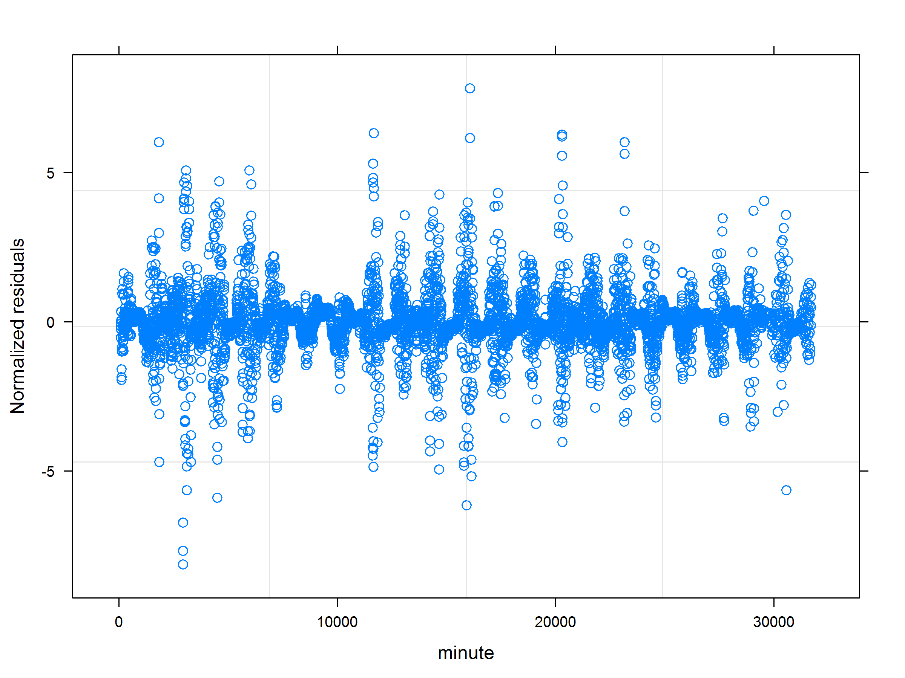
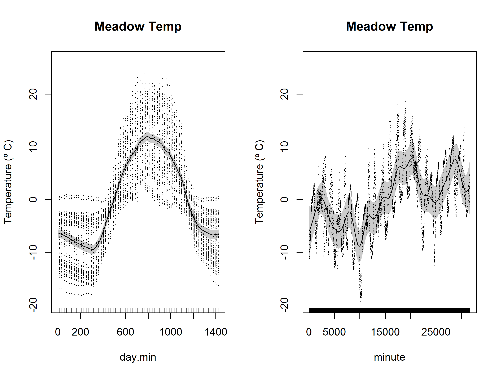
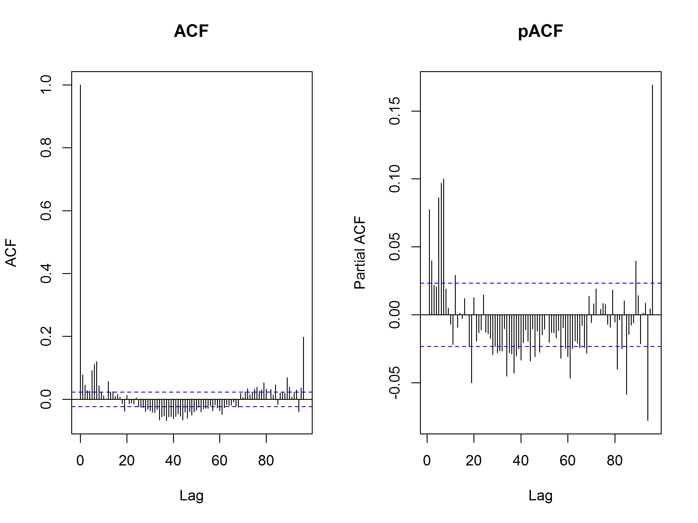
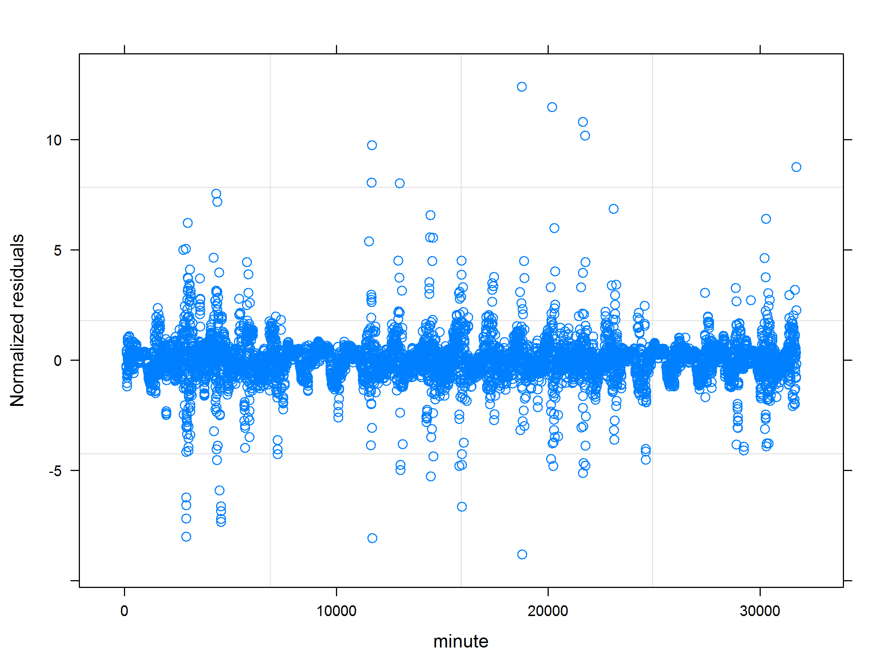
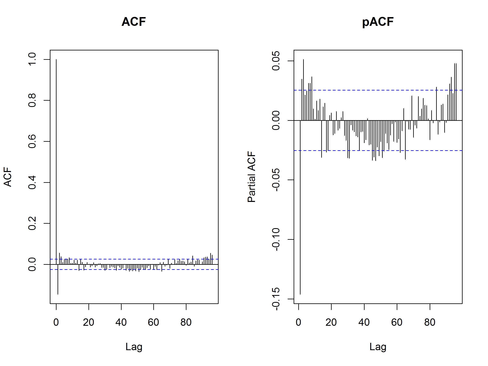
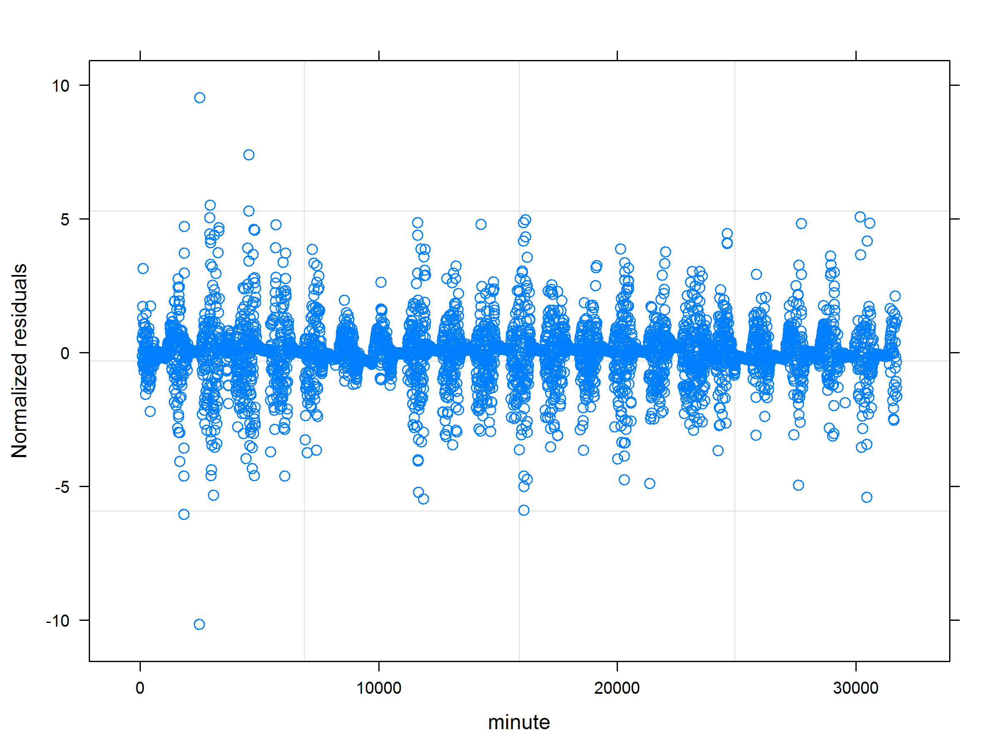
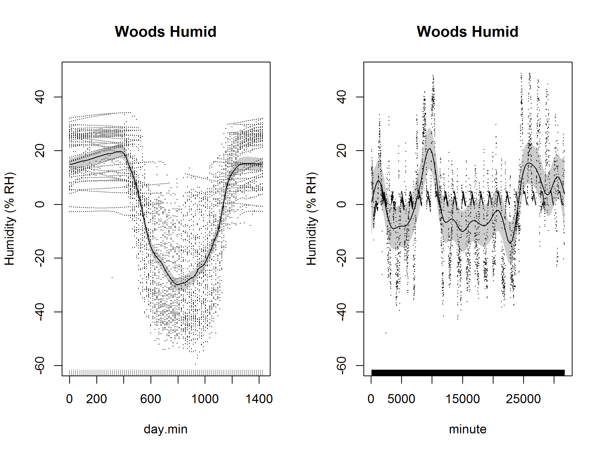
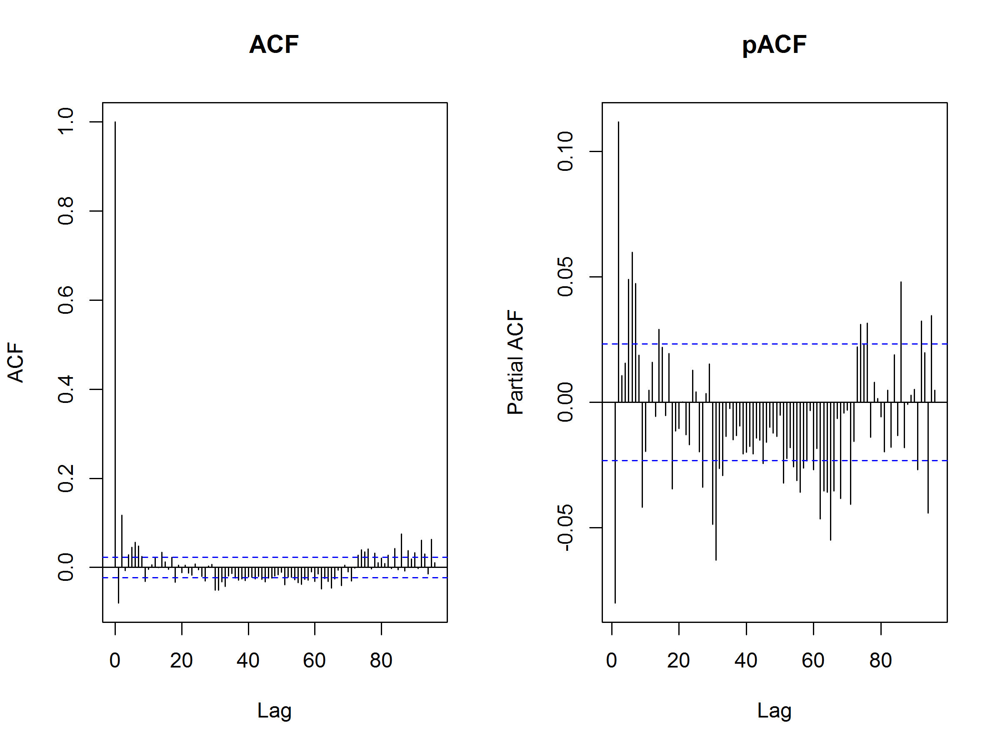
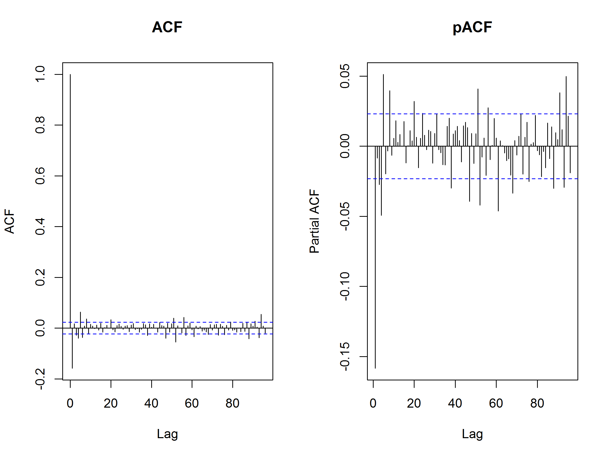
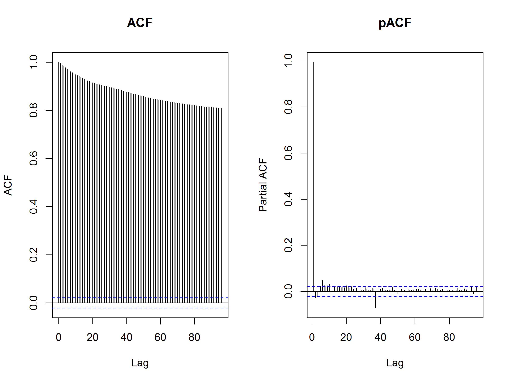

# Microenvironmental Differences Within Transects
James Mickley  


## Overview

This analysis is looking for microenvironmental differences or gradients within transects.

We're using this [GAM approach](http://www.fromthebottomoftheheap.net/2014/05/09/modelling-seasonal-data-with-gam/).  In this approach, there are two smoothers (as Robi suggested).  One smoother is a cubic spline that accounts for intra-day variation.  Then a second spline is fitted to account for temporal variation that is not intra-day.  

Readings have temporal autocorrelation, therefore, we add an autoregressive moving average correlation structure (corAR1). We set the form here to account for autocorrelation separately for each transect position, treating positions as independent.  In every case, accounting for autocorrelation improves the models considerably, however, significant autocorrelation is still unaccounted for.  Zuur et. al. say that it's usually not worth finding the optimal autocorrelation structure.  

After all temporal effects are accounted for, we test for differences among transect positions separately for each transect (woods and meadow) and each variable (temperature, humidity, vwc, par).

We do this with two models: in one the transect positions are treated as individual factors, and there is no explicit spatial trend.  In the other, transect positions are treated as a continuous variable, testing for a gradient.

**Expectations:**

1. The woods VWC should increase (wetter) from 1 to 4, moving down the hill (no, but heterogeneity)
2. The meadow VWC should increase (wetter) from 1 to 4, moving into the swamp (yes)
3. The woods temperature should get cooler from 1 to 4, moving down the hill (no)
4. There should be no difference in PAR, or in temperature @ the meadow
    1. In fact, there are slight gradients in PAR in both sites, especially the meadow
    2. No differences in temp at the meadow
5. Humidity is unclear, but perhaps it would mirror soil moisture patterns
    1. No gradient, but some heterogeneity (in the meadow)


#### Transects

* Meadow: 1 (dry, sunny, grassy) to 4 (wet, some shade from ferns and shrubs)
* Woods: 1 (highest part of hill, but not top) to 4 (bottom of hill)


## Temperature


### Meadow Temperature

The model that includes transect order is worse than the base temporal model for meadow temperature.

There are no significant differences between position 2, 3, and 4 (1 is bad data and removed).  The maximum difference is 0.65 ºC between positions.

<!-- -->

```
                  dAICc   df
m.temp.ar1$lme        0.0 6 
m.temp.uncorr$lme 13523.4 5 

Family: gaussian 
Link function: identity 

Formula:
temperature ~ s(day.min, bs = "cc", k = 96) + s(minute)

Parametric coefficients:
            Estimate Std. Error t value Pr(>|t|)    
(Intercept)  19.1102     0.5231   36.53   <2e-16 ***
---
Signif. codes:  0 '***' 0.001 '**' 0.01 '*' 0.05 '.' 0.1 ' ' 1

Approximate significance of smooth terms:
             edf Ref.df     F  p-value    
s(day.min) 42.97     94 13.20  < 2e-16 ***
s(minute)   1.00      1 33.73 6.64e-09 ***
---
Signif. codes:  0 '***' 0.001 '**' 0.01 '*' 0.05 '.' 0.1 ' ' 1

R-sq.(adj) =  0.683   
  Scale est. = 33.242    n = 5998
```

<!-- --><!-- --><!-- -->

```
                          dAICc   df
m.temp.ar1$lme                0.0 6 
m.temp.ar1.continuous$lme     2.0 7 
m.temp.ar1.factor$lme         3.7 8 
m.temp.uncorr$lme         13523.4 5 
Linear mixed-effects model fit by maximum likelihood
 Data: strip.offset(mf) 
       AIC      BIC    logLik
  22706.38 22759.97 -11345.19

Random effects:
 Formula: ~Xr - 1 | g
 Structure: pdIdnot
               Xr1        Xr2        Xr3        Xr4        Xr5        Xr6
StdDev: 0.03921717 0.03921717 0.03921717 0.03921717 0.03921717 0.03921717
               Xr7        Xr8        Xr9       Xr10       Xr11       Xr12
StdDev: 0.03921717 0.03921717 0.03921717 0.03921717 0.03921717 0.03921717
              Xr13       Xr14       Xr15       Xr16       Xr17       Xr18
StdDev: 0.03921717 0.03921717 0.03921717 0.03921717 0.03921717 0.03921717
              Xr19       Xr20       Xr21       Xr22       Xr23       Xr24
StdDev: 0.03921717 0.03921717 0.03921717 0.03921717 0.03921717 0.03921717
              Xr25       Xr26       Xr27       Xr28       Xr29       Xr30
StdDev: 0.03921717 0.03921717 0.03921717 0.03921717 0.03921717 0.03921717
              Xr31       Xr32       Xr33       Xr34       Xr35       Xr36
StdDev: 0.03921717 0.03921717 0.03921717 0.03921717 0.03921717 0.03921717
              Xr37       Xr38       Xr39       Xr40       Xr41       Xr42
StdDev: 0.03921717 0.03921717 0.03921717 0.03921717 0.03921717 0.03921717
              Xr43       Xr44       Xr45       Xr46       Xr47       Xr48
StdDev: 0.03921717 0.03921717 0.03921717 0.03921717 0.03921717 0.03921717
              Xr49       Xr50       Xr51       Xr52       Xr53       Xr54
StdDev: 0.03921717 0.03921717 0.03921717 0.03921717 0.03921717 0.03921717
              Xr55       Xr56       Xr57       Xr58       Xr59       Xr60
StdDev: 0.03921717 0.03921717 0.03921717 0.03921717 0.03921717 0.03921717
              Xr61       Xr62       Xr63       Xr64       Xr65       Xr66
StdDev: 0.03921717 0.03921717 0.03921717 0.03921717 0.03921717 0.03921717
              Xr67       Xr68       Xr69       Xr70       Xr71       Xr72
StdDev: 0.03921717 0.03921717 0.03921717 0.03921717 0.03921717 0.03921717
              Xr73       Xr74       Xr75       Xr76       Xr77       Xr78
StdDev: 0.03921717 0.03921717 0.03921717 0.03921717 0.03921717 0.03921717
              Xr79       Xr80       Xr81       Xr82       Xr83       Xr84
StdDev: 0.03921717 0.03921717 0.03921717 0.03921717 0.03921717 0.03921717
              Xr85       Xr86       Xr87       Xr88       Xr89       Xr90
StdDev: 0.03921717 0.03921717 0.03921717 0.03921717 0.03921717 0.03921717
              Xr91       Xr92       Xr93       Xr94
StdDev: 0.03921717 0.03921717 0.03921717 0.03921717

 Formula: ~Xr.0 - 1 | g.0 %in% g
 Structure: pdIdnot
           Xr.01    Xr.02    Xr.03    Xr.04    Xr.05    Xr.06    Xr.07
StdDev: 0.004396 0.004396 0.004396 0.004396 0.004396 0.004396 0.004396
           Xr.08 Residual
StdDev: 0.004396 5.759786

Correlation Structure: AR(1)
 Formula: ~1 | g/g.0/order 
 Parameter estimate(s):
      Phi 
0.9611429 
Fixed effects: y ~ X - 1 
                    Value Std.Error   DF   t-value p-value
X(Intercept)    19.074747 0.9288051 5994 20.536868  0.0000
Xfactor(order)3  0.368920 1.2823371 5994  0.287693  0.7736
Xfactor(order)4 -0.282184 1.2976624 5994 -0.217456  0.8279
Xs(minute)Fx1    2.953144 0.5094980 5994  5.796184  0.0000
 Correlation: 
                X(Int) Xfc()3 Xfc()4
Xfactor(order)3 -0.726              
Xfactor(order)4 -0.716  0.520       
Xs(minute)Fx1    0.052 -0.062 -0.048

Standardized Within-Group Residuals:
         Min           Q1          Med           Q3          Max 
-3.070365583 -0.644659134  0.009985748  0.691092167  3.010875203 

Number of Observations: 5998
Number of Groups: 
         g g.0 %in% g 
         1          1 
```

### Woods Temperature

The model that includes transect order is worse than the base temporal model for woods temperature.

There are no significant differences between any of the positions relative to position 1, and a maximum difference of 0.48 ºC between positions.

<!-- -->

```
                  dAICc   df
w.temp.ar1$lme        0.0 6 
w.temp.uncorr$lme 22179.5 5 

Family: gaussian 
Link function: identity 

Formula:
temperature ~ s(day.min, bs = "cc", k = 96) + s(minute)

Parametric coefficients:
            Estimate Std. Error t value Pr(>|t|)    
(Intercept)  17.4664     0.3688   47.36   <2e-16 ***
---
Signif. codes:  0 '***' 0.001 '**' 0.01 '*' 0.05 '.' 0.1 ' ' 1

Approximate significance of smooth terms:
              edf Ref.df     F p-value    
s(day.min) 66.411 94.000 37.01  <2e-16 ***
s(minute)   7.795  7.795 26.75  <2e-16 ***
---
Signif. codes:  0 '***' 0.001 '**' 0.01 '*' 0.05 '.' 0.1 ' ' 1

R-sq.(adj) =  0.785   
  Scale est. = 7.9898    n = 7078
```

<!-- --><!-- --><!-- -->

```
                          dAICc   df
w.temp.ar1$lme                0.0 6 
w.temp.ar1.continuous$lme     2.0 7 
w.temp.ar1.factor$lme         5.9 9 
w.temp.uncorr$lme         22179.5 5 
Linear mixed-effects model fit by maximum likelihood
 Data: strip.offset(mf) 
       AIC      BIC    logLik
  10501.98 10563.76 -5241.989

Random effects:
 Formula: ~Xr - 1 | g
 Structure: pdIdnot
               Xr1        Xr2        Xr3        Xr4        Xr5        Xr6
StdDev: 0.02364486 0.02364486 0.02364486 0.02364486 0.02364486 0.02364486
               Xr7        Xr8        Xr9       Xr10       Xr11       Xr12
StdDev: 0.02364486 0.02364486 0.02364486 0.02364486 0.02364486 0.02364486
              Xr13       Xr14       Xr15       Xr16       Xr17       Xr18
StdDev: 0.02364486 0.02364486 0.02364486 0.02364486 0.02364486 0.02364486
              Xr19       Xr20       Xr21       Xr22       Xr23       Xr24
StdDev: 0.02364486 0.02364486 0.02364486 0.02364486 0.02364486 0.02364486
              Xr25       Xr26       Xr27       Xr28       Xr29       Xr30
StdDev: 0.02364486 0.02364486 0.02364486 0.02364486 0.02364486 0.02364486
              Xr31       Xr32       Xr33       Xr34       Xr35       Xr36
StdDev: 0.02364486 0.02364486 0.02364486 0.02364486 0.02364486 0.02364486
              Xr37       Xr38       Xr39       Xr40       Xr41       Xr42
StdDev: 0.02364486 0.02364486 0.02364486 0.02364486 0.02364486 0.02364486
              Xr43       Xr44       Xr45       Xr46       Xr47       Xr48
StdDev: 0.02364486 0.02364486 0.02364486 0.02364486 0.02364486 0.02364486
              Xr49       Xr50       Xr51       Xr52       Xr53       Xr54
StdDev: 0.02364486 0.02364486 0.02364486 0.02364486 0.02364486 0.02364486
              Xr55       Xr56       Xr57       Xr58       Xr59       Xr60
StdDev: 0.02364486 0.02364486 0.02364486 0.02364486 0.02364486 0.02364486
              Xr61       Xr62       Xr63       Xr64       Xr65       Xr66
StdDev: 0.02364486 0.02364486 0.02364486 0.02364486 0.02364486 0.02364486
              Xr67       Xr68       Xr69       Xr70       Xr71       Xr72
StdDev: 0.02364486 0.02364486 0.02364486 0.02364486 0.02364486 0.02364486
              Xr73       Xr74       Xr75       Xr76       Xr77       Xr78
StdDev: 0.02364486 0.02364486 0.02364486 0.02364486 0.02364486 0.02364486
              Xr79       Xr80       Xr81       Xr82       Xr83       Xr84
StdDev: 0.02364486 0.02364486 0.02364486 0.02364486 0.02364486 0.02364486
              Xr85       Xr86       Xr87       Xr88       Xr89       Xr90
StdDev: 0.02364486 0.02364486 0.02364486 0.02364486 0.02364486 0.02364486
              Xr91       Xr92       Xr93       Xr94
StdDev: 0.02364486 0.02364486 0.02364486 0.02364486

 Formula: ~Xr.0 - 1 | g.0 %in% g
 Structure: pdIdnot
           Xr.01    Xr.02    Xr.03    Xr.04    Xr.05    Xr.06    Xr.07
StdDev: 41.52078 41.52078 41.52078 41.52078 41.52078 41.52078 41.52078
           Xr.08 Residual
StdDev: 41.52078 2.828298

Correlation Structure: AR(1)
 Formula: ~1 | g/g.0/order 
 Parameter estimate(s):
      Phi 
0.9842778 
Fixed effects: y ~ X - 1 
                    Value Std.Error   DF   t-value p-value
X(Intercept)    17.380317  0.673909 7073 25.790284  0.0000
Xfactor(order)2  0.118147  0.950991 7073  0.124236  0.9011
Xfactor(order)3  0.477488  1.311162 7073  0.364172  0.7157
Xfactor(order)4 -0.001094  0.951098 7073 -0.001151  0.9991
Xs(minute)Fx1   -1.754815  3.834611 7073 -0.457625  0.6472
 Correlation: 
                X(Int) Xfc()2 Xfc()3 Xfc()4
Xfactor(order)2 -0.706                     
Xfactor(order)3 -0.513  0.363              
Xfactor(order)4 -0.706  0.500  0.363       
Xs(minute)Fx1    0.003  0.000  0.023  0.000

Standardized Within-Group Residuals:
        Min          Q1         Med          Q3         Max 
-3.07436990 -0.63939385  0.03689316  0.77686452  3.75483917 

Number of Observations: 7078
Number of Groups: 
         g g.0 %in% g 
         1          1 
```


## Humidity

### Meadow Humidity

The model that includes transect order is better than the base temporal model for meadow humidity.

There are no significant differences between position 2 and 3, but position 4 is 7.9% more humid.  This would make sense, given its position in the swamp.

<!-- -->

```
                   dAICc   df
m.humid.ar1$lme        0.0 6 
m.humid.uncorr$lme 12534.9 5 

Family: gaussian 
Link function: identity 

Formula:
humidity ~ s(day.min, bs = "cc", k = 96) + s(minute)

Parametric coefficients:
            Estimate Std. Error t value Pr(>|t|)    
(Intercept)   80.318      1.024    78.4   <2e-16 ***
---
Signif. codes:  0 '***' 0.001 '**' 0.01 '*' 0.05 '.' 0.1 ' ' 1

Approximate significance of smooth terms:
             edf Ref.df      F  p-value    
s(day.min) 36.86  94.00 12.170  < 2e-16 ***
s(minute)   7.62   7.62  6.658 6.14e-08 ***
---
Signif. codes:  0 '***' 0.001 '**' 0.01 '*' 0.05 '.' 0.1 ' ' 1

R-sq.(adj) =  0.704   
  Scale est. = 192.57    n = 5997
```

<!-- --><!-- --><!-- -->

```
                           dAICc   df
m.humid.ar1.factor$lme         0.0 8 
m.humid.ar1.continuous$lme     0.5 7 
m.humid.ar1$lme                9.1 6 
m.humid.uncorr$lme         12544.0 5 
Linear mixed-effects model fit by maximum likelihood
 Data: strip.offset(mf) 
       AIC      BIC    logLik
  35654.04 35707.63 -17819.02

Random effects:
 Formula: ~Xr - 1 | g
 Structure: pdIdnot
               Xr1        Xr2        Xr3        Xr4        Xr5        Xr6
StdDev: 0.09412263 0.09412263 0.09412263 0.09412263 0.09412263 0.09412263
               Xr7        Xr8        Xr9       Xr10       Xr11       Xr12
StdDev: 0.09412263 0.09412263 0.09412263 0.09412263 0.09412263 0.09412263
              Xr13       Xr14       Xr15       Xr16       Xr17       Xr18
StdDev: 0.09412263 0.09412263 0.09412263 0.09412263 0.09412263 0.09412263
              Xr19       Xr20       Xr21       Xr22       Xr23       Xr24
StdDev: 0.09412263 0.09412263 0.09412263 0.09412263 0.09412263 0.09412263
              Xr25       Xr26       Xr27       Xr28       Xr29       Xr30
StdDev: 0.09412263 0.09412263 0.09412263 0.09412263 0.09412263 0.09412263
              Xr31       Xr32       Xr33       Xr34       Xr35       Xr36
StdDev: 0.09412263 0.09412263 0.09412263 0.09412263 0.09412263 0.09412263
              Xr37       Xr38       Xr39       Xr40       Xr41       Xr42
StdDev: 0.09412263 0.09412263 0.09412263 0.09412263 0.09412263 0.09412263
              Xr43       Xr44       Xr45       Xr46       Xr47       Xr48
StdDev: 0.09412263 0.09412263 0.09412263 0.09412263 0.09412263 0.09412263
              Xr49       Xr50       Xr51       Xr52       Xr53       Xr54
StdDev: 0.09412263 0.09412263 0.09412263 0.09412263 0.09412263 0.09412263
              Xr55       Xr56       Xr57       Xr58       Xr59       Xr60
StdDev: 0.09412263 0.09412263 0.09412263 0.09412263 0.09412263 0.09412263
              Xr61       Xr62       Xr63       Xr64       Xr65       Xr66
StdDev: 0.09412263 0.09412263 0.09412263 0.09412263 0.09412263 0.09412263
              Xr67       Xr68       Xr69       Xr70       Xr71       Xr72
StdDev: 0.09412263 0.09412263 0.09412263 0.09412263 0.09412263 0.09412263
              Xr73       Xr74       Xr75       Xr76       Xr77       Xr78
StdDev: 0.09412263 0.09412263 0.09412263 0.09412263 0.09412263 0.09412263
              Xr79       Xr80       Xr81       Xr82       Xr83       Xr84
StdDev: 0.09412263 0.09412263 0.09412263 0.09412263 0.09412263 0.09412263
              Xr85       Xr86       Xr87       Xr88       Xr89       Xr90
StdDev: 0.09412263 0.09412263 0.09412263 0.09412263 0.09412263 0.09412263
              Xr91       Xr92       Xr93       Xr94
StdDev: 0.09412263 0.09412263 0.09412263 0.09412263

 Formula: ~Xr.0 - 1 | g.0 %in% g
 Structure: pdIdnot
           Xr.01    Xr.02    Xr.03    Xr.04    Xr.05    Xr.06    Xr.07
StdDev: 168.8999 168.8999 168.8999 168.8999 168.8999 168.8999 168.8999
           Xr.08 Residual
StdDev: 168.8999 13.32375

Correlation Structure: AR(1)
 Formula: ~1 | g/g.0/order 
 Parameter estimate(s):
      Phi 
0.9363859 
Fixed effects: y ~ X - 1 
                    Value Std.Error   DF  t-value p-value
X(Intercept)     77.39708  1.680774 5993 46.04849  0.0000
Xfactor(order)3   0.83626  2.328134 5993  0.35920  0.7195
Xfactor(order)4   7.96295  2.348717 5993  3.39034  0.0007
Xs(minute)Fx1   -20.87596 15.361422 5993 -1.35899  0.1742
 Correlation: 
                X(Int) Xfc()3 Xfc()4
Xfactor(order)3 -0.727              
Xfactor(order)4 -0.717  0.523       
Xs(minute)Fx1    0.029 -0.035 -0.024

Standardized Within-Group Residuals:
         Min           Q1          Med           Q3          Max 
-3.790553680 -0.652385353 -0.008550314  0.683194107  2.945707706 

Number of Observations: 5997
Number of Groups: 
         g g.0 %in% g 
         1          1 
```

### Woods Humidity

The model that includes transect order is worse than the base temporal model for woods humidity.

There are no significant differences between any of the transect positions for humidity in the woods.

<!-- -->

```
                   dAICc   df
w.humid.ar1$lme        0.0 6 
w.humid.uncorr$lme 18627.4 5 

Family: gaussian 
Link function: identity 

Formula:
humidity ~ s(day.min, bs = "cc", k = 96) + s(minute)

Parametric coefficients:
            Estimate Std. Error t value Pr(>|t|)    
(Intercept)   84.604      4.266   19.83   <2e-16 ***
---
Signif. codes:  0 '***' 0.001 '**' 0.01 '*' 0.05 '.' 0.1 ' ' 1

Approximate significance of smooth terms:
             edf Ref.df     F  p-value    
s(day.min) 29.39     94 11.45  < 2e-16 ***
s(minute)   1.00      1 55.21 1.21e-13 ***
---
Signif. codes:  0 '***' 0.001 '**' 0.01 '*' 0.05 '.' 0.1 ' ' 1

R-sq.(adj) =  -0.41   
  Scale est. = 581.29    n = 7078
```

<!-- --><!-- --><!-- -->

```
                           dAICc   df
w.humid.ar1$lme                0.0 6 
w.humid.ar1.continuous$lme     2.0 7 
w.humid.ar1.factor$lme         5.9 9 
w.humid.uncorr$lme         18627.4 5 
Linear mixed-effects model fit by maximum likelihood
 Data: strip.offset(mf) 
       AIC      BIC    logLik
  35827.73 35889.52 -17904.87

Random effects:
 Formula: ~Xr - 1 | g
 Structure: pdIdnot
               Xr1        Xr2        Xr3        Xr4        Xr5        Xr6
StdDev: 0.04119045 0.04119045 0.04119045 0.04119045 0.04119045 0.04119045
               Xr7        Xr8        Xr9       Xr10       Xr11       Xr12
StdDev: 0.04119045 0.04119045 0.04119045 0.04119045 0.04119045 0.04119045
              Xr13       Xr14       Xr15       Xr16       Xr17       Xr18
StdDev: 0.04119045 0.04119045 0.04119045 0.04119045 0.04119045 0.04119045
              Xr19       Xr20       Xr21       Xr22       Xr23       Xr24
StdDev: 0.04119045 0.04119045 0.04119045 0.04119045 0.04119045 0.04119045
              Xr25       Xr26       Xr27       Xr28       Xr29       Xr30
StdDev: 0.04119045 0.04119045 0.04119045 0.04119045 0.04119045 0.04119045
              Xr31       Xr32       Xr33       Xr34       Xr35       Xr36
StdDev: 0.04119045 0.04119045 0.04119045 0.04119045 0.04119045 0.04119045
              Xr37       Xr38       Xr39       Xr40       Xr41       Xr42
StdDev: 0.04119045 0.04119045 0.04119045 0.04119045 0.04119045 0.04119045
              Xr43       Xr44       Xr45       Xr46       Xr47       Xr48
StdDev: 0.04119045 0.04119045 0.04119045 0.04119045 0.04119045 0.04119045
              Xr49       Xr50       Xr51       Xr52       Xr53       Xr54
StdDev: 0.04119045 0.04119045 0.04119045 0.04119045 0.04119045 0.04119045
              Xr55       Xr56       Xr57       Xr58       Xr59       Xr60
StdDev: 0.04119045 0.04119045 0.04119045 0.04119045 0.04119045 0.04119045
              Xr61       Xr62       Xr63       Xr64       Xr65       Xr66
StdDev: 0.04119045 0.04119045 0.04119045 0.04119045 0.04119045 0.04119045
              Xr67       Xr68       Xr69       Xr70       Xr71       Xr72
StdDev: 0.04119045 0.04119045 0.04119045 0.04119045 0.04119045 0.04119045
              Xr73       Xr74       Xr75       Xr76       Xr77       Xr78
StdDev: 0.04119045 0.04119045 0.04119045 0.04119045 0.04119045 0.04119045
              Xr79       Xr80       Xr81       Xr82       Xr83       Xr84
StdDev: 0.04119045 0.04119045 0.04119045 0.04119045 0.04119045 0.04119045
              Xr85       Xr86       Xr87       Xr88       Xr89       Xr90
StdDev: 0.04119045 0.04119045 0.04119045 0.04119045 0.04119045 0.04119045
              Xr91       Xr92       Xr93       Xr94
StdDev: 0.04119045 0.04119045 0.04119045 0.04119045

 Formula: ~Xr.0 - 1 | g.0 %in% g
 Structure: pdIdnot
              Xr.01       Xr.02       Xr.03       Xr.04       Xr.05
StdDev: 0.006333094 0.006333094 0.006333094 0.006333094 0.006333094
              Xr.06       Xr.07       Xr.08 Residual
StdDev: 0.006333094 0.006333094 0.006333094 23.84779

Correlation Structure: AR(1)
 Formula: ~1 | g/g.0/order 
 Parameter estimate(s):
      Phi 
0.9919495 
Fixed effects: y ~ X - 1 
                   Value Std.Error   DF   t-value p-value
X(Intercept)    83.19019  7.732528 7073 10.758472  0.0000
Xfactor(order)2  2.97672 10.934778 7073  0.272225  0.7855
Xfactor(order)3  2.61895 14.171890 7073  0.184799  0.8534
Xfactor(order)4  0.79379 10.935939 7073  0.072585  0.9421
Xs(minute)Fx1   16.20077  2.197297 7073  7.373045  0.0000
 Correlation: 
                X(Int) Xfc()2 Xfc()3 Xfc()4
Xfactor(order)2 -0.707                     
Xfactor(order)3 -0.546  0.386              
Xfactor(order)4 -0.707  0.500  0.386       
Xs(minute)Fx1   -0.005  0.000  0.004  0.000

Standardized Within-Group Residuals:
        Min          Q1         Med          Q3         Max 
-2.28434803 -0.68355488 -0.06814581  0.65283237  2.59623314 

Number of Observations: 7078
Number of Groups: 
         g g.0 %in% g 
         1          1 
```


## Volumetric Water Content

### Meadow VWC

The model that includes transect order as a continuous fixed factor is better than the base temporal model for meadow soil volumetric water content.  However, the base model is better than the model with transect order as a factor.  

The continuous model shows a positive trend towards increased soil moisture of about 0.039 m<sup>3</sup>/m<sup>3</sup> per position. This matches the pattern expected as the transect goes into the swamp.  

The factor model shows minimal differences between positions 1 and 2 (not significant).  However, position 3 is wetter, and position 4 is a lot wetter.  This is also what the data show, and qualitatively what one might expect.  

Also, an ANOVA shows that the factor model is better than the base temporal model, though AIC doesn't agree.  

<!-- -->

```
                 dAICc   df
m.vwc.ar1$lme        0.0 6 
m.vwc.uncorr$lme 44193.6 5 

Family: gaussian 
Link function: identity 

Formula:
vwc ~ s(day.min, bs = "cc", k = 96) + s(minute)

Parametric coefficients:
            Estimate Std. Error t value Pr(>|t|)    
(Intercept)  0.22022    0.02008   10.97   <2e-16 ***
---
Signif. codes:  0 '***' 0.001 '**' 0.01 '*' 0.05 '.' 0.1 ' ' 1

Approximate significance of smooth terms:
              edf Ref.df      F  p-value    
s(day.min) 12.879 94.000  0.817 1.12e-15 ***
s(minute)   7.826  7.826 10.179 5.68e-14 ***
---
Signif. codes:  0 '***' 0.001 '**' 0.01 '*' 0.05 '.' 0.1 ' ' 1

R-sq.(adj) =  -0.146   
  Scale est. = 0.0027348  n = 7216
```

<!-- --><!-- --><!-- -->

```
                         dAICc   df
m.vwc.ar1.continuous$lme     0.0 7 
m.vwc.ar1$lme                7.8 6 
m.vwc.ar1.factor$lme        36.1 9 
m.vwc.uncorr$lme         44201.4 5 
Linear mixed-effects model fit by maximum likelihood
 Data: strip.offset(mf) 
        AIC       BIC   logLik
  -67250.82 -67188.86 33634.41

Random effects:
 Formula: ~Xr - 1 | g
 Structure: pdIdnot
                 Xr1          Xr2          Xr3          Xr4          Xr5
StdDev: 1.450306e-05 1.450306e-05 1.450306e-05 1.450306e-05 1.450306e-05
                 Xr6          Xr7          Xr8          Xr9         Xr10
StdDev: 1.450306e-05 1.450306e-05 1.450306e-05 1.450306e-05 1.450306e-05
                Xr11         Xr12         Xr13         Xr14         Xr15
StdDev: 1.450306e-05 1.450306e-05 1.450306e-05 1.450306e-05 1.450306e-05
                Xr16         Xr17         Xr18         Xr19         Xr20
StdDev: 1.450306e-05 1.450306e-05 1.450306e-05 1.450306e-05 1.450306e-05
                Xr21         Xr22         Xr23         Xr24         Xr25
StdDev: 1.450306e-05 1.450306e-05 1.450306e-05 1.450306e-05 1.450306e-05
                Xr26         Xr27         Xr28         Xr29         Xr30
StdDev: 1.450306e-05 1.450306e-05 1.450306e-05 1.450306e-05 1.450306e-05
                Xr31         Xr32         Xr33         Xr34         Xr35
StdDev: 1.450306e-05 1.450306e-05 1.450306e-05 1.450306e-05 1.450306e-05
                Xr36         Xr37         Xr38         Xr39         Xr40
StdDev: 1.450306e-05 1.450306e-05 1.450306e-05 1.450306e-05 1.450306e-05
                Xr41         Xr42         Xr43         Xr44         Xr45
StdDev: 1.450306e-05 1.450306e-05 1.450306e-05 1.450306e-05 1.450306e-05
                Xr46         Xr47         Xr48         Xr49         Xr50
StdDev: 1.450306e-05 1.450306e-05 1.450306e-05 1.450306e-05 1.450306e-05
                Xr51         Xr52         Xr53         Xr54         Xr55
StdDev: 1.450306e-05 1.450306e-05 1.450306e-05 1.450306e-05 1.450306e-05
                Xr56         Xr57         Xr58         Xr59         Xr60
StdDev: 1.450306e-05 1.450306e-05 1.450306e-05 1.450306e-05 1.450306e-05
                Xr61         Xr62         Xr63         Xr64         Xr65
StdDev: 1.450306e-05 1.450306e-05 1.450306e-05 1.450306e-05 1.450306e-05
                Xr66         Xr67         Xr68         Xr69         Xr70
StdDev: 1.450306e-05 1.450306e-05 1.450306e-05 1.450306e-05 1.450306e-05
                Xr71         Xr72         Xr73         Xr74         Xr75
StdDev: 1.450306e-05 1.450306e-05 1.450306e-05 1.450306e-05 1.450306e-05
                Xr76         Xr77         Xr78         Xr79         Xr80
StdDev: 1.450306e-05 1.450306e-05 1.450306e-05 1.450306e-05 1.450306e-05
                Xr81         Xr82         Xr83         Xr84         Xr85
StdDev: 1.450306e-05 1.450306e-05 1.450306e-05 1.450306e-05 1.450306e-05
                Xr86         Xr87         Xr88         Xr89         Xr90
StdDev: 1.450306e-05 1.450306e-05 1.450306e-05 1.450306e-05 1.450306e-05
                Xr91         Xr92         Xr93         Xr94
StdDev: 1.450306e-05 1.450306e-05 1.450306e-05 1.450306e-05

 Formula: ~Xr.0 - 1 | g.0 %in% g
 Structure: pdIdnot
               Xr.01        Xr.02        Xr.03        Xr.04        Xr.05
StdDev: 4.904782e-05 4.904782e-05 4.904782e-05 4.904782e-05 4.904782e-05
               Xr.06        Xr.07        Xr.08  Residual
StdDev: 4.904782e-05 4.904782e-05 4.904782e-05 0.0158144

Correlation Structure: AR(1)
 Formula: ~1 | g/g.0/order 
 Parameter estimate(s):
      Phi 
0.9895428 
Fixed effects: y ~ X - 1 
                      Value   Std.Error   DF  t-value p-value
X(Intercept)     0.19246829 0.005993929 7211 32.11054  0.0000
Xfactor(order)2 -0.00310230 0.007667831 7211 -0.40459  0.6858
Xfactor(order)3  0.03561160 0.007585017 7211  4.69499  0.0000
Xfactor(order)4  0.11042378 0.007611197 7211 14.50807  0.0000
Xs(minute)Fx1    0.00145602 0.002227452 7211  0.65367  0.5133
 Correlation: 
                X(Int) Xfc()2 Xfc()3 Xfc()4
Xfactor(order)2 -0.782                     
Xfactor(order)3 -0.798  0.625              
Xfactor(order)4 -0.793  0.621  0.635       
Xs(minute)Fx1    0.173 -0.139 -0.184 -0.169

Standardized Within-Group Residuals:
        Min          Q1         Med          Q3         Max 
-3.39595613 -0.51859991  0.01547479  0.71571071  3.29830203 

Number of Observations: 7216
Number of Groups: 
         g g.0 %in% g 
         1          1 
Linear mixed-effects model fit by maximum likelihood
 Data: strip.offset(mf) 
       AIC       BIC   logLik
  -67286.9 -67238.71 33650.45

Random effects:
 Formula: ~Xr - 1 | g
 Structure: pdIdnot
                 Xr1          Xr2          Xr3          Xr4          Xr5
StdDev: 1.202058e-05 1.202058e-05 1.202058e-05 1.202058e-05 1.202058e-05
                 Xr6          Xr7          Xr8          Xr9         Xr10
StdDev: 1.202058e-05 1.202058e-05 1.202058e-05 1.202058e-05 1.202058e-05
                Xr11         Xr12         Xr13         Xr14         Xr15
StdDev: 1.202058e-05 1.202058e-05 1.202058e-05 1.202058e-05 1.202058e-05
                Xr16         Xr17         Xr18         Xr19         Xr20
StdDev: 1.202058e-05 1.202058e-05 1.202058e-05 1.202058e-05 1.202058e-05
                Xr21         Xr22         Xr23         Xr24         Xr25
StdDev: 1.202058e-05 1.202058e-05 1.202058e-05 1.202058e-05 1.202058e-05
                Xr26         Xr27         Xr28         Xr29         Xr30
StdDev: 1.202058e-05 1.202058e-05 1.202058e-05 1.202058e-05 1.202058e-05
                Xr31         Xr32         Xr33         Xr34         Xr35
StdDev: 1.202058e-05 1.202058e-05 1.202058e-05 1.202058e-05 1.202058e-05
                Xr36         Xr37         Xr38         Xr39         Xr40
StdDev: 1.202058e-05 1.202058e-05 1.202058e-05 1.202058e-05 1.202058e-05
                Xr41         Xr42         Xr43         Xr44         Xr45
StdDev: 1.202058e-05 1.202058e-05 1.202058e-05 1.202058e-05 1.202058e-05
                Xr46         Xr47         Xr48         Xr49         Xr50
StdDev: 1.202058e-05 1.202058e-05 1.202058e-05 1.202058e-05 1.202058e-05
                Xr51         Xr52         Xr53         Xr54         Xr55
StdDev: 1.202058e-05 1.202058e-05 1.202058e-05 1.202058e-05 1.202058e-05
                Xr56         Xr57         Xr58         Xr59         Xr60
StdDev: 1.202058e-05 1.202058e-05 1.202058e-05 1.202058e-05 1.202058e-05
                Xr61         Xr62         Xr63         Xr64         Xr65
StdDev: 1.202058e-05 1.202058e-05 1.202058e-05 1.202058e-05 1.202058e-05
                Xr66         Xr67         Xr68         Xr69         Xr70
StdDev: 1.202058e-05 1.202058e-05 1.202058e-05 1.202058e-05 1.202058e-05
                Xr71         Xr72         Xr73         Xr74         Xr75
StdDev: 1.202058e-05 1.202058e-05 1.202058e-05 1.202058e-05 1.202058e-05
                Xr76         Xr77         Xr78         Xr79         Xr80
StdDev: 1.202058e-05 1.202058e-05 1.202058e-05 1.202058e-05 1.202058e-05
                Xr81         Xr82         Xr83         Xr84         Xr85
StdDev: 1.202058e-05 1.202058e-05 1.202058e-05 1.202058e-05 1.202058e-05
                Xr86         Xr87         Xr88         Xr89         Xr90
StdDev: 1.202058e-05 1.202058e-05 1.202058e-05 1.202058e-05 1.202058e-05
                Xr91         Xr92         Xr93         Xr94
StdDev: 1.202058e-05 1.202058e-05 1.202058e-05 1.202058e-05

 Formula: ~Xr.0 - 1 | g.0 %in% g
 Structure: pdIdnot
            Xr.01     Xr.02     Xr.03     Xr.04     Xr.05     Xr.06
StdDev: 0.3198385 0.3198385 0.3198385 0.3198385 0.3198385 0.3198385
            Xr.07     Xr.08   Residual
StdDev: 0.3198385 0.3198385 0.03035884

Correlation Structure: AR(1)
 Formula: ~1 | g/g.0/order 
 Parameter estimate(s):
      Phi 
0.9971956 
Fixed effects: y ~ X - 1 
                   Value   Std.Error   DF  t-value p-value
X(Intercept)  0.12582968 0.021695875 7213 5.799705  0.0000
Xorder        0.03911106 0.007620984 7213 5.132023  0.0000
Xs(minute)Fx1 0.03402166 0.023984932 7213 1.418460  0.1561
 Correlation: 
              X(Int) Xorder
Xorder        -0.922       
Xs(minute)Fx1  0.057 -0.012

Standardized Within-Group Residuals:
         Min           Q1          Med           Q3          Max 
-1.994316364 -0.588474966 -0.006793286  0.692253279  3.131925374 

Number of Observations: 7216
Number of Groups: 
         g g.0 %in% g 
         1          1 
                     Model df       AIC       BIC   logLik   Test  L.Ratio
m.vwc.ar1$lme            1  6 -67279.14 -67237.84 33645.57                
m.vwc.ar1.factor$lme     2  9 -67250.82 -67188.86 33634.41 1 vs 2 22.32305
                     p-value
m.vwc.ar1$lme               
m.vwc.ar1.factor$lme   1e-04
```

### Woods VWC

The model that includes transect order is better than the base temporal model for woods soil volumetric water content.  

The actual pattern is a bit odd, though it matches qualitative results.  The highest point on the hill (position 1) is the driest, while the second position is the wettest.  Position 3 is not different from position 2, and position 4 is intermediate between 1 and 2 in soil moisture.  

So, while there are differences among transect positions, there isn't really a gradient.

<!-- -->

```
                 dAICc   df
w.vwc.ar1$lme        0.0 6 
w.vwc.uncorr$lme 39540.6 5 

Family: gaussian 
Link function: identity 

Formula:
vwc ~ s(day.min, bs = "cc", k = 96) + s(minute)

Parametric coefficients:
            Estimate Std. Error t value Pr(>|t|)    
(Intercept)  0.09606    0.00770   12.47   <2e-16 ***
---
Signif. codes:  0 '***' 0.001 '**' 0.01 '*' 0.05 '.' 0.1 ' ' 1

Approximate significance of smooth terms:
             edf Ref.df     F  p-value    
s(day.min) 29.97     94 0.841 1.79e-08 ***
s(minute)   1.00      1 0.421    0.516    
---
Signif. codes:  0 '***' 0.001 '**' 0.01 '*' 0.05 '.' 0.1 ' ' 1

R-sq.(adj) =  0.00274   
  Scale est. = 0.0013192  n = 8435
```

<!-- --><!-- --><!-- -->

```
                     dAICc   df
w.vwc.ar1.factor$lme     0.0 9 
w.vwc.ar1$lme           63.5 6 
w.vwc.uncorr$lme     39604.1 5 
Linear mixed-effects model fit by maximum likelihood
 Data: strip.offset(mf) 
        AIC       BIC   logLik
  -72055.08 -71991.72 36036.54

Random effects:
 Formula: ~Xr - 1 | g
 Structure: pdIdnot
                 Xr1          Xr2          Xr3          Xr4          Xr5
StdDev: 4.242277e-05 4.242277e-05 4.242277e-05 4.242277e-05 4.242277e-05
                 Xr6          Xr7          Xr8          Xr9         Xr10
StdDev: 4.242277e-05 4.242277e-05 4.242277e-05 4.242277e-05 4.242277e-05
                Xr11         Xr12         Xr13         Xr14         Xr15
StdDev: 4.242277e-05 4.242277e-05 4.242277e-05 4.242277e-05 4.242277e-05
                Xr16         Xr17         Xr18         Xr19         Xr20
StdDev: 4.242277e-05 4.242277e-05 4.242277e-05 4.242277e-05 4.242277e-05
                Xr21         Xr22         Xr23         Xr24         Xr25
StdDev: 4.242277e-05 4.242277e-05 4.242277e-05 4.242277e-05 4.242277e-05
                Xr26         Xr27         Xr28         Xr29         Xr30
StdDev: 4.242277e-05 4.242277e-05 4.242277e-05 4.242277e-05 4.242277e-05
                Xr31         Xr32         Xr33         Xr34         Xr35
StdDev: 4.242277e-05 4.242277e-05 4.242277e-05 4.242277e-05 4.242277e-05
                Xr36         Xr37         Xr38         Xr39         Xr40
StdDev: 4.242277e-05 4.242277e-05 4.242277e-05 4.242277e-05 4.242277e-05
                Xr41         Xr42         Xr43         Xr44         Xr45
StdDev: 4.242277e-05 4.242277e-05 4.242277e-05 4.242277e-05 4.242277e-05
                Xr46         Xr47         Xr48         Xr49         Xr50
StdDev: 4.242277e-05 4.242277e-05 4.242277e-05 4.242277e-05 4.242277e-05
                Xr51         Xr52         Xr53         Xr54         Xr55
StdDev: 4.242277e-05 4.242277e-05 4.242277e-05 4.242277e-05 4.242277e-05
                Xr56         Xr57         Xr58         Xr59         Xr60
StdDev: 4.242277e-05 4.242277e-05 4.242277e-05 4.242277e-05 4.242277e-05
                Xr61         Xr62         Xr63         Xr64         Xr65
StdDev: 4.242277e-05 4.242277e-05 4.242277e-05 4.242277e-05 4.242277e-05
                Xr66         Xr67         Xr68         Xr69         Xr70
StdDev: 4.242277e-05 4.242277e-05 4.242277e-05 4.242277e-05 4.242277e-05
                Xr71         Xr72         Xr73         Xr74         Xr75
StdDev: 4.242277e-05 4.242277e-05 4.242277e-05 4.242277e-05 4.242277e-05
                Xr76         Xr77         Xr78         Xr79         Xr80
StdDev: 4.242277e-05 4.242277e-05 4.242277e-05 4.242277e-05 4.242277e-05
                Xr81         Xr82         Xr83         Xr84         Xr85
StdDev: 4.242277e-05 4.242277e-05 4.242277e-05 4.242277e-05 4.242277e-05
                Xr86         Xr87         Xr88         Xr89         Xr90
StdDev: 4.242277e-05 4.242277e-05 4.242277e-05 4.242277e-05 4.242277e-05
                Xr91         Xr92         Xr93         Xr94
StdDev: 4.242277e-05 4.242277e-05 4.242277e-05 4.242277e-05

 Formula: ~Xr.0 - 1 | g.0 %in% g
 Structure: pdIdnot
               Xr.01        Xr.02        Xr.03        Xr.04        Xr.05
StdDev: 5.624072e-05 5.624072e-05 5.624072e-05 5.624072e-05 5.624072e-05
               Xr.06        Xr.07        Xr.08   Residual
StdDev: 5.624072e-05 5.624072e-05 5.624072e-05 0.01732149

Correlation Structure: AR(1)
 Formula: ~1 | g/g.0/order 
 Parameter estimate(s):
      Phi 
0.9809949 
Fixed effects: y ~ X - 1 
                     Value   Std.Error   DF   t-value p-value
X(Intercept)    0.06668074 0.003761252 8430 17.728337  0.0000
Xfactor(order)2 0.08194459 0.005318876 8430 15.406374  0.0000
Xfactor(order)3 0.00716216 0.005318876 8430  1.346555  0.1782
Xfactor(order)4 0.02860882 0.005319477 8430  5.378127  0.0000
Xs(minute)Fx1   0.00311244 0.001793419 8430  1.735479  0.0827
 Correlation: 
                X(Int) Xfc()2 Xfc()3 Xfc()4
Xfactor(order)2 -0.707                     
Xfactor(order)3 -0.707  0.500              
Xfactor(order)4 -0.707  0.500  0.500       
Xs(minute)Fx1    0.000  0.000  0.000  0.000

Standardized Within-Group Residuals:
       Min         Q1        Med         Q3        Max 
-3.0694043 -0.5035026 -0.1751489  0.3654195  8.1796477 

Number of Observations: 8435
Number of Groups: 
         g g.0 %in% g 
         1          1 
```


## Photosynthetically Active Radiation

### Meadow PAR

The model that includes transect order is better than the base temporal model for meadow PAR.  

There are no differences between positions 1 and 2, but 3 and 4 have increasingly lower PAR, with a maximum difference of 108 µmol/m<sup>2</sup>/s between position 2 and 4.  The difference between 1 and 3 is not significant (p = 0.08), but the difference between 1 and 4 is.  

This pattern can probably be explained by the increasing vegetation, especially in positions 3 and 4 that must be adding a small amount of shade.


<!-- -->

```
                 dAICc  df
m.par.ar1$lme       0.0 6 
m.par.uncorr$lme 4324.3 5 

Family: gaussian 
Link function: identity 

Formula:
par ~ s(day.min, bs = "cc", k = 96) + s(minute)

Parametric coefficients:
            Estimate Std. Error t value Pr(>|t|)    
(Intercept)  351.690      7.611   46.21   <2e-16 ***
---
Signif. codes:  0 '***' 0.001 '**' 0.01 '*' 0.05 '.' 0.1 ' ' 1

Approximate significance of smooth terms:
              edf Ref.df     F p-value    
s(day.min) 15.577 94.000 27.60  <2e-16 ***
s(minute)   8.596  8.596 32.67  <2e-16 ***
---
Signif. codes:  0 '***' 0.001 '**' 0.01 '*' 0.05 '.' 0.1 ' ' 1

R-sq.(adj) =  0.664   
  Scale est. = 81394     n = 7216
```

<!-- --><!-- --><!-- -->

```
                         dAICc  df
m.par.ar1.factor$lme        0.0 9 
m.par.ar1.continuous$lme    0.7 7 
m.par.ar1$lme              27.1 6 
m.par.uncorr$lme         4351.4 5 
Linear mixed-effects model fit by maximum likelihood
 Data: strip.offset(mf) 
       AIC      BIC    logLik
  97757.68 97819.63 -48869.84

Random effects:
 Formula: ~Xr - 1 | g
 Structure: pdIdnot
             Xr1      Xr2      Xr3      Xr4      Xr5      Xr6      Xr7
StdDev: 1.323261 1.323261 1.323261 1.323261 1.323261 1.323261 1.323261
             Xr8      Xr9     Xr10     Xr11     Xr12     Xr13     Xr14
StdDev: 1.323261 1.323261 1.323261 1.323261 1.323261 1.323261 1.323261
            Xr15     Xr16     Xr17     Xr18     Xr19     Xr20     Xr21
StdDev: 1.323261 1.323261 1.323261 1.323261 1.323261 1.323261 1.323261
            Xr22     Xr23     Xr24     Xr25     Xr26     Xr27     Xr28
StdDev: 1.323261 1.323261 1.323261 1.323261 1.323261 1.323261 1.323261
            Xr29     Xr30     Xr31     Xr32     Xr33     Xr34     Xr35
StdDev: 1.323261 1.323261 1.323261 1.323261 1.323261 1.323261 1.323261
            Xr36     Xr37     Xr38     Xr39     Xr40     Xr41     Xr42
StdDev: 1.323261 1.323261 1.323261 1.323261 1.323261 1.323261 1.323261
            Xr43     Xr44     Xr45     Xr46     Xr47     Xr48     Xr49
StdDev: 1.323261 1.323261 1.323261 1.323261 1.323261 1.323261 1.323261
            Xr50     Xr51     Xr52     Xr53     Xr54     Xr55     Xr56
StdDev: 1.323261 1.323261 1.323261 1.323261 1.323261 1.323261 1.323261
            Xr57     Xr58     Xr59     Xr60     Xr61     Xr62     Xr63
StdDev: 1.323261 1.323261 1.323261 1.323261 1.323261 1.323261 1.323261
            Xr64     Xr65     Xr66     Xr67     Xr68     Xr69     Xr70
StdDev: 1.323261 1.323261 1.323261 1.323261 1.323261 1.323261 1.323261
            Xr71     Xr72     Xr73     Xr74     Xr75     Xr76     Xr77
StdDev: 1.323261 1.323261 1.323261 1.323261 1.323261 1.323261 1.323261
            Xr78     Xr79     Xr80     Xr81     Xr82     Xr83     Xr84
StdDev: 1.323261 1.323261 1.323261 1.323261 1.323261 1.323261 1.323261
            Xr85     Xr86     Xr87     Xr88     Xr89     Xr90     Xr91
StdDev: 1.323261 1.323261 1.323261 1.323261 1.323261 1.323261 1.323261
            Xr92     Xr93     Xr94
StdDev: 1.323261 1.323261 1.323261

 Formula: ~Xr.0 - 1 | g.0 %in% g
 Structure: pdIdnot
         Xr.01  Xr.02  Xr.03  Xr.04  Xr.05  Xr.06  Xr.07  Xr.08 Residual
StdDev: 2818.9 2818.9 2818.9 2818.9 2818.9 2818.9 2818.9 2818.9 281.9435

Correlation Structure: AR(1)
 Formula: ~1 | g/g.0/order 
 Parameter estimate(s):
      Phi 
0.6667919 
Fixed effects: y ~ X - 1 
                    Value Std.Error   DF   t-value p-value
X(Intercept)     391.2339  18.92545 7211 20.672363  0.0000
Xfactor(order)2    5.5224  23.91626 7211  0.230904  0.8174
Xfactor(order)3  -41.5238  23.71901 7211 -1.750657  0.0800
Xfactor(order)4 -102.5562  23.73555 7211 -4.320783  0.0000
Xs(minute)Fx1    434.2726 157.62305 7211  2.755134  0.0059
 Correlation: 
                X(Int) Xfc()2 Xfc()3 Xfc()4
Xfactor(order)2 -0.794                     
Xfactor(order)3 -0.812  0.643              
Xfactor(order)4 -0.807  0.641  0.658       
Xs(minute)Fx1    0.008  0.016 -0.024 -0.011

Standardized Within-Group Residuals:
        Min          Q1         Med          Q3         Max 
-3.29185291 -0.54004974 -0.09175662  0.48845217  3.95698988 

Number of Observations: 7216
Number of Groups: 
         g g.0 %in% g 
         1          1 
```

### Woods PAR

The model that includes transect order is better than the base temporal model for woods PAR.  

PAR increases from the highest position on the hill (position 1) to the bottom (position 4).  There are no significant differences between positions 1-3, but position 4 has significantly higher par, with a maximum difference of 18.7 µmol/m<sup>2</sup>/s between position 1 and 4.  

It's unclear what explains this difference. Perhaps light is coming from the forest edge?


<!-- -->

```
                 dAICc df
w.par.ar1$lme      0   6 
w.par.uncorr$lme 469   5 

Family: gaussian 
Link function: identity 

Formula:
par ~ s(day.min, bs = "cc", k = 96) + s(minute)

Parametric coefficients:
            Estimate Std. Error t value Pr(>|t|)    
(Intercept)  44.3550     0.9459   46.89   <2e-16 ***
---
Signif. codes:  0 '***' 0.001 '**' 0.01 '*' 0.05 '.' 0.1 ' ' 1

Approximate significance of smooth terms:
              edf Ref.df      F  p-value    
s(day.min) 69.537 94.000 15.710  < 2e-16 ***
s(minute)   8.003  8.003  8.225 4.03e-11 ***
---
Signif. codes:  0 '***' 0.001 '**' 0.01 '*' 0.05 '.' 0.1 ' ' 1

R-sq.(adj) =  0.212   
  Scale est. = 4612.3    n = 8435
```

<!-- --><!-- --><!-- -->

```
                         dAICc df
w.par.ar1.factor$lme       0.0 9 
w.par.ar1.continuous$lme   6.5 7 
w.par.ar1$lme             52.7 6 
w.par.uncorr$lme         521.7 5 
Linear mixed-effects model fit by maximum likelihood
 Data: strip.offset(mf) 
       AIC      BIC    logLik
  94838.68 94902.05 -47410.34

Random effects:
 Formula: ~Xr - 1 | g
 Structure: pdIdnot
             Xr1      Xr2      Xr3      Xr4      Xr5      Xr6      Xr7
StdDev: 4.577942 4.577942 4.577942 4.577942 4.577942 4.577942 4.577942
             Xr8      Xr9     Xr10     Xr11     Xr12     Xr13     Xr14
StdDev: 4.577942 4.577942 4.577942 4.577942 4.577942 4.577942 4.577942
            Xr15     Xr16     Xr17     Xr18     Xr19     Xr20     Xr21
StdDev: 4.577942 4.577942 4.577942 4.577942 4.577942 4.577942 4.577942
            Xr22     Xr23     Xr24     Xr25     Xr26     Xr27     Xr28
StdDev: 4.577942 4.577942 4.577942 4.577942 4.577942 4.577942 4.577942
            Xr29     Xr30     Xr31     Xr32     Xr33     Xr34     Xr35
StdDev: 4.577942 4.577942 4.577942 4.577942 4.577942 4.577942 4.577942
            Xr36     Xr37     Xr38     Xr39     Xr40     Xr41     Xr42
StdDev: 4.577942 4.577942 4.577942 4.577942 4.577942 4.577942 4.577942
            Xr43     Xr44     Xr45     Xr46     Xr47     Xr48     Xr49
StdDev: 4.577942 4.577942 4.577942 4.577942 4.577942 4.577942 4.577942
            Xr50     Xr51     Xr52     Xr53     Xr54     Xr55     Xr56
StdDev: 4.577942 4.577942 4.577942 4.577942 4.577942 4.577942 4.577942
            Xr57     Xr58     Xr59     Xr60     Xr61     Xr62     Xr63
StdDev: 4.577942 4.577942 4.577942 4.577942 4.577942 4.577942 4.577942
            Xr64     Xr65     Xr66     Xr67     Xr68     Xr69     Xr70
StdDev: 4.577942 4.577942 4.577942 4.577942 4.577942 4.577942 4.577942
            Xr71     Xr72     Xr73     Xr74     Xr75     Xr76     Xr77
StdDev: 4.577942 4.577942 4.577942 4.577942 4.577942 4.577942 4.577942
            Xr78     Xr79     Xr80     Xr81     Xr82     Xr83     Xr84
StdDev: 4.577942 4.577942 4.577942 4.577942 4.577942 4.577942 4.577942
            Xr85     Xr86     Xr87     Xr88     Xr89     Xr90     Xr91
StdDev: 4.577942 4.577942 4.577942 4.577942 4.577942 4.577942 4.577942
            Xr92     Xr93     Xr94
StdDev: 4.577942 4.577942 4.577942

 Formula: ~Xr.0 - 1 | g.0 %in% g
 Structure: pdIdnot
           Xr.01    Xr.02    Xr.03    Xr.04    Xr.05    Xr.06    Xr.07
StdDev: 196.1159 196.1159 196.1159 196.1159 196.1159 196.1159 196.1159
           Xr.08 Residual
StdDev: 196.1159 67.51583

Correlation Structure: AR(1)
 Formula: ~1 | g/g.0/order 
 Parameter estimate(s):
      Phi 
0.2320613 
Fixed effects: y ~ X - 1 
                   Value Std.Error   DF   t-value p-value
X(Intercept)    37.67484  1.862460 8430 20.228533  0.0000
Xfactor(order)2  2.92871  2.633915 8430  1.111923  0.2662
Xfactor(order)3  5.05142  2.633915 8430  1.917839  0.0552
Xfactor(order)4 18.73784  2.634229 8430  7.113215  0.0000
Xs(minute)Fx1   69.27213 17.678369 8430  3.918468  0.0001
 Correlation: 
                X(Int) Xfc()2 Xfc()3 Xfc()4
Xfactor(order)2 -0.707                     
Xfactor(order)3 -0.707  0.500              
Xfactor(order)4 -0.707  0.500  0.500       
Xs(minute)Fx1    0.000  0.000  0.000  0.000

Standardized Within-Group Residuals:
        Min          Q1         Med          Q3         Max 
-2.66060529 -0.17674825 -0.03139179  0.09317335 20.98434643 

Number of Observations: 8435
Number of Groups: 
         g g.0 %in% g 
         1          1 
```


## Session Information


```
R version 3.4.0 (2017-04-21)
Platform: x86_64-apple-darwin15.6.0 (64-bit)
Running under: OS X El Capitan 10.11.6

Matrix products: default
BLAS: /Library/Frameworks/R.framework/Versions/3.4/Resources/lib/libRblas.0.dylib
LAPACK: /Library/Frameworks/R.framework/Versions/3.4/Resources/lib/libRlapack.dylib

locale:
[1] en_US.UTF-8/en_US.UTF-8/en_US.UTF-8/C/en_US.UTF-8/en_US.UTF-8

attached base packages:
[1] stats4    stats     graphics  grDevices utils     datasets  methods  
[8] base     

other attached packages:
[1] bindrcpp_0.2    dplyr_0.7.1     bbmle_1.0.19    mgcv_1.8-17    
[5] nlme_3.1-131    lubridate_1.6.0 tidyr_0.6.3     cowplot_0.7.0  
[9] ggplot2_2.2.1  

loaded via a namespace (and not attached):
 [1] Rcpp_0.12.11      compiler_3.4.0    plyr_1.8.4       
 [4] bindr_0.1         tools_3.4.0       digest_0.6.12    
 [7] evaluate_0.10     tibble_1.3.3      gtable_0.2.0     
[10] lattice_0.20-35   pkgconfig_2.0.1   rlang_0.1.1      
[13] Matrix_1.2-9      yaml_2.1.14       stringr_1.2.0    
[16] knitr_1.16        rprojroot_1.2     grid_3.4.0       
[19] glue_1.1.1        R6_2.2.2          rmarkdown_1.6    
[22] magrittr_1.5      codetools_0.2-15  backports_1.1.0  
[25] scales_0.4.1      htmltools_0.3.6   assertthat_0.2.0 
[28] colorspace_1.3-2  numDeriv_2016.8-1 labeling_0.3     
[31] stringi_1.1.5     lazyeval_0.2.0    munsell_0.4.3    
```

