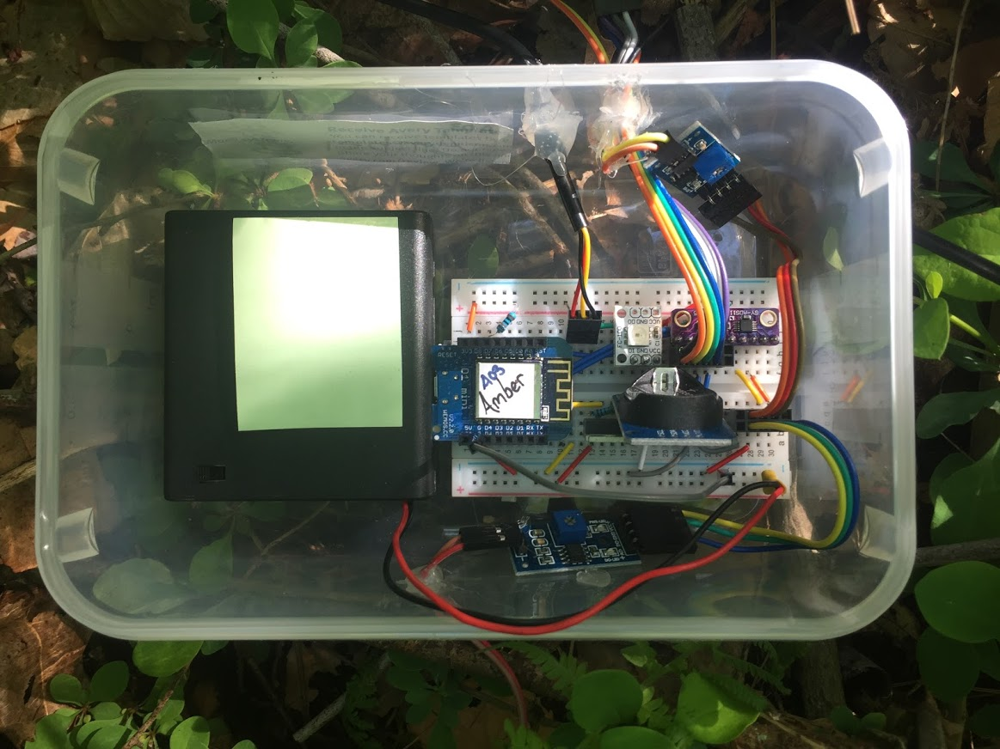

# Environmental Microcontroller Units (EMUs)

This repository stores code, documentation, and analyses for Environmental Microcontroller Units (EMUs). We detail their use in our paper for measuring aspects of microenvironment: temperature, humidity, light, and soil moisture all for less than $20 in hardware costs. However, their flexible nature means that they can be used in a variety of research situations where inexpensive sensors are required.

If this work is useful in your research, please cite our paper:

**Mickley, J. G., T. E. Moore, C. D. Schlichting, A. L. DeRobertis, E. N. Pfisterer, & R. Bagchi (2018). Measuring Microenvironments for Global Change: DIY Environmental Microcontroller Units (EMUs). *Methods in Ecology and Evolution*. 10:578-584. [doi: 10.1111/2041-210X.13128](http://dx.doi.org/10.1111/2041-210X.13128)**

We provide the following:
* [Detailed documentation](/Documentation) including [building EMUs](/Documentation/Building%20EMUs.md), [parts list](/Documentation/), [programming EMUs](/Documentation/EMU%20programming.md), [troubleshooting](/Documentation/Troubleshooting.md), and [circuit diagrams](/Documentation/Diagrams/).
* EMU [operating code](/EMU-Software).
* A [pre-built firmware](/Firmware)
* Our [analyses and data](EMU-Analysis) used in calibrating light and soil moisture sensors and in a field test of EMUs.
